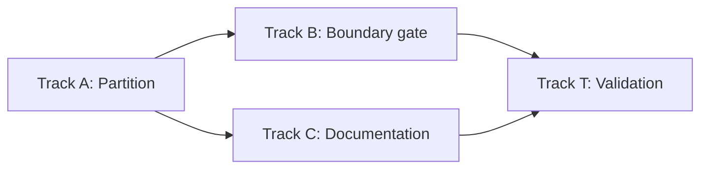

# Stage 25 Tasks — Frontend Module Topology (`packages/ui`)

**Phase:** 25
**Status:** Done
**Strategic Goal:** Turn the four-tier module model (composition root → shell → surfaces → shared) from a convention no tool can see into a boundary checked on every changed file — by first making tier membership expressible as a path, then declaring the zones, then proving the package's public API survived unchanged.

## Character

A **structural, behavior-preserving refactor plus a lint gate** — the TypeScript counterpart of Phase 13 (Core Decomposition). No new domain logic, no new core capability, no widening of the `bridge.ts` `CoreClient`, no new dependency (`fallow` is already a root devDependency and already in the always-on gate). Every runtime behavior of `packages/ui` is identical before and after; what changes is that a violation becomes visible.

**Why now rather than later:** the cost of declaring a boundary rises with the number of edges already crossing it. The package is ~3,000 lines across 25 source modules — the last point where the declaration is nearly free.

## Track dependency (Planning Audit — read before starting)

**Track A must complete before Track B starts.** This is not a soft ordering. Zones are declared as *path patterns*; today `dashboard.tsx` (a surface), `theme.ts` (shared) and `surfaces.tsx` (a composer) all sit at the same directory level, so no pattern can name a tier. Until the partition exists on disk, the boundary config has nothing to point at. Parallel mode (C3) applies **within** Track A and **within** Track B, and Track C runs parallel to B — but B cannot open while A is unfinished.

## Verification commands (measured during planning)

`fallow audit` does **not** complete in a practical window on this dev host — the Phase 24 disclosure stands. Two narrower commands do, and they are what this phase verifies against:

| Command | Measured | Shows |
| --- | --- | --- |
| `npx fallow list --boundaries` | ~1.4 s | zone list, rules, **per-zone file counts** (the total-coverage proof) |
| `npx fallow guard <file>` | ~1.4 s | which zone a file is in and which zones it may import |

The full `fallow audit --changed-since <base>` stays the CI gate; it is never a local `Verify` line in this phase.

## Disclosed spec discrepancy (do not silently resolve)

`l2-ui-module-topology` §4.1 UMT-1 states the rule as *"may import only from tiers strictly below it"*, under which the composition root may import **surfaces** (surfaces is strictly below root). The §4.2 table under-enumerates root's row as `shell, shared`.

The rule text governs and this phase plans on it, because the same spec **requires the package's public API to survive the relocation** (§6, and its `[SRC]` canonical reference: *"the composition root's current public API — the surface a relocation must preserve"*), and `index.ts` re-exports `DashboardPanel` / `OfficeViewPanel`. Under the table's narrower reading those two requirements contradict each other.

→ Recommend `/magic.spec main` reconcile §4.2's root row to UMT-1's rule text. **Not** in this phase's scope — `magic.run` does not edit specs.

## Atomic Checklist

- [x] [T-25A01] Mint the `shared/` leaf tier
- [x] [T-25A02] Split `surfaces.tsx`; mint the `surfaces/` tier
- [x] [T-25A03] Repoint `shell/` and the composition root; freeze the public API
- [x] [T-25B01] Declare zones and the four direction rules (coverage off)
- [x] [T-25B02] Turn on total zone coverage
- [x] [T-25B03] Add the single-seam forbidden-call rule
- [x] [T-25C01] Record the tier model in `packages/ui/README.md`
- [x] [T-25C02] Containment cleanup — remove the plan reference from the root `CHANGELOG.md`
- [x] [T-25T01] Validation — prove UMT-1…UMT-7 and behavior neutrality

## Detailed Tracking

### [T-25A01] Mint the `shared/` leaf tier

- **Spec:** l2-ui-module-topology.md §4.2, §4.3 · UMT-5
- **Status:** Done
- **Assignment:** Agent
- **Verify:** `pnpm -C packages/ui test` (94 tests, unchanged count) · `pnpm -C packages/ui exec tsc --noEmit` · `pnpm exec biome check packages/ui` · `node packages/ui/scripts/craft-lint.mjs`
- **Handoff:** T-25A02 (the surfaces tier repoints onto the new `shared/` paths)
- **Notes:** Move into `packages/ui/src/shared/`: `bridge.ts`, `i18n.ts`, `navigation.ts`, `theme.ts`, `tokens.ts`, `canvas.ts`, `tokens.css`, `schemes/`. Add `shared/index.ts` re-exporting the tier's public symbols.

  **`styles.css` stays at `src/styles.css`** — `package.json` declares `"./styles.css": "./src/styles.css"` and `apps/desktop/src/main.tsx` imports `@cronus/ui/styles.css`. Moving it silently breaks the only consumer. Its three `@import` lines repoint to `./shared/tokens.css` and `./shared/schemes/default/tokens.{light,dark}.css`.

  `theme.ts`'s `./schemes/default/manifest.json` import becomes a within-tier path. Co-located tests (`theme.test.ts`, `tokens.test.ts`, `navigation.test.ts`, `canvas.test.ts`, `bridge.test.tsx`) move with their modules — the grouping rule, and the test-zoning rule depends on it.

- **Changes:** `packages/ui/src/shared/` minted; 13 modules relocated as pure renames (R100) — `bridge.ts`, `canvas.ts`, `i18n.ts`, `navigation.ts`, `theme.ts`, `tokens.ts`, `tokens.css`, `schemes/`, and the co-located `.test` files. `shared/index.ts` added: a 6-line `export *` barrel (`bridge`, `canvas`, `i18n`, `navigation`, `theme`, `tokens`) — the tier declaration. `bridge.test.tsx` `./App` → `../App`. `tokens.test.ts` reworked to resolve token files against its own location (tier-local) and `styles.css` against the composition root one level up. `styles.css` kept at `src/` (only consumer imports it by that path); its three `@import` lines repointed to `./shared/...`. 15 importers repointed (`src/index.ts`, `App.tsx`, `dashboard.tsx`, `office-view.tsx`, `surfaces.tsx`, `surfaces.test.tsx`, all 13 `shell/*` files) — deep `./shared/<mod>` paths, not the barrel (the shell→barrel collapse is T-25A03's). `organizeImports` re-sorted the import blocks of 6 files whose new `./shared/*` specifiers changed sort order (re-export order; no runtime effect).
- **[DR]** Added a repo-root `.gitattributes` (`* text=auto eol=lf`) and normalized the working tree to LF. *Criterion:* every Phase 25 task's `Verify` runs `biome check`, which was failing on all 49 `packages/ui` files — this host checks out with CRLF (`core.autocrlf=true`) and the repo had no `.gitattributes`; biome's formatter is LF-only. Every committed blob was already LF (`git ls-files --eol` → 0 `i/crlf`), so this changes no stored content — it makes the checkout match what is stored. Without it the phase cannot satisfy its own gate. *(Override: revert `.gitattributes` and run the gate under Git Bash, which checks out LF.)*
- **Evidence:**
  - `command: pnpm -C packages/ui exec vitest run` · `exit_code: 0` · `key_findings: 15 files, 94 passed (unchanged from the pre-move baseline)`
  - `command: pnpm -C packages/ui exec tsc --noEmit` · `exit_code: 0`
  - `command: pnpm exec biome check packages/ui` · `exit_code: 0` · `key_findings: 49 files checked, 0 errors (53 before the .gitattributes fix — all CRLF format noise)`
  - `command: node packages/ui/scripts/craft-lint.mjs` · `exit_code: 0` · `key_findings: clean; EXEMPT regexes still match the relocated tokens.css / schemes/`
  - `command: git diff -M --name-status` · `key_findings: 13× R100 pure renames + 1× R097 (bridge.test.tsx) + import-repoint edits only; no behavioural change`

### [T-25A02] Split `surfaces.tsx`; mint the `surfaces/` tier

- **Spec:** l2-ui-module-topology.md §4.1 UMT-1/UMT-4 · §4.3
- **Status:** Done
- **Assignment:** Agent
- **Verify:** `pnpm -C packages/ui test` · `pnpm -C packages/ui exec tsc --noEmit` · plus the lateral-edge check, runnable before any zone config exists: no module under `packages/ui/src/surfaces/` imports another surface (`grep -rn 'from "\.\./surfaces' packages/ui/src/surfaces/` returns nothing, and no relative import there names a sibling surface file)
- **Handoff:** T-25A03
- **Notes:** **The largest task in Track A** — it resolves a real violation, not a hypothetical one. `surfaces.tsx` today imports `./dashboard` and `./office-view`; left in the surfaces tier those become lateral surface-to-surface edges, which UMT-1 forbids. The file is two things fused:

  - `SurfaceId` / `SURFACES` / `SURFACE_LABEL` — **catalog data** → `shared/` (alongside `navigation.ts`, which already owns the sidebar catalog).
  - `Workbench` — a **composer** (renders a nav strip and routes to a surface panel) → `shell/workbench.tsx`. Functionally it is the Phase 8 predecessor of `BuildingShell`; the shell tier is where a composer belongs.

  Then move `dashboard.tsx` + `office-view.tsx` (and their tests) into `src/surfaces/`, each still a single file — neither has a private collaborator yet, so **neither is minted as a folder** (a surface earns a folder at its second private module, never for size). Add `surfaces/index.ts` as the tier declaration, exporting mount components, their props, and consumed projection types only (UMT-2).

  `[DR]` `Workbench` is **kept and relocated**, not retired — retiring it is GUI-to-core integration scope (the disclosed Phase 24 deferral: `main.tsx` still renders it) and is governed by INV-9's declared-retirement rule. *(Override: raise it in `/magic.spec main` as an `l2-app-ui` amendment.)*

- **Changes:** `surfaces.tsx` dissolved into three homes. Catalog data (`SurfaceId`, `SURFACES`, `SURFACE_LABEL`) → new `shared/surface-catalog.ts` (added to the shared barrel). `Workbench` + `WorkbenchProps` → new `shell/workbench.tsx`, imports repointed (`../surfaces` barrel for panels, `../shared/*` for i18n/theme/catalog). `dashboard.tsx` + `office-view.tsx` (+ their `Panel` tests) → `surfaces/`, each still a single file (no private collaborator → not minted as a folder); `../shared/i18n`. New `surfaces/index.ts` tier declaration — mount components + props + consumed projection types only (UMT-2). Test relocations preserving the 94 count: `surfaces.test.tsx` (9) → `shell/workbench.test.tsx` (8 Workbench/theming/i18n tests) + the one `App`-render test folded into `App.test.tsx`; the single `Workbench` test in each of `dashboard.test.tsx` / `office-view.test.tsx` → `shell/workbench.test.tsx`; `store-compliance.test.tsx` → `shell/` (`./workbench`). `App.tsx` + `index.ts` repointed; `index.ts` now exposes `Workbench`/`WorkbenchProps` from `./shell/workbench` and the panels from `./surfaces` (`SURFACE_LABEL` deliberately not re-exported at package root — it was never public). `shell/building-shell.tsx` + `shell/surface-router.tsx` `../dashboard` / `../office-view` → `../surfaces` (forced by the move; the shell→barrel collapse of the *shared* imports remains T-25A03).
- **Finding (disclosed, not fixed here):** `shared/i18n.ts` carries two source comments naming plan phases (`// Phase 8 workbench surfaces`, `// ── Phase 24 shell frame ──`) — a pre-existing §6 `SDD_REFERENCE_LEAK`, not introduced by this task and outside its scope. T-25C02 cleans a plan reference in the root `CHANGELOG.md`; these two comment lines want the same treatment and should be folded into that track or a follow-up containment task.
- **Evidence:**
  - `command: pnpm -C packages/ui exec vitest run` · `exit_code: 0` · `key_findings: 15 files, 94 passed (count unchanged; tests split across workbench.test.tsx / App.test.tsx / surfaces/*)`
  - `command: pnpm -C packages/ui exec tsc --noEmit` · `exit_code: 0`
  - `command: pnpm exec biome check packages/ui` · `exit_code: 0` · `key_findings: 51 files, 0 errors`
  - `command: node packages/ui/scripts/craft-lint.mjs` · `exit_code: 0`
  - `command: grep -rn 'from "../surfaces' packages/ui/src/surfaces/` · `key_findings: no match — no surface module imports a sibling; only surfaces/index.ts re-exports its own tier (the declaration)`

### [T-25A03] Repoint `shell/` and the composition root; freeze the public API

- **Spec:** l2-ui-module-topology.md §4.2 · UMT-2/UMT-3
- **Status:** Done
- **Assignment:** Agent
- **Verify:** `pnpm -C packages/ui exec tsc --noEmit` · `pnpm -C packages/ui test` · `pnpm -C packages/ui build` · and the neutrality proof: the sorted identifier set exported by `src/index.ts` matches the set from `git show HEAD:packages/ui/src/index.ts`
- **Handoff:** T-25B01 (the partition now exists; zones become expressible)
- **Notes:** `shell/*` keeps its directory; its `../i18n` / `../navigation` / `../theme` imports become `../shared/...`, and `../dashboard` / `../office-view` become `../surfaces` **through the tier barrel** (UMT-3 — terminate at the declaration, not at a file inside it). `shell/index.ts` gains `workbench`.

  `App.tsx` and `index.ts` stay at `src/`. **No export is added or removed** — the only consumer imports just `App` and `createCoreClient`, but the spec requires the whole declared surface to survive, so this is a repoint, not a trim.

- **Changes:** `shell/index.ts` gains `export { Workbench, type WorkbenchProps } from "./workbench"`; its header comment lost a plan-phase reference (`the Phase 24 application shell frame` → `the application shell frame`) — a §6 fix taken opportunistically on a file this task already edits. `src/index.ts`'s explicit `Workbench`/`WorkbenchProps` line removed — they now arrive through `export * from "./shell"`, terminating the import at the shell declaration. `shell/*`'s `../shared/<module>` imports were **left as deep paths, not collapsed to a `../shared` barrel**: A01 already made them `../shared/…`, and no UMT invariant requires barrel-only imports *inside* the shared tier (UMT-3 terminates at a *surface* declaration; a deep `../shared/theme` import is still `shell → shared` in-zone, which is all the T-25B01 fallow rule checks). `../dashboard` / `../office-view` → `../surfaces` barrel was already done in T-25A02.
- **Neutrality proof (the behaviour-freeze):** built `packages/ui` at the pre-refactor baseline (`5383f00`) and at the current tree; both `dist/index.js` bundles export an **identical 46-symbol value set** (`diff` empty). Every explicitly-named export identifier in `src/index.ts` is unchanged; `Workbench`/`WorkbenchProps` moved from an explicit line to the `./shell` barrel re-export (same resolved symbol — the grep-level diff is a barrel artifact, the build-level diff is authoritative). T-25T01 adds the frozen-list `import * as ui` assertion.
- **Evidence:**
  - `command: pnpm -C packages/ui exec tsc --noEmit` · `exit_code: 0`
  - `command: pnpm -C packages/ui exec vitest run` · `exit_code: 0` · `key_findings: 15 files, 94 passed`
  - `command: pnpm -C packages/ui build` · `exit_code: 0` · `key_findings: 26 modules, dist/index.js 49.5 kB`
  - `command: diff <(baseline dist exports) <(current dist exports)` · `key_findings: empty — 46 value exports identical to the 5383f00 pre-refactor baseline`

### [T-25B01] Declare zones and the four direction rules (coverage off)

- **Spec:** l2-ui-module-topology.md §4.4
- **Status:** Done
- **Assignment:** Agent
- **Verify:** `npx fallow list --boundaries` prints 4 zones with non-zero file counts and the 4 rules · `npx fallow guard packages/ui/src/shared/theme.ts` reports `zone: shared` and `may import zones: shared`
- **Handoff:** T-25B02
- **Notes:** Create `.fallowrc.json` at the repo root with boundary zones `root` / `shell` / `surfaces` / `shared` over `packages/ui/src/**`, and the four direction rules. Set `$schema` to `./node_modules/fallow/schema.json` (ships version-aligned; validates offline).

  Root's `allow` is `["shell", "surfaces", "shared"]` per UMT-1's rule text — see **Disclosed spec discrepancy** above; leave a comment in the config recording why, in plain language, with no design-artifact reference.

  Leave `coverage` unset in this task. Record any violations the four rules surface — at current size expect zero, since Track A resolved the only known one.

- **Changes:** `.fallowrc.jsonc` created at repo root (jsonc, not json — the plain-language rationale comment the task asks for needs comment support; fallow auto-discovers both). Four zones over `packages/ui/src/**` (`root` = `index.ts` + `App.tsx` + `App.test.tsx`; `shell/**`; `surfaces/**`; `shared/**`), four one-way rules (`root → shell,surfaces,shared` per UMT-1's rule text — the disclosed §4.2/UMT-1 discrepancy resolved in the rule's favour, recorded in a config comment in plain language). `coverage` left unset (T-25B02). **One real violation surfaced and fixed** — not the anticipated zero: `shared/bridge.test.tsx:3 → App.tsx` (`shared → root` upward import). The round-trip test *"a bridged status value renders in the App surface"* reaches into `App` (root tier) from a shared-tier test — exactly what §4.4's test exemption forbids (a test may reach into the module it sits with, never into another tier). Moved that one test into `App.test.tsx` (root); the two pure marshalling tests stay in `shared/bridge.test.tsx`. Test count unchanged (94).
- **Evidence:**
  - `command: npx fallow list --boundaries` · `key_findings: 4 zones (root 3 / shell 19 / surfaces 5 / shared 16), 4 rules — root→shell,surfaces,shared · shell→surfaces,shared · surfaces→shared · shared→shared`
  - `command: npx fallow guard packages/ui/src/shared/theme.ts` · `key_findings: zone: shared · may import zones: shared (same zone)`
  - `command: npx fallow dead-code --workspace packages/ui` · `exit_code: 0` · `key_findings: after the bridge.test.tsx fix — ✓ No issues found (1 boundary violation before)`

### [T-25B02] Turn on total zone coverage

- **Spec:** l2-ui-module-topology.md §4.4 (coverage scope + the two narrow exemptions) · UMT-7
- **Status:** Done
- **Assignment:** Agent | **User** (see fork below)
- **Verify:** `npx fallow list --boundaries` accounts for every `packages/ui` source file — summed per-zone counts plus the unmatched allowlist equal `find packages/ui/src -name '*.ts' -o -name '*.tsx' | wc -l`; no file reported unmatched
- **Handoff:** T-25B03
- **Notes:** Set coverage to require all files and enumerate package tooling in the unmatched allowlist: `packages/ui/vite.config.ts`, `packages/ui/vitest.setup.ts`, `packages/ui/scripts/craft-lint.mjs`. Enumerated, not glob-swept — the spec requires a new file there to be a deliberate addition.

  **Fork worth your input — test-file zoning.** §4.4 settles the principle (a co-located test takes the tier of the module under test, and may reach inside that module but never into a sibling surface) but not the config shape. Two valid encodings:

  - **(a) Inherit — recommended.** Test files match their tier's own pattern (`packages/ui/src/surfaces/**` already catches `dashboard.test.tsx`). Fewest moving parts; the exemption is implicit in the pattern. Trade-off: a misplaced test file silently joins whatever tier it landed in.
  - **(b) Explicit test zone.** A fifth zone matching `**/*.test.ts?(x)` with its own allow list. Louder and self-documenting; a misplaced test is visible as a zone mismatch. Cost: the exemption "may reach inside the module under test" becomes hard to express, since the zone can no longer distinguish *which* module a test belongs to.

  The agent implements **(a)** unless told otherwise — it is the shape §4.4's prose already describes. *(Override: choose (b), or edit the zones in `.fallowrc.json` directly.)*

- **[DR] Test-file zoning resolved as (a) Inherit** — the plan's own default; `продолжай по плану` did not redirect it. Test files carry the tier of the directory they sit in (`surfaces/**` catches `surfaces/dashboard.test.tsx`, etc.); the `root` zone lists `App.test.tsx` explicitly since root is a file list, not a directory. *(Override: switch to (b), a fifth `**/*.test.ts?(x)` zone.)*
- **Changes:** `coverage.requireAllFiles: true` with a 4-entry `allowUnmatched` — `vite.config.ts`, `vitest.setup.ts`, `scripts/craft-lint.mjs`, and `scripts/craft-lint.test.ts` (enumerated, not glob-swept). Two `src/`-internal files had no tier and were placed rather than allowlisted: `src/craft-lint.test.ts` → `scripts/craft-lint.test.ts` (it tests the tooling script, not a `src` module — co-locating it takes it out of the coverage scope; `process.cwd()` is still `packages/ui`, so its `scripts/craft-lint.mjs` path resolves unchanged), and `src/styles.css` → added to the `root` zone (it is part of the package's exported entry surface alongside `index.ts`). `fallow` counts `.css` as source, so per-zone counts exceed the `*.ts`/`*.tsx` find count by the stylesheet files — the invariant the Verify checks (nothing unmatched) holds regardless.
- **Evidence:**
  - `command: npx fallow dead-code --workspace packages/ui` · `exit_code: 0` · `key_findings: ✓ No issues found — 0 boundary-coverage violations (styles.css and craft-lint.test.ts were the two it flagged before placement)`
  - `command: npx fallow list --boundaries` · `key_findings: root 4 / shell 19 / surfaces 5 / shared 16 — every src file zoned; 4 tooling files in allowUnmatched`

### [T-25B03] Add the single-seam forbidden-call rule

- **Spec:** l2-ui-module-topology.md §4.1 UMT-6 · §4.4
- **Status:** Done
- **Assignment:** Agent
- **Verify:** `npx fallow guard packages/ui/src/surfaces/dashboard.tsx` lists the forbidden call for its zone · a scratch file adding a direct host-bridge call outside `shared/bridge.ts` is reported, then reverted (evidence pasted into the task notes)
- **Handoff:** T-25T01
- **Notes:** Add a forbidden-call rule so IPC invocation is confined to `shared/bridge.ts`. Confirm centralization first — `grep -rn 'invoke' packages/ui/src` should show the seam only; `packages/ui` holds no `@tauri-apps/*` import (the Phase 24 presentation-only property), so the rule is a ratchet against regression rather than a fix.

  If the matcher cannot express "every zone except `shared`", encode it as one rule per non-shared zone (one rule, one failure message) rather than weakening it to a warning.

- **Changes:** `boundaries.calls.forbidden` — one rule per non-shared zone (`root`, `shell`, `surfaces`), each forbidding `callee` `["invoke", "@tauri-apps/api/core.invoke", "@tauri-apps/api.invoke"]`. Centralization confirmed first: `invoke(...)` is called only in `shared/bridge.ts` (lines 24–25) and `packages/ui` imports no `@tauri-apps/*` anywhere — so the rule is a ratchet, not a fix.
- **Finding (fallow behaviour, disclosed):** fallow's `boundary-call-violation` fires on a call it can resolve to an **external module member** (its documented example is `execSync` from `node:child_process`). A probe that imports `invoke` from `@tauri-apps/api/core` in a `shell` file is still **reported** — as an `unlisted-dependency` error, because `packages/ui` deliberately ships no `@tauri-apps` dependency, which is the *stronger* guarantee: the realistic regression (importing tauri to get a real `invoke`) cannot land silently. The forbidden-call rule is verified *live* by `fallow guard` (every non-shared file shows `forbidden calls in zone: invoke, …` and `unrestricted: false`) and layers on top once such a dependency ever resolves. A bare local `invoke()` call is not flagged by fallow's call analysis — noted, not worked around.
- **Evidence:**
  - `command: npx fallow guard packages/ui/src/surfaces/dashboard.tsx` · `key_findings: zone: surfaces · forbidden calls in zone: invoke, @tauri-apps/api/core.invoke, @tauri-apps/api.invoke`
  - `command: npx fallow dead-code --workspace packages/ui` (scratch probe: shell file importing invoke from @tauri-apps/api/core) · `key_findings: ✗ 1 file · 1 unlisted dependency (@tauri-apps/api) — regression reported`
  - `command: (probe reverted) npx fallow dead-code --workspace packages/ui` · `exit_code: 0` · `key_findings: ✓ No issues found`

### [T-25C01] Record the tier model in `packages/ui/README.md`

- **Spec:** l2-ui-module-topology.md §4.4 (closing paragraph)
- **Status:** Todo
- **Assignment:** Agent
- **Verify:** `pnpm exec biome check packages/ui/README.md` clean · the file states all four tiers, the import direction, and the folder-minting threshold · `grep -nE 'l[12]-[a-z]|\.design/|[Pp]hase[-[:space:]][0-9]|T-[0-9]+[A-Z][0-9]+' packages/ui/README.md` returns nothing
- **Handoff:** T-25T01
- **Notes:** The current README is 4 lines. Extend it — do not replace it — so a contributor reading the source learns the rule without consulting anything outside the product tree. Restate the rationale in plain language: no specification names, no task IDs, no phase designators, no design-directory paths.

  Runs parallel with Track B; depends only on Track A.

- **Changes:** `packages/ui/README.md` extended (4 → ~40 lines): the four-line intro kept verbatim, a `## Module tiers` section added — a tier table (holds / may-import-from per tier), the leaf-tier and single-seam rules, the group-by-surface / folder-minting-at-second-module threshold, the co-located-test rule, and a pointer to `pnpm exec fallow guard <file>`. Plain language throughout — no spec names, task IDs, phase designators, or `.design/` paths.
- **Evidence:**
  - `command: pnpm exec biome check packages/ui/README.md` · `exit_code: 0` (markdown not linted by biome; clean/skipped)
  - `command: grep -nE 'l[12]-[a-z]|\.design/|[Pp]hase[-[:space:]][0-9]|T-[0-9]+[A-Z][0-9]+' packages/ui/README.md` · `key_findings: no match`

### [T-25C02] Containment cleanup — remove the plan reference from the root `CHANGELOG.md`

- **Spec:** none — a standing containment rule, not a spec requirement
- **Status:** Todo
- **Assignment:** Agent
- **Verify:** `grep -nE 'T-[0-9]+[A-Z][0-9]+|[Pp]hases?[-[:space:]][0-9]+|\.design/|(PLAN|TASKS|INDEX|RULES)\.md' CHANGELOG.md` returns nothing · the edited bullet still reads correctly to someone who has never seen the plan
- **Handoff:** T-25T01
- **Notes:** Found during this phase's planning pass, not introduced by it. Root `CHANGELOG.md` line 22, inside the already-released `[nodus-0.3.0]` section, ends a bullet with a parenthetical listing plan phase numbers. A released changelog ships to users who have no access to the plan, so the parenthetical is meaningless to every reader it reaches — restate it in plain language (what the work was, not which phases produced it) or drop the parenthetical entirely.

- **Changes:** Dropped the trailing `(Phases 17, 20, 21, 22)` from the one NL-6 round-trip bullet in `CHANGELOG.md`'s `[nodus-0.3.0]` section. The bullet already states what the work was (the round-trip guarantee extended across the whole `WorkflowFile`); the parenthetical only named the plan phases that delivered it incrementally. One-bullet edit; the released section is otherwise untouched. The two `// Phase …` comment leaks in `shared/i18n.ts` flagged under T-25A03 are **still open** — a separate follow-up, not folded in here (this task's scope is the CHANGELOG line).
- **Evidence:**
  - `command: grep -nE 'T-[0-9]+[A-Z][0-9]+|[Pp]hases?[-[:space:]][0-9]+|\.design/|(PLAN|TASKS|INDEX|RULES)\.md' CHANGELOG.md` · `key_findings: no match`

  Scoped here rather than to its own phase because this is the only track licensed to touch product-facing documentation, and its `Verify` already runs the containment grep. Keep the edit to that one bullet — do not restructure the released section.

  Provenance for the change belongs in the commit message, never in the file.

### [T-25T01] Validation Task

- **Goal:** Verify the implementation against `l2-ui-module-topology` UMT-1…UMT-7, and prove the refactor changed no behavior.
- **Status:** Done
- **Assignment:** Agent
- **Method / Verify:**
  1. **Public-API freeze (the neutrality proof).** Add a test asserting the sorted key set of `import * as ui from "./index"` equals a frozen literal list. `tsc` proves types resolve; only this proves no export was dropped or renamed by the move.
  2. **Full gate green:** `pnpm -C packages/ui test` · `pnpm -C packages/ui exec tsc --noEmit` · `pnpm exec biome check packages/ui` · `node packages/ui/scripts/craft-lint.mjs` · `pnpm -C packages/ui build`.
  3. **Per-rule boundary evidence:** `npx fallow list --boundaries` (zones + rules + counts — UMT-1/UMT-5/UMT-7) and `npx fallow guard` on one file per tier (UMT-3), output pasted into the phase record.
  4. **Lateral-edge check:** no module under `src/surfaces/` imports another surface.
  5. **Test count unchanged or higher** — 94 is the Phase 24 baseline; a relocation that loses a test has lost a file.
- **Notes:** UMT-2's judgment half — whether a symbol in a tier barrel is genuinely contract or a leaked internal — is **not** mechanically checkable, and §4.4 declares it a review obligation. Record it as a reviewed judgment in the phase notes, naming what each barrel publishes and why; do not fabricate a check for it.

  Do **not** add `fallow audit` to the local gate. If CI is available, confirm the full audit passes there; if not, record that as a disclosed deferral rather than claiming coverage.

- **Changes:** New `src/index.test.ts` (root tier — added to the `root` zone's file list): asserts `Object.keys(import * as ui from "./index").sort()` equals a 46-symbol frozen literal `PUBLIC_API` list, with a comment that a deliberate API change updates the list in the same commit. This is the neutrality proof `tsc` cannot give.
- **UMT-2 barrel review (judgment, not a check):** every tier declaration publishes contract, no leaked internal —
  - `shared/index.ts`: `export *` of `bridge` (the IPC client), `canvas` (geometry helpers), `i18n`, `navigation`, `surface-catalog`, `theme`, `tokens` — all cross-tier leaf utilities. `canvas` currently has no non-test consumer but is a genuine shared module, not an internal.
  - `surfaces/index.ts`: `DashboardPanel` / `OfficeViewPanel` (mount components) + their `*Props` + the `*Projection` / `Office*` types they consume. Each surface is still a single file, so there is no private collaborator to leak.
  - `shell/index.ts`: the frame components + their `*Props`, `Workbench` / `WorkbenchProps`, and `SelectionSurface` / `SelectionDelegate` / `SelectionItem` (the reusable selection primitive and its parameter types — contract, not internal).
  - `src/index.ts`: the 46-symbol set, byte-identical resolved list to the pre-refactor baseline (`5383f00`).
- **`fallow audit` deferral (disclosed):** CI (`deps-gate.yml`) wires no `fallow` step, so the full `--changed-since` audit is not run anywhere yet — a standing gap, not this phase's to close. Local verification uses `fallow list --boundaries`, `fallow guard`, and **`fallow dead-code --workspace packages/ui`** — the last completes in ~0.13 s and *does* populate `boundary_violations` / `boundary_coverage_violations` / `boundary_call_violations`, so the phase's boundary invariants are locally checkable after all (the Phase 24 "only `audit` checks boundaries, and it hangs" premise turned out too pessimistic — `dead-code --workspace` is the fast local boundary check).
- **Evidence:**
  - `command: pnpm -C packages/ui exec vitest run` · `exit_code: 0` · `key_findings: 16 files, 95 passed (94 baseline + the freeze test)`
  - `command: pnpm -C packages/ui exec tsc --noEmit` · `exit_code: 0`
  - `command: pnpm exec biome check packages/ui` · `exit_code: 0` · `key_findings: 52 files, 0 errors`
  - `command: node packages/ui/scripts/craft-lint.mjs` · `exit_code: 0`
  - `command: pnpm -C packages/ui build` · `exit_code: 0`
  - `command: npx fallow dead-code --workspace packages/ui` · `exit_code: 0` · `key_findings: ✓ No issues found — 0 boundary / coverage / call violations`
  - `command: npx fallow list --boundaries` · `key_findings: root 5 / shell 19 / surfaces 5 / shared 16; rules root→shell,surfaces,shared · shell→surfaces,shared · surfaces→shared · shared→shared`
  - `command: npx fallow guard <one file per tier>` · `key_findings: index.ts→root · building-shell.tsx→shell · office-view.tsx→surfaces (may import: shared) · theme.ts→shared (may import: shared only, forbidden calls: none)`
  - `lateral-edge: dashboard.tsx and office-view.tsx each import only ../shared/i18n — no surface imports a sibling`
