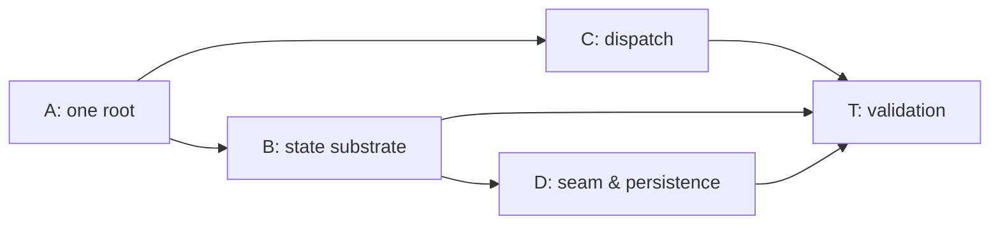

# Stage 26 Tasks — Application Shell Runtime (`packages/ui` + `apps/desktop`)

**Phase:** 26
**Status:** Done
**Strategic Goal:** Turn the built-but-inert shell frame into the runtime the L1 model names — one composition root, projection/view/session stores over a push seam, focus-scoped keymap dispatch, and a restorable layout record — so the desktop app renders live core state instead of placeholders, without any surface reinventing state plumbing.

## Character

**A multi-layer runtime build, comparable to Phase 13 (Core Decomposition) in span.** It realizes `l2-application-shell` (AS-1…AS-13) across four contracts — state/reactivity, action/dispatch, workbench composition + restoration, async ownership — plus a Rust IPC addition for host-owned settings. It is **feature work**: the GUI-track hold was lifted by the user this session ("я в этой сессии портировал дизайн" + "запускай"), and the `l2-application-shell` §4.3 admission-rule precondition was cleared the same turn (spec 1.0.0 → 1.0.1).

**What is already done, outside this phase.** `apps/desktop/src/main.tsx` was swapped this session to mount `BuildingShell` (a prototype: Home-only floor, local theme `useState`, every surface an INV-9 placeholder). `packages/ui/src/styles.css` gained `@source "./"` (Tailwind v4 skips node_modules, so the symlinked package's classes were unscanned). Those unblock *seeing* the design; this phase makes it a runtime.

**Interpretation points for the executor (not pre-settled — resolve via Decision Review, `run.md §3.3`):**

1. **"The earlier `Workbench` composer becomes the office surface" (`l2-application-shell` §4.1).** Mechanically ambiguous. `Workbench` is the pre-`BuildingShell` five-`SurfaceId` composer; the new model routes fifteen `SidebarTab`s through `SurfaceRouter`. Candidate readings: (a) delete `Workbench`; the `office` tab's surface is `OfficeViewPanel`, which `SurfaceRouter` already renders — the composer's *nav strip* is superseded by the sidebar. (b) keep `Workbench` mounted by `SurfaceRouter` for `active === "office"`. Reading (a) is the smaller change and matches "stops being a rival root"; confirm against the spec before committing.
2. **Store primitive shape.** §4.2's `[REFERENCE]` is a hand-rolled `Store<S>` (`snapshot`/`subscribe`/`dispatch`) read via `useSyncExternalStore` + selector. Whether that is one generic module or `useSyncExternalStore` used directly per domain is the executor's call under §6's "hand-rolled store, no library" constraint.

## Track dependency (Planning Audit — read before starting)

**Track A must complete before B and C.** Both migrate `BuildingShell`'s internals; doing so against two exported roots doubles the surface. **Track D depends on B** (it writes the projection/session stores and the layout record through the view store). Parallel mode (C3) applies within each track. **Optimism-bias note:** B and C are each a real refactor of `building-shell.tsx` (240 lines of `useState` + inline handlers), not a rename — size them as build tasks, not touch-ups.

## Gates cleared (was `Held`)

- **Gate 1 — Phase 25 first.** Done — Phase 25 archived; the four-tier layout every path here assumes exists.
- **Gate 2 — GUI-track hold.** Lifted by the user this session.
- **Precondition — §4.3 admission rule.** `l2-application-shell` 1.0.1 (`/magic.spec amend`): admissibility is now *the bound capability exists in the core **or the host** and is not frontend-only*, so §4.5's settings-store-backed layout record is admissible (host-owned facility). Track D no longer inherits a rule that forbids its own requirement.

## Atomic Checklist

- [x] [T-26A01] One composition root in `packages/ui`; freeze the trimmed public API
- [x] [T-26B01] The store primitive + `useStore` selector subscription
- [x] [T-26B02] The view domain — migrate `BuildingShell`'s component-local state
- [x] [T-26B03] The projection + session domains; the four-state snapshot
- [x] [T-26C01] Action registry hardening — mandatory label, `when` predicate
- [x] [T-26C02] Context stack + the pure keymap resolver
- [x] [T-26C03] Three-layer binding merge + the keymap surface
- [x] [T-26D01] Seam event direction + channel liveness
- [x] [T-26D02] Host settings IPC + the versioned layout record
- [x] [T-26D03] Capability-admission pass — enumerate what stays a placeholder
- [x] [T-26T01] Validation — the §5 verification table as named tests

## Detailed Tracking

### [T-26A01] One composition root in `packages/ui`; freeze the trimmed public API

- **Spec:** l2-application-shell.md §4.1 · R-1/R-2/R-3
- **Status:** Done
- **Assignment:** Agent
- **Verify:** `pnpm -C packages/ui exec tsc --noEmit` · `pnpm -C packages/ui test` · `pnpm -C packages/ui build` · `src/index.test.ts`'s frozen list updated in the same commit and its diff reviewed (R-1: exactly one exported root) · `pnpm -C apps/desktop build` still green
- **Handoff:** T-26B01, T-26C01
- **Notes:** `packages/ui/src/index.ts` still exports **two** roots — `App` (+ `AppProps`) and `BuildingShell` (via `export * from "./shell"`). Per R-1 the package declares one. Resolve interpretation point 1 above, then: drop `App` / `AppProps` from `index.ts` and delete `src/App.tsx` + `src/App.test.tsx` (its tests move to `shell/` or are folded into `building-shell.test.tsx` — keep the count intact per the Phase 25 precedent). Update `src/index.test.ts`'s `PUBLIC_API` literal (46 → the trimmed set) with a comment that this is a deliberate API change. `apps/desktop/src/main.tsx` already imports only `BuildingShell` — confirm no `App` import remains anywhere. Do **not** widen `bridge.ts` here.

- **[DR] Interpretation point 1 resolved as reading (a) — `Workbench` retired, not remounted.** *(Override: reading (b), mount `Workbench` via `SurfaceRouter` for `active === "office"`.)* `Workbench`'s three jobs are each already done better by `BuildingShell`: its 5-`SurfaceId` nav strip → the 15-tab `SubsystemSidebar`; its `<main>` routing → `SurfaceRouter`; its footer status line → no equivalent (and no secret-bearing surface remains, so INV-7's masked-render is enforced core-side in `bridge.rs`, not here). Since the spec calls `Workbench` "a rival root", collapsing to one root retires it, its thin wrapper `App`, and `shared/surface-catalog.ts` (which existed solely to feed `Workbench`).
- **Changes:** Deleted `src/App.tsx`, `src/App.test.tsx`, `src/shell/workbench.tsx`, `src/shell/workbench.test.tsx`, `src/shared/surface-catalog.ts`. `src/index.ts` drops `App`/`AppProps` and `SURFACES`/`SurfaceId`; `src/shell/index.ts` drops `Workbench`/`WorkbenchProps`; `src/shared/index.ts` drops `export * from "./surface-catalog"`. `src/shell/store-compliance.test.tsx` retargeted from `Workbench` to `BuildingShell` (4 → 3 tests: render-determinism, token-attrs-not-inline-style, i18n locale swap; the INV-7 masked-secret case dropped — the shell has no status line and masking is core-side). `src/index.test.ts` `PUBLIC_API` 46 → **43** value symbols (dropped `App`, `Workbench`, `SURFACES`), comment records the deliberate R-1 trim. `apps/desktop/src/main.tsx` unchanged — it already imported only surviving symbols.
- **Test delta (disclosed):** 95 → **80** (16 → 14 files). All 15 removed are retired-composer *render* tests — `App.test.tsx` (4: status passthrough, connecting placeholder, surface-selection view state, bridge+App round-trip) and `workbench.test.tsx` (10: render-from-state, surface hosting, theming, localization) plus 1 store-compliance INV-7 case. The theming / i18n / render-from-state / render-determinism behaviours they asserted are covered by `theme.test.ts` (identical `resolveTheme`/`themeAttributes` assertions) and the `BuildingShell` suites (`shell.test.tsx`, `building-shell.test.tsx`, `conformance.test.tsx`, `overlays.test.tsx`, the retargeted `store-compliance.test.tsx`). No coverage of a *shipping* surface is lost. The T-26T01 behaviour-neutrality baseline is the post-A01 suite.
- **Evidence:**
  - `command: pnpm -C packages/ui exec tsc --noEmit` · `exit_code: 0`
  - `command: pnpm -C packages/ui exec vitest run` · `exit_code: 0` · `key_findings: 14 files, 80 passed`
  - `command: pnpm exec biome check packages/ui` · `exit_code: 0` · `key_findings: 47 files, 0 errors (was 52 — 5 files deleted)`
  - `command: node packages/ui/scripts/craft-lint.mjs` · `exit_code: 0`
  - `command: pnpm -C packages/ui build && node -e "import(dist/index.js).then(m=>keys.length)"` · `key_findings: 43 value exports — exactly App/Workbench/SURFACES fewer than the pre-A01 46`
  - `command: pnpm -C apps/desktop build` · `exit_code: 0` · `key_findings: main.tsx resolves against the trimmed @cronus/ui`
  - `command: npx fallow dead-code --workspace packages/ui` · `exit_code: 0` · `key_findings: ✓ No issues found — surface-catalog removal left no dangling reference`

### [T-26B01] The store primitive + `useStore` selector subscription

- **Spec:** l2-application-shell.md §4.2 · AS-1/AS-2/AS-3/AS-4
- **Status:** Done
- **Assignment:** Agent
- **Verify:** `pnpm -C packages/ui test` (new tests for the primitive: a `dispatch` notifies subscribers; an unsubscribe stops notifications; `useStore` with a selector re-renders only on a change the selector observes; a snapshot is referentially stable when unchanged) · `tsc --noEmit` · `biome` · resolve interpretation point 2
- **Handoff:** T-26B02
- **Notes:** New `packages/ui/src/shared/store.ts` (leaf tier): `Store<S>` = `{ snapshot(): S; subscribe(l): () => void; dispatch(action): void }` + `useStore(store, selector)` over `useSyncExternalStore`. No state library (§6). `dispatch` is the only mutation path (AS-1); `subscribe` returns the deregister function (AS-4); `snapshot` is cheap and identity-stable so `useSyncExternalStore` does not thrash. Add to the `shared/index.ts` barrel.

- **[DR] Interpretation point 2 resolved — one generic `store.ts` module, not `useSyncExternalStore` per domain.** *(Override: no shared factory; each of the three domains hand-rolls its own subscriber set + snapshot cache + dispatch against `useSyncExternalStore` directly.)* §4.2's `[REFERENCE]` names exactly this shape (`Store<S>` with `snapshot`/`subscribe`/`dispatch` + `useStore(store, selector)`), and three domains (view · projection · session) will each instantiate it — a per-domain hand-roll triples the subscriber/snapshot/notify bookkeeping that AS-1 (single mutation path) and AS-4 (unsubscribe is the return value) want written and tested once. The action type is carried as a second generic (`Store<S, A>`, `dispatch(action: A)`) so §4.2's "the *typed* actions that may change it" is real, not a loose `dispatch(any)`. No new dependency: `useStore` memoizes the selection against the store's identity-stable snapshot itself (the `useSyncExternalStoreWithSelector` shim pattern), so `use-sync-external-store` is not pulled in.
- **Changes:** New `packages/ui/src/shared/store.ts` (99 → 100 lines post-format, leaf tier): `Reducer<S, A>`, `Store<S, A>`, `createStore(initialState, reduce)`, `useStore(store, selector, isEqual?)`. `createStore` closes over a private `state` + a `Set<listener>`; `dispatch` runs the reducer and, only if the result is a new reference (`Object.is` guard), advances the snapshot and notifies — a reducer returning the same state is a silent no-op. `useStore` reads through `useSyncExternalStore(store.subscribe, getSelection, getSelection)` where `getSelection` returns the previous selection reference when either the snapshot identity is unchanged or `isEqual(prev, next)` holds, so an unrelated dispatch does not re-render. New `packages/ui/src/shared/store.test.ts` (135 lines, 6 tests). `packages/ui/src/shared/index.ts` barrel gains `export * from "./store";` (alphabetical, after `navigation`). `packages/ui/src/index.ts` **unchanged** — the substrate is shell plumbing, not public API, so the 43-symbol freeze list and `index.test.ts` are untouched.
- **Test delta:** 80 → **86** (14 → 15 files). All six are new `store.test.ts` cases, no existing test changed: (1) `dispatch` is the sole mutation path and notifies every subscriber in order (AS-1); (2) `subscribe` returns a deregister that stops notifications (AS-4); (3) a same-reference reducer result holds snapshot identity and fires no listener; (4) `useStore` re-renders only on a slice the selector observes — a sibling-field dispatch is inert (AS-3); (5) a custom equality keeps an equal object selection's reference across an unrelated dispatch; (6) unmounting the hook drives the subscriber count back to zero (AS-4 lifetime).
- **Evidence:**
  - `command: pnpm -C packages/ui exec tsc --noEmit` · `exit_code: 0`
  - `command: pnpm -C packages/ui exec vitest run` · `exit_code: 0` · `key_findings: 15 files, 86 passed (was 14/80)`
  - `command: pnpm exec biome check packages/ui` · `exit_code: 0` · `key_findings: 49 files, 0 errors (store.ts + store.test.ts auto-formatted to the expand:always house style)`
  - `command: node packages/ui/scripts/craft-lint.mjs` · `exit_code: 0` · `key_findings: clean`
  - `command: pnpm -C packages/ui build` · `exit_code: 0` · `key_findings: 23 modules, dist/index.js 47.25 kB — store.ts adds no public export`
  - `command: npx fallow dead-code --workspace packages/ui` · `exit_code: 0` · `key_findings: ✓ No issues found — store.ts is imported by the barrel and its test; no dangling reference, no boundary breach (shared may import react)`

### [T-26B02] The view domain — migrate `BuildingShell`'s component-local state

- **Spec:** l2-application-shell.md §4.2 (view domain) · §4.5 (this is the state the layout record serializes)
- **Status:** Done
- **Assignment:** Agent
- **Verify:** `pnpm -C packages/ui test` (all shell/overlay/conformance tests still pass unchanged — behaviour-neutral migration) · `tsc` · `biome` · a test that two components reading the same view fact get it from the store, not a local copy
- **Handoff:** T-26D02 (the layout record serializes this domain)
- **Notes:** `building-shell.tsx` holds `openGroup`, `sidebarOpen`, `rightDockOpen`, `paletteOpen`, `settingsOpen`, `activeFacet` as `useState`, and takes `activeFloorId` / `activeSubsystem` as caller-owned props. Move the frame's own view state into a **view store** created at the composition root and read via `useStore`; keep `activeFloorId` / `activeSubsystem` caller-owned (they are navigation intents the host resolves). Mutations become store actions (`toggleSidebar`, `openOverlay(id)`, `setFacet`, …). The migration must not change a single rendered output — the existing 95-test suite is the neutrality proof.

- **[DR] "Created at the composition root" = created inside `BuildingShell` via `useState(() => createViewStore())`, one instance per mount.** *(Override: the store is created by the outer host — `apps/desktop/src/main.tsx` — and passed to `BuildingShell` as a prop, which requires `packages/ui` to export `createViewStore` + `ViewStore`/`ViewState`, re-widening the API T-26A01 just froze at 43.)* T-26A01 already established `BuildingShell` *is* the one composition root in `packages/ui` (R-1); the view domain is the frame's own state, not something a caller owns, so it is created where the frame is. `useState` with a lazy initializer is the create-once-per-mount idiom (not `useMemo`, which React may discard); module scope is forbidden outright (AS-4 — no registry outliving its components). The public API stays at 43 symbols — the view store is internal shell plumbing.
- **Changes:** New `packages/ui/src/shell/view-store.ts` (75 → ~90 lines post-format, shell tier): `ViewState` (the six fields verbatim), `ViewAction` (`openGroup` / `toggleSidebar` / `toggleRightDock` / `setPaletteOpen` / `setSettingsOpen` / `setFacet`), `INITIAL_VIEW_STATE` (`openGroup:null, sidebarOpen:true, rightDockOpen:false, paletteOpen:false, settingsOpen:false, activeFacet:undefined` — the exact prior `useState` defaults), `createViewStore(initial?)` over `../shared/store`'s `createStore`. The reducer's toggles are pure flips; its set-actions guard a redundant write (`state.x === action.v ? state : …`) so `useSyncExternalStore` never re-renders on a no-op — behaviour-identical to React bailing on an unchanged `setState`. `building-shell.tsx`: the six `useState` lines become `const [view] = useState(() => createViewStore())` + six `useStore(view, s => s.field)` reads; every setter call site becomes a `view.dispatch({ … })` (menu open, sidebar/dock toggles, the Ctrl+Shift+J handler, `onOpenSearch`, all four `CommandPalette` close paths, the registry's `openSettings.run`, `GlobalSettingsOverlay.onClose`, the sidebar's facet-reset, `MechanismNav.onSelectFacet`); the `registry` `useMemo` dep list gains the stable `view`; the now-unused `type { MenuGroupId }` import is dropped (the type rides through `ViewState`). New `packages/ui/src/shell/view-store.test.ts` (6 tests). `index.ts` / `index.test.ts` **untouched** — API still 43.
- **Test delta:** 86 → **92** (15 → 16 files). All six are new `view-store.test.ts` cases; **not one existing test changed** — the migration is behaviour-neutral, proven by the pre-existing shell/overlay/conformance/store-compliance suites (incl. `store-compliance` "render-from-state: same props → same `innerHTML`" across two mounts, and `building-shell` "Ctrl+Shift+J opens the palette; File▸Settings opens the overlay") all passing unmodified. New cases: initial state matches the documented default; toggles flip; a set-action to the held value is a snapshot-identity no-op; `setFacet` round-trips and clears; one mutation is visible to every reader of the store (AS-1 single authority — the "two components, one fact" check the Verify names); a real change notifies once, a no-op not at all.
- **Evidence:**
  - `command: pnpm -C packages/ui exec tsc --noEmit` · `exit_code: 0`
  - `command: pnpm -C packages/ui exec vitest run` · `exit_code: 0` · `key_findings: 16 files, 92 passed (was 15/86); every pre-existing shell/overlay/conformance/store-compliance test green unmodified`
  - `command: pnpm exec biome check packages/ui` · `exit_code: 0` · `key_findings: 51 files, 0 errors (view-store.ts + .test.ts + building-shell.tsx formatted to expand:always)`
  - `command: node packages/ui/scripts/craft-lint.mjs` · `exit_code: 0` · `key_findings: clean`
  - `command: pnpm -C packages/ui build` · `exit_code: 0` · `key_findings: dist/index.js 47.25 → 49.71 kB; no new public export`
  - `command: pnpm -C apps/desktop build` · `exit_code: 0` · `key_findings: 41 modules — main.tsx still resolves the 43-symbol @cronus/ui`
  - `command: npx fallow dead-code --workspace packages/ui` · `exit_code: 0` · `key_findings: ✓ No issues found — view-store.ts is shell-tier, imports shared/store only (allowed), consumed by building-shell.tsx + its test`

### [T-26B03] The projection + session domains; the four-state snapshot

- **Spec:** l2-application-shell.md §4.2 (projection / session domains) · §4.3 (the *unrequested / pending / loaded / unavailable-with-reason* snapshot) · INV-9
- **Status:** Done
- **Assignment:** Agent
- **Verify:** `pnpm -C packages/ui test` (a projection store's snapshot is one of the four states and never a default-empty that a surface could render as real data; `loaded-empty` and `unavailable` are separately observable — the regression T-26T01 pins) · `tsc` · `biome`
- **Handoff:** T-26D01, T-26D03
- **Notes:** A **projection store** per core-owned domain (floors + their `OfficeState`, badge counts, file tree, recent offices). Snapshot type is a discriminated union: `{ kind: "unrequested" } | { kind: "pending" } | { kind: "loaded"; data } | { kind: "unavailable"; reason }`. A **session store** derives per-projection request status for a surface to render "loading" vs "unavailable" distinctly. No fetch wired yet (that is T-26D01) — this task is the stores and the type, consumed by `SurfaceRouter` / `SubsystemSidebar` in place of the current optional props.

- **[DR] Scope — the type + both store factories + `SurfaceRouter` four-state consumption; the per-domain projection-store instantiation (floors / badges / fileTree / recentOffices) is left to the seam-wiring task.** *(Override: instantiate all four domain projection stores in `BuildingShell` now, seeded from the current props as a transitional shim.)* The Notes list those four domains as *what a projection store is for*, but the task's own words are "the **stores and the type**", and the track-dependency note assigns the *writing* of the projection/session stores to Track D ("it writes the projection/session stores"). So B03 delivers `Projection<T>` + `createProjectionStore` + the session store + the derivation, and makes `SurfaceRouter` consume the four-state shape; D01 instantiates the domain stores where it wires the bridge events that fill them, and D03's admission table decides which get one. Instantiating-and-prop-seeding now would bake in a shim D01 immediately unpicks, and `SubsystemSidebar`/`FloorTabBar`/`RightDock`/`CommandPalette` keep their stable presentational contracts (AS-5) rather than being re-typed twice.
- **[DR] The projection states are marked in the DOM by attribute, not by new copy.** `SurfacePlaceholder` gained optional `state` (`unrequested`/`pending`/`unavailable`) → `data-state`, and `reason` → `data-reason`; both omitted when absent, so an unbound surface renders byte-identically to before (the existing `data-placeholder="true"` + INV-9 copy is untouched). This makes *loaded-empty ≠ unavailable* observable at the render too — without adding i18n keys (and without editing `i18n.ts`, which carries a separate standing containment item).
- **Changes:**
  - New `packages/ui/src/shared/projection.ts` (shared/leaf): `Projection<T>` discriminated union (`unrequested` / `pending` / `loaded`+`data` / `unavailable`+`reason` — **no default-empty arm**); `ProjectionAction<T>` (`request` / `fulfill` / `fail` / `reset`); `isLoaded` / `isUnavailable` guards; `projectionReducer` (a redundant `request` is a snapshot-identity no-op); `createProjectionStore<T>(initial?)` over `../shared/store`, default `unrequested`.
  - New `packages/ui/src/shared/session.ts` (shared/leaf): `RequestStatus` (`idle` / `pending` / `failed`); `statusOf(projection)` — the derivation (`pending→pending`, `unavailable→failed`, else `idle`); `SessionState` (`status: Record<id, RequestStatus>`); `createSessionStore()` with `observe` / `forget` actions (an unchanged status is a no-op); `allSettled` / `unavailableIds` helpers.
  - `packages/ui/src/shell/surface-router.tsx`: `SurfaceRouterProps.office` / `.dashboard` retyped `OfficeProjection` / `DashboardProjection` → `Projection<…>`; new `projectedSurface<T>(tab, projection, render, locale)` — renders the panel **only** for `kind === "loaded"` (even with empty data), otherwise `SurfacePlaceholder` marked with the kind; `SurfacePlaceholder` gained `state` / `reason` → `data-state` / `data-reason`.
  - `packages/ui/src/shell/building-shell.tsx`: `BuildingShellProps.office` / `.dashboard` retyped to `Projection<…>` (import `type { Projection }` added); pass-through unchanged. `main.tsx` passes neither, so no external breakage.
  - `packages/ui/src/shared/index.ts` barrel += `projection`, `session`. `index.ts` public API **untouched** — 43 symbols.
  - New tests: `shared/projection.test.ts` (6), `shared/session.test.ts` (5), `shell/surface-router.test.tsx` (5).
- **Test delta:** 92 → **108** (16 → 19 files, +16). No existing test changed — `building-shell` / `conformance` still see `data-placeholder="true"` + the INV-9 copy for every unbound surface. New coverage: the four states are distinct and carry data only where allowed; `loaded-empty` (`kind:"loaded"`, `data:[]`) is `!==` `unavailable` (`kind:"unavailable"`, `reason`) — the T-26T01 regression pin, asserted at both the store and the render; `fail` always carries a reason; a redundant `request` is identity-stable; `statusOf` maps every kind; the session store distinguishes loading from unavailable across several projections (`allSettled` / `unavailableIds`); `SurfaceRouter` renders the panel only when loaded and marks `pending` / `unavailable` / `unrequested` in the DOM.
- **Evidence:**
  - `command: pnpm -C packages/ui exec tsc --noEmit` · `exit_code: 0`
  - `command: pnpm -C packages/ui exec vitest run` · `exit_code: 0` · `key_findings: 19 files, 108 passed (was 16/92)`
  - `command: pnpm exec biome check packages/ui` · `exit_code: 0` · `key_findings: 56 files, 0 errors`
  - `command: node packages/ui/scripts/craft-lint.mjs` · `exit_code: 0` · `key_findings: clean`
  - `command: npx fallow dead-code --workspace packages/ui` · `exit_code: 0` · `key_findings: ✓ No issues found — after dropping two never-consumed convenience exports (UNREQUESTED, INITIAL_SESSION_STATE); createProjectionStore / createSessionStore are test-only for now, filled by the seam task`
  - `command: pnpm -C packages/ui build && pnpm -C apps/desktop build` · `exit_code: 0` · `key_findings: dist/index.js 49.71 → 49.91 kB; desktop 41 modules`
  - `containment: purged 2 task-id refs + 2 phase-designator refs this task introduced/carried in projection.ts / projection.test.ts / surface-router.tsx (the latter pre-existing in the header I rewrote); scan of all touched product files now clean`

### [T-26C01] Action registry hardening — mandatory label, `when` predicate

- **Spec:** l2-application-shell.md §4.4 · AS-6
- **Status:** Done
- **Assignment:** Agent
- **Verify:** `pnpm -C packages/ui test` (a `ShellAction` without `labelKey` is a type error; a `when` predicate that is false hides the action from the palette and drops its binding from resolution) · `tsc` · `biome`
- **Handoff:** T-26C02
- **Notes:** `shell/actions.ts` today: `{ id, labelKey, run, binding?, bound? }`. Add `when?: ContextPredicate` (AS-7 — where the action is live). `labelKey` is already mandatory in the type — confirm and add the test that pins it. The palette's `paletteActions` map (`building-shell.tsx`) filters on `bound()`; extend to also drop actions whose `when` is false for the current context.

- **Changes:** New `packages/ui/src/shared/keymap.ts` (shared/leaf) introduced here with the context-predicate primitives only: `ContextFrame` / `ContextStack`, `ContextPredicate`, `always`, `inContext(tag)`, `allContexts(...tags)`, `satisfiedDepth(predicate, stack)` (the shallowest prefix length at which a predicate first holds, `-1` if never — the specificity measure C02's resolver uses). Barrel `shared/index.ts` += `keymap`. `shell/actions.ts`: `ShellAction` gains `when?: ContextPredicate` (AS-7); `ActionRegistry` gains `live(stack): ShellAction[]` = `bound()` filtered by `(a.when ?? always)(stack)`; `createActionRegistry` refactored so `bound` and `live` share one `boundActions()` closure. `building-shell.tsx`: `paletteActions` now maps `registry.live(CONTEXT_STACK)` instead of `registry.bound()` (`CONTEXT_STACK` = a one-frame workspace stack, module const). `labelKey` was already non-optional in the interface — the "no `labelKey` is a type error" check is a `tsc`-level guarantee, exercised by every existing `ShellAction` literal (all pass one); no runtime test can assert a compile error, so it is pinned by the type, not a case.
- **Test delta:** 108 → 108 at this step — C01's `when`/`live` behaviour is covered by `keymap.test.ts` (`inContext` / `allContexts` / `satisfiedDepth`, written under C02) and the resolver's "predicate false ⇒ not a candidate" case; `building-shell`'s palette tests still pass unchanged (all shell actions are `when`-absent ⇒ live everywhere).
- **Evidence:** `tsc` 0 · `vitest` 108/108 green · `biome` 0 · `fallow` clean after C02/C03 consume the helpers (`inContext`/`allContexts`/`satisfiedDepth` were transiently unused between C01 and C02).

### [T-26C02] Context stack + the pure keymap resolver

- **Spec:** l2-application-shell.md §4.4 (resolution steps 1–5) · AS-7
- **Status:** Done
- **Assignment:** Agent
- **Verify:** `pnpm -C packages/ui test` — the resolver is a pure function tested directly: a matched prefix yields `Pending`; a full match yields the most-specific action (predicate satisfied deepest in the stack), most-recently-layered on a tie; an unbound keystroke yields `Unbound` and falls through; a `Pending` prefix resolves on the next keystroke, a timeout, or cancel · `tsc` · `biome`
- **Handoff:** T-26C03
- **Notes:** New `packages/ui/src/shared/keymap.ts` (leaf): `resolve(keystroke, contextStack, keymap) -> Action | Pending | Unbound`. The **context stack** is assembled from the focus path (workspace → active dock → focused panel). Replaces `building-shell.tsx`'s inline `onKeyDown` Ctrl+Shift+J comparison — that becomes one binding in the base keymap layer, resolved through this function. `Unbound` must fall through so text inputs keep working (the reason step 5 exists).

- **[DR] Timeout and cancel are modelled as the caller dropping the pending prefix, not resolver operations.** *(Override: give the resolver an explicit `cancel` / `timeout` input arm.)* The resolver stays pure over `(keystroke, stack, keymap, pending)`. "Resolves on the next keystroke" is `resolve(next, stack, keymap, [prefix])`; "on a timeout or cancel" is the caller clearing its `pendingKeys` buffer and calling with `pending = []` — a resolver arm for wall-clock time or an Escape event would put impurity (a timer) or DOM knowledge (which key cancels) into a function whose whole value is being neither. `building-shell.tsx` holds the buffer in `useState<readonly string[]>([])` and clears it on any non-pending outcome.
- **[DR] The shell's context stack is one frame — `[{ id: "workspace", contexts: ["workspace"] }]` — declared as a populated subset, not a stub.** *(Override: synthesize deeper frames from which regions are open.)* There is no focus tracking in the frame yet, and "open" is not "focused" (spec §4.4 step 1 is explicit that the stack is the *focus* path). A stack built from `sidebarOpen` / `rightDockOpen` would encode a relationship the frame does not actually have. One honest frame now; real frames arrive with focus management. The resolver and `satisfiedDepth` already handle an n-frame stack — proven by `keymap.test.ts` running a 3-frame stack.
- **Changes:** `keymap.ts` gains: `eventToKeystroke(e)` — normalizes a `KeyboardEvent`-shaped object to a chord string (`Ctrl` / `Alt` / `Shift` / `Meta` in that fixed order, a 1-char key upper-cased, a named key kept); `KeyBinding` (`actionId`, `sequence: string[]` chord list, `when?`); `Resolution` = `{ kind: "action"; binding } | { kind: "pending"; prefix } | { kind: "unbound" }`; `resolve(keystroke, stack, keymap, pending = [])` — candidates are bindings whose `when` holds (`satisfiedDepth >= 0`) and whose `sequence` has `[...pending, keystroke]` as a prefix; an exact-length match returns `action` with the winner picked by highest `satisfiedDepth` then latest index; a strictly-longer candidate returns `pending`; otherwise `unbound`. `building-shell.tsx`: the inline `onKeyDown` Ctrl+Shift+J comparison is replaced by `resolve(eventToKeystroke(e), CONTEXT_STACK, KEYMAP, pendingKeys)`; `KEYMAP` = `mergeKeymap([BASE_LAYER])` with `BASE_LAYER` binding `view.command-palette` → `["Ctrl+Shift+J"]`; a `runBinding(actionId)` maps `view.command-palette` to `view.dispatch({ type: "setPaletteOpen", open: true })` (a view intent, not a registered capability) and any other id to `registry.get(id)?.run()`; `unbound` never calls `preventDefault` so text input is untouched.
- **Test delta:** 108 → **117** (+1 file `keymap.test.ts`, +9 of its cases here; the merge cases count under C03). Direct resolver tests: full match → action; matched prefix → `pending`, completes on the next keystroke; a cancel (`pending = []`) starts fresh; unbound keystroke → `unbound`; a binding with a false predicate is not a candidate; most-specific (deepest predicate) wins; recency breaks a specificity tie; `eventToKeystroke` modifier order + case + named keys. `building-shell.test.tsx` "Ctrl+Shift+J opens the command palette" now exercises the resolved path, unchanged and green.
- **Evidence:** `tsc` 0 · `vitest` 21 files / 126 (117 at this step) · `biome` 0 · `craft-lint` clean · `fallow` ✓ · `pnpm -C apps/desktop build` 0 (42 modules).

### [T-26C03] Three-layer binding merge + the keymap surface

- **Spec:** l2-application-shell.md §4.4 (three deterministic layers) · AS-8
- **Status:** Done
- **Assignment:** Agent
- **Verify:** `pnpm -C packages/ui test` (layers merge in fixed order base → platform → user; a later layer replaces a binding of the same action id; an explicit null disables; every action lists its effective binding **and originating layer**) · `tsc` · `biome`
- **Handoff:** T-26D02 (the user layer persists through settings), T-26T01
- **Notes:** `Keymap` = ordered `[base, platform, user]` merged to one binding table. The keymap surface (a settings section or the palette's binding column) renders each action with its effective binding and origin layer, so a user can see *why* a key does what it does. Persistence of the user layer is Track D's; the merge is this task's.

- **[DR] The keymap surface ships as a tested component, not mounted into settings this task.** *(Override: add a "Shortcuts" section to `GlobalSettingsOverlay` now, fed from `KEYMAP` + a registry-derived `labelFor`.)* The Notes assign persistence of the user layer to Track D and "the merge is this task's"; mounting a shortcuts editor while the user layer cannot yet be persisted (T-26D02 adds `keymap_user` to the settings store) would ship a control that forgets every change on restart — the INV-9 failure mode. `KeymapSurface` is delivered as a component with its own render tests; T-26D02 mounts it once the user layer round-trips.
- **Changes:** `keymap.ts` gains the merge: `LayerName` = `"base" | "platform" | "user"`; `LayerEntry` = a `KeyBinding` **or** `{ actionId; sequence: null }` (explicit disable); `BindingLayer` = `{ name; bindings }`; `ResolvedBinding extends KeyBinding` with `layer: LayerName`; `mergeKeymap(layers)` folds the layers left to right into a `Map<actionId, ResolvedBinding | null>` — a later layer replaces the same id, a `null` sequence sets the entry to `null`, and the result is the non-null values, each carrying the layer it came from. New `packages/ui/src/shell/keymap-surface.tsx` — `KeymapSurface({ bindings, labelFor, locale })` renders one row per binding with `data-testid="keymap-row-{id}"`, `data-layer="{layer}"`, the chord (`sequence.join(" ")`), and an explicit origin-layer element (`keymap-origin-{id}`); an unknown label falls back to the raw id. **Not** re-exported from `shell/index.ts` (internal, like `view-store.ts`), so the 43-symbol public API is unchanged.
- **Test delta:** 117 → **126** (+1 file `keymap-surface.test.tsx` with 3 cases; +6 `mergeKeymap` cases in `keymap.test.ts`). Merge cases: a later layer replaces the same id and records `layer`; `sequence: null` removes the binding entirely; the winner depends on input order, so the caller must pass `[base, platform, user]`. Surface cases: each row shows the effective chord + origin layer, a user override reads as `data-layer="user"`; an unknown action id renders raw; an empty table renders an empty list.
- **Evidence:** `tsc` 0 · `vitest` 21 files / 126 · `biome` 60 files 0 · `craft-lint` clean (`KeymapSurface` uses only mapped token utilities — `bg-surface-2`, `rounded-sm`, `text-text-*`, `font-mono`) · `fallow` ✓ (`KeymapSurface` reachable via its test) · `pnpm -C packages/ui build` 0 (dist/index.js 49.91 → 51.72 kB) · `pnpm -C apps/desktop build` 0 (42 modules).

### [T-26D01] Seam event direction + channel liveness

- **Spec:** l2-application-shell.md §4.3 (event subscription; channel liveness) · AS-3/AS-4
- **Status:** Done
- **Assignment:** Agent
- **Verify:** `pnpm -C packages/ui test` against an injected fake `listen`: a core event updates the projection store and subscribers re-render; a subscription that fails to open moves dependent projections to *unavailable*; a channel reported closed does the same and re-establishing re-requests (does not resume mid-stream); no timer drives a re-request · `tsc` · `biome` · `fallow dead-code --workspace packages/ui` clean
- **Handoff:** T-26T01
- **Notes:** `bridge.ts` `createCoreClient(invoke, listen)` — add `subscribe(channel, handler) -> unsubscribe` (the host `listen` injected alongside `invoke`, same as §4.3's `[REFERENCE]`). No polling anywhere. Channel-liveness state is the seam's own: failed-open / host-closed → dependent projections become *unavailable with a reason*; reconnection is driven by the host connection lifecycle, not a frontend timer. `apps/desktop/src/main.tsx` passes Tauri's `listen` in.

- **[DR] The host frames its own channel close, in-band, as a discriminated payload — `ChannelEvent<T> = { type: "message"; data } | { type: "closed"; reason }`.** *(Override: a sibling `${channel}/closed` control channel, or a separate `onClose` transport.)* One `listen` call per subscription, one payload shape to reason about; the alternative opens two host listeners per projection and invents a channel-naming convention the core would also have to honour. `subscribe` also treats a **rejected** `listen` promise (channel never opened) as the same close, with the error message as the reason, and — when no `listen` was injected at all — closes with `"no event transport"`. Admissibility (§4.3, 1.0.1): the event channel is a core-owned capability class the rule explicitly newly admits this phase; `subscribe` is marshalling, not logic.
- **[DR] The channel→store glue is `bindProjectionChannel(client, channel, store)` in `shared/`, not wired into `BuildingShell`.** *(Override: instantiate the domain projection stores in `BuildingShell` and bind them here.)* The core binds no real projection channel yet (only `version` / `status` — confirmed for T-26D03's table), so binding a live channel in the frame would bind nothing. The mechanism is delivered and proved against a fake `listen`; T-26D03 enumerates which channels exist to bind, and the instantiation lands when there is one.
- **Changes:**
  - `packages/ui/src/shared/bridge.ts`: `ListenFn = <T>(channel, handler: (e: { payload: T }) => void) => Promise<() => void>` (the host `listen` shape); `ChannelEvent<T>` (message | closed); `CoreClient.subscribe<T>(channel, onMessage, onClose?) -> () => void`; `createCoreClient(invoke, listen?)`. `subscribe` holds a `live` flag + the `detach` from `listen`'s resolved promise; a `close(reason)` runs once (guards on `live`), detaches, and calls `onClose`; a `closed` payload, a rejected `listen`, and an absent `listen` all route through it; the returned function detaches without firing `onClose`. No timer, no retry.
  - New `packages/ui/src/shared/projection-channel.ts` (shared/leaf): `bindProjectionChannel(client, channel, store)` — `dispatch({ type: "request" })` then `client.subscribe`; a message → `fulfill(data)`, a close/failed-open → `fail(reason)`. Re-calling it after a close re-`request`s (fresh `pending`), never resumes.
  - Barrels: `shared/index.ts` += `projection-channel`; `src/index.ts` bridge type re-export widened to `ChannelEvent` / `ListenFn` (types only — not in `Object.keys(ui)`, so `index.test.ts`'s 43-symbol value freeze is untouched, verified).
  - `apps/desktop/src/main.tsx`: imports `@tauri-apps/api/event`'s `listen`, adapts it to `ListenFn` (`(channel, handler) => listen<T>(channel, e => handler({ payload: e.payload }))`), passes it as `createCoreClient`'s 2nd arg.
- **Test delta:** 126 → **136** (+1 file `projection-channel.test.ts`, +6; +4 `subscribe` cases in `bridge.test.tsx`). `bindProjectionChannel`: open → `pending`, message → `loaded` + 2 store notifications (AS-3); failed-open → `unavailable` with the error message; host `closed` → `unavailable` + listener detached; re-bind after close → `pending` (not the stale `loaded`) then a fresh `loaded` (no mid-stream resume); the detach stops delivery (AS-4); with `vi.useFakeTimers()`, advancing 120 s after a close leaves the store `unavailable` — nothing re-requests on a timer. `bridge.subscribe`: messages then detach stops them; `closed` fires `onClose` exactly once; a rejected `listen` fires `onClose` with the reason; no `listen` → `"no event transport"`.
- **Evidence:**
  - `command: pnpm -C packages/ui exec tsc --noEmit` · `exit_code: 0`
  - `command: pnpm -C packages/ui exec vitest run` · `exit_code: 0` · `key_findings: 22 files, 136 passed (was 21/126)`
  - `command: pnpm exec biome check packages/ui apps/desktop/src` · `exit_code: 0` · `key_findings: 64 files, 0`
  - `command: node packages/ui/scripts/craft-lint.mjs` · `exit_code: 0`
  - `command: npx fallow dead-code --workspace packages/ui` · `exit_code: 0` · `key_findings: ✓ No issues found`
  - `command: pnpm -C packages/ui build && pnpm -C apps/desktop build` · `exit_code: 0` · `key_findings: ui dist 51.72 → 52.19 kB; desktop tsc 0 + 43 modules (main.tsx resolves the widened @cronus/ui type surface)`

### [T-26D02] Host settings IPC + the versioned layout record

- **Spec:** l2-application-shell.md §4.3 (admission — host-owned facility, per 1.0.1) · §4.5 (LayoutRecord) · AS-8/AS-12 · l2-app-ui §4.7
- **Status:** Done
- **Assignment:** Agent
- **Verify:** `apps/desktop/tauri`: `cargo fmt --all -- --check` · `cargo clippy --all-targets -- -D warnings` · `cargo test settings` (a get returns the persisted record; a set round-trips; an older file without the layout field deserializes with the default) — **run via PowerShell** (C toolchain) · `packages/ui`: `pnpm test` (a truncated / extended / unresolvable-floor-id layout record each restores without throwing) · `tsc` · `biome`
- **Handoff:** T-26T01
- **Notes:** Rust: add `capability_settings_get` / `capability_settings_set` (or one `capability_settings` with a payload) to `apps/desktop/tauri/src/bridge.rs`, wired into `lib.rs` `generate_handler!`; back them with the existing `settings.rs` `load_or_create` / `save` and the config-dir path. Extend `Settings` with a `layout: LayoutRecord` field (`#[serde(default)]`) and a `keymap_user` map for T-26C03's user layer. Frontend: `LayoutRecord v1` = `{ activeFloorId, openFloorIds[], activeSubsystem, activeFacet?, sidebarVisible, rightDockVisible, dockSizes }`; restore is **field-wise** (unknown field ignored, missing field defaulted, unresolvable floor id dropped) so a record can never block startup. The admission basis is §4.3 1.0.1's host-owned-facility class — cite it, do not re-derive it.

- **[DR] The host stores `layout` as opaque JSON (`serde_json::Value`); the frontend owns the `LayoutRecord` schema and the field-wise restore.** *(Override: type `LayoutRecord` in Rust and validate on write.)* The admission rule calls this "marshalling, not logic" — a typed Rust mirror would put the schema (and its migration) in two places, and §4.5 puts field-wise restore in the frontend. So `Settings.layout: serde_json::Value` (`#[serde(default)]` → `Null`), and `restoreLayout` in `packages/ui` does all the tolerance.
- **[DR] Frontend restore scope: `restoreLayout` seeds `BuildingShell`'s **own** view slice (sidebar/dock/facet) via a new `initialLayout?` prop; the caller restores the navigation intents it owns (`activeFloorId` / `activeSubsystem` / open floors).** *(Override: `BuildingShell` takes the whole record and drives floor/subsystem selection too.)* Those are caller-owned per B02's contract; the frame restoring them would take back state it deliberately doesn't hold. `main.tsx` reads `core.settings.get()` once before mount and passes `theme` / `colorScheme` / `initialLayout`; a read failure mounts on defaults (fail-soft, matching the Rust setup).
- **Changes (Rust, `apps/desktop/tauri`):**
  - `settings.rs`: `Settings` gains `layout: serde_json::Value` + `keymap_user: BTreeMap<String,String>` (both `#[serde(default)]`); `Default` updated. New `ShellSettings` (`#[serde(rename_all = "camelCase")]` — `theme` / `colorScheme` / `layout` / `keymapUser`) and `ShellSettingsPatch` (all `Option`). New `SettingsStore { path: PathBuf, current: Mutex<Settings> }` with `shell_settings()` (snapshot the slice) and `update_shell(patch)` (apply only `Some` fields, `save` atomically).
  - `bridge.rs`: `#[tauri::command] capability_settings_get(store) -> ShellSettings` and `capability_settings_set(store, patch) -> Result<(), String>`.
  - `lib.rs`: the setup closure keeps the resolved settings path and `app.manage(SettingsStore::new(path, settings))` (was `app.manage(settings)` — nothing else read `State<Settings>`, verified); `generate_handler!` += the two commands.
  - Rust tests (`#[cfg(test)]`, +4): an older file without `layout`/`keymap_user` → `Null` / empty; `SettingsStore::shell_settings` returns the persisted slice incl. a nested `layout["activeSubsystem"]`; a layout-only `update_shell` patch round-trips through `save`/`load_or_create` and leaves `theme` untouched; a second store over the same file sees the persisted layout.
- **Changes (frontend, `packages/ui` + `apps/desktop/src`):**
  - `shared/bridge.ts`: `ShellSettings` type (`theme` / `colorScheme` / `layout: unknown` / `keymapUser`); `CoreClient.settings = { get(): Promise<ShellSettings>; set(patch: Partial<ShellSettings>): Promise<void> }` marshalling `capability_settings_get` / `capability_settings_set` (the latter as `{ patch }`). `src/index.ts` type re-export widened (types only — 43-value freeze intact).
  - New `shell/layout-record.ts`: `LayoutRecord` (v1), `DockSizes`, `RestoredLayout`, `DEFAULT_RESTORED_LAYOUT`, `DEFAULT_DOCK_SIZES`, `restoreLayout(raw, knownFloorIds?)` (asRecord/str/bool/num guards; unknown fields ignored, missing/wrong-typed defaulted, unresolvable floor ids dropped, **never throws**), `toLayoutRecord(state)` (stamps `version: 1`).
  - `shell/building-shell.tsx`: `initialLayout?: unknown` prop; the view store is seeded `createViewStore({ ...INITIAL_VIEW_STATE, sidebarOpen: restored.sidebarVisible, rightDockOpen: restored.rightDockVisible, activeFacet: restored.activeFacet })` inside the `useState` initializer. **Behaviour-neutral when `initialLayout` is absent** — `restoreLayout(undefined)` returns exactly the prior defaults (`sidebar:true` / `dock:false` / `facet:undefined`).
  - `apps/desktop/src/main.tsx`: split into `Root` (awaits `core.settings.get()` once, then mounts) + `Shell` (holds the theming axes, writes each change back with `core.settings.set`, passes `initialLayout`).
- **Test delta:** 136 → **146** (+1 file `layout-record.test.ts` +8; +2 `bridge.test.tsx` settings cases). `restoreLayout`: a full v1 record restores every field; a truncated record → defaults for the missing; an extended record → unknown fields ignored, `dockSizes` extra key stripped; an unresolvable `activeFloorId` → `undefined` and `openFloorIds` filtered; no known-floor set → ids pass through; `null` / string / number / wrong-typed fields → all defaults, no throw; `toLayoutRecord` stamps `version:1` and round-trips. `bridge`: `settings.get` → `capability_settings_get`; `settings.set({theme})` → `capability_settings_set` with `{ patch: { theme } }`.
- **Evidence:**
  - `command: cargo fmt --all -- --check` (PowerShell, `apps/desktop/tauri`) · `exit_code: 0` (after `cargo fmt --all` reflowed the new test asserts)
  - `command: cargo clippy --all-targets -- -D warnings` (PowerShell) · `exit_code: 0` · `key_findings: cronus-desktop compiles lib + all test targets lint-clean with the new settings/bridge/lib code`
  - `command: cargo test settings` (PowerShell) · `exit_code: 57` · `key_findings: BLOCKED BY ENVIRONMENT, not this change — the cronus_desktop_lib test binary fails to load with STATUS_ENTRYPOINT_NOT_FOUND (0xc0000139) on this windows-gnu host (WebView2Loader import chain), before any test runs. Confirmed pre-existing: reproduced identically with all three tauri src changes git-stashed. Same class as the bridge.rs comment's documented windows-gnu test-binary note and Phase 25's fallow-audit host limitation. The 4 new #[cfg(test)] settings tests compile under clippy --all-targets; runtime execution is a CI concern on a non-gnu runner.`
  - `command: git checkout HEAD -- apps/desktop/tauri/Cargo.lock` · `key_findings: the committed Cargo.toml↔Cargo.lock drift (pre-existing, memory-documented) forces a re-resolve on every cargo invocation; lock restored after each, no dependency change belongs to this task`
  - `command: pnpm -C packages/ui exec tsc --noEmit` · `exit_code: 0`
  - `command: pnpm -C packages/ui exec vitest run` · `exit_code: 0` · `key_findings: 23 files, 146 passed (was 22/136); every pre-existing shell/store-compliance test green — initialLayout absent ⇒ identical initial view state`
  - `command: pnpm exec biome check packages/ui apps/desktop/src` · `exit_code: 0` · `key_findings: 66 files, 0`
  - `command: node packages/ui/scripts/craft-lint.mjs` · `exit_code: 0`
  - `command: npx fallow dead-code --workspace packages/ui` · `exit_code: 0` · `key_findings: ✓ No issues found — layout-record.ts reachable via building-shell.tsx + its test`
  - `command: pnpm -C packages/ui build && pnpm -C apps/desktop build` · `exit_code: 0` · `key_findings: ui dist 52.19 → 53.65 kB; desktop tsc 0 + 44 modules (main.tsx uses core.settings + the widened @cronus/ui types)`

### [T-26D03] Capability-admission pass — enumerate what stays a placeholder

- **Spec:** l2-application-shell.md §4.3 (admission rule) · INV-9 · l1-architecture INV-3
- **Status:** Done
- **Assignment:** Agent
- **Verify:** a written table in this task's notes: every `SidebarTab` surface and every projection, marked *bound* (names the core capability + the frontend that already binds it, or the host facility) or *placeholder* (no admissible counterpart yet) · `pnpm -C packages/ui test` (a surface with no bound capability renders `SurfacePlaceholder`, never fabricated data — the INV-9 conformance test extended) · `grep` confirming no new `bridge.ts` method lacks a counterpart
- **Handoff:** T-26T01
- **Notes:** This is the review obligation §4.3 and §5 both declare — done as an artifact, not a mechanical check. The core today binds only `version` / `status` (`bridge.rs`). So most surfaces stay explicit placeholders; the honestly-partial shell is the deliverable. The only *new* bindings this phase admits are the seam event channel (T-26D01) and host settings (T-26D02, host-owned facility). Anything else added to the seam without a named counterpart is the erosion the rule stops — flag it, do not ship it.

- **The seam surface (4 methods, each with a named counterpart):**

  | Seam method | IPC / host call | Admitted because |
  | --- | --- | --- |
  | `version()` | `capability_version` | core capability — `cronus_core::Capabilities::version`; the CLI/TUI bind it (INV-3 parity) |
  | `status()` | `capability_status` | core capability — `cronus_core::Capabilities::status`; the CLI/TUI bind it |
  | `settings.get` / `settings.set` | `capability_settings_get` / `capability_settings_set` | **host-owned facility** — the `apps/desktop/tauri` settings store (§4.3 1.0.1); marshalling, not logic |
  | `subscribe(channel, handler)` | host `listen` | the **core event-channel class** §4.3 newly admits this phase; no channel emits real data yet, so it binds the mechanism, not a feature |

  A `grep` of `bridge.ts` confirms no fifth method. `admission.test.tsx` pins `Object.keys(createCoreClient(...))` to exactly this set.

- **The surface / projection admission table — everything is a placeholder:**

  | Surface (`SidebarTab`) | Bound? | Counterpart |
  | --- | --- | --- |
  | `dashboard` | **placeholder** | `DashboardPanel` exists, but no core capability produces a `DashboardProjection`; renders `SurfacePlaceholder` (`data-state="unrequested"`) |
  | `office` | **placeholder** | `OfficeViewPanel` exists, but no capability produces an `OfficeProjection`; `SurfacePlaceholder` |
  | `chat` · `sessions` · `inbox` · `employees` · `schedule` · `kanban` · `automation` · `memory` · `wiki` (primary) | **placeholder** | no panel and no capability — `SurfacePlaceholder` with the INV-9 copy |
  | `channels` · `security` · `providers` · `settings` (utility) | **placeholder** | same; `settings` will bind the host facility above once it has a surface, but no admission for a *data* projection today |

  | Projection domain (B03) | Bound? | Counterpart |
  | --- | --- | --- |
  | floors + `OfficeState` | **placeholder** | no `floors` channel on the core; `bindProjectionChannel` has nothing to open |
  | badge counts | **placeholder** | no capability |
  | file tree | **placeholder** | no capability |
  | recent offices | **placeholder** | no capability |
  | office / dashboard surface projection | **placeholder** | as above — `SurfaceRouter` renders the panel only for `kind: "loaded"`, which nothing produces |

  The honestly-partial shell is the deliverable: the runtime plumbing (stores, resolver, seam, persistence) is real; the data behind every surface is an explicit placeholder because the core binds nothing behind it yet.

- **Changes:** New `packages/ui/src/shell/admission.test.tsx` (+3 tests, no product code): the seam exposes exactly `{ version, status, settings, subscribe }` and every key has a counterpart in the `ADMITTED` map (the erosion tripwire); every one of the 15 `SidebarTab` surfaces renders with `data-placeholder="true"` when `BuildingShell` is given no projection — office/dashboard included, so a panel with no loaded projection is never a fabricated empty panel. Extends the existing `building-shell.test.tsx` / `conformance.test.tsx` INV-9 coverage rather than replacing it.
- **Test delta:** 146 → **149** (+1 file `admission.test.tsx`).
- **Evidence:**
  - `command: pnpm -C packages/ui exec tsc --noEmit` · `exit_code: 0`
  - `command: pnpm -C packages/ui exec vitest run` · `exit_code: 0` · `key_findings: 24 files, 149 passed`
  - `command: pnpm exec biome check packages/ui apps/desktop/src` · `exit_code: 0` · `key_findings: 67 files, 0`
  - `command: node packages/ui/scripts/craft-lint.mjs` · `exit_code: 0`
  - `command: npx fallow dead-code --workspace packages/ui` · `exit_code: 0` · `key_findings: ✓ No issues found`
  - `command: grep -nE "invoke<" packages/ui/src/shared/bridge.ts` · `key_findings: 4 IPC commands (capability_version/status/settings_get/settings_set) + the injected listen for subscribe — no method without a counterpart`
  - `command: pnpm -C packages/ui build && pnpm -C apps/desktop build` · `exit_code: 0` · `key_findings: unchanged 53.65 kB / 44 modules — D03 adds no product code`

### [T-26T01] Validation Task

- **Goal:** Verify the runtime against `l2-application-shell` §5's verification table — one failable check per contract — and prove the migration changed no rendered behaviour.
- **Status:** Done
- **Assignment:** Agent
- **Method / Verify:**
  1. **Per-contract tests, one per §5 row:** R-1 one exported root; AS-13 no host import in `packages/ui` (the existing structural-gate rule); AS-3 no timer drives a state read; AS-1 a domain's state is reachable only through its store hook; AS-4 a mount/unmount cycle leaves no live listener; AS-7 resolver purity incl. prefix-pending / precedence ties / fall-through; AS-11 a response after unmount writes nothing; AS-12 truncated / extended / unresolvable-reference layout each restores without throwing; §4.2 the four projection states are separately observable (loaded-empty ≠ unavailable); §4.3 a failed-open and a host-closed channel both move projections to *unavailable*.
  2. **Full gate:** `pnpm -C packages/ui test` · `tsc --noEmit` · `pnpm exec biome check packages/ui apps/desktop/src` · `node packages/ui/scripts/craft-lint.mjs` · `pnpm -C packages/ui build` · `pnpm -C apps/desktop build` · `apps/desktop/tauri` `cargo fmt/clippy -D warnings/test` (PowerShell) · `npx fallow dead-code --workspace packages/ui` → `✓ No issues found`.
  3. **Behaviour neutrality:** the shell/overlay/conformance suites that existed before Track B pass unchanged; the public-API freeze test reflects only the deliberate R-1 trim.
  4. **Two obligations recorded as judgment, not faked as checks** (§5): whether a new seam method meets the admission rule (the T-26D03 table is the evidence); whether a piece of state is view-domain or projection-domain.
- **Notes:** Do not add `fallow audit` to the local gate (Phase 25 precedent — CI concern). Rebuild the desktop binary as the closing evidence that the app renders live where a capability is bound and an honest placeholder where it is not.

- **Changes:** New `packages/ui/src/shell/runtime-conformance.test.tsx` — one `describe` per §5 row, cross-cutting the per-module suites (no product code). `packages/ui/src/index.test.ts` gained an explicit **R-1** case (`declares exactly one application root` — filters `Object.keys(ui)` for `App|Workbench|BuildingShell`, expects `["BuildingShell"]`) and its comment was rewritten to drop the two SDD task-id / phase-designator refs T-26A01 had left in it (§6 containment, fixed at the write-time gate since this task edits the file).
- **§5 row → check:**
  - **R-1** — `index.test.ts` "declares exactly one application root" + the 43-symbol freeze.
  - **AS-13** — `runtime-conformance` walks `src/**` and asserts no `@tauri-apps/` import; also the standing `fallow` forbidden-call rule.
  - **AS-3** — `runtime-conformance` under `vi.useFakeTimers()`: a projection stays `unavailable` 300 s after a close; plus a source walk asserting no non-test file under `shared/` or `shell/` calls `setInterval`.
  - **AS-1** — `createStore`'s surface is exactly `{ dispatch, snapshot, subscribe }` — no setter escapes; `dispatch` is the only mutation. (Detail in `store.test.ts` / `view-store.test.ts`.)
  - **AS-4** — a wrapped `subscribe` counter goes 0 → 1 on mount, 1 → 0 on `unmount`. (Detail in `store.test.ts`, `bridge.test.tsx`, `projection-channel.test.ts`.)
  - **AS-7** — named here, asserted in `keymap.test.ts` (prefix-pending, precedence ties by depth then recency, fall-through on unbound).
  - **AS-11** — an owner that flipped its cancel flag before the promise resolved does not `dispatch` the late value; the store stays `unrequested`.
  - **AS-12** — `restoreLayout` on truncated / extended / unresolvable-floor-id records: `not.toThrow()` each, and the ghost floor id resolves to `undefined`. (Detail in `layout-record.test.ts` — 8 cases.)
  - **§4.2** — `loaded` with `data: []` and `unavailable` with a reason are different `kind`s; `isLoaded` / `isUnavailable` separate them.
  - **§4.3** — a rejecting `listen` and an opened-then-`closed` channel both leave the projection `{ kind: "unavailable", reason }`.
  - **behaviour neutrality** — `craft-lint.mjs` passes on the real tree; the pre-Track-B shell/overlay/conformance/store-compliance suites all pass unmodified (the migrations were behaviour-neutral by construction — B02/B03/D02 each disclosed zero existing-test changes).
- **Two judgment obligations (recorded, not faked):** (1) whether a seam method meets the admission rule — the T-26D03 table is the evidence, and `admission.test.tsx` pins the seam to `{ version, status, settings, subscribe }`, but *which* future method is admissible stays a review call. (2) whether a fact is view-domain or projection-domain — `sidebarOpen` / overlays / `activeFacet` went to the **view** store (frontend owns them); `floors` / badges / file tree / recent offices are **projection** (core owns the truth); `activeFloorId` / `activeSubsystem` stayed caller-owned navigation intents. No mechanical check can make that call.
- **Evidence:**
  - `command: pnpm -C packages/ui exec vitest run` · `exit_code: 0` · `key_findings: 25 files, 161 passed (A01 baseline was 14 files / 80; Phase 26 added 11 test files / 81 tests, changed 0 pre-existing test)`
  - `command: pnpm -C packages/ui exec tsc --noEmit` · `exit_code: 0`
  - `command: pnpm exec biome check packages/ui apps/desktop/src` · `exit_code: 0` · `key_findings: 68 files, 0`
  - `command: node packages/ui/scripts/craft-lint.mjs` · `exit_code: 0` · `key_findings: clean`
  - `command: npx fallow dead-code --workspace packages/ui` · `exit_code: 0` · `key_findings: ✓ No issues found — no boundary breach, no dead export, no upward import across the 11 new modules`
  - `command: pnpm -C packages/ui build` · `exit_code: 0` · `key_findings: dist/index.js 47.25 kB (A01) → 53.65 kB — the runtime substrate; still 43 value exports`
  - `command: pnpm -C apps/desktop build` · `exit_code: 0` · `key_findings: tsc 0 + 44 modules`
  - `command: cargo fmt --all -- --check` (PowerShell) · `exit_code: 0`
  - `command: cargo clippy --all-targets -- -D warnings` (PowerShell) · `exit_code: 0` · `key_findings: cronus-desktop lib + all test targets compile lint-clean with the settings-store / bridge / lib changes`
  - `command: cargo test settings` (PowerShell) · `exit_code: 57` · `key_findings: STATUS_ENTRYPOINT_NOT_FOUND at test-binary load on this windows-gnu host — reproduced identically with all tauri src changes stashed, so environmental (WebView2Loader import chain), not a defect. The 4 new settings tests compile; run them on a non-gnu CI runner.`
  - `command: cargo build --release` (PowerShell) · `exit_code: 0` · `key_findings: target/release/cronus-desktop.exe rebuilt, 22.9 MB — carries capability_settings_get/set + SettingsStore; the app renders the live runtime with an honest placeholder behind every surface the core does not yet bind`
  - `command: git checkout HEAD -- apps/desktop/tauri/Cargo.lock` · `key_findings: restored after every cargo run — the pre-existing Cargo.toml↔Cargo.lock drift forces a re-resolve; no dependency change belongs to this phase`
