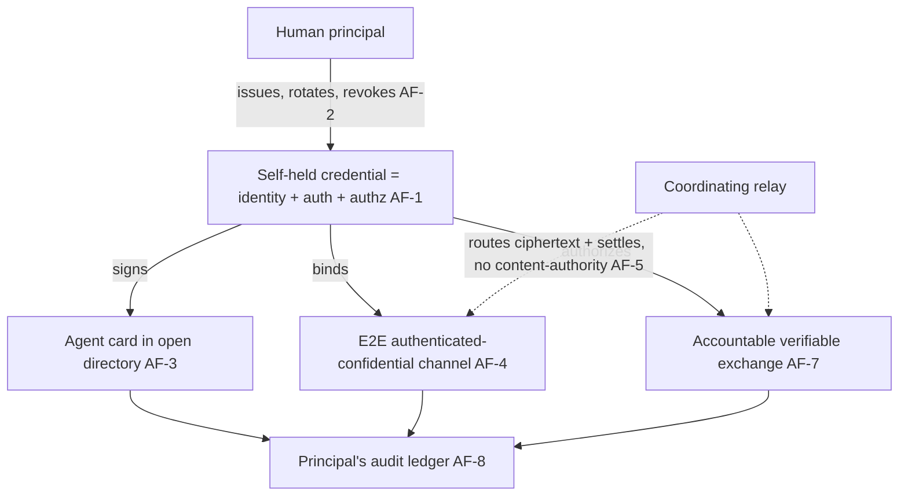

# Agent Federation

**Version:** 1.0.0
**Status:** Stable
**Layer:** concept

## Overview

An office's agents interact today with their human client, with each other inside the office, and with external *services* (SaaS connectors, model backends). This spec names the missing counterparty class: **other independent agents** — sovereign agents belonging to other people, offices, or organizations — and the contract for interoperating with them as **verifiable peers**. Federation is the discipline that lets an agent hold a self-owned identity, advertise and discover capabilities in an open network, communicate over authenticated-confidential channels, and exchange value or services accountably — without any of the counterparties trusting a central owner, and without the network minting authority no human granted.

The root idea, abstracted from any specific cryptography, is that **the credential is the identity**: a single self-held secret is simultaneously an agent's identity, its authenticator, and its authorization root, so who-it-is, is-it-really-it, and may-it-do-this collapse into one thing the agent's principal controls. On top of that root sit four interoperation surfaces — advertise, discover, communicate, exchange — coordinated by infrastructure that **routes and settles but never controls**: it holds no plaintext and no keys, so it cannot read, forge, or selectively suppress. Trust lives at the sovereign endpoints, not in the middle.

## Related Specifications

- [l1-security.md](l1-security.md) — SEC-10 authority self-containment: an agent's identity is human-rooted and the agent never mints its own authority (AF-2); the egress gate and default-deny govern reaching a peer (AF-6).
- [l1-attestation.md](l1-attestation.md) — the verifiable signed-witness contract behind a signed agent card (AF-3) and an exchange proof (AF-7).
- [l1-tool-receipts.md](l1-tool-receipts.md) — execution-authenticity receipts: a peer's delivered result carries a model-unforgeable witness so a fabricated peer result is detectable (AF-7).
- [l1-context-provenance.md](l1-context-provenance.md) — a peer is an external actor, so its outputs enter as **untrusted** (AF-6).
- [l1-operational-ledger.md](l1-operational-ledger.md) — the append-only, attributable record every inter-agent exchange and interaction writes to (AF-7/AF-8).
- [l1-acp.md](l1-acp.md) — the protocol by which a caller talks to *one* office; federation is the **peer-network** layer that composes it — a peer is reached over a protocol like ACP, but as a *verified sovereign counterparty*, not an anonymous client.
- [l1-global-orchestration.md](l1-global-orchestration.md) — coordination across the user's **own** building of offices; federation is across **independent** principals, demarcated in §4.3.
- [l1-progressive-disclosure.md](l1-progressive-disclosure.md) — an agent card is a minimal descriptor (PD-1) expanded on engagement (AF-3).
- [l1-extension-marketplace.md](l1-extension-marketplace.md) — a curated catalog of *extensions*; the federation directory is its peer analog — a directory of *agents*, discovered by capability (AF-3).
- [../../nodus/specifications/l1-nodus-portability.md](../../nodus/specifications/l1-nodus-portability.md) — LP-14 verified-peer delegation seam is the nodus-workflow realization: a step delegates to a named, host-resolved, host-authorized verifiable peer.

## 1. Motivation

The value of autonomous agents multiplies when they can transact with each other: an agent that needs a capability it lacks could find, hire, and pay a peer that has it, rather than only calling a hard-wired SaaS API or bothering its human. But naive inter-agent interaction is dangerous and centralizing. If a middleman holds everyone's keys, it can impersonate any agent, read every message, and censor at will — the network becomes a single point of control and failure. If a discovered peer is trusted by default, an open directory becomes an attack surface: any listing can inject instructions or exfiltrate data. If an exchange is just an API call with no record, there is no accountability when a paid task is not delivered.

Federation resolves these by fixing the trust architecture up front. **Sovereign identity** means each agent holds its own root credential, so no middleman can impersonate it. **Coordinate-without-controlling** means infrastructure routes and settles over ciphertext and minimal metadata, so it *cannot* read, forge, or suppress. **Default-deny peer trust** means discoverability grants nothing — a peer is verified, explicitly authorized, treated as untrusted, and reached through the egress gate. And **accountable exchange** means every deal is an append-only, verifiable event both sides can prove, disputable through escrow, never ambient. The result is an open economy of agents that stays sovereign, private, and accountable by construction.

## 2. Constraints & Assumptions

- **Crypto-agnostic (Layer 1).** This concept names no signature scheme, key format, transport, chain, or settlement rail. The concrete identity and exchange mechanisms are Layer-2 / host concerns; the L1 owns the trust contract.
- **Human-rooted.** An agent's identity descends from a human principal (SEC-10); the network never issues authority, and the agent never self-issues it.
- **Local-first-compatible.** Federation is an *opt-in outward* capability; an office that never federates is unaffected, and reaching any peer passes the egress consent gate.
- **Peers are untrusted.** No amount of reputation or directory presence makes a peer's output trusted input; provenance rules always apply.
- This spec adds a *counterparty class and its trust contract*; it introduces no new work unit and no new runtime confinement — it composes identity, attestation, receipts, provenance, and the ledger already defined.

## 3. Core Invariants

Rules every Layer 2 realization MUST NOT violate. They are technology-neutral.

- **AF-1 (Sovereign self-held identity as root of trust):** an agent participates as a **sovereign principal** whose single **self-held credential** is simultaneously its **identity**, its **authenticator**, and its **authorization root** — the credential *is* the identity. There is no separate account, password, or API token, and no third party (including any coordinating relay) holds the secret or can impersonate the agent. Everything the agent asserts, signs, or authorizes traces to this one credential.

- **AF-2 (Human-rooted, never self-minted):** the identity and its controlling secret are owned by the agent's **human principal**, not minted by the network or bootstrapped by the agent. The agent acts *under* the identity but cannot self-issue it or the authority it carries (composing SEC-10); issuance, rotation, and revocation are principal acts. Authority is delegated downward from a human, never upward from the agent.

- **AF-3 (Signed advertisement + open capability discovery):** an agent MAY publish a **capability descriptor** (an agent card: who it is plus what it offers), **signed by its AF-1 credential** so authorship is verifiable, to an **open directory**; peers discover counterparties **by capability**, not by prior private arrangement. The card is a minimal descriptor (progressive-disclosure PD-1) expanded on engagement, and publishing it grants the publisher nothing over a discoverer (AF-6).

- **AF-4 (Authenticated-confidential peer channels):** agent-to-agent communication is **end-to-end confidential and mutually authenticated** — the channel binds to both peers' verified identities (AF-1), so a message's origin is provable and its content is private to the endpoints. A message cannot be forged as coming from an agent that did not sign it, nor read by anyone but the intended peer.

- **AF-5 (Coordinate without controlling — relay neutrality):** any coordinating intermediary MAY route messages and facilitate settlement, but holds **no content-authority**: it never holds plaintext or private keys, cannot author or alter a participant's identity, messages, or exchanges, and cannot selectively censor. It sees only ciphertext plus the minimal metadata needed to route and settle. Trust lives at the sovereign endpoints; the middle is a facilitator, not an owner.

- **AF-6 (Default-deny peer trust):** a discoverable or reachable peer gains **no capability** by being visible or contactable. Engaging an external peer is **default-deny**: its identity is verified, the engagement is explicitly authorized, its outputs are **untrusted input** (context-provenance), and reaching it is an **egress act** through the consent gate. The openness of the network never implies trust of any peer in it.

- **AF-7 (Accountable, verifiable exchange):** when agents exchange value, services, or data, the exchange is recorded as an **append-only, independently-verifiable event** anchored to a proof **both sides can check** (composing the ledger, attestation, and execution receipts), optionally **shielded** (parties/amounts hidden while the event stays verifiable) for privacy, and disputable through an explicit **escrow / arbitration** backstop. No inter-agent exchange is ambient, deniable, or unrecorded. The durable record is an **event log plus a verifier**, not a balance an intermediary asserts.

- **AF-8 (Auditable attribution to the principal):** every inter-agent interaction — which peer, which capability, what was exchanged — is **attributed to the acting principal** and written to the principal's own audit ledger (composing the operational ledger and log-legibility), never a shadow side-channel. A public activity view MAY **project** the record for ambient display, but that projection is a renderable view, not the system of record; the durable, attributable truth stays with the principal.

> L2 specs cannot reach RFC status until all invariants here are addressed in their "Invariant Compliance" section.

## 4. Detailed Design

### 4.1 The trust architecture



One credential is the hub (AF-1); the relay touches only the dashed edges — it moves ciphertext and settles proofs but never holds the credential or the plaintext (AF-5). Everything the agent does traces back through the credential to a human principal (AF-2) and forward into an attributable ledger (AF-8).

### 4.2 Engaging a peer (default-deny path)

```text
[REFERENCE]
engage(peer_capability):
    peer   := directory.discover(peer_capability)      // AF-3, by capability
    verify_identity(peer.card.signature)               // AF-1: authorship provable, else abort
    authorize(peer, engagement)                         // AF-6: explicit, default-deny; egress gate
    chan   := open_channel(self.cred, peer.cred)       // AF-4: E2E, mutually authenticated
    result := over(chan) { request(peer_capability) }  // peer output is UNTRUSTED (AF-6, provenance)
    record_exchange(peer, capability, proof)           // AF-7: append-only, verifiable, attributed AF-8
    return neutralize(result)                            // untrusted-as-data until validated
```

Discovery finds a candidate by capability; verification proves who it is; authorization is an explicit, consent-gated, default-deny decision; the channel is confidential and authenticated; the result is untrusted and neutralized; and the exchange is recorded, verifiably and attributably.

### 4.3 Federation vs the office's own coordination

| Layer | Counterparty | Trust basis | Owner |
| --- | --- | --- | --- |
| Orchestration | roles inside one office | shared office, one principal | l1-orchestration |
| Global orchestration | offices in the user's **own** building | one owner, one system | l1-global-orchestration |
| ACP | a caller talking to one office | authenticated session across the office boundary | l1-acp |
| **Federation** | **independent** external agents (other principals) | **verifiable sovereign identity + default-deny** | this spec |

The discriminator is *whose* agent: orchestration and global orchestration coordinate the user's **own** agents (shared authority); federation interoperates with **someone else's** agents (no shared authority — hence sovereign identity and default-deny do the work a shared owner otherwise would).

## 5. Drawbacks & Alternatives

**Alternative: a central broker holds all identities/keys.** Rejected by AF-1/AF-5 — it can impersonate, read, and censor; sovereignty plus a no-content-authority relay removes that single point of control.

**Alternative: trust discovered peers (open = safe).** Rejected by AF-6 — an open directory is an attack surface; discoverability must grant nothing, and peer output is untrusted.

**Alternative: exchange as a bare API call.** Rejected by AF-7 — no record means no accountability for undelivered paid work; append-only verifiable events plus escrow backstop the exchange.

**Risk: scope creep into a crypto platform.** Mitigation: this L1 is deliberately crypto-agnostic — it owns the *trust contract* (sovereign identity, relay neutrality, default-deny, accountable exchange); the signature scheme, transport, and settlement rail are Layer-2/host choices.

## Canonical References

| Alias | Path | Purpose |
| --- | --- | --- |
| `[SECURITY]` | `.design/main/specifications/l1-security.md` | SEC-10 human-rooted authority the identity descends from (AF-2); egress + default-deny (AF-6) |
| `[ATTEST]` | `.design/main/specifications/l1-attestation.md` | The verifiable signed-witness behind signed cards and exchange proofs (AF-3/AF-7) |
| `[LEDGER]` | `.design/main/specifications/l1-operational-ledger.md` | The append-only attributable record of exchanges and interactions (AF-7/AF-8) |
| `[NODUS]` | `.design/nodus/specifications/l1-nodus-portability.md` | The host-neutral realization: LP-14 verified-peer delegation seam |

## Document History

| Version | Date | Author | Notes |
| --- | --- | --- | --- |
| 1.0.0 | 2026-07-09 | Core Team | Initial stable spec — agent federation: interoperation with independent external agents as verifiable peers. Sovereign self-held credential as identity+auth+authz root (AF-1), human-rooted never self-minted (AF-2), signed advertisement + open capability discovery (AF-3), authenticated-confidential peer channels (AF-4), coordinate-without-controlling relay neutrality with no content-authority (AF-5), default-deny peer trust with untrusted output + egress gate (AF-6), accountable verifiable append-only exchange with optional shielding + escrow (AF-7), auditable attribution to the principal with public views as projections not the record (AF-8). Deliberately crypto-agnostic — owns the trust contract, defers scheme/transport/settlement to L2/host. Composes l1-security / l1-attestation / l1-tool-receipts / l1-context-provenance / l1-operational-ledger; demarcated from l1-acp and l1-global-orchestration (own agents vs independent peers). Distilled from an adoption pass over an external agent-to-agent network reference (sovereign identity, encrypted relay, open directory, on-chain accountable exchange). |
