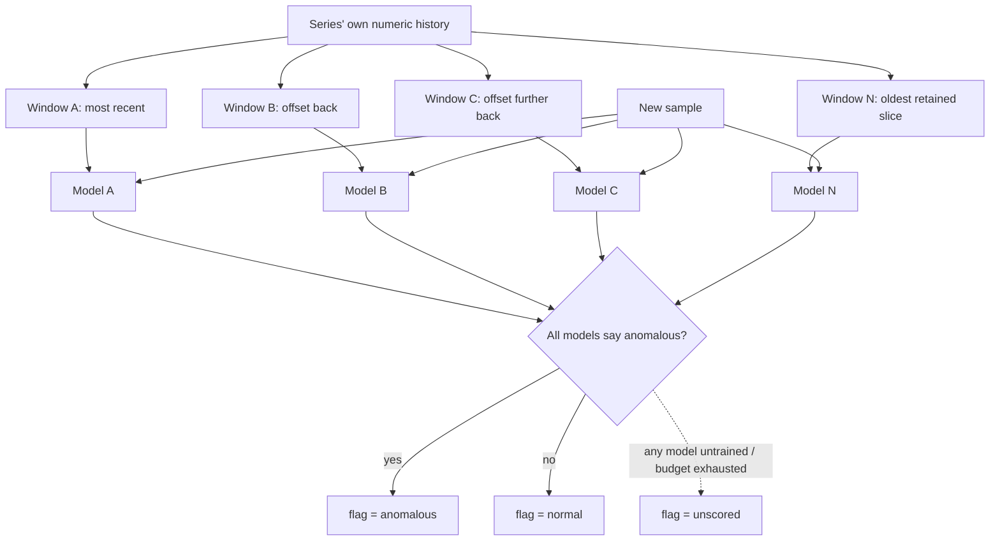

# Anomaly Consensus

**Version:** 1.0.0
**Status:** Stable
**Layer:** concept

## Overview

Always-on, unsupervised, per-series anomaly marking whose false-positive rate is controlled **structurally** — by requiring several models trained on different, staggered slices of history to agree unanimously — rather than by per-series threshold tuning that no operator has time to do.

Two design commitments make it affordable at the scale of thousands of series on a user's own machine. **Many light models, not one heavy model**: each series carries its own cheap model over its own recent history, so scoring is bounded work per sample and nothing is shared, pooled, or shipped. **The verdict is one bit, carried inline with the observation it qualifies**: it costs no extra storage, and the anomaly *rate* over any range or grouping is then computed by the ordinary query path as the mean of that bit — including from coarse retention tiers.

The layer's posture is deliberately non-escalating: an anomaly is an **investigation signal**, never a page. It tells an operator (or an agent) where to look; the threshold/rule layer remains the only thing that raises graded alerts.

## Related Specifications

- [l1-operational-health.md](l1-operational-health.md) - Owns thresholds, scores, and severity-graded alerts; consumes anomaly rates as one more signal and is the only layer permitted to escalate (AC-5).
- [l1-observation-retention.md](l1-observation-retention.md) - Stores the inline flag and preserves its fraction across coarse tiers (OR-2), which is what makes long-horizon anomaly rates exact.
- [l1-change-attribution.md](l1-change-attribution.md) - Ranks change over a window; ranking *anomaly rates* rather than raw values is one of its two scored quantities (CA-4).
- [l1-live-diagnostics.md](l1-live-diagnostics.md) - The deep, on-demand probe an anomaly signal motivates opening.
- [l1-model-runtime.md](l1-model-runtime.md) - Boundary: anomaly models are small local statistical models, unrelated to the language-model runtime.
- [l1-security.md](l1-security.md) - Local-first data posture: models, training windows, and verdicts never leave the device (AC-10).
- [../../nodus/specifications/l1-nodus-observability.md](../../nodus/specifications/l1-nodus-observability.md) - Carries the optional per-event anomaly annotation (HO-16) and the unscored marker, without computing any verdict.

## 1. Motivation

Threshold alerting answers "did this cross a line I already knew about?". It cannot answer "is this behaving unlike itself?", which is the question that catches the failures nobody anticipated: a queue that is technically within bounds but has stopped draining the way it always drained, a workflow whose step latency doubled while staying under every limit, a cost curve that bent.

The obvious remedy — statistical anomaly detection — has an equally well-known failure mode: at scale it produces a flood of "anomalies" that are just normal variation, and the operator learns to ignore the whole channel. Two mitigations are usually proposed and both are bad. Tuning a sensitivity per series does not scale past a few dozen series. Raising a global sensitivity until the noise stops also silences the real signals.

The structural mitigation is different: keep the per-model sensitivity high, but require **unanimity across models trained on materially different historical windows**. A genuine regime change looks anomalous against recent history *and* against older history; a transient blip or a one-off training artifact does not. Unanimity converts an intractable tuning problem into a fixed structural property, and it does so with cheap models rather than expensive ones.

The second half of the motivation is economic. If a verdict is a separate series, anomaly detection doubles the record and every anomaly-rate question becomes a second query joined against the first. If the verdict is a bit carried inside the observation, it costs nothing to store and the anomaly rate is just an average — computable by the same query engine, over the same ranges, through the same retention tiers, with no new machinery at all.

## 2. Constraints & Assumptions

- Detection is unsupervised: there are no labels, and there will never be labels. Nothing in this layer depends on a human marking examples.
- Models are small local statistical models trained on a series' own numeric history. No user content, prompt, document, or message body is ever an input.
- Scoring runs outside the observation path and on a bounded budget; the observed system's behaviour and timing are unaffected (composing observer neutrality).
- The layer is switchable off in whole; with it off, every other layer keeps working and simply sees no verdicts.
- A "series" is as defined by the retention layer: a named, uniformly-sampled numeric quantity attributed to a monitored unit.

## 3. Core Invariants

Rules every Layer 2 implementation MUST NOT violate:

- **AC-1 (Per-series, unsupervised, many-light-models):** each series carries its **own** models, trained without labels from that series' own history. The layer uses many cheap models rather than one large shared one; scoring a sample is bounded work independent of how much history exists. No model is trained on user content, and no model is a generative model. A design that requires a single global or shared model, or whose per-sample cost grows with history, violates this invariant.
- **AC-2 (Unanimity gate):** several models per series, each trained on a **different, staggered** historical window such that the ensemble collectively spans materially more history than any single window — each model's window and the ensemble's collective span being declared and reportable per AC-8, so "materially more" is an inspectable configured fact rather than a matter of opinion — score every sample. A sample is marked anomalous **only if every model agrees** it is anomalous. A majority, a weighted vote, or any single model's verdict is not an anomaly. Unanimity is this layer's sole false-positive control and explicitly replaces per-series threshold tuning.
- **AC-3 (The verdict is one flag, carried inline):** the verdict is a single boolean carried **with the observation itself** — not a parallel series, not a separate store, not a side table. Consequence: marking costs no additional storage, and the anomaly rate over any range or grouping is the ordinary mean of that flag, computable by the normal query path and preserved exactly through coarse retention tiers (OR-2).
- **AC-4 (Anomaly rate is first-class at two grains):** the mean of the flag is defined and reported at two grains — **per series over time** (how often this quantity behaved unusually) and **per monitored unit at an instant** (what fraction of a unit's series were behaving unusually at once). Both are ordinary observable series in their own right: they can be charted, retained, thresholded, and scored like any other signal.
- **AC-5 (Assistance, not paging):** an anomaly mark is an investigation signal. Marks MUST NOT by themselves raise a severity-graded alert, notify, or wake anyone; escalation remains exclusively the rule/threshold layer's job. A *sustained elevated unit-level anomaly rate* MAY be surfaced as a distinct low-urgency event — never as a per-sample notification. Notification volume is therefore bounded by construction regardless of how many marks are produced.
- **AC-6 (Unscored is never normal):** a sample the layer could not score — models not yet trained, insufficient history, models reset, scoring budget exhausted — is marked **unscored**, never *normal*. Unscored intervals are excluded from anomaly-rate denominators rather than counted as zero. A system that has just started, or whose detection is falling behind, MUST NOT appear healthy merely because it has produced no verdicts. (The same honesty rule as the retention layer's gap marker, OR-3.)
- **AC-7 (Out of the observation path, bounded, degradable, optional):** training and scoring never sit between an observation and its recording. They run on a bounded budget; when the budget binds they degrade to *unscored* (AC-6) and MUST NOT delay, drop, reorder, or perturb the observation itself. The whole layer is switchable off, and with it off every other layer behaves exactly as it does today.
- **AC-8 (Explainable and reproducible verdict):** for any marked sample the layer can state which models participated, the historical window each was trained on, and the score and threshold each produced. A verdict that cannot be explained MUST NOT be shown. Given the same series history and the same model set, the verdict is reproducible.
- **AC-9 (Drift is retraining, not a permanent anomaly):** models are periodically retrained on newer history, so a durable change of regime becomes the new normal rather than an indefinite anomaly stream. Every retraining boundary is recorded, so a consumer can distinguish "the world changed" from "the baseline moved underneath me" — the two look identical in the flag alone and must not be conflated in the record.
- **AC-10 (Local-first):** models, training windows, and verdicts stay on-device. No model, sample, or verdict is shipped anywhere, and enabling detection never creates an egress path (consistent with the local-first, no-exfiltration posture).

> L2 specs cannot reach RFC status until all invariants here are addressed in their "Invariant Compliance" section.

## 4. Detailed Design

### 4.1 The staggered ensemble



The windows overlap and are staggered rather than disjoint, so the ensemble covers a long stretch of history while each individual model stays small and cheap to train. A model trained on the most recent window is sensitive to a fresh deviation; a model trained further back resists calling a temporary-but-established pattern anomalous. Requiring all of them to agree is what removes the overwhelming majority of spurious marks.

### 4.2 Scoring a sample

```text
[REFERENCE]
score_sample(series, sample):
    models := trained models of `series`
    if models is empty or budget exhausted:
        return UNSCORED                                   // AC-6, AC-7
    for each m in models:
        d := deviation of sample's feature vector from m's learned structure
        if d ≤ m.threshold:                               // threshold derived from m's own training data
            return NORMAL                                 // AC-2: one dissent ends it
    return ANOMALOUS
```

Two properties are load-bearing. Evaluation **short-circuits on the first dissent**, so the common case (normal) is the cheapest case. And each model's threshold is derived from its *own* training distribution — nothing global is tuned, which is what makes AC-2's claim to replace tuning real rather than rhetorical.

### 4.3 From flags to rates

At any instant a monitored unit has a column of flags across its series; over time each series has a row of flags. The two means are the two grains of AC-4:

| | series₁ | series₂ | series₃ | series₄ | **unit rate** |
| --- | --- | --- | --- | --- | --- |
| t₁ | · | · | · | · | 0% |
| t₂ | · | · | ● | · | 25% |
| t₃ | ● | · | ● | · | 50% |
| t₄ | ● | · | ● | ● | 75% |
| t₅ | · | · | · | · | 0% |
| **series rate** | 40% | 0% | 60% | 20% | |

(`●` anomalous, `·` normal; unscored cells are excluded from both denominators per AC-6.)

The **unit rate** is the operationally interesting one: a single series behaving oddly is routine, while a large fraction of a unit's series going odd *simultaneously* is the shape of a real incident. That is the quantity AC-5 permits to be surfaced as a low-urgency event.

### 4.4 Why the flag rides inside the observation

| Property | Verdict as a separate series | Verdict as an inline flag (AC-3) |
| --- | --- | --- |
| Storage cost | A second full series per series | None |
| Anomaly rate over a range | A second query, joined and time-aligned | A mean over the existing query |
| Behaviour under coarse retention | Independently downsampled; may disagree with its subject | Preserved as the anomalous fraction of the same point (OR-2) |
| Risk of drift between value and verdict | Real — two records can diverge | Impossible — one record |

The last row is the deciding one: a verdict physically attached to the value it qualifies cannot become misaligned with it.

### 4.5 Boundary with the alerting layer

Anomaly consensus **marks**; operational health **escalates**. The interface between them is deliberately narrow: health may read anomaly rates as ordinary signals and apply its own thresholds, hysteresis, and severity grading to them (OH-3/OH-10). What health may not do is treat a raw mark as an alert, and what this layer may not do is notify anyone. Keeping the escalation authority in exactly one place is what prevents an anomaly flood from becoming a notification flood.

## 5. Drawbacks & Alternatives

- **Unanimity reduces sensitivity.** Accepted and intended: a deviation that only the most recent model finds unusual is, by this layer's definition, not yet worth an operator's attention. The threshold layer still catches anything that crosses a known line, immediately and unconditionally.
- **A cold system produces no verdicts for a while.** Accepted and made honest by AC-6: those intervals read *unscored*, not *normal*, so nobody mistakes an untrained system for a healthy one.
- **Statistical models can be fooled by seasonality.** Mitigated by the staggered windows (AC-2) and periodic retraining (AC-9); a pattern that recurs over the ensemble's span stops being anomalous, which is the correct outcome.
- **Alternative — one large model over all series.** Rejected: it couples unrelated units, its cost grows with the corpus, its verdicts are unexplainable at the per-series grain (AC-8), and a single model cannot express "unlike *this* series' own history".
- **Alternative — per-series configurable sensitivity.** Rejected: it does not scale past a handful of series and pushes an unbounded tuning burden onto the operator. AC-2 exists precisely to make tuning unnecessary.
- **Alternative — let anomalies raise alerts directly.** Rejected by AC-5: it reproduces exactly the flood that makes anomaly detection get ignored. Detection informs; only the rule layer escalates.
- **Alternative — store verdicts as their own series.** Rejected by AC-3/§4.4: it doubles the record, requires a join for every rate question, and lets value and verdict drift apart under independent downsampling.

## Canonical References

| Alias | Path | Purpose |
| --- | --- | --- |
| `[HEALTH]` | `.design/main/specifications/l1-operational-health.md` | The only layer permitted to escalate; consumer of anomaly rates as signals. |
| `[RETENTION]` | `.design/main/specifications/l1-observation-retention.md` | Preserves the inline flag's fraction across coarse tiers (OR-2); the gap/unscored honesty analog. |
| `[ATTRIBUTION]` | `.design/main/specifications/l1-change-attribution.md` | Consumes anomaly rates as an alternative scored quantity when ranking change. |
| `[OBSERVABILITY]` | `.design/nodus/specifications/l1-nodus-observability.md` | Carrier of the optional per-event anomaly annotation and unscored marker (HO-16). |

## Document History

| Version | Date | Author | Notes |
| --- | --- | --- | --- |
| 1.0.0 | 2026-07-23 | Core Team | Initial spec — unsupervised per-series anomaly marking with structural false-positive control: own cheap models per series with bounded per-sample cost (AC-1), unanimity across staggered-window models replacing per-series threshold tuning (AC-2), verdict as one flag carried inline with the observation so rates are computed by the ordinary query path at zero storage cost (AC-3), anomaly rate first-class at series and unit grain (AC-4), assistance-not-paging with escalation reserved to the rule layer (AC-5), unscored-is-never-normal (AC-6), out of the observation path / bounded / degradable / optional (AC-7), explainable and reproducible verdicts (AC-8), drift handled by recorded retraining (AC-9), local-first (AC-10). Concept-only. |
