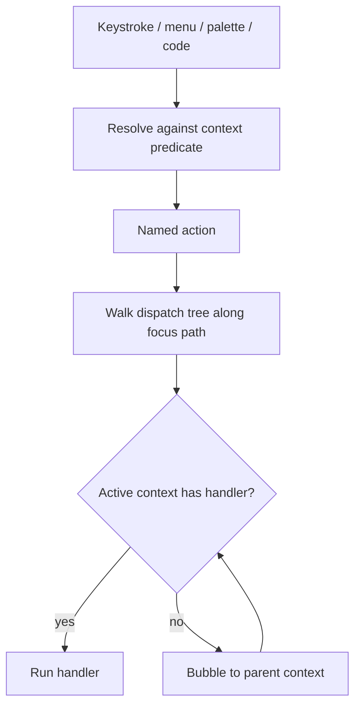

# Application Shell

**Version:** 1.0.0
**Status:** Stable
**Layer:** concept

## Overview

A paradigm-neutral model for the **reactive desktop application shell** — the front-end
runtime that hosts every surface of the product: how application state is held and
mutated, how change propagates to what is shown, how user intent is named and routed, and
how the visible workbench is composed from a small fixed vocabulary of layout parts.

It names the skeleton that high-performance native application platforms converge on: a
single-authority **reactive entity-state runtime**, **declarative rendering** from that
state, a **command system** of named actions dispatched along a focus tree under
context-scoped keybindings, a **workbench** of panes-in-a-center plus edge docks of
panels with floating modal surfaces, **delegated** selection surfaces, and **structured,
cancellable async**.

This spec is a **model-spec** (sibling to [l1-navigation-model.md](l1-navigation-model.md)
and [l1-kanban-model.md](l1-kanban-model.md)). It does not pick a UI toolkit or pin a tab
layout. The *concrete tab catalog* belongs to the navigation model; the *concrete
realization* (its specific UI stack, tray, shortcut backend, overlay windows) belongs to
the application-UI implementation spec; the *layered core/frontend split* belongs to the
architecture concept. This document owns what those do not yet name as one coherent
concept: the **runtime shape** every frontend surface is built on — the state/reactivity
contract, the action/dispatch contract, and the workbench-composition contract.

## Related Specifications

- [l1-architecture.md](l1-architecture.md) - Layered core + frontends and hub-and-spoke topology; this model details the *frontend runtime* shape that sits above the core.
- [l1-navigation-model.md](l1-navigation-model.md) - The concrete tab/sidebar catalog and settings hierarchy; the navigation surfaces this shell *hosts and lays out*.
- [l1-extensions.md](l1-extensions.md) - Skills/MCP/plugins lifecycle; panels, actions, and pickers are the shell-side extension points (AS-9/AS-6/AS-10).
- [l1-agent-framework-skeleton.md](l1-agent-framework-skeleton.md) - Typed state channels, observation, and events; the shell's entity/notify/subscribe model (AS-2…AS-4) is the UI-side echo of that substrate.
- [l1-office-visualization.md](l1-office-visualization.md) - The office projection rendered as a workbench panel; one realization of AS-5/AS-9.
- [l1-automation-canvas.md](l1-automation-canvas.md) - The visual pipeline canvas; a panel item with its own delegated surfaces (AS-9/AS-10).
- [l1-dashboard.md](l1-dashboard.md) - Live read-only statistics; a render-from-state panel (AS-5).

## 1. Motivation

A product that presents many live surfaces — chat, office view, kanban, schedule, memory,
dashboards, an automation canvas — needs a runtime that keeps all of them correct,
responsive, and composable without each surface reinventing state plumbing, input routing,
and layout. Studied native application platforms converge on a shared answer, and naming it
buys four things:

1. **Correct-by-construction reactivity.** State lives in one authority and propagates by
   push, so two surfaces showing the same data never disagree and the UI never stalls
   polling for changes.
2. **One command vocabulary.** Every operation is a named action, triggerable from a
   keybinding, a menu, a palette, or code alike — so discoverability, rebinding, and
   automation come for free instead of being wired per feature.
3. **Composable layout.** A fixed workbench vocabulary (center panes, edge docks, panels,
   modals) lets new surfaces slot in as uniform units, with persisted layout, rather than
   bespoke window code per feature.
4. **Responsiveness under load.** A structured async model with cancellation-on-drop keeps
   long work off the UI thread and tied to the lifetime of what needs it.

The cost of *not* modeling this is a frontend that drifts: each surface holding its own
copy of state that falls out of sync, input handled ad-hoc per widget, layout hard-coded,
and background work either blocking the UI or leaking after the surface that needed it is
gone.

## 2. Constraints & Assumptions

- **Technology-agnostic.** This is a Layer 1 concept. It names no UI toolkit, rendering
  API, language, or windowing backend. The concrete binding — a web-technology frontend
  over an inter-process bridge to a native core — lives in the application-UI Layer 2 spec.
- **Cross-process generalization.** Where the studied platform keeps all UI state on one
  in-process thread, this model generalizes the rule to *one owning authority per state
  domain*; when the authority lives in a separate core process, reactivity (AS-3/AS-4)
  crosses the process boundary as an event stream, and the frontend holds projections, not
  the source of truth.
- **Defers where a concern is owned.** The concrete tab set and settings tiers defer to the
  navigation model; the concrete UI stack, tray, global-shortcut backend, and overlay
  windows defer to the application-UI spec; the core/frontend layering defers to the
  architecture concept. This model wins only on the runtime contracts (§3).
- **On-device-first.** Layout, state, and session restoration are user data and stay local
  unless the user authorizes egress (inherited from the security concept).
- **Render is pure.** Visual output is a function of state; the model forbids side effects
  during rendering. All change flows through state mutation plus notification.

## 3. Core Invariants

Layer 2 realizations and concrete surfaces MUST NOT violate these.

- **AS-1 Single-authority state.** Each domain of application state has exactly one owning
  authority; mutation is serialized through it so concurrent writes never race. Work that
  would block interaction is moved off the interactive path and rejoins by handing its
  result back to the authority.
- **AS-2 State as typed handles.** Application state is a graph of typed **entities**, each
  reached through a strong handle; code reads via a scoped read and mutates via a scoped
  update, never holding a raw long-lived borrow across an async boundary. A **weak handle**
  variant exists and is used wherever entities reference one another, so mutually-referencing
  entities can still be released — reference cycles never leak.
- **AS-3 Push-based reactivity.** An entity signals that its observable state changed by
  emitting a change-notification; dependents register interest and are re-evaluated or
  re-rendered in response. Surfaces never poll on a timer to stay current; propagation is
  push-based and scoped to what actually changed.
- **AS-4 Typed events with lifecycle-bound subscriptions.** Beyond change-notifications,
  entities emit **typed events** to declared subscribers. Every subscription yields a handle
  whose drop deregisters it, and subscriptions are owned by the subscriber so they live
  exactly as long as it does. No ambient event bus outlives its listeners.
- **AS-5 Declarative render from state.** A renderable surface (**view**) produces its
  element tree as a pure function of current state; it causes visual change only by mutating
  state and notifying (AS-3), never by imperative out-of-band drawing in normal flow.
  Stateless, render-only **components** compose views without holding independent state.
- **AS-6 Actions are the command vocabulary.** Every user-invokable operation is a named,
  namespaced **action** — a typed command independent of how it was triggered (keybinding,
  menu, palette, or programmatic dispatch). Each action carries a human-readable description
  so it is discoverable and bindable without bespoke wiring; behavior is attached by
  registering a handler in a context, not by hard-coding input handling.
- **AS-7 Context-scoped dispatch over a focus tree.** Input and actions route along a
  **dispatch tree** rooted at the workspace and following the current focus path; a handler
  fires only when its context is active. Keybindings resolve against a **context predicate**
  (a boolean expression over the active context stack), support multi-keystroke sequences,
  and resolve conflicts by a defined precedence (most-specific / most-recently-layered wins).
- **AS-8 Layered, user-overridable bindings and settings.** Keymaps and settings are
  composed in layers — a base preset, then platform defaults, then user overrides — merged
  deterministically. The user may rebind any action or disable bindings entirely, and a
  discoverable command surface lists every action with its current binding.
- **AS-9 Workbench composition.** The window content is assembled from a fixed vocabulary:
  a **workspace** root holds a **center** split into **panes** (each hosting interchangeable
  items) and a small fixed set of edge **docks**, each holding **panels**; transient
  surfaces (modals, pickers) float above. Panels and items are uniform units behind a common
  contract — the workbench does not special-case individual feature surfaces.
- **AS-10 Delegated selection surfaces.** List-driven choosers (command palette, finders,
  any picker) share one reusable surface whose behavior is supplied by a **delegate** — how
  items are sourced, matched, ordered, rendered, and confirmed. A new chooser is built by
  providing a delegate, not a new widget.
- **AS-11 Structured, cancellable async.** Asynchronous work is a **task** scheduled on an
  interactive (foreground) or background executor; a dropped task is cancelled, so ownership
  decides lifetime — store a task to bound it to its owner, detach it to let it run to
  completion. Fallible async work surfaces failure to the UI; it is never silently
  discarded.
- **AS-12 Persisted, restorable layout.** Workbench layout (open panes and items, dock
  visibility and sizes, active panel) is serialized per window and restored across sessions,
  so a window reopens as it was left. Layout state is kept distinct from document/content
  state.
- **AS-13 Platform behind one surface.** Operating-system interactions (windows, clipboard,
  notifications, opening links, quitting) are reached through the single application context,
  not scattered platform calls — keeping the rest of the system platform-agnostic and
  testable behind a simulated context.

> A Layer 2 spec cannot reach RFC status until every AS-n invariant above is addressed in
> its "Invariant Compliance" section.

## 5. Detailed Design

### 5.1 The reactive runtime

The runtime is organized around an application authority and a graph of entities.

| Primitive | Purpose |
| --- | --- |
| Application authority | The single owner of UI-facing state and the registry of all entities; confined to one interactive thread (or one owning process per domain). Holds globals — singleton state reachable from anywhere. |
| Entity (strong handle) | A typed handle to a managed struct; the unit of state ownership and reactivity (AS-2). |
| Weak handle | A runtime-checked, droppable reference used to break cycles between mutually-referencing entities (AS-2). |
| Context | The scoped capability passed to code that updates an entity — read/update access plus the means to notify, emit, subscribe, and spawn (AS-3/AS-4/AS-11). |

Access discipline: read through a scoped read, mutate through a scoped update, and never
hold a borrow across an `await`; updating an entity while it is already being updated is
forbidden. This is the mechanical guarantee behind AS-1.

### 5.2 Reactivity: notify, observe, and events

Two distinct propagation channels keep surfaces consistent:

- **Change-notification (notify / observe).** After a mutation that affects rendering, the
  entity emits a change-notification; the framework re-renders dependent views and invokes
  observers registered against that entity (AS-3). This is the "something about me changed —
  re-read me" channel.
- **Typed events (emit / subscribe).** An entity declares the event types it can emit;
  another entity subscribes with a handler and receives a **subscription** that deregisters
  on drop (AS-4). This is the "a specific thing happened" channel, carrying typed payloads.

Subscriptions are stored in the subscriber so their lifetime matches it. The two channels
together replace both polling and global mutable signals: a surface stays current by being
*told*, scoped to exactly the entities it depends on.

### 5.3 Declarative rendering

A **view** is an entity that implements rendering: each frame it builds an **element tree**
from its current state, laid out with a flexbox model and styled through a utility-class
API. Rendering is pure (AS-5) — it reads state and returns elements, never mutating or
performing I/O. **Components** are render-only builders (no independent state) that compose
into views. Conditional structure is expressed inline (render this child only when a
condition holds) rather than by imperative mutation of a built tree. The platform may mix a
high-level declarative register with a low-level imperative element register for
performance-critical surfaces (large virtualized lists, custom-laid-out canvases), but both
ultimately render from state.

### 5.4 Actions, focus, and keymap dispatch

Input becomes behavior through a uniform command path:



- **Actions** (AS-6) are named, namespaced, optionally payload-carrying commands with
  user-visible descriptions. Handlers are registered per context.
- **Dispatch tree & focus** (AS-7): contexts form a tree rooted at the workspace; the active
  path is determined by focus. An action is offered to the focused context first and bubbles
  outward until handled.
- **Context predicates**: a keybinding may carry a boolean expression over the active context
  stack (e.g. "in the project panel and not editing"); the binding is live only when the
  predicate matches.
- **Key sequences & precedence**: bindings match multi-keystroke sequences and modifier
  combinations; when several match, precedence resolves by specificity and layer order.
- **Layering** (AS-8): a base keymap preset, platform defaults, and user overrides merge
  deterministically; any action is rebindable, and a palette exposes the full action list
  with current bindings for discovery.

### 5.5 Workbench composition

The visible shell is composed from a fixed, uniform vocabulary (AS-9):

```plaintext
Window
└── Workspace (root)
    ├── Center
    │   └── Pane group (splits)
    │       └── Pane → items (interchangeable surfaces)
    ├── Dock (left)    → Panel(s)
    ├── Dock (right)   → Panel(s)
    ├── Dock (bottom)  → Panel(s)
    └── Floating layer → Modal / Picker
```

- **Workspace** is the window root; **Center** holds a tree of **panes** split horizontally
  and vertically; each **pane** hosts interchangeable **items**.
- **Docks** are openable/hideable edges (a small fixed set, e.g. left/right/bottom); each
  holds one or more **panels**. Panels and items satisfy a common contract (identity, title,
  serialized state, focus behavior) so the workbench treats them uniformly.
- **Floating surfaces** — modals and pickers — render above the workbench without disturbing
  layout.
- Multiple windows may be open; each restores its own layout (AS-12). Layout persistence is
  separate from content state, so reopening a window restores *structure* without
  re-deriving *data*.

### 5.6 Delegated selection surfaces

All list-driven choosers share one surface parameterized by a **delegate** (AS-10). The
surface owns the generic concerns — query input, result list, keyboard navigation,
highlight, confirm/cancel — and the delegate supplies the specifics:

| Delegate responsibility | Example variation |
| --- | --- |
| Source candidates | actions (command palette), files (finder), symbols, entities. |
| Match & order | fuzzy-rank, recency, priority. |
| Render a row | label, icon, secondary text, current binding. |
| Confirm an item | dispatch the action, open the file, jump to the symbol. |

A new chooser is a new delegate, not a new widget — which is why the command palette, file
finder, and any future entity picker stay visually and behaviorally consistent for free.

### 5.7 Structured concurrency

Async work is modeled as **tasks** on two executors (AS-11): an **interactive/foreground**
executor for state-touching work and a **background** executor (a thread pool) for blocking
or CPU-heavy work. The defining rule is **cancellation-on-drop**: a task that is dropped is
cancelled, so its lifetime is decided by ownership —

- *awaited* in another async context (runs as part of that flow),
- *detached* to run to completion independently, or
- *stored in a field* so it is cancelled when its owner is dropped.

A common pattern is a background task that computes, awaited by a foreground task that
applies the result via a scoped update. Fallible async work propagates errors to the UI for
meaningful feedback rather than swallowing them.

### 5.8 Platform abstraction and testability

OS capabilities are reached through the single application context (AS-13): windowing,
clipboard, notifications, link opening, quitting. Concentrating them there keeps feature
code platform-agnostic and, crucially, **testable**: a simulated application context drives
surfaces deterministically — dispatching synthetic input, advancing the executor to
quiescence, asserting on resulting state — without a real window or OS event loop. The
reactive runtime (AS-1…AS-4) and the structured executor (AS-11) are what make this
simulation faithful.

### 5.9 Ideas-to-adopt mapping

What the studied native application platform contributes, and where each idea lands. Sources
are named by structural idea, not by product.

| Source idea | Worth adopting | Where it lands |
| --- | --- | --- |
| Single-authority reactive entity store | Typed handles, scoped read/update, weak-handle cycle-breaking, push-based notify/observe. | **New** as AS-1…AS-3 / §5.1–§5.2; for this project the authority is the native core and the frontend holds projections fed by an event stream over the bridge. |
| Typed events + drop-deregistering subscriptions | A second propagation channel with lifecycle-bound subscriptions; no ambient bus. | **New** as AS-4; the UI-side echo of the agent-framework's typed channels/events. |
| Declarative render-from-state with a low-level escape hatch | Pure render; render-only components; imperative register only for hot surfaces. | AS-5 / §5.3; sharpens the existing application-UI stance. |
| Named actions + context-predicate keymap + palette | One command vocabulary, focus-tree dispatch, layered rebindable keymaps, discoverable palette. | **New** as AS-6…AS-8 / §5.4; generalizes the existing global-shortcut system into a full action/keymap model and complements the navigation tabs. |
| Workbench of center-panes + edge docks + panels + modals | A fixed, uniform layout vocabulary with persisted per-window layout. | **New** as AS-9 / §5.5; a dockable-panel workbench complementing the fixed tab navigation. |
| One picker surface + delegate | Reusable selection surface; new choosers via a delegate. | **New** as AS-10 / §5.6; unifies command palette, finder, and entity pickers. |
| Tasks with cancellation-on-drop on dual executors | Ownership-decided async lifetime; foreground/background split; errors to UI. | AS-11 / §5.7; aligns with the core's task model. |
| Platform services behind one context + simulated test context | Platform-agnostic feature code; deterministic UI tests without a real OS loop. | AS-13 / §5.8; a testability lever for the frontend. |

## 7. Drawbacks & Alternatives

- **Reactive runtime vs a web framework's own model.** The frontend stack already provides a
  component/state model, so a second entity-reactivity layer risks duplication. Mitigation:
  at this project the authoritative reactive store is the *core*, and AS-1…AS-4 govern the
  **core→frontend propagation contract** (an event stream over the bridge) — the frontend's
  own component state remains a thin projection, not a competing source of truth.
- **Workbench complexity.** Dockable panes/docks/panels are heavier than a fixed tab layout.
  Mitigation: the navigation model keeps a fixed primary tab catalog; this shell adds
  workbench composition only where multi-surface arrangement earns it (e.g. office view,
  canvas, dashboards side-by-side), and panels stay uniform units (AS-9).
- **Over-abstraction risk.** A shell model can ossify into ceremony. Mitigation: it states
  only contracts (state, dispatch, composition, async), defers the concrete catalog and
  stack to their owning specs, and earns its place through the action/keymap, workbench, and
  delegated-picker ideas not previously named.
- **Alternative — per-surface ad-hoc frontends.** Let each surface own its state, input, and
  layout. Rejected: it is exactly how surfaces drift out of sync, input handling diverges,
  background work leaks, and layout becomes unrestorable — the failures this model prevents.

## Canonical References

| Alias | Path | Purpose |
| --- | --- | --- |
| `[ARCH]` | `.design/main/specifications/l1-architecture.md` | Authoritative layered core/frontend topology this shell's runtime sits within. |
| `[NAV]` | `.design/main/specifications/l1-navigation-model.md` | Authoritative concrete tab catalog and settings tiers the workbench hosts (AS-9). |
| `[SKELETON]` | `.design/main/specifications/l1-agent-framework-skeleton.md` | Authoritative typed state-channel/event substrate echoed by AS-2…AS-4. |
| `[EXT]` | `.design/main/specifications/l1-extensions.md` | Authoritative extension lifecycle behind shell-side panels/actions/pickers. |
| `[APPUI]` | `.design/main/specifications/l2-app-ui.md` | Authoritative Layer 2 realization (UI stack, tray, shortcuts, overlay windows) that implements these contracts. |

## Document History

| Version | Date | Change |
| --- | --- | --- |
| 1.0.0 | 2026-06-25 | Initial model: single-authority reactive entity-state runtime (notify/observe + typed events/subscriptions, weak-handle cycle-breaking), declarative render-from-state, named-action command system with context-predicate keymap dispatch over a focus tree, dockable workbench composition (workspace/center-panes/edge-docks/panels/modals) with persisted per-window layout, delegated selection surfaces, structured cancellation-on-drop async, and platform-behind-one-context testability (AS-1…AS-13). |
