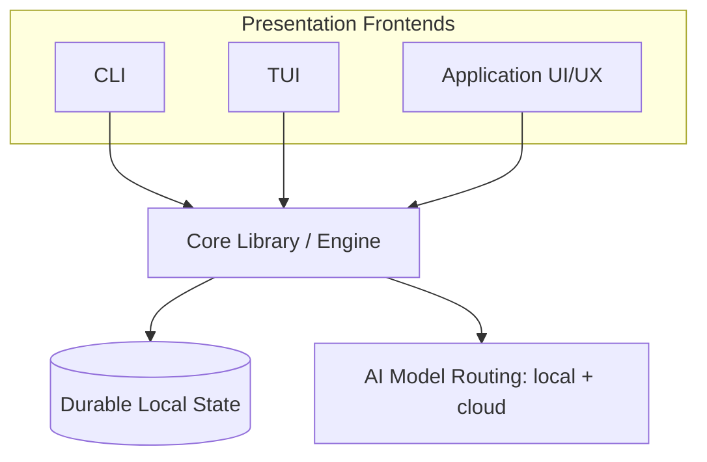
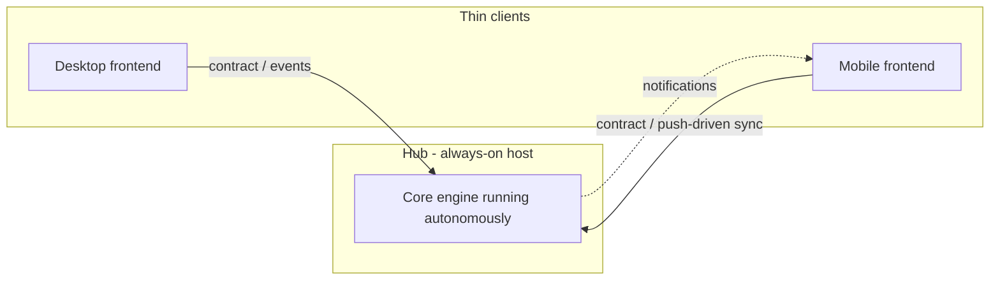

# Cronus Architecture

**Version:** 1.0.0
**Status:** Stable
**Layer:** concept

## Overview

Cronus is an autonomous multi-agent system organized as a single embeddable **core engine** consumed by interchangeable **presentation frontends**. This specification defines the technology-agnostic architecture: the layering of the product into a foundational library plus its frontends, the direction of dependencies between them, and the deployment topology that governs where autonomous work may run.

The product is built from four architectural layers:

1. **Core library (foundation)** — an embeddable library that can be linked into other projects; it holds all domain logic (agents, orchestration, memory, scheduling, model routing, state).
2. **CLI** — a command-line frontend over the core.
3. **TUI** — a terminal user-interface frontend over the core.
4. **Application (desktop/web)** — a full graphical UI/UX frontend over the core.

## Related Specifications

- [l2-technology-stack.md](l2-technology-stack.md) - Concrete technology realization of this architecture.
- [l2-core-library.md](l2-core-library.md) - Implementation of layer 1 (foundation).
- [l2-cli.md](l2-cli.md) - Implementation of layer 2 (CLI).
- [l2-tui.md](l2-tui.md) - Implementation of layer 3 (TUI).
- [l2-app-ui.md](l2-app-ui.md) - Implementation of layer 4 (application UI/UX).

## 1. Motivation

A single autonomous agent product must reach users through several surfaces — scripts and automation (CLI), interactive terminals (TUI), and rich graphical clients (desktop/web/mobile) — without duplicating domain logic in each. Concentrating all capability in one embeddable core and treating every surface as a thin frontend yields:

- One source of truth for behavior; frontends cannot drift apart.
- Embeddability: the same core can be reused inside third-party programs.
- Testability: domain logic is verifiable without any UI.
- A clear place for the autonomous workload to live, independent of which surface launched it.

It also confronts a hard environmental reality: not every host can sustain always-on background work (see INV-4). The architecture must separate *where the autonomous engine runs* from *where the user interacts with it*.

## 2. Constraints & Assumptions

- The core library has **no dependency** on any presentation technology, windowing system, or terminal.
- Frontends depend on the core; the core never depends on a frontend (one-directional dependency).
- The same logical command is expressible across all frontends (command parity); frontends differ in presentation, not behavior.
- The autonomous, long-running workload requires a host that permits sustained background execution; some target environments do not (assumption validated by platform research — resource-constrained, uncontrolled-lifecycle clients).
- State is local-first and durable; remote/synchronized operation is an optional capability layered on top, never a prerequisite.

## 3. Core Invariants (Layer 1 only)

Rules that every Layer 2 implementation MUST NOT violate:

- **INV-1 (Embeddable core):** The core is a standalone library with zero presentation/UI dependencies and MUST be linkable into an external host program.
- **INV-2 (Logic in core only):** All product capabilities are exposed by the core through a stable programmatic contract. Frontends MUST contain presentation and input mapping only — never domain/business logic.
- **INV-3 (Frontend interchangeability / command parity):** CLI, TUI, and graphical frontends are interchangeable surfaces over the same core contract. An equivalent command issued from any frontend MUST yield equivalent behavior and outcome.
- **INV-4 (Hub-and-spoke autonomy):** The always-on autonomous workload runs only on a host capable of sustained background execution (the *hub*: desktop, server, or remote node). Hosts with constrained or externally-controlled process lifecycles act as thin *spokes* (clients) and MUST NOT be relied upon to perform persistent background work.
- **INV-5 (Durable, restartable state):** The core MUST persist its state durably and resume without loss after a process restart; sessions, memory, and task state survive restarts.
- **INV-6 (Graceful capability scaling):** A frontend MAY expose a subset of the core contract appropriate to its host environment, but MUST NOT introduce behavior that diverges from the core contract. Reduced capability is allowed; contradictory behavior is not.
- **INV-7 (Security of client data):** Secrets and user data are protected by default; the core MUST keep local secrets (e.g. credentials, tokens) out of version-controlled or exported artifacts and MUST distinguish user data from anonymized operational telemetry.

> L2 specs cannot reach RFC status until all invariants here are addressed in their "Invariant Compliance" section.

## 4. Detailed Design

### 4.1 Layer model and dependency direction

Dependencies point inward only: frontends → core → state/services. No arrow ever points from the core to a frontend. This keeps the core embeddable (INV-1) and prevents logic leaking outward (INV-2).

### 4.2 The four layers

| # | Layer | Responsibility | Depends on |
| --- | --- | --- | --- |
| 1 | Core library | Domain logic: agent orchestration, memory, scheduling/cron, model routing, Kanban state, persistence; exposes a programmatic contract | (nothing in this product) |
| 2 | CLI | Map shell commands/flags to core contract calls; render text output | Core |
| 3 | TUI | Interactive terminal rendering of core state and commands | Core |
| 4 | Application | Full graphical UI/UX (desktop/web/mobile shell) over the core contract | Core |

### 4.3 Hub-and-spoke deployment topology

The hub is any host that can legitimately run a sustained background process (a desktop OS service, a server, an SSH-reachable node). Spokes connect to the hub's core contract; a spoke MAY also embed its own core for offline/foreground-only use, but persistent autonomous operation is the hub's responsibility (INV-4).

### 4.4 Command parity

Each user-facing capability is named once and offered by every frontend that supports it; the frontend differs only in how the command is invoked and how results are rendered. Example capability set (illustrative, not exhaustive): `help`, `init`, `idea`, `plan`, `task`, `run`, `status`, `compact`, `analyze`, `memory`, `goal`, `quit`/`exit`. INV-3 requires that the same capability behaves identically regardless of the surface it is invoked from.

## 5. Drawbacks & Alternatives

- **Single-core coupling:** all frontends break if the core contract breaks. Mitigated by treating the contract as a versioned, reviewed interface.
- **Alternative — per-surface monoliths:** building independent CLI/TUI/GUI apps avoids a shared contract but guarantees behavioral drift and triples maintenance; rejected.
- **Alternative — phone-as-server (no hub):** treating every device as an always-on node was considered and rejected because some target hosts cannot sustain background execution; hence INV-4. <!-- TBD: confirm minimum hub deployment targets (desktop-only vs desktop+self-hosted server) for v0.1.0 -->

## Canonical References

| Alias | Path | Purpose |
| --- | --- | --- |
| `[STACK]` | `.design/main/specifications/l2-technology-stack.md` | Concrete technology choices realizing this architecture |
| `[CONTRIB]` | `CONTRIBUTING.md` | Intended on-disk repository and user-state layout |
