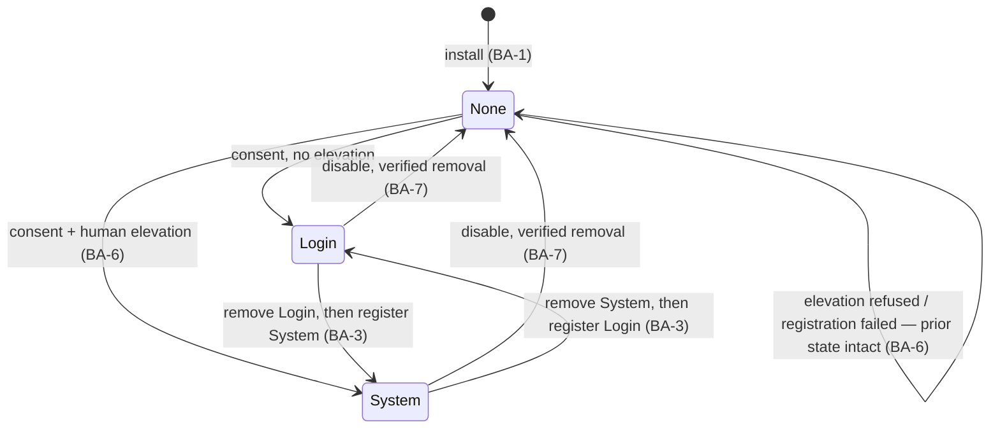
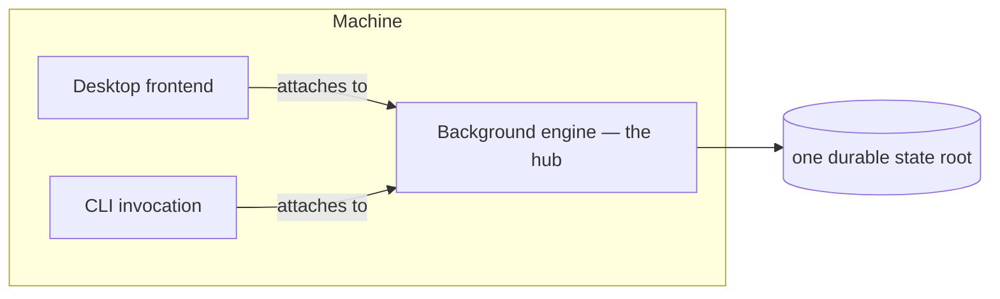

# Background Activation

**Version:** 1.0.0
**Status:** Stable
**Layer:** concept

## Overview

How the engine comes to be running when no one launched it. The architecture's INV-4 names a *hub* — a host capable of sustained background execution — but never says how a host becomes one. This specification defines that transition: the **activation modes** (manual, login-scoped, system-scoped), the boundary that governs them, and the invariants that keep an autonomous agent from granting itself the right to run unattended.

The central claim is that background activation is **not a preference**. It is a grant of authority: it decides whether the engine may think, spend, and act while the user is absent. It therefore belongs to the human-authored authority plane (`l1-security` SEC-10), not to the configuration the agent can write.

## Related Specifications

- [l1-architecture.md](l1-architecture.md) - INV-4 names the hub; this spec defines how a host becomes one, and INV-8 keeps every mode the same single deployable.
- [l1-security.md](l1-security.md) - SEC-10 authority self-containment (the agent may never self-activate); SEC-2 safe defaults; SEC-7 auditability.
- [l1-deployment-neutrality.md](l1-deployment-neutrality.md) - DN-1's zero-configuration default posture: activation, like a backend, is opt-in and additive.
- [l1-work-liveness.md](l1-work-liveness.md) - WL-1 exclusive ownership and WL-4 single active run, which BA-3/BA-11 protect.
- [l1-crash-recovery.md](l1-crash-recovery.md) - The engine's own recovery ladder, which BA-9 keeps independent of who supervises the process.
- [l1-generation-budget.md](l1-generation-budget.md) - The spend ceiling that BA-5 requires be stated at the moment of consent.
- [l1-usage-allowance.md](l1-usage-allowance.md) - The allowance an unattended engine consumes without a human present to observe it.
- [l1-multi-device-sync.md](l1-multi-device-sync.md) - A hub reached by spokes; BA-10 governs which hosts may become one.
- [l2-service-activation.md](l2-service-activation.md) - The Layer 2 realization across Windows, macOS, and Linux.

## 1. Motivation

An autonomous agent that only runs while its window is open is not autonomous. Scheduled work does not fire, wake queues do not drain, long-horizon goals stall the moment the user closes the laptop lid. The product's own architecture concedes this: INV-4 divides the world into *hubs* that sustain background execution and *spokes* that cannot. But nothing in the specification set says how a machine becomes a hub — the invariant describes a property the deployment is assumed to have, not a capability the user can turn on.

The obvious remedy — a checkbox in settings labelled "start with my computer" — hides three problems that only surface once written down.

**It is two features, not one.** Starting with a user's login session and running as an OS-supervised service are different in lifecycle owner, privilege, supervision, and failure behavior. A login item dies when the user logs out; a system service survives it. One needs no elevation; the other cannot be installed without it. Conflating them produces a setting whose behavior nobody can predict.

**It is an authority grant wearing the costume of a preference.** Enabling background activation means the engine may call models, spend budget, touch the filesystem, and act on the user's behalf at 03:00 with nobody watching. That is precisely the plane SEC-10 reserves to the human principal: *what the agent may do* and *who may reach it*. A setting stored in the agent-writable configuration file would let an agent — or untrusted content steering one — grant itself persistent unattended execution. The write path is the vulnerability, not the agent's intentions.

**Its state is not the product's to remember.** An administrator can revoke the registration. An operating system can suspend it after an update. A user can disable it through the OS's own controls, which the product never sees. Any value the product stores about whether activation is "on" is a cached belief the operating system may have already contradicted. The registration itself is the only honest source of truth.

This specification resolves all three: two named modes with distinct semantics, an authority boundary the agent cannot cross, and observed-not-remembered state.

## 2. Constraints & Assumptions

- The engine is one deployable in every mode (INV-8). Activation changes *who starts the process and when*, never what the process is or what it contains.
- The concept names no operating system, registry, unit file, or API. Concrete mechanisms are Layer 2.
- Not every host can sustain background execution. Hosts that cannot are spokes (INV-4) and are addressed by BA-10 rather than exempted silently.
- Activation is local. It creates no network listener, no account, and no egress; a background engine is subject to exactly the same consent gates as a foreground one.
- The user may already have background activation configured by means outside the product (a registration authored by hand, a system administrator's policy). The product reports such state truthfully and does not fight it.

## 3. Core Invariants (Layer 1 only)

Rules that Layer 2 implementations MUST NOT violate.

- **BA-1 (Manual launch is the complete default):** a fresh install registers **no** activation entry of any kind. The engine runs when, and only when, the user starts it. Background activation is opt-in, and the default install is fully functional without it — a foreground engine is a whole product, not a crippled one.

- **BA-2 (Two activation modes, one engine):** exactly two background modes exist beyond manual launch. **Login-scoped** activation starts the engine with the user's session, under the user's privileges, and ends with that session. **System-scoped** activation places the engine under the operating system's own supervisor: it starts independently of any user session, survives logout, and is restarted by the OS according to that supervisor's policy. Both run the same engine (INV-8); they differ only in lifecycle owner, privilege, and supervision — never in behavior or capability.

- **BA-3 (At most one activation registration):** the two modes are mutually exclusive. Enabling one MUST remove the other's registration before its own becomes effective. Two registrations for one state root would race two engines against the same durable state, violating exclusive ownership (WL-1) and single-active-run (WL-4).

- **BA-4 (Activation is human-authored — the agent can never self-activate):** registering, changing, or removing an activation mode is an act of the human principal, performed through a boundary the agent's execution has **no write path to**. A model-produced action MUST NOT be able to grant the engine persistent unattended execution, directly or by editing any artifact the product later reads as an activation instruction. The agent MAY read the current activation state — to explain it, or to reason about whether it will be running later — and MAY *request* a change as data through a human-resolved approval path. It never grants. This is `l1-security` SEC-10 applied to the engine's own lifecycle: enabling background activation raises the agent's effective autonomy, and SEC-10 reserves every write to that plane to the human. The isolation is **structural**, enforced by the absence of a write path, not by trusting the agent to abstain — an agent subverted by untrusted content still cannot make itself always-on.

- **BA-5 (Activation is an autonomy grant, disclosed at the moment of consent):** enabling either background mode MUST be presented as what it is — a decision to let the engine think, call models, spend allowance, and act while the user is absent. The consent moment MUST state, in the user's terms: that the engine will run unattended; which autonomy level and spend ceiling govern it while unattended; and how to revoke. Consent is per-mode, never inherited: consenting to login-scoped activation does not consent to system-scoped activation. Enabling background activation MUST NOT, by itself, raise the autonomy level or the budget ceiling — those remain separately authored (SEC-10), and an unattended engine operating under an unstated ceiling is a BA-5 violation.

- **BA-6 (Least privilege — no silent elevation, and never elevated at run time):** login-scoped activation MUST require no privilege elevation. System-scoped activation MUST require an explicit, OS-mediated elevation that the human performs and can refuse; the product never acquires elevation by stealth, by cached credential, or by a helper that retains it. Elevation authorizes **registration only** — the running engine holds the least privilege it needs to do its work and never runs as a system superuser merely because a supervisor started it. A refused or failed elevation MUST leave the previous activation state exactly as it was.

- **BA-7 (Reversible and complete):** disabling a mode removes its registration entirely, leaving no orphaned registration and no residual helper process behind. Uninstalling the product removes every activation registration the product created. Removal is **verified against the operating system**, not assumed from a successful call; a removal that did not take effect is reported as a failure, never as success.

- **BA-8 (Observed state, never remembered state):** the activation state the product reports is read from the operating system at the moment it is asked. The product MUST NOT present a stored value as the current state. A registration disabled, removed, or blocked outside the product — by an administrator, a policy, or the OS itself — MUST be reported as inactive. Where the OS cannot be queried, the state is reported as **unknown**, never as enabled.

- **BA-9 (Supervision belongs to the mode; the engine never assumes restart):** whether a crashed engine is restarted, and by whom, is a property of the activation mode — the OS supervisor under system-scoped activation, nobody under manual or login-scoped activation. The engine's own durability and recovery behavior (crash recovery, liveness reconciliation, work resumption) MUST be identical in all three modes. An engine MUST NOT rely on being restarted, and MUST NOT weaken its own recovery ladder because a supervisor exists.

- **BA-10 (Spoke hosts refuse activation, visibly):** on a host that cannot sustain background execution (INV-4 spoke), background activation MUST be unavailable and MUST say so with a reason. It MUST NOT be offered as a setting that silently does nothing. A spoke reaches autonomy by connecting to a hub, never by pretending to be one.

- **BA-11 (One engine per state root — frontends attach, never duplicate):** when an engine is already running for a given durable-state root, a frontend or a second launch MUST attach to it rather than start a second engine. Two engine instances never own one state root concurrently (WL-1). A locally-installed background engine therefore turns the user's own desktop frontend into a spoke of it — the same hub-and-spoke relation of INV-4, at a distance of zero.

> L2 specs cannot reach RFC status until all invariants here are addressed in their "Invariant Compliance" section.

## 4. Detailed Design

### 4.1 The three modes

| | Manual (default) | Login-scoped | System-scoped |
| --- | --- | --- | --- |
| Starts when | the user launches it | the user's session begins | the machine boots |
| Ends when | the user quits it | the session ends | the machine stops, or the operator stops it |
| Lifecycle owner | the user | the session manager | the OS service supervisor |
| Privilege to register | none | none (BA-6) | explicit human elevation (BA-6) |
| Privilege to run | the user's | the user's | least required — never superuser (BA-6) |
| Restarted on crash by | nobody | nobody | the supervisor, per its policy (BA-9) |
| Survives logout | — | no | yes |
| Suitable as an INV-4 hub | no | while the session lasts | yes |
| Autonomy exposure | none beyond the session | unattended within the session | fully unattended (BA-5) |

The two background rows are not points on a scale; they answer different questions. Login-scoped asks *"should the engine be here when I sit down?"* System-scoped asks *"should the engine keep working when I walk away — or when I never log in at all?"* Only the second makes the machine a hub in the sense INV-4 means, and only the second demands elevation.

### 4.2 The activation plane is authority, not configuration

This is the invariant with a structural consequence, so it is worth stating as a rule about *where state lives* rather than a rule about behavior.

The engine's configuration is agent-reachable: an agent edits workspace files, and a configuration watcher applies changes to a running process. If "background activation: on" were a configuration key, then any path by which an agent writes configuration — including one opened by prompt injection through untrusted content — would be a path by which the agent grants itself persistent, unattended execution. SEC-10 forbids exactly this: *"a model-produced action can never elevate its own autonomy… or open a new ingress path."*

Therefore:

```text
[REFERENCE] The activation plane
  Source of truth        : the operating system's own activation registration
  Written by             : the human principal, through an OS-mediated act (BA-4, BA-6)
  Read by                : the engine, freely (BA-8)
  Written by the engine  : never — no write path exists (BA-4)
  Mirrored into config   : never — a mirror is a second, forgeable source of truth
```

Two consequences follow, and both are load-bearing:

**No mirrored key.** The product stores no `autostart: true` anywhere the agent can reach. There is nothing to forge, because the only thing that means "activated" is the OS registration itself. This is why BA-8 (observed, never remembered) is a *security* invariant and not merely an honesty invariant — the moment a cached value becomes authoritative, it becomes a target.

**The request path stays open.** BA-4 does not silence the agent. An agent may observe that a scheduled goal will not fire because the engine will not be running, and may *say so*, or raise a request the human resolves. The request is data; the grant is the human's. This preserves the useful behavior — an assistant that notices it is about to be asleep — without the dangerous one.

### 4.3 Consent content

BA-5 requires the consent moment to be honest about what is being granted. Enabling a background mode discloses, at minimum:

1. **That the engine will run while you are not there** — and, for system-scoped, that it will run even if you never log in.
2. **What it may do unattended** — the autonomy level in force, named in the user's terms, not an internal enum.
3. **What it may spend unattended** — the budget ceiling and allowance that bound an unwatched engine (`l1-generation-budget`, `l1-usage-allowance`).
4. **How to stop it** — the revocation path, which BA-7 guarantees is complete.

Consent is per-mode. A user who accepted login-scoped activation has not accepted system-scoped activation, because the disclosures differ in kind: one grants unattended operation *within a session I started*, the other grants it *unconditionally*.

Enabling activation never silently widens autonomy or budget. If the current autonomy level would make an unattended engine dangerous, the correct product behavior is to *say so* at the consent moment — not to quietly raise or lower it, which would be the engine authoring its own authority plane by proxy.

### 4.4 Mode transitions



Every transition is **removal-before-registration** (BA-3) and **verified-after** (BA-7). A transition that fails part-way MUST converge on a single well-defined state; the specification's ordering makes the safe direction the natural one, since a failure after removal leaves the engine merely un-activated (BA-1's default) rather than doubly activated.

The `None --> None` self-loop is not decoration. A refused elevation is an ordinary, expected outcome — the human said no — and must be indistinguishable, in its effect on system state, from never having asked.

### 4.5 Attach, never duplicate

BA-11 makes the local case an instance of the architecture's own hub-and-spoke picture rather than an exception to it.



When a background engine is already running, launching the desktop app or a CLI command must not start a second engine over the same state. The frontend becomes a spoke of the local hub — the identical relation INV-4 describes between a phone and a desktop, with the network distance reduced to zero. This is why BA-11 is stated in terms of the **state root** rather than the machine: two engines over two distinct state roots are two independent deployments and are permitted; two engines over one state root are a data-corruption bug wearing a feature's clothes.

A frontend that cannot attach (the running engine is a different, incompatible version; the attach channel is unavailable) MUST fail visibly rather than fall back to starting a second engine.

### 4.6 Removal and uninstall

BA-7's "complete" is a stronger claim than it appears, and it is the invariant most often violated in practice by products that register OS entries.

- Disabling a mode removes its registration, then **reads the OS back** to confirm the registration is gone. A call that returned success but left the entry in place is a failure.
- Uninstalling the product removes every registration the product created — including one created under a mode the user later switched away from, if the switch's removal step failed and left an orphan.
- Registrations the product did **not** create (one authored by hand; an administrator's policy) are never removed. They are reported (BA-8) and left alone. The product does not fight the operator for control of the machine.

### 4.7 Hosts that cannot be hubs

On a spoke (INV-4) — a host whose process lifecycle is controlled externally, which may suspend or terminate the engine at any time — background activation is not merely unreliable, it is unrepresentable. BA-10 requires the product to say this rather than expose a setting that appears to work.

The correct affordance on a spoke is not "enable background activation" but "connect to a hub". A spoke that offered a broken activation toggle would teach the user to expect autonomous work that never happens, which is worse than the honest absence of the feature.

## 5. Drawbacks & Alternatives

**Drawback — two modes are more surface than one toggle.** A single "start automatically" switch is easier to explain, right up to the moment a user asks why their scheduled work stopped when they logged out. The modes differ in observable behavior, so hiding the difference would trade an honest question for a mysterious bug. Mitigation: the settings surface may present a single question ("keep working when I'm away?") and derive the mode, provided the disclosure names the real consequences (BA-5) and the elevation prompt is not concealed (BA-6).

**Drawback — observed state costs an OS query on every read.** BA-8 forbids the fast path of trusting a cached flag. The cost is a syscall against a screen the user opened deliberately; the alternative is a UI that lies after an administrator changes something. Accepted.

**Alternative — store activation state in the workspace configuration.** Rejected by BA-4/§4.2. It creates a write path from the agent to its own autonomy, which SEC-10 forbids structurally rather than by policy. The configuration file is agent-reachable by design; the authority plane must not be.

**Alternative — a single always-on background mode, no login-scoped option.** Rejected by BA-6. It would force every user who merely wants the engine present after login to grant an elevation they do not need, violating least privilege for the common case.

**Alternative — a privileged helper that retains elevation to manage registrations on demand.** Rejected by BA-6. A resident elevated helper is a durable escalation path whose value — avoiding one authorization prompt per change — does not repay a permanent increase in attack surface. Elevation is per-act and human-mediated.

**Alternative — let the agent enable activation when it determines it needs to run later.** Rejected by BA-4, and worth naming explicitly because it is superficially reasonable: an assistant that notices a goal will stall could "helpfully" make itself always-on. That is precisely the self-granted-authority move SEC-10 exists to make impossible. The agent may say it, request it, and explain it. It may not do it.

**Risk — a partial transition leaves two registrations.** Mitigated by BA-3's removal-before-registration ordering and BA-7's read-back verification, which make the failure mode "not activated" rather than "activated twice".

**Risk — the user grants system-scoped activation without understanding the autonomy it implies.** Mitigated by BA-5's disclosure requirements, and bounded by the fact that activation alone never raises the autonomy level or the spend ceiling (SEC-10) — an unattended engine is still confined by the authority the human separately authored.

## Canonical References

| Alias | Path | Purpose |
| --- | --- | --- |
| `[ARCH]` | `.design/main/specifications/l1-architecture.md` | INV-4 hub-and-spoke; INV-8 one deployable across all modes |
| `[SECURITY]` | `.design/main/specifications/l1-security.md` | SEC-10 authority self-containment (BA-4); SEC-2 safe defaults (BA-1); SEC-7 audit (BA-4) |
| `[LIVENESS]` | `.design/main/specifications/l1-work-liveness.md` | WL-1 / WL-4 exclusive ownership, which BA-3 and BA-11 protect |
| `[BUDGET]` | `.design/main/specifications/l1-generation-budget.md` | The spend ceiling BA-5 requires be disclosed at consent |
| `[IMPL]` | `.design/main/specifications/l2-service-activation.md` | The Layer 2 realization across Windows, macOS, and Linux |

## Document History

| Version | Date | Notes |
| --- | --- | --- |
| 1.0.0 | 2026-07-10 | Initial spec. Defines how a host becomes an INV-4 hub: three activation modes (manual / login-scoped / system-scoped) with distinct lifecycle owners, privilege, and supervision. Establishes BA-4 — background activation is a SEC-10 authority grant the agent has no write path to — and its structural consequence (§4.2): activation state lives in the OS registration, never mirrored into agent-writable configuration. Adds BA-8 observed-not-remembered state, BA-11 attach-never-duplicate (one engine per state root), and BA-10 visible refusal on spoke hosts. |
