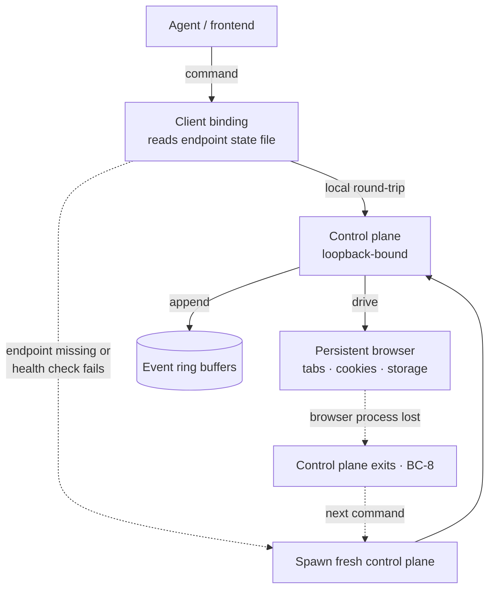
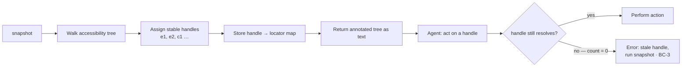

# Agentic Browser Control

**Version:** 1.0.0
**Status:** Stable
**Layer:** concept

## Overview

A control substrate that lets an agent drive a real web browser reliably — to QA a
running app, dogfood a flow, fill a form, verify a deploy, or read a page that a
plain fetch cannot render. The hard part is not "open a URL"; it is doing so with
**sub-second latency**, **persistent state** (cookies, tabs, logins survive across
commands), **robust element addressing** that does not break on modern frameworks,
and a **security posture** strong enough to operate against hostile pages.

The core design decision is a **long-lived browser behind a local control plane**.
Cold-starting a browser per command costs seconds and discards all state; instead a
persistent browser process is driven through a thin, loopback-bound command surface,
so the first command pays startup once and every command after is a fast local
round-trip. Elements are addressed through the **accessibility tree** with short
stable handles rather than model-authored CSS/XPath or injected DOM markers — the
approach that survives content-security policies, framework re-rendering, and shadow
roots. Every command is classified by side effect (read / write / control), every
fetched page is untrusted, and the control plane never leaves the loopback interface
without an explicit, separately-bound, allowlisted remote surface.

This is technology-neutral: it names the invariants and the mechanics, not a specific
browser engine, automation library, or runtime.

## Related Specifications

- [l2-tool-security.md](l2-tool-security.md) - Untrusted-context wrapping and prompt-injection defenses the browser content path reuses (BC-5).
- [l1-security.md](l1-security.md) - Secret isolation, egress gate, sandboxing; the credential-safety and egress boundary (BC-6, BC-10).
- [l1-acp.md](l1-acp.md) - Transport-agnostic protocol for remote callers; the model for the optional remote-control surface (BC-6).
- [l2-app-ui.md](l2-app-ui.md) - Desktop shell, overlay windows, and MCP client transports; a host of the browser-control bindings.
- [l2-deep-research.md](l2-deep-research.md) - Web research over fetched content; complements interactive browsing (static fetch vs. live DOM).
- [l1-extensions.md](l1-extensions.md) - Skills/tools lifecycle; browser control is exposed as a sandboxed tool/skill.
- [l1-quality-standards.md](l1-quality-standards.md) - QA as a definition-of-done gate; the browser is the substrate for live QA.
- [l1-tool-composition.md](l1-tool-composition.md) - Single authorization surface for grouped tools; the command set composes as a toolkit.

## 1. Motivation

An autonomous office that ships software must be able to *look at the running
product*, not just read its source. Three forces make a dedicated browser-control
concept necessary rather than ad-hoc page fetching:

1. **State and latency are load-bearing.** A QA pass is 20+ interactions: log in,
   navigate, click, fill, assert. If each command relaunches a browser, that is
   minutes of pure overhead and a fresh, logged-out session every time. A persistent
   browser turns a multi-minute ordeal into sub-second steps that share one logged-in
   context.
2. **Element addressing is where browser agents fail.** Models that write CSS/XPath
   or inject DOM markers break on production sites: content-security policies block
   injected scripts, framework reconciliation strips markers, shadow roots hide
   nodes. Addressing through the accessibility tree — external to the DOM — is the
   mechanic that actually holds up, and it must be an invariant, not an afterthought.
3. **The browser is the most prompt-injection-exposed surface in the system.** A
   web-reading agent ingests hostile content by definition. Defense cannot be a
   single classifier; it must be layered, and a leaked system-prompt canary must be a
   deterministic stop. This risk is severe enough to belong in the concept, not be
   delegated to implementation taste.

Without this concept, browser use is reinvented per task: slow, stateless, brittle on
real sites, and dangerously trusting of page content.

## 2. Constraints & Assumptions

- A real browser engine is available on the host; the office does not reimplement
  rendering.
- The control plane is single-user and single-workspace by default; token auth is
  defense-in-depth, not multi-tenancy.
- Page content is hostile until proven otherwise.
- Persistent state is a feature, not a leak risk *only because* the control plane is
  loopback-bound and credential access is user-approved (BC-6, BC-10).
- The agent reads errors and self-corrects; error text is part of the contract.

## 3. Core Invariants (Layer 1 only)

Rules that any Layer 2 implementation MUST NOT violate:

- **BC-1 — Persistent control daemon.** A long-lived browser sits behind a control
  plane; tabs, cookies, storage, and login state persist across commands. The control
  plane auto-starts on first use and auto-shuts down after a bounded idle period.
  Cold-starting a browser per command is prohibited.
- **BC-2 — Accessibility-tree addressing.** Agents address page elements through the
  accessibility tree via short, stable handles — never through model-authored CSS/
  XPath or DOM markers injected into the page. The mechanism must work under
  content-security policies, framework re-rendering, and shadow roots.
- **BC-3 — Fail-loud reference invalidation.** Element handles are invalidated on
  navigation and on detected DOM mutation. Acting on a stale handle errors
  immediately with remediation guidance; it MUST NEVER silently target a different
  element.
- **BC-4 — Side-effect-classified commands.** Every command declares its class —
  `READ` (no mutation, idempotent, retry-safe), `WRITE` (mutates page state, not
  idempotent), or `META` (control-plane operation). The class governs dispatch, retry
  policy, and parallel-safety; it is not merely organizational.
- **BC-5 — Untrusted web content.** All page content and any tool output derived from
  the web is untrusted: it is wrapped via the untrusted-context protocol before
  reaching the model and passed through layered injection defenses. A system-prompt
  canary whose value appears anywhere in model output, tool arguments, URLs, or file
  writes is a deterministic stop. (Reuses l2-tool-security.)
- **BC-6 — Loopback control plane + capability tokens.** The control plane binds to
  the loopback interface; every state-mutating command requires a per-session
  capability token. Any remote exposure is a *separately bound* surface restricted to
  an explicit command allowlist with scoped (non-root) tokens. The security boundary
  is physical socket separation, never request-header inference.
- **BC-7 — Agent-actionable errors.** Every error states the recovery action (e.g.
  "refresh handles, then retry"). Native engine errors are rewritten to strip
  internals and add a next step. An agent must be able to recover without human help.
- **BC-8 — Fail-fast crash recovery.** On loss of the browser process the control
  plane exits rather than reconnecting to a half-dead browser; the client detects the
  dead control plane and restarts it cleanly on the next command. No partial-state
  reconnection.
- **BC-9 — Non-blocking bounded observability.** Console, network, and dialog events
  are captured in bounded ring buffers and flushed asynchronously to append-only
  logs. Observability never blocks command handling and is best-effort — an
  observability write failure MUST NOT fail a command.
- **BC-10 — Credential safety.** Accessing stored browser credentials requires
  explicit user approval; decryption is in-memory only and never persisted in
  plaintext; the real browser credential store is opened read-only; secret values
  never appear in logs, output, or UI. (Reuses l1-security.)
- **BC-11 — Library-first surface.** The control capability is a library method
  first; CLI and TUI are thin bindings over it, per the project command grammar.
- **BC-12 — Multi-instance isolation.** Each workspace/office runs its own isolated
  control plane with dynamic endpoint selection; concurrent instances never collide
  or share browser state.

> An L2 spec cannot reach RFC status until all BC invariants are addressed in its
> "Invariant Compliance" section.

## 4. Detailed Design

### 4.1 Daemon model and lifecycle

The client locates the control plane through a small, owner-readable **endpoint
state record** (process handle, endpoint, session token, build identity). On each
invocation the client health-checks the control plane; a missing record or failed
health check spawns a fresh one (BC-1). When the running control plane's build
identity does not match the client's, the client replaces it — eliminating the
"stale binary" class of bug. First command pays startup; subsequent commands are
fast local round-trips.

### 4.2 Element reference system (BC-2, BC-3)

`snapshot` walks the accessibility tree and assigns sequential, human-short handles;
each handle maps to a locator built from role + accessible name, external to the DOM.
Acting on a handle first performs a cheap existence check; a zero match fails fast
with guidance instead of waiting out an action timeout. Handles clear on navigation;
a separate handle namespace (e.g. cursor-interactive) captures elements that are
clickable but absent from the accessibility tree (custom components rendered as
generic containers).

### 4.3 Command taxonomy and dispatch (BC-4)

| Class | Examples | Properties | Dispatch consequence |
| --- | --- | --- | --- |
| `READ` | read text, list links, console, network | No mutation; idempotent | Safe to retry; safe to run in parallel with other reads |
| `WRITE` | navigate, click, fill, press | Mutates page state | Not idempotent; serialized; never auto-retried blindly |
| `META` | snapshot, screenshot, tab management, shutdown | Control-plane operation | Handled by the control layer, outside read/write |

The classification is the dispatch key, not documentation: it decides retry-safety
and parallel-safety. A `help`/introspection command returns all three sets so agents
can self-discover the surface.

### 4.4 Untrusted content and layered injection defense (BC-5)

Defense is layered, not single-point. Conceptually:

1. **Content sanitization** on every page-content command and every tool output:
   data-marking, hidden-element stripping, structural-attribute regex, URL blocklist,
   and a trust-boundary envelope wrapper.
2. **Local content classifier** — an on-device model scans inbound page content and
   web-derived tool output before the model sees it; no network call.
3. **Transcript classifier** — a cheap pass over the conversation *shape* (message +
   tool calls + tool output), gated by a low threshold so clean traffic skips it.
4. **System-prompt canary** — a random token injected at session start; rolling-buffer
   detection across output, tool arguments, URLs, and file writes. A leak is a
   deterministic stop (BC-5): the only way it appears is if the page convinced the
   agent to reveal the system prompt.
5. **Ensemble combiner** — a hard BLOCK requires agreement from two classifiers at or
   above the warn threshold; a single confident hit degrades to WARN. This is the
   deliberate false-positive mitigation for legitimately instruction-shaped content
   (e.g. a page that explains prompt injection). On non-user-authored tool output,
   single-layer high confidence may block directly.

### 4.5 Security boundary (BC-6)

The control plane binds to loopback and authenticates mutating commands with a
per-session capability token written to an owner-only record. Remote driving (a paired
agent over a tunnel) does **not** widen the local surface; it stands up a *second*
listener bound to a different socket that serves only an explicit allowlist —
pairing, an allowlisted command subset under scoped tokens, and nothing else. A
root-scope token presented on the remote surface is rejected. The security property
comes from **physical socket separation**: paths that do not exist on the remote
socket cannot be reached by manipulating headers. Every remote-surface rejection is
logged asynchronously (rate-capped) for audit.

### 4.6 Observability (BC-9)

Console, network, and dialog events each feed a bounded ring buffer (constant-time
push); a periodic asynchronous flush appends only new entries to per-stream
append-only logs. Command handling is never blocked by disk I/O; logs survive a
crash up to one flush interval; memory is bounded. Live queries read the in-memory
buffers; the on-disk logs are for post-mortem.

### 4.7 Error philosophy and crash recovery (BC-7, BC-8)

Errors are written for an agent: each names the corrective next step rather than
exposing an internal stack. The control plane does not self-heal a broken browser —
on browser loss it exits, and the client restarts it on the next command. Fail-fast
plus clean restart is more reliable than reconnecting to a half-dead process.

### 4.8 Command surface (BC-11)

| Action | CLI | TUI | Library (no code) |
| --- | --- | --- | --- |
| snapshot page | `cronus browse snapshot [-i]` | `/browse snapshot` | `browser.snapshot(opts) -> RefTree` |
| navigate | `cronus browse goto "<url>"` | `/browse goto <url>` | `browser.goto(url) -> PageState` |
| act on handle | `cronus browse click <handle>` | `/browse click <handle>` | `browser.click(handle) -> void` |
| read content | `cronus browse text [--selector]` | `/browse text` | `browser.readText(opts) -> string` |
| logs | `cronus browse console \| network` | `/browse console` | `browser.events(kind) -> Event[]` |
| shutdown | `cronus browse stop` | `/browse stop` | `browser.stop() -> void` |

## 5. Ideas-to-Adopt Mapping

| Mined mechanic | Value | Lands in |
| --- | --- | --- |
| Persistent browser daemon behind a local control plane | Sub-second commands + state that survives across steps | BC-1, §4.1 |
| Accessibility-tree handles, not DOM mutation/CSS/XPath | Element addressing that holds up on real production sites | BC-2, §4.2 |
| Fail-loud handle staleness via existence check | Stale handle errors fast, never clicks the wrong thing | BC-3, §4.2 |
| Side-effect command classes (read/write/meta) | Retry-safety and parallel-safety become structural | BC-4, §4.3 |
| Layered injection defense + deterministic canary stop | A web-reading agent that survives hostile pages | BC-5; [l2-tool-security.md](l2-tool-security.md) |
| Physical socket separation for remote exposure | Security from topology, not from fragile header checks | BC-6, §4.5; [l1-acp.md](l1-acp.md) |
| Agent-actionable error rewriting | Agents self-recover without a human | BC-7 |
| Fail-fast crash + clean client restart | No half-dead-browser bug class | BC-8 |
| Bounded non-blocking ring-buffer logs | Observability that never slows the hot path | BC-9 |
| User-approved, in-memory-only credential access | Cookie/login use without plaintext leakage | BC-10; [l1-security.md](l1-security.md) |

**Cross-pollination to the workflow DSL (nodus).** One mechanic transfers cleanly to
the workflow language: **classifying each operation by side effect (read / write /
control)** so the runtime can decide what is retry-safe and what is parallel-safe
(BC-4). The workflow runtime already carries step modifiers and a retry primitive in
its parity surface; a read/write/control facet on step definitions would let the
executor parallelize reads and serialize writes without per-workflow annotation. This
is recorded here as a candidate; it is not specified into the nodus workspace by this
document to avoid pre-committing the DSL's grammar.

## 6. Drawbacks & Alternatives

- **A persistent daemon is more moving parts** than launch-per-command. Justified by
  BC-1's motivation: QA and dogfooding are inherently multi-step and stateful, where
  per-command relaunch is both slow and incorrect (loses login).
- **Accessibility-tree addressing misses non-semantic UI.** Some clickable elements
  are absent from the tree; mitigated by the separate cursor-interactive handle
  namespace (§4.2). Sites that are wholly inaccessible are a smaller, flagged set.
- **Layered defense has a cost and false-positive risk.** The ensemble-agreement rule
  (BC-5) is the explicit trade: it tolerates a missed single-layer signal to avoid
  blocking legitimate instruction-shaped content, accepting that non-user content can
  still block on one strong hit.
- **Alternative — a protocol-server tool surface (e.g. MCP) instead of a local
  command plane:** heavier per-call schema overhead and a persistent connection for a
  surface that is a handful of commands; rejected in favor of a thin local plane.
  This is a placement choice, not a contradiction — the same capability can also be
  surfaced as a tool where a host needs it.
- **Alternative — remote/cloud browser service:** rejected as the default; it breaks
  the on-device posture and the credential-safety boundary (BC-10), though it remains
  a possible opt-in backend.

## Canonical References

<!-- L1 concept spec: no implementation exists yet. The authoritative contracts a
     downstream L2 implementer MUST honor are the related concept specs below. -->

| Alias | Path | Purpose |
| --- | --- | --- |
| `[TOOLSEC]` | `.design/main/specifications/l2-tool-security.md` | Untrusted-context wrapping + injection-defense contract (BC-5). |
| `[SEC]` | `.design/main/specifications/l1-security.md` | Secret isolation, egress gate, sandbox boundary (BC-6, BC-10). |
| `[ACP]` | `.design/main/specifications/l1-acp.md` | Remote-caller protocol model for the optional remote surface (BC-6). |

## Document History

| Version | Date | Change |
| --- | --- | --- |
| 1.0.0 | 2026-06-25 | Initial specification: BC-1…BC-12 invariants for agentic browser control — persistent control daemon, accessibility-tree handle addressing with fail-loud staleness, side-effect-classified commands, untrusted-content layered injection defense with deterministic canary stop, loopback-bound control plane with physical-socket-separated remote surface, agent-actionable errors, fail-fast crash recovery, bounded non-blocking observability, user-approved in-memory credential safety, library-first surface, multi-instance isolation. |
