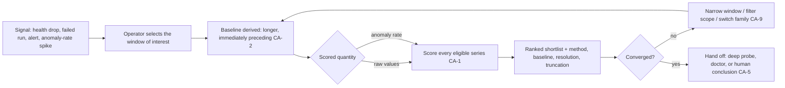

# Change Attribution

**Version:** 1.0.0
**Status:** Stable
**Layer:** concept

## Overview

The mechanism that turns *"something went wrong around 14:32"* into *"these twelve signals moved, ranked"*.

Given one window of interest, change attribution scores **every eligible recorded series** by how much it changed relative to an automatically-derived baseline window immediately preceding it, and returns a small ranked shortlist. It is the entry point of an investigation, not its conclusion: the shortlist says *where to look*, and a human or an agent decides *what it means*.

Two properties make it usable rather than merely clever. The baseline is **derived from the window itself**, so the operator selects one interval and never has to construct a control. And the same ranking machinery runs over raw values **or** over anomaly rates — "which signals moved" and "which signals behaved unusually" are different questions, and an incident usually needs both.

## Related Specifications

- [l1-observation-retention.md](l1-observation-retention.md) - The tiered record being ranked; supplies the resolution-and-truncation honesty that CA-8 enforces (OR-7).
- [l1-anomaly-consensus.md](l1-anomaly-consensus.md) - Supplies the anomaly rate that CA-4 ranks as an alternative scored quantity.
- [l1-operational-health.md](l1-operational-health.md) - Raises the alert or score drop that motivates opening an attribution window; consumes the shortlist as a finding, never as a cause.
- [l1-live-diagnostics.md](l1-live-diagnostics.md) - The next step after a shortlist: attach a deep probe to the specific operation the ranking implicated.
- [l1-doctor.md](l1-doctor.md) - Acts on findings; attribution itself never remediates (CA-5).
- [l1-improvement-loop.md](l1-improvement-loop.md) - Consumes attribution results as evidence when reasoning about regressions across runs.
- [l1-data-lineage.md](l1-data-lineage.md) - Answers "what produced this datum" structurally; attribution answers "what moved together with it" statistically. Complementary, not overlapping.
- [../../nodus/specifications/l1-nodus-observability.md](../../nodus/specifications/l1-nodus-observability.md) - Stable cross-run step identity (HO-15) is what makes a prior period of the same workflow a comparable baseline.

## 1. Motivation

An incident begins as a single observation: a health score dropped, a run failed, an office went quiet, a cost curve bent. Everything needed to explain it is already recorded — the difficulty is that *thousands* of series are recorded, and the operator has no way to know which of them matter. Manual investigation degenerates into scrolling through charts hoping to notice something, which is slow, biased toward the charts someone thought to build, and worst exactly when it is most needed.

The question the operator actually has is comparative and window-scoped: **"relative to just before this, what is different now?"** Answering it by hand requires choosing a control period, aggregating both periods for every series, and ranking the differences — mechanical work that is precisely what a machine should do over the whole corpus rather than over the handful of series a human remembered to check.

Doing it well requires three non-obvious commitments.

**The baseline must be derived, not requested.** If the operator has to specify a control window, they will specify the wrong one, or not bother. Deriving a longer, immediately-preceding interval makes the feature one gesture instead of two decisions.

**One scoring method is not enough.** A metric that shifts its *distribution* while keeping a similar mean (latency growing more variable) and a metric that was flat-zero and then switched on are both real changes, and no single score ranks both well. Two named families, with explicit guidance on which suits which shape, beats one unnamed "relevance" number that quietly fails on half the corpus.

**Ranking anomaly rates is a different and often better question.** "This value changed" catches magnitude; "this series started behaving unlike itself" catches the changes that stayed inside their normal range. Running the same ranking over the anomaly flag is nearly free (it is just another scored quantity) and frequently more discriminating.

## 2. Constraints & Assumptions

- Attribution is a **read** over the already-recorded observation tiers; it never re-collects, never instruments, and never mutates observed state.
- The record is local; attribution runs on-device and produces no egress.
- Results are statistical associations over a window. Nothing in this layer establishes causation, and the output format is required to say so (CA-5).
- The eligible corpus is the set of numeric series retained by the retention layer for the units in scope; non-numeric observations are out of scope.
- The layer is optional: with it absent, every other layer works and an operator investigates by hand.

## 3. Core Invariants

Rules every Layer 2 implementation MUST NOT violate:

- **CA-1 (Window-scoped ranking over the whole eligible corpus):** the question is always *"relative to this window of interest, which series changed most?"*, evaluated over **all** eligible series in scope rather than a pre-chosen subset. The output is an **ordered** list with a score per series — never a yes/no verdict and never an unranked set. A design that requires the user to name candidate series in advance defeats the purpose and violates this invariant.
- **CA-2 (The baseline is derived, contiguous, and always reported):** the comparison baseline is derived from the window of interest — an interval **immediately preceding** it whose length is a **declared multiple** of the window's length (a configured parameter, greater than one so the baseline is the wider context, not a coin-flip comparison) — and both the multiple and the resulting interval are reported alongside every result, so two runs using different multiples are distinguishable rather than mysteriously inconsistent. The operator selects one window and never constructs a control. An explicitly supplied baseline (a prior run, a named period) is permitted and is then reported *as supplied*, so a reader always knows what the comparison was against.
- **CA-3 (Two named scoring families, both available, neither universal):** the layer offers a **distributional** score (how much the value distribution shifted — sensitive to variance and shape changes at similar means) and a **magnitude** score (relative change of the aggregate — robust for sparse and on/off series). Both are always available; every result names the family that produced it, together with the aggregation used. Reporting a single unnamed "relevance" number, or hard-coding one family as the only option, is forbidden.
- **CA-4 (Rank raw values or anomaly rates, by the same machinery):** the identical ranking procedure applies to the raw values **and** to the anomaly flag (AC-3) as the scored quantity, selectable per run. Ranking anomaly rates answers "which signals were behaving unusually in this window", which is a distinct question from "which signals moved" and MUST be available, not merely derivable.
- **CA-5 (Shortlist, never a cause):** the result is an ordered set of **candidates for investigation**. The layer MUST NOT present a rank as a cause, record it as a root cause, trigger remediation, or feed it into an automated action. Attribution shortlists; a human or an agent concludes. Any surface rendering a result carries this framing explicitly.
- **CA-6 (Bounded candidate set with honest truncation):** the number of series evaluated and the number returned are bounded by declared limits. When a limit truncates the candidate set, the result carries an explicit **truncation marker** naming how many series were dropped and by what rule. A silently truncated ranking is forbidden — it is indistinguishable from a complete one and will be read as complete.
- **CA-7 (Read-only, non-perturbing, cancellable):** attribution reads and computes; it never mutates observed state, never re-collects, and never delays or degrades ongoing observation. A run is **cancellable** and reports partial progress. A single attribution run MUST NOT be able to starve the running system of resources — the diagnosis must not become the incident.
- **CA-8 (Refuse rather than answer weakly):** a window shorter than the declared minimum, or one whose retained resolution cannot support the requested scoring family, is **refused with the reason** — never answered with a low-confidence ranking presented like a normal one. Every result states the resolution actually used and the coverage actually available (composing OR-7); a ranking computed over intervals with gaps declares that.
- **CA-9 (Composable, iterative narrowing):** a result is re-runnable with a narrowed window, a filtered scope (by unit, label, or kind), a different scored quantity, and a different scoring family, so an investigation converges by successive refinement. Each run records its full parameter set, so the sequence of steps that led to a conclusion is reconstructable and auditable.
- **CA-10 (Widest-view evaluation with disclosed coverage):** where the record is held in more than one place, attribution is evaluated by the holder with the widest view of the requested scope, and the result names the evaluating holder and any series in scope it could not see. Partial coverage is **disclosed**, never silently narrowed — a ranking over half the corpus that looks like a ranking over all of it is worse than no ranking.

> L2 specs cannot reach RFC status until all invariants here are addressed in their "Invariant Compliance" section.

## 4. Detailed Design

### 4.1 The investigation loop



### 4.2 Choosing a scoring family

| Series shape | Family | Why |
| --- | --- | --- |
| Continuous, active in both windows, mean similar but spread changed | Distributional | Detects variance and shape shifts a mean comparison cannot see |
| Sparse, bursty, or switching between idle and active | Magnitude | A distribution comparison is unstable when one window is nearly empty; relative aggregate change is not |
| Counters and rates with a clear level | Either; magnitude first | Magnitude is easier to read and usually sufficient; escalate to distributional when magnitude ranks nothing |
| Anomaly rates (CA-4) | Magnitude | The quantity is already a rate in [0,1]; relative change is the meaningful comparison |

The layer never picks silently: the family used travels with the result (CA-3), so two runs producing different orderings are explainable rather than mysterious.

### 4.3 Reading a result

The shortlist is most informative when read **together with** the anomaly rate of the same series over the same window:

| Anomaly rate in window | Change score | Reading |
| --- | --- | --- |
| High | Strong | Most likely genuinely involved — the series both moved and moved unlike itself |
| High | Weak | Unusual behaviour without a level change — intermittent or edge-case; worth a probe |
| Low | Strong | A real but *expected-shaped* change — often a deliberate action (a config change, a new workload) rather than a fault |
| Low | Weak | Background variation; deprioritise |

This is a reading aid, not a classifier. Nothing in the layer assigns these labels automatically, because doing so would be the causal claim CA-5 forbids.

### 4.4 Bounding the work

```text
[REFERENCE]
attribute(scope, window, quantity, family, limits):
    if duration(window) < MIN_WINDOW:            refuse("window too short")        // CA-8
    baseline := interval of length k × duration(window) immediately before window  // CA-2
    series   := eligible series in scope, capped at limits.evaluated               // CA-6
    if series was capped:                        result.truncated := {dropped, rule}
    resolution := coarsest tier serving both window and baseline                   // OR-7
    if resolution cannot support `family`:       refuse("resolution insufficient")  // CA-8
    for each s in series (cancellable, budgeted):                                   // CA-7
        result.scores[s] := family.score(aggregate(s, baseline), aggregate(s, window))
    return top limits.returned of result.scores, with {baseline, family, quantity,
           resolution, coverage, truncated, evaluating holder}                      // CA-2/3/6/8/10
```

Every element of the returned metadata block exists because omitting it would let a partial or weak answer be read as a complete strong one.

### 4.5 Boundary with neighbouring layers

| Question | Owner |
| --- | --- |
| "Is something wrong?" | Operational health (scores, thresholds, alerts) |
| "Is this series behaving unlike itself?" | Anomaly consensus |
| "Which of everything recorded changed during this window?" | **This layer** |
| "What exactly did that one operation do?" | Live diagnostics (deep probe) |
| "What produced this specific datum?" | Data lineage (structural derivation, not statistical association) |
| "Fix it" | The self-healing subsystem, or a human |

## 5. Drawbacks & Alternatives

- **Correlation is not causation, and a ranked list invites the confusion.** Accepted as the central risk and addressed structurally by CA-5: the output is typed and framed as candidates, and no automated action may consume a rank.
- **Cost grows with corpus size.** Bounded by CA-6 (declared evaluation limit) and CA-7 (budgeted, cancellable). The resolution-aware planner also keeps a long-window run on coarse tiers rather than on raw points.
- **A derived baseline can be wrong** — if the "before" period already contained the problem, nothing looks changed. Mitigated by CA-9 (re-run with a shifted or explicitly supplied baseline) and by CA-2's requirement that the baseline always be visible, so this failure is diagnosable rather than invisible.
- **Alternative — a fixed dashboard of "important" charts.** Rejected: it can only show what someone anticipated, which is never the metric that explains a novel failure.
- **Alternative — a single scoring method.** Rejected by CA-3: any one method fails badly on a large class of series shapes, and an unnamed score makes that failure undetectable.
- **Alternative — automatic root-cause designation.** Rejected by CA-5: the statistics do not support the claim, and a wrong automatic cause is worse than an honest shortlist because it stops the investigation.
- **Alternative — let the operator specify candidate series.** Rejected by CA-1: it reintroduces exactly the human-selection bias the layer exists to remove.

## Canonical References

| Alias | Path | Purpose |
| --- | --- | --- |
| `[RETENTION]` | `.design/main/specifications/l1-observation-retention.md` | The tiered record being ranked; resolution/coverage honesty CA-8 composes (OR-7). |
| `[ANOMALY]` | `.design/main/specifications/l1-anomaly-consensus.md` | Source of the anomaly rate ranked as an alternative quantity (CA-4). |
| `[HEALTH]` | `.design/main/specifications/l1-operational-health.md` | Producer of the signal that opens an investigation; consumer of the shortlist as a finding. |
| `[DIAGNOSTICS]` | `.design/main/specifications/l1-live-diagnostics.md` | The deep, targeted follow-up a shortlist points at. |

## Document History

| Version | Date | Author | Notes |
| --- | --- | --- | --- |
| 1.0.0 | 2026-07-23 | Core Team | Initial spec — window-scoped change attribution as the entry point of an investigation: ranked scoring over the whole eligible corpus rather than a pre-chosen subset (CA-1), automatically derived and always-reported contiguous baseline (CA-2), two named scoring families — distributional and magnitude — with the family always disclosed (CA-3), the same machinery over raw values or anomaly rates (CA-4), shortlist-never-a-cause with no automated consumption of a rank (CA-5), bounded candidate set with explicit truncation marker (CA-6), read-only/non-perturbing/cancellable so the diagnosis never becomes the incident (CA-7), refuse-rather-than-answer-weakly on short windows or insufficient resolution (CA-8), composable iterative narrowing with recorded parameters (CA-9), widest-view evaluation with disclosed partial coverage (CA-10). Concept-only. |
