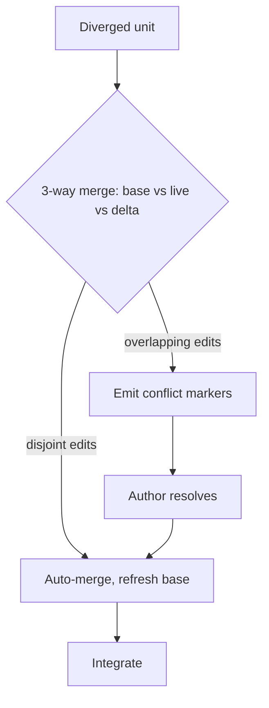

# Concurrent Change Merge

**Version:** 1.0.0
**Status:** Stable
**Layer:** concept

## Overview

Concurrent change merge is the discipline that lets several workers (or several sessions) propose modifications to the same shared structured artifact — a specification, a plan, a workflow definition, a knowledge document — **in parallel, without silently losing each other's work**.

A modification is expressed as a reviewable *delta* against a known base, kept separate from the living artifact until it is integrated. The hazard this concept exists to kill is specific and silent: when two in-flight changes touch the same part of an artifact and integration uses *replace-the-block* semantics, the second integration overwrites the first — a shipped, approved unit simply disappears, with no error, no diff, no conflict marker. The source of truth is corrupted and nobody is told.

The fix is borrowed from source control but applied at the granularity of the artifact's *meaning*: address deltas at the finest semantic unit, record the exact base each delta was authored against, refuse to integrate a delta whose base has moved, and reconcile divergence with a deterministic three-way merge that surfaces real conflicts for a human to resolve. This is the structured-artifact counterpart to the prose CRDT merge in [l1-notes.md](l1-notes.md): notes merge free-form text automatically; structured artifacts merge reviewable deltas with explicit conflict resolution.

## Related Specifications

- [l1-spec-driven-governance.md](l1-spec-driven-governance.md) — the governance umbrella; this concept is the concurrent-edit mechanic its drift guards (SDG-7) do not cover.
- [l1-version-control.md](l1-version-control.md) — git worktree atomicity (VC-4) and commit boundaries; the merge here is the artifact-semantic analogue of source-control merge.
- [l1-notes.md](l1-notes.md) — CRDT concurrent merge for prose; this concept is its reviewable-delta counterpart for structured artifacts.
- [l1-task-graph-model.md](l1-task-graph-model.md) — additive reversible expansion (TG-7) and the dependency DAG that orders concurrent integration.
- [l1-orchestration.md](l1-orchestration.md) — where concurrent proposals are dispatched; the change dependency metadata that orders integration lives in its implementation.
- [l1-operational-ledger.md](l1-operational-ledger.md) — supersede-don't-mutate identity (OL-2) is the single-author analogue of the base-fingerprint guard here.
- [l1-doctor.md](l1-doctor.md) — stale-base and orphaned-delta detection are health-check surfaces.

## 1. Motivation

A multi-agent office is concurrent by nature: the orchestrator may have three workers refining the same specification, or two sessions amending the same plan. Three failures follow when concurrent edits are integrated naively:

1. **Silent clobbering.** Change A adds scenario X to a requirement; change B, authored against the pre-A version, adds scenario Y to the same requirement. A integrates (X present). B integrates with replace-the-block semantics and ships its two-scenario version — X is gone. No warning. The most dangerous bug is the one that completes successfully.

2. **Order-dependence.** With replace semantics the merged result depends on integration order. "A then B" and "B then A" produce different living artifacts, which means the source of truth is a function of scheduling luck, not of what was approved.

3. **No reconciliation path.** Without a base to diff against, the tooling cannot even tell that two changes diverged, so it offers no merge, no rebase, no conflict markers — the contributor has no source-control-grade way to reconcile parallel work.

The cost of not having this layer is corruption that looks like success: a living spec that quietly omits a shipped requirement, discovered much later as a mysterious gap.

## 2. Constraints & Assumptions

- This concept governs **structured** artifacts with addressable units (specs, plans, workflow definitions, tabular knowledge). Free-form prose is served by the CRDT path of `l1-notes.md`; this is the reviewable-delta path.
- A delta is **data** — human-readable, reviewable markdown/structure — not an opaque binary patch.
- The living artifact is the **single source of truth**; changes are ephemeral and live separately until integrated, then archive.
- Integration is the merge point and is **atomic**: a change integrates entirely or not at all; it never half-leaks into the source of truth.
- Concurrency is expected; this concept assumes the *existing* change dependency metadata (declared elsewhere) for ordering and does not redefine it.

## 3. Core Invariants

Rules any Layer 2 implementation MUST NOT violate:

- **CM-1 Change as delta, not snapshot**: a modification is expressed as a structured delta — typed operations (added / modified / removed / renamed) on addressable units — against a known base, never as a full-document replacement. The delta is human-readable and reviewable on its own.
- **CM-2 Sub-unit granularity**: deltas address the finest meaningful unit (a scenario within a requirement, a row within a table, a step within a section), not only the whole document or its top-level blocks. Two changes editing *different* sub-units of the same block MUST be mergeable without conflict.
- **CM-3 Base fingerprinting**: every delta records a fingerprint (and the raw text) of the exact base content each addressed unit was authored against, persisted with the change. A modify/remove/rename delta without a recorded base is malformed.
- **CM-4 Divergence-blocked integration**: before a delta merges, the live unit's fingerprint is recompared to the recorded base. If they differ — the base moved under the change — integration is **blocked** and the author is directed to reconcile. Silent replacement of diverged content is prohibited; blocking is the default, not an opt-in.
- **CM-5 Deterministic three-way reconciliation**: on divergence, a three-way merge (base, live, delta) auto-resolves non-overlapping edits; genuinely overlapping edits surface explicit conflict markers the author resolves (a rebase), after which the delta's recorded base is refreshed. The procedure is deterministic and reviewable, mirroring source-control merge/rebase.
- **CM-6 No silent loss; disjoint edits commute**: a unit present in the living artifact is never removed by integrating a change unless that change carries an explicit *removed* delta for it. For changes whose edits touch disjoint units, the merged result MUST be independent of integration order (commutativity for non-conflicting edits).
- **CM-7 Concurrent proposals, dependency-ordered integration**: multiple change proposals MAY be in flight against the same artifacts. Their integration order follows declared dependencies (reusing the existing change dependency metadata, not a new scheme); overlap on shared units is surfaced as an actionable warning *before* work begins, not discovered at integration.
- **CM-8 Atomic integration, ephemeral changes**: the living artifact reflects current reality; a change lives separately until integrated and then archives. Integration is all-units-or-none; a change never partially leaks into the source of truth.
- **CM-9 Blockers versus warnings**: validation distinguishes deterministic blockers — dependency cycle, missing required predecessor, stale base, malformed delta — which fail, from advisory signals — a unit also touched by another in-flight change, an unmatched capability marker — which warn but do not block.

> An L2 implementation cannot reach RFC until every invariant above is addressed in its Invariant Compliance section.

## 4. Detailed Design

### 4.1 Delta Model and Granularity (CM-1, CM-2)

A change carries a set of typed operations on addressable units:

| Operation | Carries | Notes |
| --- | --- | --- |
| `added` | the new unit | no base required |
| `modified` | new unit body + recorded base (CM-3) | finest-unit addressing (CM-2) |
| `removed` | recorded base | the only way a unit may disappear (CM-6) |
| `renamed` | old id → new id + recorded base | identity-preserving |

Addressing is hierarchical and stable (e.g. `requirement/«id»/scenario/«id»`), so a delta naming a scenario never forces a rewrite of its sibling scenarios. Granularity is the property that makes disjoint concurrent edits non-conflicting by construction.

### 4.2 Base Fingerprint and Divergence Detection (CM-3, CM-4)

```text
[REFERENCE]
AUTHOR    — for each modified/removed/renamed unit, record base = { hash(live_unit), raw_text }
INTEGRATE — for each such unit: live_hash = hash(current live_unit)
            live_hash == recorded base hash  → safe to apply
            live_hash != recorded base hash  → DIVERGED → block, route to reconcile (4.3)
```

The fingerprint is what turns "two changes corrupted the spec" into "this change's base moved; reconcile before integrating." It is the multi-author generalization of the single-author supersede-don't-mutate rule (OL-2).

### 4.3 Three-Way Merge and Rebase (CM-5, CM-6)



Non-overlapping edits (A touched scenario X, B touched scenario Y) merge automatically and the result is order-independent (CM-6). Overlapping edits (both rewrote scenario X) cannot be auto-resolved; the system writes conflict markers into the delta and requires the author to reconcile, exactly as a source-control rebase does. After resolution the recorded base is refreshed so the integration is clean.

### 4.4 Concurrent Proposals and Integration Order (CM-7, CM-9)

Ordering reuses the change dependency metadata already defined for the office (declared `dependsOn` predecessors, advisory `touches`/capability markers) — this concept does not introduce a parallel scheme. It adds the *merge-safety* layer on top:

- **Before work**: overlap on shared units is surfaced as an actionable warning, so authors can sequence or split.
- **At integration**: deterministic blockers (cycle, missing predecessor, stale base, malformed delta) fail; advisory overlaps warn (CM-9).

### 4.5 Ideas-to-Adopt Mapping

| Mined idea | Disposition | Where it lands |
| --- | --- | --- |
| Delta-based change with typed ops against a base | **New** | CM-1; §4.1 |
| Sub-unit (scenario-level) granularity | **New** | CM-2; §4.1 |
| Base fingerprinting + divergence-blocked integration | **New** | CM-3, CM-4; §4.2 |
| Three-way merge + rebase + conflict markers for artifacts | **New** | CM-5; §4.3 |
| No-silent-loss + order-independence for disjoint edits | **New** | CM-6 |
| Atomic integrate-then-archive, change-as-ephemeral-delta | **New (at L1)** | CM-8 |
| Change dependency metadata (dependsOn/provides/requires/touches/parent), DAG validation, archive-order | **Reuse** | the change-graph in the orchestration implementation |
| Requirement + scenario (Given/When/Then) spec format | **Reuse** | testable Given/When/Then in the quality pipeline |
| Artifact graph with downstream regeneration | **Reuse** | the artifact dependency graph in the orchestration implementation |
| Initiatives (a layer grouping related changes with shared context) | **Reuse** | milestones/roadmap in mission execution |
| Durable shared context store | **Reuse** | the operational ledger + memory model |
| Exploration artifacts preceding a change | **Reuse** | Explore mode + spike/sketch surfaces |
| Prose concurrent merge | **Reuse** | CRDT merge in the notes subsystem |

### 4.6 Nodus Relevance

A workflow authored in the agent workflow DSL is itself a structured artifact with addressable units (sections, steps, macros), so concurrent edits to a shared workflow or macro library face the same clobbering hazard:

- **Delta granularity maps to DSL structure**: a delta can address a single step or a single macro within a workflow file, so two authors editing different steps never collide (CM-2).
- **Base-fingerprint + 3-way merge as DSL tooling**: the merge-safety layer is a candidate capability for the DSL's tooling surface — fingerprint a step's base, block a stale edit, reconcile via three-way merge (CM-3…CM-5).
- **Atomic integration as a validator gate**: refusing to integrate a diverged delta is expressible as a validation step with blocker/warning outcomes (CM-9).

These are adoption *candidates* recorded at concept level; the concrete language/runtime surface is owned by the nodus specs.

## 5. Implementation Notes

1. Granularity first (CM-2): if the delta language only understands whole top-level blocks, every other guard still loses sibling edits. Parse to the finest unit before anything else.
2. Fingerprint at author time and integrate time from the *same* canonical serialization, or benign formatting differences will read as divergence.
3. Block before merge (CM-4) is the cheap, must-have guard; the full three-way merge (CM-5) is the ergonomic follow-on. Ship the guard first.
4. Disjoint-edit commutativity (CM-6) is the property to test hardest — it is the one that prevents order-dependent corruption.

## 6. Drawbacks & Alternatives

**Drawback — merge ceremony.** Fingerprints and rebases add steps a single-author flow does not need. Mitigation: the guard is a no-op when bases match (the common case); ceremony appears only on real divergence.

**Alternative — replace-the-block on integration (the status quo being corrected).** Rejected: it is order-dependent and silently drops concurrent sibling edits (the exact failure this concept exists to prevent).

**Alternative — serialize all changes (one in-flight change at a time).** Rejected: it removes concurrency, which is the office's core advantage; it also does not help two *sessions* that both branched from the same base.

**Alternative — CRDT-merge everything (as notes do).** Rejected for structured artifacts: automatic prose merge is the wrong default where a conflicting requirement edit needs human judgment, not silent union. Structured artifacts want *reviewable* reconciliation, not invisible convergence.

## Canonical References

| Alias | Path | Purpose |
| --- | --- | --- |
| `[GOVERNANCE]` | `.design/main/specifications/l1-spec-driven-governance.md` | Governance umbrella; the gap (concurrent merge) this concept fills |
| `[VERSION-CONTROL]` | `.design/main/specifications/l1-version-control.md` | Source-control atomicity (VC-4); merge/rebase analogue |
| `[NOTES]` | `.design/main/specifications/l1-notes.md` | CRDT prose-merge counterpart to this reviewable-delta path |
| `[OPERATIONAL-LEDGER]` | `.design/main/specifications/l1-operational-ledger.md` | Supersede-don't-mutate (OL-2), the single-author analogue of CM-3/CM-4 |

## Document History

| Version | Date | Author | Notes |
| --- | --- | --- | --- |
| 1.0.0 | 2026-06-25 | Core Team | Initial spec — CM-1…CM-9; delta model + sub-unit granularity, base fingerprinting, divergence-blocked integration, three-way merge/rebase, no-silent-loss commutativity, dependency-ordered concurrent integration; ideas-to-adopt + nodus-relevance mapping (mined from an external spec-driven-development tool's parallel-change merge problem) |
