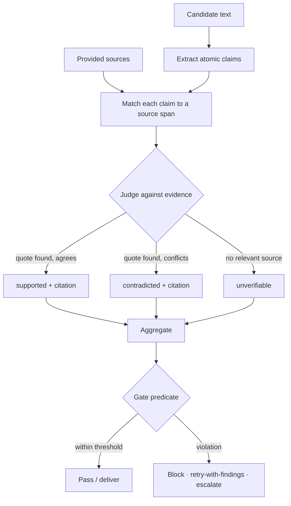

# Claim Verification

**Version:** 1.0.0
**Status:** Stable
**Layer:** concept

## Overview

A reusable mechanism that checks whether the factual claims in a candidate text are actually supported by a given set of source materials — the runtime detector of hallucination and ungrounded assertion. It takes `(claims, sources)` and returns, per individual claim, a verdict (supported / contradicted / unverifiable) together with the specific evidence span and source it rests on. It answers one narrow question — *"is this claim grounded in these sources?"* — and never *"is this claim true in the world."*

This is the faithfulness half of generation quality, the sibling of retrieval evaluation: retrieval evaluation measures whether the right material was *recalled*; claim verification measures whether the produced text is *faithful* to the material it cites. The project already asserts grounded-and-attributed anti-hallucination as a *property* in several places (the client wiki must cite a real artifact for every claim; the operational ledger demands verbatim citation; research synthesis wraps untrusted pages) — but it has no single, reusable *enforcement* mechanism those properties can call. This concept is that mechanism: one verifier, composed as a quality gate, applied across every surface that emits claims over sources.

## Related Specifications

- [l1-output-contracts.md](l1-output-contracts.md) - A verification result composes as an inline output gate; it reuses the existing retry-budget + escalation machinery rather than a parallel one.
- [l1-retrieval-evaluation.md](l1-retrieval-evaluation.md) - The sibling measurement: recall quality of what was retrieved, vs. this spec's faithfulness of what was generated over it.
- [l1-knowledge-base.md](l1-knowledge-base.md) - RAG sources with per-chunk attribution are the evidence claim verification cites against.
- [l1-operational-ledger.md](l1-operational-ledger.md) - Verbatim-citation grounding (OL-4/OL-7) is exactly what a verifier enforces mechanically.
- [l1-project-wiki.md](l1-project-wiki.md) - PW-4 (every client-facing claim cites a real artifact) is enforced by this concept rather than asserted.
- [l1-deep-research.md](l1-deep-research.md) - Research synthesis claims are verified against the gathered, attributed pages before the report is delivered.
- [l1-loop-governance.md](l1-loop-governance.md) - LG-4 oracle ownership: the verifier is independent of the generator that produced the claims.
- [l1-orchestration.md](l1-orchestration.md) - ORC-11 escalation is the path a failed verification gate takes when retry is exhausted.

## 1. Motivation

An agent that retrieves the right documents can still state something the documents do not say — confident, plausible, and wrong. The danger is sharpest exactly where the system already promises grounding: a client wiki that cites a decision the decision never made, a research report that rounds "over 450" up to "500," an answer that blends a real source with an invented detail. Retrieval quality does not catch this; the documents were fine, the *claim about them* was not.

The naive defenses are weak. Asking the generator to "only state what the sources support" is an instruction it can violate silently. Checking the whole answer as one blob hides which specific sentence is unsupported. Treating "no evidence found" as "false" produces confident contradictions of true-but-uncited facts. What is needed is a dedicated, independent check operating at the granularity of individual claims, deciding each against the *provided* evidence (not the model's memory), distinguishing *contradicted* from merely *unverifiable*, citing the span it relied on, and composing as a gate that can block, retry, or escalate. Built once with a clean contract, it serves every surface that emits claims over sources — answers, wiki entries, research syntheses, marketing/report copy checked against documentation — instead of each reinventing a brittle one-off check.

## 2. Constraints & Assumptions

- Verification judges faithfulness to *provided* sources, not world-truth; a source set that is itself wrong or incomplete bounds what verification can conclude.
- The verifier is a signal, not an authority — it never silently rewrites the candidate text; it reports and lets a gate or a human decide.
- Absence of evidence is a distinct outcome from contradiction; the system never coerces "unverifiable" into "false" or "true."
- The verifier is separated from the generator whose output it judges (no self-grading on the same lineage).
- Sources and claims are user/program data — verification runs on-device by default and does not egress them.
- Verification is bounded (claim count, source size) and every run is observable.

## 3. Core Invariants

Rules every Layer 2 implementation MUST NOT violate:

- **CV-1 (Claim-level granularity):** verification operates on individually-addressable atomic claims extracted from the candidate text, never on the text as one opaque blob. Each claim carries its own verdict, so the unsupported sentence is identifiable, not averaged away.
- **CV-2 (Source-grounded, never self-graded knowledge):** every verdict is decided strictly against an explicit set of provided source materials. The verifier MUST NOT decide a claim from its own parametric/world knowledge; a claim with no relevant source is `unverifiable`, never assumed supported.
- **CV-3 (Ternary verdict):** each claim resolves to exactly one of `supported` / `contradicted` / `unverifiable`. Absence of evidence (`unverifiable`) is a first-class outcome distinct from `contradicted` — the system MUST NOT collapse the three into a binary.
- **CV-4 (Mandatory evidence attribution):** a `supported` or `contradicted` verdict MUST cite the specific source span (a quote) and the source identity it rests on. A verdict that cannot attribute its evidence is downgraded to `unverifiable` — there is no verdict without a citation.
- **CV-5 (Verifier independence):** the component that verifies the claims is separated from the component that produced them; a generator does not grade its own faithfulness. Where the same model lineage must serve both, that is recorded as reduced confidence (consistent with the oracle-ownership discipline used for loops).
- **CV-6 (Non-authoritative, advisory boundary):** verification reports faithfulness to the given sources only; it MUST NOT assert ground truth about the world, silently edit the candidate, or be treated as a fact oracle. Its output is a signal others act on.
- **CV-7 (Gate composition, not a parallel engine):** a verification result composes as a quality gate via a configurable predicate (e.g. *any contradicted claim* or *unsupported-ratio over threshold*) that can pass, block, trigger a bounded retry with the findings injected, or escalate. It reuses the existing output-validation retry/escalation machinery rather than defining a new one.
- **CV-8 (Bounded, observable, on-device by default):** verification has explicit input bounds (claim count, source size) and degrades gracefully when exceeded; every run is traceable (claims, verdicts, cited evidence, model used); sources and claims do not leave the device by default (data-safety parity with the rest of the system).
- **CV-9 (Surface-agnostic contract):** one `(claims, sources) → verdicts` contract serves every surface — agent answer vs. RAG chunks, wiki claim vs. work-product, report claim vs. documentation, research synthesis vs. gathered pages. Surfaces supply claims and sources; they MUST NOT each reimplement the verifier.

> L2 specs cannot reach RFC status until all invariants here are addressed in their "Invariant Compliance" section.

## 4. Detailed Design

### 4.1 Verification Pipeline

```text
[REFERENCE]
verify(candidate_text, sources, gate_policy):
    claims  := extract_atomic_claims(candidate_text)        # CV-1
    results := []
    for claim in claims (bounded count):                    # CV-8
        span, src := best_evidence(claim, sources)          # CV-2 — search PROVIDED sources only
        verdict   := judge(claim, span)                     # supported | contradicted | unverifiable (CV-3)
        if verdict != unverifiable and span is null:
            verdict := unverifiable                          # CV-4 — no citation ⇒ no verdict
        results.append({ claim, verdict, evidence: span, source: src, reasoning })
    decision := gate_policy(results)                         # CV-7 — pass | block | retry | escalate
    trace(results, model)                                    # CV-8
    return { results, decision }
```



### 4.2 Verdict & Evidence Contract

```text
[REFERENCE]
ClaimResult:
  claim     : the atomic assertion under test
  verdict   : supported | contradicted | unverifiable      # CV-3
  evidence  : quoted source span                           # required for supported/contradicted (CV-4)
  source    : source identity (+ locator)                  # CV-4
  reasoning : why this verdict (short, auditable)
```

`unverifiable` is the honest default whenever the provided sources neither support nor contradict — it is never silently promoted to `supported` to make a text "pass."

### 4.3 Gate Composition

The gate predicate is policy, not hard-coded: a client-facing wiki may demand *zero contradicted and zero unverifiable* claims; an internal draft may tolerate unverifiable but never contradicted. On violation the gate reuses the output-contract loop — inject the failed claims as feedback, retry within budget, and escalate through the orchestration error-containment path when the budget is exhausted (never ship a silently-failed text).

### 4.4 Placement in the Quality Family

This concept is a distinct member beside the existing quality mechanisms; it does not absorb or duplicate them:

| Mechanism | Question it answers |
| --- | --- |
| Retrieval evaluation | Did we *recall* the right material? (ranked-recall metrics) |
| **Claim verification (this)** | Is the produced text *faithful* to the material it cites? |
| Output contracts | Is the output the right *shape / valid* (schema, callable, criteria)? |
| Requirement checklists | Are the *requirements* themselves well-formed? ("unit tests for the spec") |
| Evaluation suites | Does a customization *behave* correctly across golden tasks? |

### 4.5 Ideas-to-Adopt Mapping (no-duplication proof)

The source is an AI-agent *safety* toolkit; safety is the project's most thoroughly-covered area, so its other three capabilities map onto the existing stack and are **not** re-specified. Only claim verification was genuinely uncovered.

| Source mechanic | Disposition | Owner |
| --- | --- | --- |
| Runtime *guard* — classify content for prompt-injection / jailbreak / data-exfiltration with typed violation categories + CWE codes, block/allow | Already covered | [l2-tool-security.md](l2-tool-security.md) (request guardrail pipeline, 17-category taxonomy, UNTRUSTED_CONTEXT_POLICY, anti-jailbreak prompt), [l2-agent-autonomy.md](l2-agent-autonomy.md) (CommandRiskLevel classifier), [l2-security.md](l2-security.md) (egress gate) |
| *Redact* — strip PII/PHI/secrets with entity types, whitelisting, file redaction | Already covered | [l2-tool-security.md](l2-tool-security.md) (pii-masker guardrail), [l2-security.md](l2-security.md) (SecretMap redaction, credential-finding protocol — value never emitted), [l1-error-reporting.md](l1-error-reporting.md) (scrub), [l1-telemetry.md](l1-telemetry.md) (never-collected list) |
| *Scan* — analyze a repository/workspace for agent-targeted poisoning and malicious instructions | Already covered | [l2-tool-security.md](l2-tool-security.md) (static + deep scan, repository-content-as-data rule), [l2-security.md](l2-security.md) (workspace-trust DiscoveryScan), [l2-quality-pipeline.md](l2-quality-pipeline.md) (codebase audit) |
| *Test* — fire red-team scenarios (prompt-injection / data-exfiltration) at the running agent | **Refinement candidate** — adversarial review + implicit-requirement adversarial tasks exist; a security-specific red-team scenario suite is a sharpening, recorded here, not duplicated | [l1-evaluation-suites.md](l1-evaluation-suites.md) (ES-14), [l2-quality-pipeline.md](l2-quality-pipeline.md) (adversarial review) |
| On-device guard models (small, low-latency, CPU/GGUF) for safety classification | Already covered | [l1-model-runtime.md](l1-model-runtime.md) (local-first serving), [l1-routing.md](l1-routing.md) RTG-9 (function-scoped economical model roles — a guard classifier is one such role) |
| SDK / CLI / MCP / prompt-submit-hook delivery of these checks | Already covered | [l1-extensions.md](l1-extensions.md), [l2-extension-registry.md](l2-extension-registry.md), [l2-plugin-hooks.md](l2-plugin-hooks.md) (UserPromptSubmit) |
| Uniform content-safety classification applied at *every* trust boundary (input, tool output, retrieved content, file) backed by one function-scoped guard model | **Refinement candidate** for [l1-security.md](l1-security.md) / [l2-tool-security.md](l2-tool-security.md) — the pieces exist per-boundary; unifying them under one classifier is a sharpening, not a new concept | (recorded, not duplicated) |

### 4.6 nodus Relevance

This concept maps cleanly onto nodus's existing validation and error model, as a candidate vocabulary addition rather than a structural change:

- **Verification as a validator/step:** a claim-verification check fits nodus's `^validator` and step-output-contract model directly — a step's generated output is gated against sources supplied via `@ctx`, and the ternary verdict maps to severity (`supported` → pass, `unverifiable` → warning, `contradicted` → error), emitting a grounding/faithfulness code in the error taxonomy (the natural home alongside the existing validation-category codes).
- **Gate reuse:** CV-7's gate-with-bounded-retry is the same shape as nodus's existing validator-retry and `~RETRY` constructs — no new control surface needed.
- **Observability:** the per-claim results (claim / verdict / evidence / source) are a structured event the AuditProvider records, matching the existing execution-event taxonomy. Net: a `VERIFY`-class validator + one grounding error code, not a language redesign.

## 5. Drawbacks & Alternatives

- **Verifier cost & latency:** an extra model pass per delivered text. Mitigated by CV-8 bounds, by applying it only where grounding is promised (wiki, research, RAG answers) rather than universally, and by routing it to a small function-scoped model.
- **Garbage-in sources:** verification is only as good as the source set (CV-6) — faithful to wrong sources is still wrong. Mitigated by pairing it with retrieval evaluation (right material) and source provenance; verification is explicitly the faithfulness layer, not a truth oracle.
- **Claim-extraction error:** mis-split or merged claims can mis-verdict. Mitigated by CV-1 atomicity discipline and by surfacing extracted claims in the trace for inspection.
- **Alternative — instruct the generator to stay grounded:** rejected as the sole defense; an instruction is silently violable and provides no independent, attributable check (violates CV-5 independence).
- **Alternative — verify the whole text as one blob:** rejected; hides *which* claim failed and prevents targeted retry (violates CV-1).
- **Alternative — fold into output contracts:** rejected as a merge; output contracts validate shape/criteria generically, while faithfulness-to-sources is a distinct judgment with its own ternary verdict and evidence contract — it *composes with* the contract gate (CV-7) without becoming it.

## Canonical References

| Alias | Path | Purpose |
| --- | --- | --- |
| `[OUTPUT-CONTRACTS]` | `.design/main/specifications/l1-output-contracts.md` | The retry/escalation gate machinery a verification result composes onto (CV-7). |
| `[RETRIEVAL-EVAL]` | `.design/main/specifications/l1-retrieval-evaluation.md` | The sibling recall-quality measurement; defines the boundary this spec sits beside. |
| `[KNOWLEDGE-BASE]` | `.design/main/specifications/l1-knowledge-base.md` | Attributed RAG sources that supply the evidence verification cites. |

## Document History

| Version | Date | Author | Notes |
| --- | --- | --- | --- |
| 1.0.0 | 2026-06-30 | Core Team | Initial spec — claim/grounding verification mined from an external AI-agent-safety toolkit. The faithfulness counterpart to retrieval evaluation: takes `(claims, sources)` and returns per-claim ternary verdicts with mandatory evidence attribution — claim-level granularity (CV-1), source-grounded never self-graded knowledge (CV-2), ternary supported/contradicted/unverifiable (CV-3), mandatory evidence citation or downgrade-to-unverifiable (CV-4), verifier independence from the generator (CV-5), non-authoritative advisory boundary (CV-6), gate composition reusing output-contract retry/escalation (CV-7), bounded+observable+on-device (CV-8), one surface-agnostic contract (CV-9). Enforces the previously-asserted-only anti-hallucination properties (wiki PW-4, operational-ledger OL-4/OL-7, research synthesis). The toolkit's other capabilities map to the existing security stack with no duplication — runtime guard → l2-tool-security guardrail pipeline + threat taxonomy + l2-agent-autonomy classifier; redact → l2-tool-security pii-masker + l2-security SecretMap/credential-finding + error-reporting/telemetry scrub; repo scan → l2-tool-security static+deep scan + l2-security workspace-trust + l2-quality-pipeline audit; on-device guard models → l1-model-runtime + l1-routing RTG-9 function-scoped roles; SDK/CLI/MCP/hook delivery → l1-extensions + l2-extension-registry + l2-plugin-hooks. Red-team scenario testing and a unified every-boundary content-safety classifier recorded as refinement candidates (l1-evaluation-suites / l1-security / l2-tool-security), not duplicated. Additive, no C12 cascade. nodus-relevance: a VERIFY-class `^validator` + one grounding error code mapping the ternary verdict to severity, reusing the validator-retry gate and AuditProvider event taxonomy — no structural change. |
