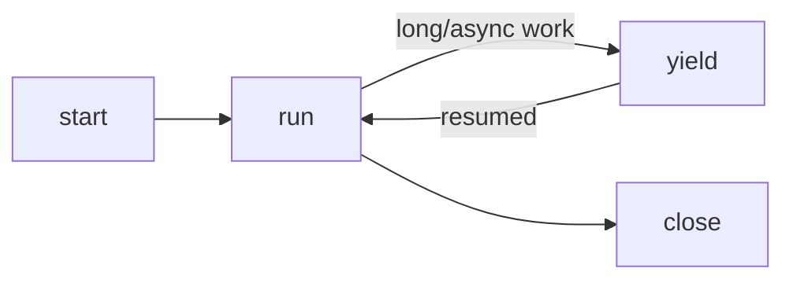

# Code-Execution Tool Surface

**Version:** 1.0.0
**Status:** Stable
**Layer:** concept

## Overview

A tool-use surface in which the agent expresses a multi-step task as a single executable program — in a sandboxed runtime where tool and capability invocations appear as ordinary in-language calls — instead of emitting many discrete one-tool-per-turn calls. The available capabilities are projected to the agent as a typed interface, so it writes calls against a checkable contract with real control flow (loops, conditionals, intermediate variables, data reshaping between calls). The program runs inside the same authorization and sandbox envelope as discrete calls; it is a composition convenience, never an escape hatch.

This complements the tool-composition model: composition defines how tools are *organized and authorized* (toolkits, dispatchers, dependency ordering); this spec defines how the agent *expresses and runs* orchestration over them. It also gives the workflow language a natural home — a workflow program is exactly the kind of orchestration a code-execution runtime evaluates.

## Related Specifications

- [l1-tool-composition.md](l1-tool-composition.md) - Toolkits/dispatcher the program calls into; code-execution composes over the same authorized surface.
- [l1-output-contracts.md](l1-output-contracts.md) - Nested-call and program results follow the structured-output contract (CE-6).
- [l1-security.md](l1-security.md) - SEC-6 sandboxed execution; code-mode runs inside the same envelope (CE-3).
- [l1-agent-tool-ergonomics.md](l1-agent-tool-ergonomics.md) - Typed projection and bounded output serve agent-facing tool ergonomics.
- [l1-workflow-language.md](l1-workflow-language.md) - A workflow program is a concrete form of the orchestration this surface evaluates.

## 1. Motivation

The discrete tool-call loop — one tool call, one model turn, repeat — is simple but costs a round-trip per step and forces the model to carry intermediate state in its context. A task that fetches a list, filters it, calls a tool per item, and aggregates the results becomes a dozen turns of copying data between calls by hand. The model spends tokens transcribing values it just received, and each hop is a chance to drift.

Letting the agent write one program that performs the whole orchestration — calling tools as functions, holding intermediates in variables, looping and branching in real code — collapses those turns into one execution. The decisive constraints are that the program must be *typed* (the agent calls a checkable interface, not stringly-typed guesses), *confined* (no more privilege than the equivalent discrete calls), and *observable* (every nested call is traced). Without those, code-mode would trade reliability and safety for convenience; with them, it is strictly a better composition surface for non-trivial multi-tool work.

## 2. Constraints & Assumptions

- Capabilities exposed to a program are a projection of the *same* tool schemas the discrete-call path uses — there is no second, divergent tool definition.
- The runtime is sandboxed; the program's only effects on the outside world are through authorized capability calls, not arbitrary ambient I/O.
- Code-execution is optional and additive: a single trivial action still uses a discrete call. The surface earns its keep on multi-step orchestration.
- The authoring language/runtime is an implementation choice; this spec constrains the contract (typed, confined, bounded, observable), not the language.

## 3. Core Invariants

Rules every Layer 2 implementation MUST NOT violate:

- **CE-1 (Program as orchestration):** the agent MAY express a multi-step task as one program in which capability invocations are in-language calls, replacing N discrete round-trips with one composed execution that may loop, branch, and hold intermediates.
- **CE-2 (Typed capability projection):** the capabilities a program may call are presented to the authoring agent as a typed interface (named signatures with parameter and result types), auto-derived from the same tool schemas the discrete path exposes. The agent writes against the contract, not free-form strings.
- **CE-3 (Confinement parity):** a program executes within the same sandbox and permission envelope as discrete tool calls. Every nested call inside the program is authorized, gated, and audited exactly as the equivalent discrete call would be. Code-execution MUST NOT widen authority or bypass an approval that the discrete call would require.
- **CE-4 (Stateful cells):** execution is organized into addressable units that retain state across invocations within a session, so later code builds on earlier results without recomputation. Each unit's lifecycle (start → run → yield → close) is explicit and the runtime can route follow-up calls to a live unit.
- **CE-5 (Bounded, yielding execution):** each execution is budget-bounded (output size and wall-time) and yields cooperatively for long or asynchronous work via an explicit wait primitive, so a runaway or blocking program cannot monopolize the turn. Partial output streams back as it is produced.
- **CE-6 (Structured results):** a program and each nested call return structured, attributed, size-bounded results — not just concatenated stdout — consistent with the output-contract model. Oversized results are truncated with the truncation made explicit.
- **CE-7 (Equivalence & fallback):** the code-execution and discrete-call surfaces are semantically equivalent per call; choosing code-mode never changes a call's authorization or effect. When code-execution is unavailable or unwarranted, the agent falls back to discrete calls with no loss of capability.
- **CE-8 (Observable & replayable):** the executed program text, its nested calls, and their outcomes are recorded as a first-class execution trace, so a code-mode turn is at least as inspectable and replayable as the equivalent sequence of discrete calls.

> L2 specs cannot reach RFC status until all invariants here are addressed in their "Invariant Compliance" section.

## 4. Detailed Design

### 4.1 Typed Projection

```text
[REFERENCE]
for each authorized tool/toolkit in scope:
    project schema → typed signature   // e.g. a typed function the program can call
expose the projection as the program's callable surface (CE-2)
```

The projection is generated from the tool schemas already defined for the discrete path (no divergent second definition), so a capability behaves identically whether called discretely or from a program.

### 4.2 Cell Lifecycle



A *cell* is an addressable execution unit holding session-scoped state (CE-4). A program may run in a fresh cell or a live one; the runtime routes a follow-up execution or a wait-resume to the correct cell.

### 4.3 Nested Call Gating

Each in-program capability call is intercepted and routed through the same authorization path as a discrete call (CE-3): permission rules, sandbox policy, and audit apply identically. A call that would prompt for approval discretely also prompts from within the program — the program pauses, the user decides, execution resumes or aborts.

### 4.4 Workflow-Language Relevance

The workflow language is a declarative form of exactly this orchestration: typed inputs/outputs, capability calls as steps, control flow, bounded execution. A workflow program is therefore one concrete realization of CE-1…CE-8 — the code-execution surface is the runtime semantics a workflow can compile to, and the workflow validator's pre-run checks (typed IO, declared capabilities, bounded loops) map onto CE-2/CE-3/CE-5.

## 5. Drawbacks & Alternatives

- **Runtime surface area:** a code-execution runtime is more to build and secure than a discrete-call loop; justified only because CE-3 keeps it inside the existing envelope and CE-8 keeps it inspectable. For trivial tasks it is pure overhead — hence CE-7 fallback.
- **Alternative — discrete calls only:** simplest and already supported; rejected as the *sole* surface because it is token-expensive and error-prone for multi-step orchestration (manual state copying between turns).
- **Alternative — free-form shell scripts as the program:** rejected; an untyped, unsandboxed shell loses CE-2 (typed contract) and CE-3 (per-call gating), turning every program into an ungoverned escape hatch.

## Canonical References

| Alias | Path | Purpose |
| --- | --- | --- |
| `[COMPOSITION]` | `.design/main/specifications/l1-tool-composition.md` | The authorized toolkit/dispatcher surface a program calls into. |
| `[OUTPUT]` | `.design/main/specifications/l1-output-contracts.md` | Structured-result contract for nested calls and program output (CE-6). |
| `[WORKFLOW]` | `.design/main/specifications/l1-workflow-language.md` | Declarative orchestration form that compiles onto this surface. |

## Document History

| Version | Date | Author | Notes |
| --- | --- | --- | --- |
| 1.0.0 | 2026-06-26 | Core Team | Initial spec — code-execution tool surface: program-as-orchestration with typed capability projection, confinement parity, stateful cells, bounded/yielding execution, structured results, discrete-call equivalence, observable replay (CE-1…CE-8); workflow-language relevance mapped. |
