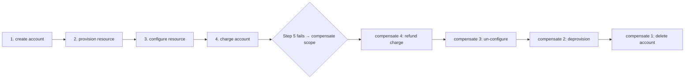

# Effect Compensation

**Version:** 1.0.0
**Status:** Stable
**Layer:** concept

## Overview

The third answer to "a step committed a real effect, and then something downstream went wrong" — the one the recovery stack was missing.

Cronus already had two answers. **State rollback** (crash-recovery) restores prior state, and works only for *internal, reversible* state. **Honest surfacing** (conversation-rewind) reports *externally-committed, irreversible* effects that cannot be un-happened — a sent message, a pushed commit, a provisioned resource — because they have escaped the office's undo boundary. Surfacing is honest, but it leaves the escaped effect *orphaned*: named, and then nothing.

**Compensation** is the missing remediation. An externally-committed effect cannot be technically rolled back — but its *business* effect can often be cancelled by executing a **different, declared, forward action**: refund the payment, deprovision the resource, retract the message. Compensation is not "restore the old state"; it is "do a new thing that undoes what the committed thing meant." It is itself an effect — it performs work, is gated, and **can fail** — and when a scope is torn down, the compensations of its completed steps run in **reverse order of completion**, because effects depend on the effects before them.

This spec owns that contract: a per-step compensating action, run in reverse over the completed steps of a failed scope, honestly accounted when it cannot fully undo.

## Related Specifications

- [l1-conversation-rewind.md](l1-conversation-rewind.md) - RW-5 surfaces irreversible effects it cannot undo; compensation is the remediation path RW-5 lacked — a surfaced effect with a declared compensation MAY be offered for compensation rather than only orphaned (RW-5 v1.1.0 / CO-10).
- [l1-crash-recovery.md](l1-crash-recovery.md) - State rollback (reversible internal state); compensation is its complement for committed external effects, and a crash mid-compensation resumes it (CO-8 idempotence composes CR-9).
- [l1-action-gating.md](l1-action-gating.md) - A compensating action is an effect and passes the same risk-proportional gate as any other (CO-2).
- [l1-work-liveness.md](l1-work-liveness.md) - A scope being compensated is owned and has a next-move path; a stalled compensation is a liveness concern (CO-7).
- [l1-operational-ledger.md](l1-operational-ledger.md) - The append-only record every compensation writes (CO-9).
- [l1-data-lineage.md](l1-data-lineage.md) - Completion order — which effect depended on which — is what makes reverse-order compensation correct (CO-4).
- [l1-directability.md](l1-directability.md) - DIR-9 honest-control: a partially-compensated scope is never presented as cleanly undone (CO-10).
- [../../nodus/specifications/l1-nodus-language.md](../../nodus/specifications/l1-nodus-language.md) - The workflow-side realization: a step declares a compensation, and the runtime runs completed steps' compensations in reverse scope order (NL-22).

## 1. Motivation

A long-running process does real things: it moves money, provisions infrastructure, sends messages, creates records in systems the office does not own. Each of those is a *committed* effect — the instant it succeeds, it is out in the world, past any boundary the office controls. And long-running processes fail: a step three stages later errors, a condition turns out false, the user cancels. Now the process holds a half-finished transaction whose completed steps have already changed the world.

The recovery stack, before this spec, had exactly two moves, and neither undoes a committed effect.

**Rollback restores state, and a committed effect is not state.** Crash-recovery can restore the office's internal, reversible state to a prior snapshot — but the email that was sent is not in the snapshot, and restoring the snapshot does not un-send it. Rollback is the right tool for reversible internal state and structurally the wrong tool for anything that escaped the office; applying it to a committed effect is a category error that *looks* like it worked (the state is back) while the effect is still live.

**Surfacing is honest but inert.** Conversation-rewind faces this squarely: an irreversible effect is *surfaced* — named to the user as "this already escaped" — rather than falsely rolled back. That honesty is essential and this spec preserves it. But surfacing alone leaves the user holding a list of things that happened and no way to unwind them; the office says "I sent the email" and stops. The honest report is the floor, not the remedy.

The remedy is the one the recovery stack did not name: a committed effect usually has a **business inverse** that is itself a forward action. A payment has a refund; a provisioned resource has a deprovision; a sent message has a retraction or correction; a created record has a deletion or a cancelling record. Executing the inverse does not restore the prior state (the ledger now shows a charge *and* a refund, which is correct and auditable) — it **cancels the business meaning** of the committed effect. That is compensation, and it has three properties that make it its own discipline rather than a flavour of rollback.

**Compensation is itself an effect that can fail.** A refund can bounce; a deprovision can error; a retraction can arrive after the message was read. Unlike a state rollback (which either restores the snapshot or does not), a compensation is a new action out in the same unreliable world, and a design that assumes compensation always succeeds recreates the original lie one level up — believing you undid something you did not.

**Order matters, and the correct order is reverse.** When several effects committed in sequence, they usually depend on each other — you provisioned a resource, then configured it; you created an account, then charged it. Undoing them in the order they happened would try to deprovision a still-configured resource, or delete a still-charged account. Compensation runs **last-in-first-out**: the most recently completed effect is compensated first, unwinding the dependency chain the forward execution built. This reverse order is not a convenience; it is a correctness requirement that falls straight out of the fact that later effects were built on earlier ones.

## 2. Constraints & Assumptions

- Compensation is **local-first**: the declaration, the trigger, and the record live on-device; the compensating action itself may reach an external system exactly as the original effect did, under the same egress authorization.
- Compensation governs **committed external effects**, not reversible internal state (that is crash-recovery) and not still-running work (that is cancellation/interruption).
- A "scope" is a declared region within which effects share an all-or-nothing business intent — a transaction, a subprocess, a workflow region. Which region is a per-workflow declaration.
- A compensating action is **effectful and fallible**; nothing here assumes it succeeds.
- Compensation is technology-agnostic: this spec names no transaction protocol, no external API. It constrains *when, in what order, and with what honesty* compensation runs.

## 3. Core Invariants

Rules every Layer 2 implementation MUST NOT violate:

- **CO-1 (Semantic undo, not state rollback — the two are complementary and never conflated):** compensation cancels a committed effect's **business meaning** by executing a **different, declared forward action** (refund, deprovision, retract), not by restoring prior state. State rollback (crash-recovery) is for **reversible internal state**; compensation is for **committed external effects** that rollback structurally cannot reach. Applying rollback to a committed effect is a category error — it restores the state and leaves the effect live — and treating compensation as a form of rollback hides that compensation is itself a new, fallible effect (CO-7).
- **CO-2 (A compensating action is declared with its step and is a first-class effect):** an effectful step MAY declare a **compensating action** that undoes its business effect. That action is an effect in its own right: it performs work, passes the same risk-proportional gate as any effect (action-gating), is observable, and **can fail**. A step that commits an externally-irreversible effect **without** a declared compensation is **honestly un-compensable** — recorded as such, never silently assumed reversible (composing RW-5).
- **CO-3 (Only successfully-completed effects are compensated):** compensation applies to steps whose effect **successfully committed** — never to a step that did not run, is still running, or already failed. You cannot undo what did not happen. A step still in flight is **cancelled/interrupted** (a distinct mechanism), not compensated; a step that never committed has nothing to compensate.
- **CO-4 (Reverse completion order — LIFO):** when a scope is compensated, the compensations of its completed steps run in **reverse order of completion** — the most recently completed is compensated first. This is a **correctness requirement**, not a preference: later effects were typically built on earlier ones (configure-after-provision, charge-after-create), so undoing in forward order would act on a dependency that is not yet removed. Reverse order unwinds the dependency chain the forward execution established. A compensation that runs in forward order, or in an undeclared order, is a defect.
- **CO-5 (Scoped to a declared compensation boundary):** compensation is triggered **within a declared scope** and compensates the completed steps **within that scope only**, not the whole run. The scope is where the all-or-nothing business intent lives; a failure in one scope compensates that scope and MUST NOT reach across into an unrelated scope's committed effects. **Nested scopes compensate inner-then-outer**, each within its own boundary: an inner scope that already compensated on its own failure is not re-compensated when the outer scope later unwinds — an effect is compensated **at most once** (composing CO-8 idempotence), and the completed-effect ledger records that it has been. And **one compensation's failure does not abort the rest**: when a compensating action fails (CO-7), the scope continues compensating its remaining completed steps in reverse order — stopping would strand the effects *below* the failed one, which is strictly worse — and the failed one is carried into the net-effect statement (CO-10) as live-and-uncompensated. Best-effort-continue, then report, is the rule; abort-on-first-compensation-failure is forbidden.
- **CO-6 (Triggered by failure, cancellation, or explicit request — never automatic on success):** compensation fires when a scope **fails**, is **cancelled**, or is **explicitly asked** to compensate. It is the **exception path**, never the default teardown: a scope that completes successfully **keeps** its effects, and running compensation on success would undo exactly the work that succeeded. Compensation is armed by the failure/cancel/request signal, not by ordinary completion.
- **CO-7 (Compensation is bounded, and its own failure is surfaced — never silently swallowed):** a compensating action runs under a declared bound (time/retry), and when it **fails** — the refund bounced, the deprovision errored — the failure is **surfaced as an incomplete compensation**, recorded, and escalated to a human or a recovery path, **never** treated as if the undo succeeded. A failed compensation leaves the business effect **still live**; reporting it as undone is the single worst outcome — it converts a known problem into a hidden one. (Composes work-liveness: a stalled compensation is owned and has a next move.)
- **CO-8 (Idempotent and safe to re-drive):** a compensating action is designed to be **idempotent** — re-running it (after a crash mid-compensation, or a retry) does **not** double-undo: a refund is not issued twice, a resource is not deprovisioned twice. Because compensation can be interrupted and resumed (composing crash-recovery), it MUST be safe to re-drive from any point; a compensation whose second run causes harm is a defect.
- **CO-9 (Recorded, attributed, auditable):** every compensation records **what triggered it**, **which steps were compensated**, **in what order**, and **each outcome** (succeeded / failed / partial), on the append-only trace — so a scope's **net effect** is reconstructable. The ledger correctly shows both the original committed effect and its compensation (a charge and a refund), never erasing the original: compensation is an *added* countervailing effect, not a deletion of history.
- **CO-10 (Honest net-effect accounting — a partially-compensated scope is never presented as cleanly undone):** where a completed effect has **no declared compensation** (CO-2) or its compensation **failed** (CO-7), the scope's teardown produces an **honest net-effect statement**: what committed, what was successfully compensated, and what **remains live and uncompensated**. This composes RW-5 (surface the irreversible): compensation is the remediation path RW-5 lacked, and where remediation is unavailable or fails, RW-5's honest surfacing still holds. Presenting a scope as fully undone when part of its effect remains live is forbidden.

> L2 specs cannot reach RFC status until all invariants here are addressed in their "Invariant Compliance" section.

## 4. Detailed Design

### 4.1 Three answers to a committed-then-failed effect

| Answer | Applies to | Mechanism | Owner |
| --- | --- | --- | --- |
| **State rollback** | Reversible internal state | Restore a prior snapshot | Crash-recovery |
| **Compensation** | Committed external effect *with a declared inverse* | Execute the inverse forward action, reverse order | **This spec** |
| **Honest surfacing** | Committed external effect *with no inverse, or a failed one* | Name what remains live; do not pretend | Conversation-rewind (RW-5), completed by CO-10 |

The three are a ladder, not alternatives: reversible state is rolled back; a committed effect with a compensation is compensated; whatever cannot be compensated (no inverse declared, or the inverse failed) falls through to honest surfacing. The pre-compensation stack had only the top and bottom rungs, so every committed external effect fell all the way to "surfaced and orphaned." Compensation is the middle rung.

### 4.2 Reverse order, and why it is correctness (CO-4)



Undo in reverse (refund → un-configure → deprovision → delete). Undoing forward would try to *delete the account while it is still charged* and *deprovision the resource while it is still configured* — acting on effects whose dependencies are not yet removed. The forward run built a dependency stack; compensation must pop it, not read it bottom-up.

### 4.3 Compensation is fallible — the honest net effect (CO-7 / CO-10)

```text
[REFERENCE]
compensate(scope):
    for step in reverse(completed_effects(scope)):          # CO-4, CO-3
        if step has no declared compensation:
            net.uncompensated += step                        # CO-2 → CO-10
            continue
        outcome := run(step.compensation, bounded, idempotent)   # CO-7, CO-8
        record(step, outcome)                                # CO-9
        if outcome is failed:
            net.failed += step ; escalate(step)              # CO-7
        else:
            net.compensated += step
    report(net: {compensated, failed, uncompensated})        # CO-10 — never "cleanly undone" if failed/uncompensated non-empty
```

The report is the point. A scope teardown does not return "undone" — it returns a **net-effect statement** with three buckets, and only an *empty* failed-and-uncompensated set may be called clean. Everything else is surfaced, because a compensation that failed leaves a real charge un-refunded, and the one unacceptable outcome is the office believing otherwise.

### 4.4 Boundary with neighbouring layers

| Concern | Owner |
| --- | --- |
| Undo a committed external effect by its declared inverse, reverse order | **This spec** |
| Restore reversible internal state to a snapshot | Crash-recovery |
| Report an irreversible effect that cannot be undone | Conversation-rewind RW-5 (CO-10 completes it) |
| Cancel a step still in flight | Cancellation/interruption (CO-3 defers to it) |
| Whether a compensating action is *permitted* | Action-gating (a compensation is an effect) |
| Which effect depended on which (why reverse is correct) | Data lineage |

## 5. Drawbacks & Alternatives

- **Every effect now needs a compensation authored.** Accepted and bounded by honesty: CO-2 does not *require* one — a step without a declared inverse is *honestly un-compensable*, surfaced (CO-10), not silently assumed reversible. The cost is paid only where undo matters.
- **Compensation can fail, leaving a mess.** True, and CO-7/CO-10 make that mess *visible and owned* rather than hidden — which is the whole improvement over pretending. A failed compensation is a known, escalated problem, not a silent live effect.
- **Reverse-order compensation is more machinery than a state restore.** Accepted: it is the machinery the problem actually requires, because committed effects have dependencies a snapshot restore ignores. The alternative (forward order) is simply wrong.
- **Alternative — just roll back state.** Rejected by CO-1: a committed external effect is not in the state, so a rollback restores the state and leaves the effect live — worse than doing nothing, because it looks resolved.
- **Alternative — only surface, never compensate.** Rejected by CO-10/§4.1: surfacing is the honest floor, but leaving every committed effect orphaned when a business inverse exists is a missing remediation, not a design choice.
- **Alternative — assume compensation succeeds and mark the scope clean.** Rejected by CO-7: it recreates the original lie one level up, converting a known un-refunded charge into a hidden one.
- **Alternative — compensate in completion order.** Rejected by CO-4: later effects depend on earlier ones, so forward-order undo acts on unremoved dependencies. Reverse order is a correctness requirement, not a style.

## Canonical References

| Alias | Path | Purpose |
| --- | --- | --- |
| `[REWIND]` | `.design/main/specifications/l1-conversation-rewind.md` | RW-5 surfaces the irreversible; compensation is the remediation path it lacked (RW-5 v1.1.0 / CO-10). |
| `[RECOVERY]` | `.design/main/specifications/l1-crash-recovery.md` | State rollback for reversible internal state — the complement compensation is not. |
| `[GATING]` | `.design/main/specifications/l1-action-gating.md` | A compensating action is an effect and passes the same gate (CO-2). |
| `[LANGUAGE]` | `.design/nodus/specifications/l1-nodus-language.md` | Workflow realization: a step declares a compensation, run reverse-order over a failed scope (NL-22). |

## Document History

| Version | Date | Author | Notes |
| --- | --- | --- | --- |
| 1.0.0 | 2026-07-26 | Core Team | Initial spec — effect compensation as the third answer to a committed-then-failed effect, the middle rung the recovery stack lacked between state rollback (reversible internal state) and honest surfacing (irreversible, orphaned): semantic undo by a declared forward inverse, never a state rollback, the two complementary and never conflated (CO-1); a per-step compensating action that is a first-class fallible effect, a step without one honestly un-compensable rather than assumed reversible (CO-2); only successfully-completed effects compensated, still-running work cancelled not compensated (CO-3); **reverse completion order (LIFO) as a correctness requirement**, since later effects were built on earlier ones (CO-4); scoped to a declared compensation boundary, not reaching across unrelated scopes (CO-5); triggered by failure/cancellation/explicit request, never automatic on success (CO-6); bounded and its own failure surfaced as an incomplete compensation, never swallowed, since a failed compensation leaves the effect live (CO-7); idempotent and safe to re-drive after a crash mid-compensation (CO-8); recorded and auditable with the ledger showing both the effect and its countervailing compensation (CO-9); and an honest net-effect statement so a partially-compensated scope is never presented as cleanly undone, completing RW-5's surfacing with a remediation path (CO-10). Nodus realization = l1-nodus-language NL-22. Concept-only. |
