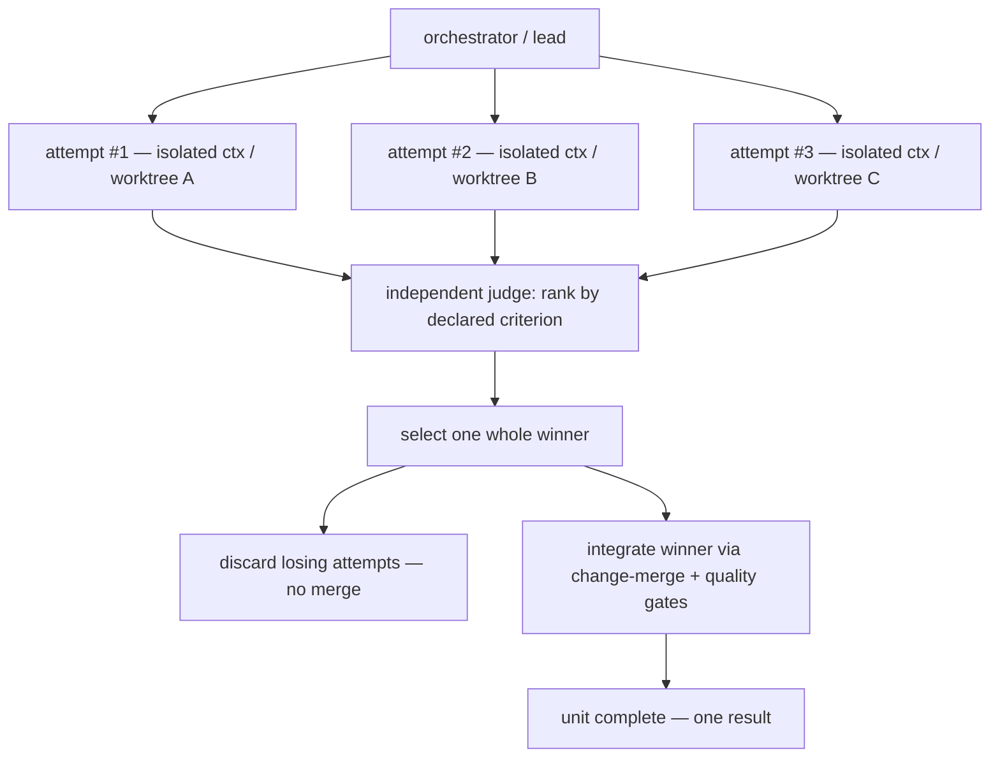

# Competitive Execution

**Version:** 1.1.0
**Status:** Stable
**Layer:** concept

## Overview

Competitive execution is the **best-of-N quality-selection** contract: when a single work unit's outcome quality is genuinely uncertain and the office can afford it, the office runs **several independent, complete attempts at the *same* unit** — each producing a whole candidate result in its own isolated execution context — then an **independent judge selects exactly one winning attempt**, the losing attempts are **discarded (not merged)**, and the winning artifact is **integrated and gated** as the unit's result.

This is the third fan-out mode in the coordination family, distinct from the two that already exist. Parallel staffing fans **disjoint partitions** of one task across same-role instances and **integrates all** of them (throughput on volume). Deliberation fans **perspectives/arguments** about one question and **synthesizes** them into one decision (answer quality via diversity). Competitive execution fans **complete rival solutions** to one whole unit and **keeps exactly one** (outcome quality via selection). The discriminator is what happens at fan-in: *integrate all partial pieces* (staffing), *blend all arguments* (deliberation), or *select one whole winner and drop the rest* (this spec).

## Related Specifications

- [l1-orchestration.md](l1-orchestration.md) — the independent judge (ORC-6), context-isolated execution (ORC-5), budget circuit-breaker (ORC-7), error containment (ORC-11), transparent+intervenable coordination (ORC-12) that competitive execution composes; the decision to run a tournament is a delegation decision.
- [l1-parallel-staffing.md](l1-parallel-staffing.md) — the sibling fan-out that scales **throughput** via disjoint partitions and integrates **all** of them; demarcated in §4.4. Competitive execution deliberately does what PS-2 forbids for throughput — rival attempts at the *same* whole unit — made safe by isolation (CE-3) and select-one-discard-rest (CE-5) so mainline is never double-written.
- [l1-deliberation.md](l1-deliberation.md) — the sibling fan-out that **synthesizes** independent arguments into one decision; competitive execution **selects** one whole artifact instead of blending, and DL-1 independence generalizes to CE-3 attempt isolation.
- [l1-change-merge.md](l1-change-merge.md) — the reviewable typed-delta discipline through which the winning attempt is integrated into mainline (CE-6).
- [l1-quality-standards.md](l1-quality-standards.md) — the definition-of-done gates the **integrated winner** must pass; a judge pick is not completion (CE-6).
- [l1-work-liveness.md](l1-work-liveness.md) — per-attempt exclusive claim (WL-1), single active run (WL-4), stranded-attempt reconciliation (WL-5); the unit-level mechanics each attempt rides on.
- [l1-reproduction-recipe.md](l1-reproduction-recipe.md) — [ADDED v1.1.0] the winner's recipe records the fidelity it was selected at and the fidelity it was produced at (CE-10), so a shipped artifact is never confused with the sketch that won.
- [l1-version-control.md](l1-version-control.md) — the isolated per-attempt working copy (a scratch branch/worktree) that realizes CE-3 so rival attempts never collide on shared files.
- [../../nodus/specifications/l1-nodus-language.md](../../nodus/specifications/l1-nodus-language.md) — NL-13 competitive `~PARALLEL` selection is the nodus-workflow realization of this contract (select one branch result, discard the rest).

## 1. Motivation

Some units have a wide, uncertain solution space where a single attempt is a gamble: an ambiguous design task, a tricky bug whose fix approach is unclear, an exploratory generation where the first draft is rarely the best. The existing stack cannot express "try this several ways and keep the best one." Parallel staffing forbids it — its PS-2 invariant hard-requires disjoint partitions and explicitly bans two workers on one unit (double-work). Deliberation blends arguments but never produces or selects among rival *artifacts*. The `/goal` loop has an independent judge, but only as a **stop condition** for one running attempt, never as a **selector among concurrent rival attempts**.

Left unnamed, an implementation would improvise the tournament unsafely: letting rival attempts write the same files (merge chaos), silently gluing pieces of losers onto the winner (a Frankenstein result no one reviewed), spawning attempts with no width bound until the budget breaks, or declaring the judge's pick "done" without ever gating the integrated artifact. Naming the contract once keeps best-of-N safe, bounded, and honest: **uncertainty, not habit, justifies rival attempts; isolation, not shared state, makes them safe; selection, not blending, resolves them; and the winner is done only when the *integrated* artifact passes the gates.**

## 2. Constraints & Assumptions

- **Rival attempts are expensive.** N complete attempts cost roughly N× a single attempt plus judging; the decision model assumes this is spent only where outcome-quality uncertainty justifies it.
- **Attempts must be genuinely independent.** Selection quality depends on attempts not contaminating each other; a shared mutable context collapses the tournament into one correlated guess.
- **The judge is independent of the attempts.** An attempt cannot judge itself or its rivals; the selector is a separate evaluation act (reusing the ORC-6 judge machinery).
- **The client sees a contest, not hidden retries.** Rival attempts are visible, attributed, and their outcome (winner + discarded losers) is legible (ORC-12), never invisible concurrency.
- **Only one winner reaches mainline.** Losing attempts never partially merge; salvaging an idea from a loser is a separate, explicit, recorded act, not an automatic graft.

## 3. Core Invariants

Rules every Layer 2 implementation MUST NOT violate. They are technology-neutral.

- **CE-1 (Uncertainty-justified, recorded tournament):** one attempt per unit is the default. Running N rival attempts is an explicit scaling decision made by the coordinating side (orchestrator or lead), justified by an **outcome-quality uncertainty** signal — ambiguous/high-stakes/exploratory unit, low confidence, prior single-attempt failure — and recorded with its rationale and width. It is never an unconditional default and never silent.

- **CE-2 (Same whole unit, N complete attempts):** every attempt targets the **same whole unit** and produces a **complete candidate result**, not a fragment. This is the deliberate inverse of parallel staffing (disjoint sub-units, each partial — PS-2) and of deliberation (arguments about a question, not artifacts). A unit whose value comes only from partitioning does not warrant a tournament; a unit with one obvious approach does not either.

- **CE-3 (Isolated, non-interfering attempts):** each attempt runs in its own isolated execution context (ORC-5) with **no shared mutable working state** and **no cross-attempt visibility during generation** — an attempt MUST NOT be influenced by a sibling while producing its result (generalizes DL-1 independence to whole solutions). Where attempts touch shared artifacts, isolation is realized by a per-attempt scratch working copy (branch/worktree) so rival attempts never collide on or corrupt mainline.

- **CE-4 (Independent judged selection, not vote, not blend):** an **independent judge** (ORC-6 judge machinery) selects **exactly one** winning attempt by a **declared criterion** — gates-passed, a score, or a stated preference — after the attempts complete. Selection is not a majority vote (which discards quality — DL rejection) and not a synthesis (which is deliberation's blend); it keeps **one whole attempt as authored**. The criterion, the judge's ranking, and the winner are recorded.

- **CE-5 (Losers discarded, never silently merged):** non-winning attempts are **discarded** — their artifacts are NOT merged, grafted, or partially absorbed into the result. The office MUST NOT assemble a composite from multiple attempts under this contract (that would be an unreviewed blend). Reusing a specific idea from a losing attempt is permitted only as a **separate, explicit, recorded** follow-up act, never an automatic side effect of the tournament.

- **CE-6 (Winner integrated and gated as one whole):** the winning attempt's artifact enters mainline through the normal change-merge discipline (CM) and the unit completes **only when the integrated winner passes its definition-of-done gates** (l1-quality-standards) — never merely because a judge picked it. A judge's selection is a ranking, not a completion.

- **CE-7 (Bounded width, honest afford):** N is bounded by explicit policy — configured maximum width, budget headroom, and a per-attempt bounded budget whose aggregate fits the unit/run budget (ORC-7). Spawning is never unbounded. If the afforded width is below 2, the unit runs as a single serial attempt — the contract never promises a tournament it cannot fund. An attempt MUST NOT itself launch a nested tournament (nested width would silently defeat the bound).

- **CE-8 (Contained failure, honest all-fail):** a failed or stalled attempt is contained at its boundary (ORC-11) and reaped via the stranded-work path (WL-5); other attempts continue undisturbed. A tournament with **at least one** successful attempt still yields a winner among the successful ones. If **every** attempt fails, the unit surfaces as **failed** — an all-fail tournament is never reported as success.

- **CE-9 (Observable, attributed contest):** the decision to run N attempts, each live attempt and its per-attempt cost, the selection criterion, the judge's choice, and the **discarding of the losers** are observable in the office's live projection and recorded in the unit's history (ORC-12). The client can always see that N attempts ran, which won, why, and what was thrown away.

- **CE-10 (Proxy-fidelity selection — select cheap, produce once at full fidelity):** [ADDED v1.1.0] the N attempts MAY be run at a **reduced, declared fidelity** — a smaller model, a lower effort setting, a shorter output, a sketch rather than a finished artifact — used **only to select**, with the winner then **re-produced at full fidelity** before it enters mainline (CE-6). This changes the economics of the tournament decisively: width becomes affordable at N attempts of cheap plus one of full, instead of N of full, which is what makes a contest worth running at all where CE-7's budget headroom would otherwise cap N at one. Reduced fidelity is reduced **detail, never reduced scope**: a proxy attempt is still a *whole* candidate for the whole unit (CE-2), and an attempt covering only part of the unit is parallel staffing rather than a contest. Three further conditions bind it, and each closes a way the saving becomes a lie. **Uniform fidelity across attempts** — a contest whose candidates were produced at different fidelities measures fidelity, not quality, and reliably crowns whichever attempt was allowed to try hardest. **The proxy is validated, not assumed** — a low-fidelity ranking is a hypothesis that it agrees with the full-fidelity ranking, and that agreement is measured periodically against contests decided at full fidelity; a proxy that does not rank alike is broken, and a broken proxy is worse than no tournament because it confidently selects wrongly and costs money to do it. **The proxy is recorded in the result** (CE-9) and in the winner's reproduction recipe, so the artifact that shipped is never confused with the sketch that won. Where the proxy cannot be validated, or its agreement has degraded past a declared bound, the contest reverts to full fidelity and reports that it did.

> L2 specs cannot reach RFC status until all invariants here are addressed in their "Invariant Compliance" section.

## 4. Detailed Design

### 4.1 The tournament decision

```text
[REFERENCE]
consider_tournament(unit):
    if not outcome_quality_uncertain(unit):  return single_attempt   // CE-1 — no tournament by habit
    width := min(policy.max_width,                                    // CE-7 config
                 budget_headroom / per_attempt_budget,
                 desired_diversity(unit))                             // how many distinct approaches are worth trying
    if width < 2:  return single_attempt                             // honest afford
    record_decision(unit, width, rationale)                          // CE-1 — surfaced, ORC-12
    return run_tournament(unit, width)
```

The inputs are signals the office already computes: confidence/uncertainty from intent resolution and prior attempts, budget headroom from the run budget, stakes from the unit's risk classification. The output is a recorded decision, not an invisible runtime mood.

### 4.2 Tournament anatomy



Attempts may be instances of one role trying different approaches, or different roles/model tiers attacking the same unit — diversity of approach is the point (CE-2). They appear in the office projection as distinct, temporary rival attempts on one unit (CE-9), each in its own scratch working copy (CE-3).

### 4.3 Attempt lifecycle

Each attempt is an ordinary work-run under the existing contracts: exclusively claimed (WL-1), single active run (WL-4), liveness-tracked (WL-3), in an isolated context (ORC-5) backed by a scratch branch/worktree (l1-version-control) so no two attempts write the same mainline file. An attempt that dies without a terminal state is stranded work: the reconciliation sweep reaps it (WL-5); the tournament proceeds with the remaining attempts (CE-8). No attempt observes another's work until all have completed and the judge runs.

### 4.4 Fan-in: selection, not integration-of-all

| Concept | Fans out | Over | Fan-in | Purpose |
| --- | --- | --- | --- | --- |
| **This spec — competitive execution** | Rival full attempts | The **same whole unit** | **Select one whole winner; discard the rest** | Outcome quality via selection |
| l1-parallel-staffing | Same-role instances | **Disjoint partitions** of one task | **Integrate all** partitions | Throughput on volume |
| l1-deliberation | Perspectives / arguments | The same **question** | **Synthesize** all arguments into one decision | Answer quality via diversity |
| ORC-2 adaptive topology | Managers / departments | The org hierarchy | — | Coordination span at scale |
| l1-task-graph-model | Sub-units | A requirement / plan | — | Decomposition algebra |

The three fan-out modes are complementary and composable: a single large unit could be *partitioned* (staffing), and one hard partition could itself be run as a *tournament* (competitive execution), whose winner is then *integrated*. What each never does: staffing never selects-and-discards (it keeps every partition), deliberation never produces rival artifacts, and competitive execution never merges losers into the winner (CE-5).

### 4.5 The judge

The selector reuses the independent-judge machinery of ORC-6 (the same guarantee that an autonomous goal is not self-declared done). Here the judge does not answer "is it done?" but "**which of these N complete attempts is best by the declared criterion?**". Criteria, in ascending cost/subjectivity:

1. **Gate-objective** — run each attempt's artifact through the definition-of-done gates; the attempt that passes (or passes with the best measured margin) wins. Cheapest and most trustworthy.
2. **Scored** — a host-supplied metric ranks completed attempts; highest wins.
3. **Judged** — a reasoning judge (a distinct role/session, never one of the attempting agents) reads the rival artifacts and selects with recorded reasoning.

The judge is always **independent of the attempts** (an attempt cannot rank itself or its rivals, CE-4). The selection and its reasoning are appended to the unit history (CE-9); the winner still faces the real gates on integration (CE-6) — the judge's pick is a ranking, not a bypass.

## 5. Implementation Notes

1. **Width policy first** — configuration surface (max width, per-attempt budget share, uncertainty trigger) with conservative defaults; the tournament decision record shape (CE-1).
2. **Isolation wiring** — reuse the existing worktree/scratch-branch mechanism (l1-version-control) for per-attempt isolation; verify no two attempts share a mainline working path (CE-3).
3. **Judge invocation** — reuse the ORC-6 judge with a *selection* prompt over the rival artifacts; default to the gate-objective criterion where gates are automatable (CE-4/§4.5).
4. **Winner integration** — lead-owned change-merge of the single winner + gate invocation; discard (do not merge) the losers, cleaning up their scratch working copies (CE-5/CE-6).
5. **Projection & record** — rival attempts visible in office visualization; per-attempt cost attribution; the selection + discarded set recorded in the unit's history (CE-9).

## 6. Drawbacks & Alternatives

- **N× cost is the headline drawback:** a tournament spends roughly N× a single attempt plus judging. Mitigated by CE-1 (only under recorded uncertainty) and CE-7 (bounded width, honest afford); defaults are conservative. <!-- TBD: default max width and the uncertainty-trigger heuristic (e.g. width 2–3 for high-stakes/ambiguous units) — tune with field data -->
- **Alternative — one attempt, then retry on failure (serial):** cheaper, but retries are correlated (same approach, same blind spot) and add latency serially; a tournament buys *diversity of approach* concurrently. Serial retry remains the right choice for low-uncertainty units — that is the CE-1 default, not this contract.
- **Alternative — blend the best parts of every attempt:** rejected as the fan-in mechanism (CE-5); an automatic composite is an unreviewed graft that no gate saw as a whole and no author owns. Deliberate synthesis of *arguments* is deliberation's job; blending *artifacts* silently is a correctness and provenance hazard. Explicit, recorded salvage of one idea from a loser stays permitted.
- **Alternative — majority vote among attempts:** rejected (CE-4); a vote discards artifact quality exactly as it does in deliberation, and rival full solutions are not ballots.
- **Judge fallibility:** a bad selector picks a worse artifact. Mitigated by preferring the gate-objective criterion (§4.5) where possible and by CE-6 (the winner still faces real gates on integration, catching a mis-selected artifact before it lands).

## Canonical References

| Alias | Path | Purpose |
| --- | --- | --- |
| `[ORCH]` | `.design/main/specifications/l1-orchestration.md` | Independent judge (ORC-6), isolation (ORC-5), budget (ORC-7), containment (ORC-11), transparency (ORC-12) the tournament composes |
| `[STAFFING]` | `.design/main/specifications/l1-parallel-staffing.md` | Sibling throughput fan-out; the PS-2 partition rule this contract deliberately inverts under isolation |
| `[DELIBERATION]` | `.design/main/specifications/l1-deliberation.md` | Sibling synthesis fan-out; select-one vs blend-all demarcation |
| `[MERGE]` | `.design/main/specifications/l1-change-merge.md` | Winner integration discipline (CE-6) |
| `[LIVENESS]` | `.design/main/specifications/l1-work-liveness.md` | Per-attempt claim / single-run / stranded-attempt reaping |

## Document History

| Version | Date | Author | Notes |
| --- | --- | --- | --- |
| 1.1.0 | 2026-07-23 | Core Team | Added CE-10 (proxy-fidelity selection) — the N attempts MAY run at a reduced, **declared** fidelity used only to select, with the winner re-produced at full fidelity before entering mainline (CE-6), changing the tournament's economics from N full attempts to N cheap plus one full and making width affordable where CE-7's budget headroom would otherwise cap N at one. Three binding conditions, each closing a way the saving becomes a lie: **uniform fidelity across attempts** (a contest of unequally-resourced candidates measures fidelity rather than quality and crowns whichever tried hardest); **the proxy is validated, not assumed** (a low-fidelity ranking is a hypothesis of agreement with the full-fidelity ranking, measured periodically against full-fidelity contests — a proxy that does not rank alike is worse than no tournament, since it selects wrongly with confidence and pays for the privilege); and **the proxy is recorded** in the result (CE-9) and in the winner's reproduction recipe so the shipped artifact is never confused with the sketch that won. On unvalidatable or degraded agreement the contest reverts to full fidelity and reports that it did. |
| 1.0.0 | 2026-07-04 | Core Team | Initial concept: best-of-N quality-selection fan-out — N independent complete attempts at the *same* whole unit, each isolated (per-attempt scratch worktree), an independent judge selects exactly one whole winner by a declared criterion (gate-objective / scored / judged), losing attempts discarded never merged, winner integrated + gated as one whole; uncertainty-justified & recorded (CE-1), bounded width & honest afford (CE-7), contained failure & honest all-fail (CE-8), observable & attributed (CE-9); the third coordination-family fan-out mode beside parallel-staffing (throughput, integrate-all) and deliberation (synthesis, blend-all). Nodus realization: l1-nodus-language NL-13 competitive `~PARALLEL` selection. |
