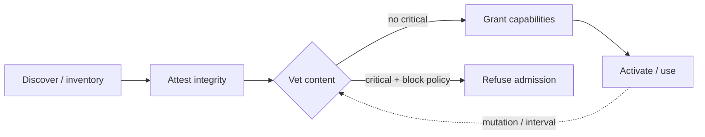

# Agent-Component Threat Scanning (Admission Vetting)

**Version:** 1.0.0
**Status:** Stable
**Layer:** concept

## Overview

An agent office admits third-party **components** — skills, tool-servers, plugins, tool-sets, and imported workflow bundles — into the boundary where their instructions, tool descriptions, and resources can influence agent decisions. Integrity (did it arrive as its author shipped it?) and capability grants (what may it do once trusted?) are already governed elsewhere. This spec governs the missing question: **is the content itself safe to admit?** — the discipline of statically vetting a component for *embedded adversarial content* before it crosses the trust boundary.

The threat is supply-chain in shape: a component that a user installed in good faith can carry hidden instructions, poisoned tool descriptions, obfuscated payloads, hardcoded secrets, or a capability composition that lets the agent be turned against its own user. Scanning turns "we trusted it because of where it came from" into "we vetted what it actually says and does."

## Related Specifications

- [l1-extensions.md](l1-extensions.md) — the component lifecycle (EXT-2 `discover → grant-permission → activate`); this spec adds a **vetting gate** between discovery and activation, alongside the capability-grant gate (EXT-3) and the integrity gate (EXT-11).
- [l1-attestation.md](l1-attestation.md) — integrity/authorship of an artifact; CS-3 makes explicit that attestation and content-vetting are **orthogonal and both required**.
- [l1-context-provenance.md](l1-context-provenance.md) — the *runtime* trusted-composition defense against injection; scanning is its *admission-time static* complement.
- [l1-interception-model.md](l1-interception-model.md) — the runtime observe/decide/transform seam; a critical finding here feeds a **decide-class** admission gate (INT-1/INT-3 fail-closed).
- [l1-security.md](l1-security.md) — the security invariants (default-deny, egress gate) this discipline composes with.
- [l1-tool-composition.md](l1-tool-composition.md) — the admitted tool set over which CS-6 cross-component flow analysis reasons.
- [l1-diagnostic-log.md](l1-diagnostic-log.md), [l1-error-reporting.md](l1-error-reporting.md) — the consent-gated, secret-scrubbed egress discipline CS-9 reuses for the scanner's own channel.

## 1. Motivation

An agent's power comes from the components it loads, and every loaded component is an entry for that power to be redirected. The dangerous cases are not exotic:

- A tool description that reads innocuously to a human but embeds instructions the model obeys (instruction-poisoning) — invisible in a UI, decisive in a prompt.
- One component's content referencing and overriding another's identity, poisoning a tool the user *does* trust (shadowing).
- Content deliberately obscured so the rendered-to-human view differs from the model-processed view (zero-width, bidi, or tag Unicode) — smuggling instructions past review.
- A skill body carrying an exfiltration/RCE snippet, a suspicious download URL, or a hardcoded credential.
- A component that fetches its real instructions from a remote URL at use-time, so its vetted-at-install content is not the content that runs.
- A *set* of individually-benign components that together give the agent untrusted input, private data, and an outbound channel — the composition, not any one member, is the vulnerability.

None of these is caught by "is it signed?" or "what permissions did we grant?". They require reading the content with an adversary's eye, before it is admitted. This spec makes that a first-class, taxonomized, repeatable discipline rather than an ad-hoc review.

## 2. Constraints & Assumptions

- Scanning is a **security-analysis** discipline, not a correctness or quality gate; a clean scan is a *no-known-embedded-threat* verdict, never a proof of safety.
- Detection is heuristic and evolving; the discipline must degrade honestly (a class it cannot yet judge is reported as *unassessed*, never silently as *clean*).
- The scanner is host/stack-agnostic here (L1). Concrete detectors, severity thresholds, and the verification backend are implementation concerns.
- The scanner is a privileged reader of exactly the secrets it protects; its own channel must not become the leak (CS-9).
- Components differ in whether their surface is knowable statically: a declarative manifest is readable at rest; a stdio tool-server may only reveal its tools by being executed (CS-7).

## 3. Core Invariants

Rules every Layer-2 realization MUST NOT violate. Findings use a fixed severity scale `info < low < medium < high < critical`.

- **CS-1 Inventory precedes trust**: you cannot vet what you have not enumerated. The system maintains a discovered inventory of every admittable component across every configuration **scope** — machine/system, user, project/workspace, and bundled-in-another-extension — before any admission decision. An un-inventoried component is treated as *un-admitted*, not as *absent-and-safe*; discovery completeness is itself a security property.

- **CS-2 Admission-time static vetting**: a component is classified for embedded threat content **before** it is admitted into the agent's trust boundary — before its instructions, tool descriptions, or resources can influence any agent decision. Vetting is a distinct gate in the component lifecycle (between discover and activate), orthogonal to and additional to the capability-grant gate and the integrity gate. Admission without a vetting verdict is a policy violation, not a default.

- **CS-3 Content-threat, not integrity**: vetting judges the *intent of the content*, which is independent of its authenticity. An authentically-signed, unmodified component can still be malicious, and a benign component can arrive tampered — so integrity attestation and content vetting are **separate checks, both required**. Attestation answers "is this what its author shipped?"; vetting answers "is what its author shipped safe to admit?".

- **CS-4 Closed, severity-graded finding taxonomy**: every vetting result is a **finding** drawn from a stable, documented catalog. Each finding carries a stable code, a severity on the fixed scale, the component-class it applies to, a confidence, and a human-readable **evidence excerpt** locating it in the content. Findings are comparable, filterable, and diffable across scans and machines; free-form prose is not a finding. A finding is *data* (like an audit event or a reward), never itself an action.

- **CS-5 Threat-class coverage**: the taxonomy spans the known embedded-threat families, each with a defined detection contract (§4.2):
  1. **Instruction-poisoning** — adversarial instructions hidden in natural-language content (a tool description, a skill body) that fall outside the component's stated purpose.
  2. **Cross-component interference (shadowing)** — one component's content naming, referencing, or overriding another component's tools or identity.
  3. **Obfuscation** — content where the human-rendered view differs from the model-processed view (hidden/zero-width/bidi/tag characters); the hidden payload is **decoded and surfaced as evidence**, and severity escalates with the strength of intent (multiple hidden-character classes, a successfully decoded hidden message).
  4. **Malicious payloads** — embedded exfiltration, backdoor, remote-code-execution, or credential-theft patterns, and suspicious download URLs (typosquats, shorteners, untrusted binaries).
  5. **Secret mishandling** — hardcoded secrets in the content, or instructions that require the agent to emit secret values verbatim.
  6. **Unpinnable dependency** — content that fetches instructions or code from an external source at use-time, so the vetted content is not the content that runs (CS-10).
  The set is extensible; a class the scanner cannot yet judge is reported as *unassessed*, never omitted silently.

- **CS-6 Cross-component flow analysis**: risk is assessed over the **admitted set**, not only per component. A set of individually-benign components composes a dangerous capability when it simultaneously affords **(i)** exposure to untrusted content, **(ii)** access to private/sensitive data, and **(iii)** an external-egress channel — the three-leg *toxic flow*. Vetting flags the composed flow and **attributes which component supplies each leg**, even when no single component is itself flagged. The composition is the vulnerability; per-component cleanliness does not clear it.

- **CS-7 Execution-dependent vetting is consent-gated and sandboxed**: when a component reveals its true surface only by being executed (a tool-server whose tools are learned by running it), **executing it to vet it is itself an effect**. It MUST require explicit, informed, **per-component** consent that shows the exact command, arguments, and secret-redacted environment that will run; default to **deny** on ambiguity, timeout, or end-of-input; record a declined component as *declined — never executed*; and SHOULD run inside a disposable sandbox. Non-interactive/batch execution requires an explicit, named dangerous override — it is never the silent default.

- **CS-8 Advisory by default, gating on critical**: vetting produces a report for a human or an admission policy to act on; it does not silently mutate or quarantine a component on a mere warning. But a **critical** finding — a confirmed embedded attack — recommends fail-closed refusal of admission, and the admission policy MAY hard-block on it. Each finding's disposition (surface / require-approval / block, and strip-from-model-view vs deny-admission) is **explicit**, never implicit. Warnings surface; criticals gate.

- **CS-9 Data-safety of the vetting channel**: the scanner reads exactly the secrets it exists to protect and MUST NOT leak them. Any content that leaves the machine — to a verification service, an issue-report bundle, or telemetry — is first run through **secret redaction** (environment values, argument values, request headers, URL query parameters, and high-entropy/keyworded secrets embedded in natural-language content) and path scrubbing; a finding's evidence never echoes a raw secret value; and egress is **consent-gated and never silent**. Declining a component's execution still permits reporting only a non-behavioral verdict, clearly labeled as not derived from local execution.

- **CS-10 Continuous re-vetting; mutable dependencies flagged**: the component supply chain drifts. Components auto-update, and CS-5(6) unpinnable dependencies can change behavior after admission with no local change — so a single admission-time pass is insufficient. Vetting is **periodic and re-triggered on change**: an admitted component's later mutation re-opens its verdict, and a component that can silently fetch new instructions or code at use-time is flagged as **unpinnable** — its admission verdict cannot be made durable, and that fact is itself a finding.

## 4. Detailed Design

### 4.1 The vetting gate in the component lifecycle

Scanning inserts one gate into the existing lifecycle; it does not replace the integrity or capability gates but runs alongside them.



Ordering is deliberate: **attest, then vet, then grant**. Attestation first, so vetting reasons over authenticated bytes; vetting before grant, so a component the office is about to trust with capabilities has already been read for embedded threats. The dashed edge is CS-10: activation does not close the loop — a later change reopens vetting.

### 4.2 Threat taxonomy (finding families)

| Family | Applies to | What it detects | Typical severity |
| --- | --- | --- | --- |
| Instruction-poisoning | tool descriptions, skill bodies | hidden/deceptive instructions outside stated purpose | high–critical |
| Suspicious-signal | any natural-language content | vocabulary associated with injection ("ignore", "override", "urgent") — a signal to investigate, not a verdict | low |
| Shadowing | multi-component sets | one component's content referencing/overriding another's tools | high |
| Obfuscation | any content | rendered-view ≠ model-view (zero-width/bidi/tag Unicode); hidden payload decoded as evidence | medium–high |
| Malicious-payload | skill bodies, resources | exfiltration/backdoor/RCE/credential-theft patterns, suspicious download URLs | critical |
| Secret-exposure | any content | hardcoded secrets; instructions to emit secrets verbatim | high |
| Sensitive-surface | tool/component purpose | integrates private data (comms, finance, credentials, workspace) into context — a toxic-flow leg (CS-6) | medium |
| Destructive-surface | tool/component purpose | can run arbitrary commands or make irreversible changes — a toxic-flow leg (CS-6) | medium |
| Unpinnable-dependency | any component | fetches instructions/code from a remote source at use-time | high |

The catalog is the authoritative registry; a realization that emits a code absent here must first amend this spec (mirrors the extension-taxonomy discipline).

### 4.3 Toxic-flow composition (CS-6)

A toxic flow is present when the admitted set covers all three legs at once:

```text
[REFERENCE]
untrusted_input_leg  := a component that ingests unverified third-party content
private_data_leg     := a component that surfaces sensitive/private data into context
egress_leg           := a component (or ambient tool, e.g. a network fetch) that can send data out
toxic_flow(set)      := untrusted_input_leg(set) AND private_data_leg(set) AND egress_leg(set)
```

Because most agents have an ambient egress leg (a network tool) by default, vetting concentrates on flagging the *untrusted-input* and *private-data* legs and reports the composition with per-leg attribution. The finding names the specific components supplying each leg so a human can break the flow by removing or de-scoping one of them.

### 4.4 Consent flow for execution-dependent vetting (CS-7)

```text
[REFERENCE]
plan  := enumerate every component whose vetting requires execution      // full plan shown first
for each planned execution:
    show(name, exact command, args, env-with-values-redacted, config source)
    decision := prompt_default_deny()          // empty / EOF / timeout / ambiguity -> deny
    if decision != allow:
        record(name, DECLINED_NEVER_EXECUTED)   // may still report a non-behavioral verdict, labeled
        continue
    run_in_sandbox_if_available(name)
batch_mode: requires an explicit named dangerous-override to auto-allow all   // never silent
```

The consent surface is diagnostic chrome, kept separate from the machine-readable scan output so that automation consuming findings is never contaminated by prompt text.

### 4.5 Report shape

A scan yields a structured, machine-readable result plus a human rendering (the two are one canonical record projected to two audiences, per the log-legibility discipline): the inventory (what was found, at which scope), per-component findings (code, severity, confidence, evidence excerpt, disposition), cross-component flow findings with attribution, and an execution ledger (which components ran, which were declined). Findings sort by severity; the top-severity findings gate, the rest surface.

## 5. Drawbacks & Alternatives

**Alternative: rely on attestation alone.** Rejected by CS-3 — a signature proves origin, not benignity; an authentic component can be malicious.

**Alternative: rely on runtime interception alone.** Rejected — runtime provenance/authorization (context-provenance, interception-model) is essential but reactive; admission-time vetting removes a class of threats before the agent can ever act on them, and catches static-only signals (obfuscation, hardcoded secrets) cheaply.

**Alternative: block on any warning.** Rejected by CS-8 — over-blocking trains users to disable scanning; only confirmed criticals gate, warnings surface for judgment.

**Risk: false confidence.** A clean scan is bounded by the detectors of the day (CS-2 assumption). The honest-degradation rule (CS-5 *unassessed*) and continuous re-vetting (CS-10) bound but do not eliminate this.

## Canonical References

| Alias | Path | Purpose |
| --- | --- | --- |
| `[LIFECYCLE]` | `.design/main/specifications/l1-extensions.md` | The component lifecycle (EXT-2) the vetting gate (CS-2) inserts into |
| `[ATTEST]` | `.design/main/specifications/l1-attestation.md` | The integrity contract CS-3 pairs with content vetting |
| `[PROVENANCE]` | `.design/main/specifications/l1-context-provenance.md` | The runtime injection defense this discipline complements at admission time |
| `[NODUS]` | `.design/nodus/specifications/l1-nodus-portability.md` | The host-neutral realization of this contract for imported workflow bundles (LP-12) |

## Document History

| Version | Date | Author | Notes |
| --- | --- | --- | --- |
| 1.0.0 | 2026-07-09 | Core Team | Initial stable spec — agent-component threat scanning / admission vetting: inventory-precedes-trust (CS-1), admission-time static vetting gate (CS-2), content-threat-≠-integrity (CS-3), closed severity-graded finding taxonomy (CS-4), threat-class coverage incl. instruction-poisoning/shadowing/obfuscation/malicious-payload/secret-mishandling/unpinnable-dependency (CS-5), cross-component toxic-flow composition with per-leg attribution (CS-6), consent-gated sandboxed execution-dependent vetting (CS-7), advisory-by-default/gating-on-critical (CS-8), data-safety of the vetting channel (CS-9), continuous re-vetting + unpinnable-dependency flag (CS-10). Composes l1-extensions / l1-attestation / l1-context-provenance / l1-interception-model / l1-security. Distilled from an adoption pass over an external agent-component supply-chain security-scanner reference. |
