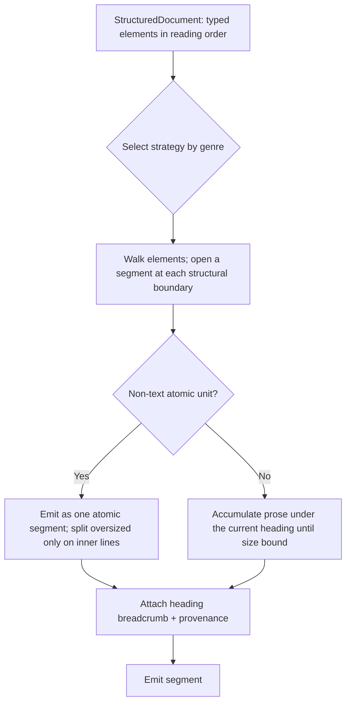
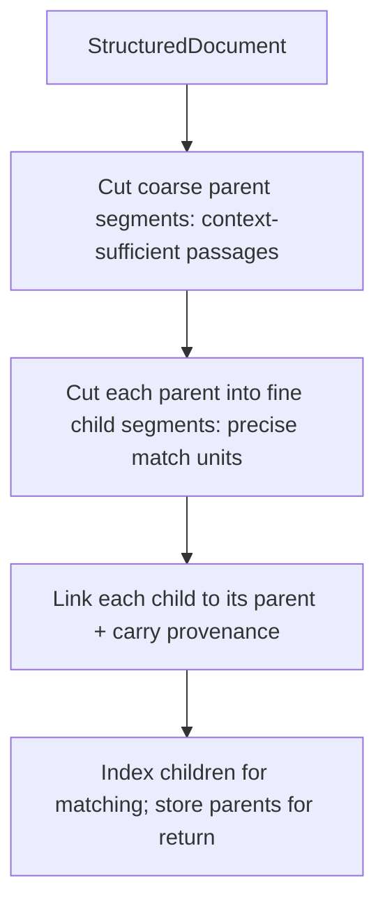

# Content Segmentation

**Version:** 1.1.0
**Status:** Stable
**Layer:** concept

## Overview

Cutting an understood document into the retrieval units (segments/chunks) that get embedded, indexed, and returned as grounded context. Segmentation quality is the second-largest lever on retrieval quality after understanding fidelity: cut on the wrong boundary and a retrieved fragment is a half-sentence stripped of its heading, a table sliced through a row, or a paragraph fused with an unrelated neighbour. This concept replaces naïve fixed-window slicing with *structure-aware* segmentation — boundaries follow the document's own structure, each segment carries the heading breadcrumb that locates it, non-text units stay atomic, and the strategy adapts to document genre. The result: retrieved fragments that read in context, cite precisely, and re-index incrementally.

## Related Specifications

- [l1-document-understanding.md](l1-document-understanding.md) - Supplies the typed, ordered, provenance-carrying elements that segmentation cuts on.
- [l1-knowledge-base.md](l1-knowledge-base.md) - The knowledge base consumes this as its chunking stage (KB-13); "chunk with overlap" is the degraded fallback for this contract.
- [l1-hierarchical-summarization.md](l1-hierarchical-summarization.md) - Segments are the leaf inputs to the summary tree.
- [l1-knowledge-graph.md](l1-knowledge-graph.md) - Segments are the extraction units for entity/relation grounding.
- [l1-claim-verification.md](l1-claim-verification.md) - A claim is verified against the source span a segment preserves; segmentation must keep that span citable.
- [l1-context-provenance.md](l1-context-provenance.md) - Segments inherit and forward the positional provenance of their source elements.

## 1. Motivation

An agent reasons from retrieved segments, so the segment is the true unit of knowledge — and a badly-cut segment poisons every answer built on it. Fixed-window chunking (every N tokens, fixed overlap) is popular because it is trivial, but it is blind to meaning: it splits mid-sentence, severs a heading from its section, and cuts tables through rows. Structure-aware segmentation instead uses the boundaries a reader would use — section breaks, list items, slide edges, table rows — surfaced by document understanding, and attaches to each segment the outline path that gives it context. It keeps a table or a figure whole. It picks a strategy suited to the genre — a slide deck, a spreadsheet, a Q&A log, and a long manual want different cuts. And because the cut is a transparent, deterministic function of structure, boundaries are inspectable, adjustable, and idempotent for cheap incremental re-indexing.

## 2. Constraints & Assumptions

- Segmentation optimizes *retrievability*; it never replaces the source, which remains preserved and reconstructable in full.
- A segment must stay within the embedding/retrieval size budget while respecting structure — the two goals are reconciled by cutting on the nearest structural boundary, splitting oversized structures on inner structural lines only.
- Boundaries are a transparent, correctable decision — segmentation is never an opaque black box.
- This concept decides *where to cut and what context to attach*; it does not embed, rank, or answer.

## 3. Core Invariants

Rules every Layer 2 implementation MUST NOT violate:

- **SEG-1 (Structure-respecting boundaries):** segments are cut on the document's own structural/semantic boundaries (headings, sections, list items, slide edges, table rows) surfaced by understanding — never on a fixed offset that splits mid-sentence or mid-structure. Fixed-window cutting is the last-resort fallback for unstructured runs, not the default.
- **SEG-2 (Hierarchy-preserving breadcrumb):** a segment carries the heading/section path that locates it in the document outline, so a retrieved fragment reads with its structural context instead of as an orphaned span. The breadcrumb travels with the segment into the index.
- **SEG-3 (Atomic non-text units):** a table, a figure-with-caption, a code block, or an equation is one atomic segment — never split across a boundary. A structure too large to fit is split only on its own inner lines (table rows, list items) with header/context preserved on each part, never mid-cell.
- **SEG-4 (Type-aware strategy):** the segmentation strategy is selected by document genre (prose, slides, spreadsheet, Q&A, structured records, long-form manual/book); one strategy does not fit all. The chosen strategy is recorded with the result so a reader knows how the document was cut.
- **SEG-5 (Bounded size, structural overlap):** each segment respects a size bound sized for the retrieval/embedding budget; where cross-segment continuity matters, overlap is added on structural lines (a repeated heading, a trailing sentence) — not arbitrary token windows.
- **SEG-6 (Provenance preservation):** every segment inherits the positional provenance of the source elements it covers (composing DU-2), so it cites its exact origin and any claim grounded on it traces back to a page/region. A segment that cannot locate its source is invalid.
- **SEG-7 (Explainable & adjustable):** the segmentation is inspectable — a human can see where each boundary fell and why — and boundaries are adjustable. A corrected boundary re-segments only the affected document. Segmentation is a transparent, correctable decision.
- **SEG-8 (Deterministic & idempotent):** same input + same strategy → identical segments; re-segmenting an unchanged document yields identical segments, so incremental re-index touches only genuinely-changed documents (composing KB-3 incremental indexing).
- **SEG-9 (Non-lossy to source):** a segment is a retrieval *view*, never a replacement — the full source is always preserved and reconstructable, and the union of a document's segments loses no retrievable content that structure-aware cutting was meant to keep.
- **SEG-10 (Multi-granularity linked segments):** a document MAY be segmented at two coupled granularities at once — fine **child** segments (small, precise **match** units) each linked to a coarse **parent** segment (a larger, context-sufficient **return** unit that contains the child). Retrieval then decouples the two: it **matches on the child** (small units embed and rank more precisely) but **returns the parent** for the injected context (the surrounding passage a small match alone lacks) — the "small-to-big" discipline, composing the knowledge base's fused retrieval (KB-15) as an opt-in expansion of a matched hit. This resolves the precision-versus-context tension a single granularity cannot: large-only chunks match imprecisely (the query signal is diluted across a big passage), small-only chunks match well but arrive context-starved. The child→parent link is explicit and provenance-preserving (the returned parent still carries the matched child's origin, SEG-6), the parent is bounded like any segment (SEG-5), and plain single-granularity segmentation (no parent link) remains the default — multi-granularity is opt-in and additive, changing nothing for a collection that does not use it.

> L2 specs cannot reach RFC status until all invariants here are addressed in their "Invariant Compliance" section.

## 4. Detailed Design

### 4.1 Segment Shape

```text
Segment {
  text        : string             // model-legible content of this unit
  breadcrumb  : string[]           // SEG-2 heading path, e.g. ["Ch.3", "3.2 Limits"]
  kind        : "prose" | "table" | "figure" | "list" | "code" | "record"
  strategy    : StrategyId         // SEG-4 which strategy produced this segment
  origin      : SourceLocation[]   // SEG-6 provenance of covered source elements
  size        : int                // token/char measure against the budget (SEG-5)
  parent      : SegmentId?         // SEG-10 coarse return-unit this child expands to (optional)
}
```

### 4.2 Structure-Aware Cut



### 4.3 Strategy Family (illustrative, extensible)

| Genre | Boundary signal | Notable rule |
| --- | --- | --- |
| Long-form prose (manual, book) | Heading hierarchy | Breadcrumb of the full heading path; overlap on section lines. |
| Slides | Slide edge | One slide (title + body) per segment. |
| Spreadsheet / records | Row / logical record | Header row repeated onto each segment for context. |
| Q&A / dialogue | Question–answer pair | The pair stays together as one unit. |
| Unstructured run | (none) | SEG-1 fallback: bounded window with sentence-aligned edges. |

The family is open: a new genre is a new strategy behind the same `Segment` contract, changing no downstream stage.

### 4.4 Breadcrumb as Retrieval Context

The heading breadcrumb (SEG-2) is what lets a fragment retrieved from deep inside a document still be legible: "3.2 Rate Limits › Burst behaviour" prefixed to the body tells both the ranker and the reading model *what this fragment is about* without loading the whole document. It is the cheapest, highest-leverage piece of context a segment can carry, and it is derived for free from the structure understanding already produced.

### 4.5 Multi-Granularity Retrieval (SEG-10)

A single chunk size forces a bad trade. Make chunks large and they carry context but match imprecisely — the query's signal is diluted across a big passage. Make them small and they match precisely but arrive without the surrounding context a reader (or model) needs to use them. Parent-child segmentation refuses the trade by producing both at once:



At retrieval the fine children are the match surface (embedded and ranked, KB-15), but a matched child is **expanded to its parent** before the context is returned — small-to-big: match small for precision, return large for sufficiency. The returned parent still carries the child's match provenance (SEG-6), so a claim grounded on the returned passage still traces to the exact span that matched. Single-granularity segmentation stays the default; the parent link is opt-in and changes nothing for a collection that does not use it.

## 5. Nodus Realization

A segmentation strategy is expressed as a bounded transform in the workflow language — a walk over the typed element stream emitting segments — with the per-genre strategy selected by an ordinary branch and the size bound an explicit constraint. The model-facing pieces (if any, e.g. a semantic-boundary judgement) are host-supplied provider calls. It introduces no new language primitive; it is a bounded, deterministic transform the language already expresses.

## 6. Drawbacks & Alternatives

- **Fixed-window chunking:** trivial and genre-blind; retained only as the SEG-1 fallback for unstructured runs. Its cost is exactly the low retrieval fidelity this concept exists to fix.
- **One universal strategy:** simpler than a strategy family but under-serves every genre it was not tuned for; rejected in favour of type-aware selection (SEG-4).
- **Semantic-only segmentation (model decides every boundary):** high quality but costly and non-deterministic; usable as an optional refinement over structural cuts, never as the deterministic baseline (would violate SEG-8).

## Canonical References

| Alias | Path | Purpose |
| --- | --- | --- |
| `[DU]` | `.design/main/specifications/l1-document-understanding.md` | Upstream contract supplying the typed elements this stage cuts on. |
| `[KB]` | `.design/main/specifications/l1-knowledge-base.md` | The consumer (KB-13); defines chunk storage and retrieval. |
| `[STORE]` | `.design/main/specifications/l2-knowledge-store.md` | Concrete chunk schema and indexing this strategy feeds. |

## Document History

| Version | Date | Author | Notes |
| --- | --- | --- | --- |
| 1.1.0 | 2026-07-22 | Core Team | Added SEG-10 (multi-granularity linked segments) — a document MAY be cut at two coupled granularities: fine child match-units each linked to a coarse parent return-unit, so retrieval matches on the small child (precise ranking) but returns the large parent (sufficient context) — "small-to-big", resolving the precision-vs-context tension a single granularity cannot; child→parent link is explicit and provenance-preserving (SEG-6), parent bounded (SEG-5), single-granularity remains the default (opt-in, additive). Segment shape gains an optional `parent` link; §4.5 added. Mined from a studied LLM-app/workflow platform's parent-child (small-to-big) retrieval. |
| 1.0.0 | 2026-07-22 | Core Team | Initial spec — structure-aware segmentation replacing naïve fixed-window chunking: boundaries follow document structure, heading breadcrumbs travel with each segment, non-text units stay atomic, per-genre strategy family, structural overlap, preserved provenance, explainable/adjustable and deterministic/idempotent boundaries (SEG-1…SEG-9). Mined from a studied retrieval/document-intelligence engine's template-based/hierarchical chunking; retrieval-fidelity-improving and source-faithful. Concept-only. |
