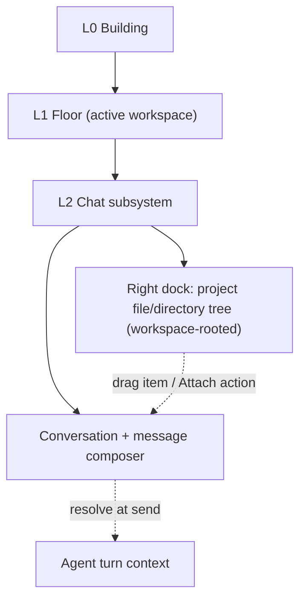
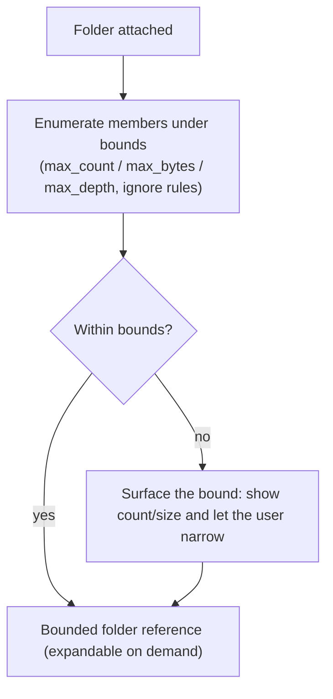
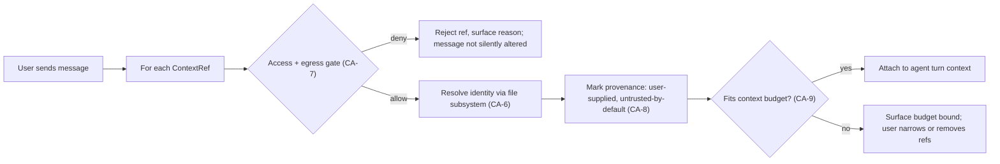

# Context Attachment

**Version:** 1.0.0
**Status:** Stable
**Layer:** concept

## Overview

The mechanism by which a user attaches **context references** to an outgoing message in the Chat surface. The active floor's project file/directory tree is browsable in a side panel of the chat window; the user attaches files or folders (and other addressable items) as explicit context for the agent — primarily by **dragging** a tree item into the message composer, with equivalent non-drag affordances.

An attachment is a **reference** (identity + kind + scope), not an inline copy: it is resolved to content only at send time, through the file subsystem's ingestion/identity path and the security/egress gate, and it enters the agent's turn as provenance-marked, budget-aware context. A folder attaches as a **bounded, expandable** reference rather than an unbounded content dump.

This spec owns *what attaching context is and the invariants it obeys*. It does **not** own file storage (that is file management), the panel's placement in the workbench (application shell + navigation model), or how the model's context window is budgeted once content is attached (context management). It composes all four.

## Related Specifications

- [l1-file-management.md](l1-file-management.md) — the authoritative file subsystem: explicit ingestion (FM-1), content-addressed identity (FM-2), access control (FM-4). An attachment that resolves to ingested content goes through this path (CA-6).
- [l1-navigation-model.md](l1-navigation-model.md) — the Chat subsystem that hosts the tree panel; the panel is a subsystem-internal companion surface permitted by recursive sub-navigation (NV-10) and rooted at the active floor's workspace (NV-8/NV-9).
- [l1-application-shell.md](l1-application-shell.md) — the workbench that composes the tree panel as a right-edge dock/panel (AS-9) and any file picker as a delegated selection surface (AS-10).
- [l2-context-management.md](l2-context-management.md) — the context-window budget that attached references participate in (CA-9); attachments are high-priority but not unbounded.
- [l1-context-provenance.md](l1-context-provenance.md) — attached user-supplied content enters as untrusted-by-default, provenance-marked context (CP-1/CP-2) per CA-8.
- [l1-security.md](l1-security.md) — resolving an attachment to content passes the same access/egress boundary as any file access (CA-7); secrets are never attached silently.
- [l1-storage-model.md](l1-storage-model.md) — the workspace root a project floor binds on disk vs the state-tier home the default floor uses; the tree is scoped to that root (CA-2).

## 1. Motivation

A user grounding a request in specific project material should not have to paste file paths or copy-and-paste file contents into the message. A browsable tree plus drag-to-attach turns "use these files as context" into direct manipulation: point at the material, drop it into the composer, send.

Without a modeled mechanism three failures recur:

1. **Reinvented attach flows.** Each surface (chat, notes, research) grows its own ad-hoc way to reference a file, so behavior, provenance, and access handling diverge.
2. **Unbounded folder dumps.** "Attach this folder" naively expands to every file recursively, blowing the context-window budget and silently truncating the real message.
3. **Gate bypass.** A file that becomes context by a side path skips the access/egress boundary that a normal file read would pass — an exfiltration and secret-leak risk.

Naming the mechanism once — reference-not-copy, workspace-scoped tree, bounded folders, ingestion through the file subsystem, security-gated resolution, provenance-marked and budget-aware entry — makes every attach surface correct by construction.

## 2. Constraints & Assumptions

- **Technology-agnostic (Layer 1).** No UI toolkit, drag API, or stack is named. The concrete panel (a right dock in the Chat subsystem) and drag mechanics are Layer 2 concerns realized per application shell and navigation model.
- **Workspace-scoped tree.** The tree is rooted at the active floor's workspace root and never traverses outside it: a project floor roots at its bound disk folder; the home floor roots at its state-tier home (per navigation model NV-8/NV-9 and storage model).
- **Reference, not copy.** The composer holds typed references; content is resolved at send time. A reference that can no longer be resolved (moved/deleted file) surfaces as a broken attachment, not silent omission.
- **No implicit attachment.** Browsing, hovering, or opening a tree item never attaches it. Attachment is always an explicit user act (CA-4).
- **Security is not bypassed.** Attaching is subject to the same access-control and egress policy as any file access; secrets and out-of-policy paths are never attached silently (CA-7).
- **Bounded by default.** Folder attachment is bounded (count/size/depth, honoring ignore rules); the mechanism never emits an unbounded recursive dump (CA-5).

## 3. Core Invariants

Rules every Layer 2 implementation MUST NOT violate:

- **CA-1 (Context reference, not inline copy):** an attachment is a typed **reference** — a file, a folder, or another addressable item kind — carrying stable identity plus scope, resolved to content only at send time. The composer holds references and never silently inlines content it cannot re-resolve.
- **CA-2 (Workspace-scoped browsable tree):** the attachment surface presents the active floor's file/directory tree rooted at that floor's workspace root; traversal never escapes the root. The tree reflects the live on-disk (or state-tier) contents, not a stale snapshot older than the subsystem's refresh cycle.
- **CA-3 (Direct-manipulation attach with affordance parity):** dragging a tree item into the message composer attaches it as context; **every** drag affordance has a non-drag equivalent (context-menu "Attach", keyboard action, or a delegated picker / @-reference) so the capability is fully reachable without a pointing device.
- **CA-4 (Explicit and reversible):** attachment is an explicit user act. Attached references appear as visible, individually removable markers in the composer before the message is sent; nothing is attached from mere browsing, and any attachment can be removed before send.
- **CA-5 (Bounded folder attachment):** attaching a folder attaches a **bounded, expandable** reference to its member files under explicit limits (max count, total size, depth) and honoring ignore rules; exceeding a limit surfaces the bound to the user, never a silent unbounded dump.
- **CA-6 (Identity through the file subsystem):** when an attached reference resolves to content that enters the system, it does so through the file subsystem's explicit-ingestion and content-addressed identity path (FM-1/FM-2) — never a side channel. An in-workspace file already on disk MAY be referenced by stable path without re-upload; content dropped from outside the workspace ingests as an upload.
- **CA-7 (Security and egress gating):** resolving any attachment to content passes the same access-control and egress boundary as a normal file access; secrets and sensitive paths are never attached silently, and a folder reference cannot smuggle out-of-policy files past the gate. The gate fails closed.
- **CA-8 (Provenance into the session):** an attached reference enters the agent's turn as **provenance-marked, untrusted-by-default** context (per context provenance), and the resulting message→attachments binding is recorded so it is auditable which references grounded which message.
- **CA-9 (Budget-aware, not budget-blind):** attached context participates in the session context-window budget; an attachment that would exceed budget is surfaced with its bound rather than silently truncating the user's message. The trim cascade treats explicit attachments as high-priority, but no attachment is exempt from accounting.

> A Layer 2 spec cannot reach RFC status until every CA-n invariant above is addressed in its "Invariant Compliance" section.

## 5. Detailed Design

### 5.1 The Attachment Surface

The tree panel is a companion surface **inside** the Chat subsystem of the active floor — a right-edge dock beside the conversation, not a new top-level navigation tab. It nests strictly (navigation model NV-6/NV-10; application shell AS-9):



The tree is scoped to the floor's workspace root (CA-2). The composer is the drop target; a dropped or attached item becomes a removable reference chip in the composer (CA-4).

### 5.2 Context Reference Model

An attachment is a reference resolved at send time, not a stored copy:

```text
[REFERENCE]
ContextRef {
  kind    : File | Folder | <other addressable kinds — see §5.6>
  target  : stable identity          // in-workspace path, or FileId once ingested
  scope   : workspace-root-relative  // never escapes the active floor's root (CA-2)
  display : label shown as a composer chip
  bounds  : (for Folder) { max_count, max_bytes, max_depth, ignore_rules }
  origin  : InWorkspace | ExternalDrop
}
```

- An `InWorkspace` file reference points at content already on disk under the workspace root; it need not be re-uploaded (CA-6).
- An `ExternalDrop` (a file dragged from outside the application) ingests through the file subsystem's upload path first, then attaches by the resulting `FileId` (CA-6).

### 5.3 Attach Affordances (parity — CA-3)

| Affordance | Interaction | Non-drag equivalent |
| --- | --- | --- |
| Drag-drop from tree | drag a tree item onto the composer | context-menu "Attach to message" |
| Delegated picker | open a file picker over the workspace tree | keyboard-driven (application shell AS-10) |
| Inline reference | type an `@`-style reference in the composer and resolve against the tree | selection from the picker |
| External OS drop | drag a file from the OS into the composer | file-upload button |

Every row's capability is reachable without a pointing device (keyboard + picker path), satisfying CA-3.

### 5.4 Folder Attachment Bounds (CA-5)

A folder does not expand eagerly to every descendant. It attaches as a bounded reference:



The bound is always surfaced, never silently applied to hide dropped content. Ignore rules (e.g. a project's ignore file, secret paths) are honored at enumeration so out-of-policy files never enter the candidate set (reinforces CA-7).

### 5.5 Resolve-at-Send Pipeline



Resolution happens per reference at send time; a failure on one reference is surfaced and does not silently drop the message body.

### 5.6 Other Attachable Item Kinds

The tree of project files is the primary source, but the reference model (CA-1) is deliberately item-kind-agnostic — the same attach/resolve/gate/provenance/budget path serves any addressable item. The exhaustive catalog of additional kinds is left open and settled as each surface earns it. <!-- TBD: which additional item kinds are attachable (e.g. memory items, kanban cards, prior sessions, knowledge documents, URLs) and their per-kind resolution rules — resolved as each source subsystem integrates -->

## 6. Implementation Notes

1. Model the `ContextRef` and the resolve-at-send pipeline before wiring any specific affordance, so drag-drop, picker, and `@`-reference all produce the same reference type (CA-3 parity for free).
2. Enforce the folder bound at enumeration time, not at render time — the candidate set must never include out-of-policy or over-budget files even transiently (CA-5/CA-7).
3. The access/egress gate (CA-7) is the same one that governs an ordinary file read; do not add a parallel path for attachments.

## 7. Drawbacks & Alternatives

- **Alternative — type file paths / paste content manually.** Rejected: error-prone, no discovery, no bounds, and pasted content bypasses provenance and the file subsystem's identity/dedup (FM-2, CA-6/CA-8).
- **Alternative — auto-attach the whole workspace as ambient context.** Rejected: blows the context budget (CA-9) and creates an egress surface (CA-7); explicit, bounded attachment is the deliberate opposite.
- **Alternative — fold into file management.** Rejected: file management owns storage, identity, and access of files; it does not own the compose-time attach UX or the provenance/budget composition. This spec composes file management (CA-6) rather than extending it.
- **Cost — resolve-at-send latency.** Resolving references (and ingesting external drops) at send adds a step before dispatch. Accepted: it is the only point where the security gate and budget check can be authoritative; results are surfaced, and in-workspace references resolve by path without re-upload.

## Canonical References

| Alias | Path | Purpose |
| --- | --- | --- |
| `[FILES]` | `.design/main/specifications/l1-file-management.md` | Explicit ingestion + content-addressed identity path all resolved content passes (CA-6). |
| `[NAV]` | `.design/main/specifications/l1-navigation-model.md` | Chat subsystem host and workspace-rooted scoping of the tree panel (CA-2). |
| `[SHELL]` | `.design/main/specifications/l1-application-shell.md` | Right-dock panel (AS-9) and delegated picker (AS-10) the surface is built from. |
| `[CTX-MGMT]` | `.design/main/specifications/l2-context-management.md` | Context-window budget attachments participate in (CA-9). |
| `[PROVENANCE]` | `.design/main/specifications/l1-context-provenance.md` | Untrusted-by-default provenance marking of attached content (CA-8). |
| `[SECURITY]` | `.design/main/specifications/l1-security.md` | Access/egress gate that resolution passes (CA-7). |

## Document History

| Version | Date | Author | Notes |
| --- | --- | --- | --- |
| 1.0.0 | 2026-07-02 | Core Team | Initial spec — context attachment as reference-not-copy (CA-1) over a workspace-scoped browsable project tree (CA-2), direct-manipulation drag-to-attach with non-drag affordance parity (CA-3), explicit/reversible attachment chips (CA-4), bounded folder attachment (CA-5), identity through the file subsystem (CA-6), security/egress gating (CA-7), provenance-marked session entry (CA-8), and budget-aware accounting (CA-9). Extended attachable item-kind catalog carried as a TBD (§5.6). |
