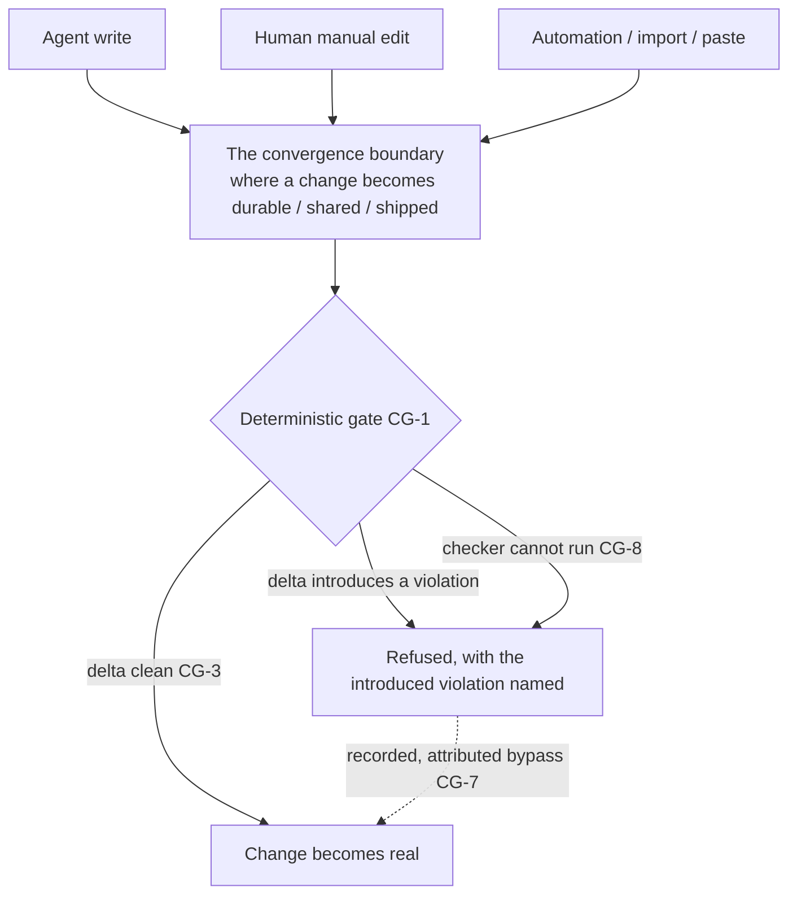
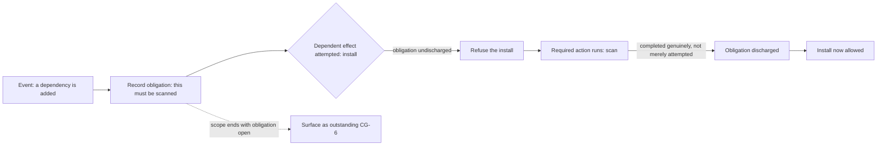

# Convergence Gate

**Version:** 1.0.0
**Status:** Stable
**Layer:** concept

## Overview

The discipline of putting a deterministic check **where all paths converge** rather than on each path that leads there — so a policy holds regardless of *who* or *what* produced the change, including producers nobody anticipated.

Inline guards on the entry paths are necessary but structurally incomplete: they cover exactly the paths they sit on, and a change that arrives by an uncovered path — a human editing an artifact by hand, an automation writing directly, an import, a paste — slips past. A convergence gate closes that class by geometry: it sits at the single boundary every change must cross to become real (durable, shared, shipped), so *source-independence is a property of placement*, not of having enumerated every source.

Three further disciplines make such a gate usable rather than merely present: it judges the **delta a change introduces**, not the accumulated state, so it is adoptable on an imperfect system; it may enforce a **deferred obligation** (an earlier event creates a requirement a later effect is blocked on); and it carries a **recorded, attributed bypass**, because a gate with no escape hatch gets disabled wholesale and a gate whose bypass is invisible is no gate at all.

## Related Specifications

- [l1-interception-model.md](l1-interception-model.md) - The interceptor taxonomy a gate is realized with; this spec is the architectural answer to INT-8's named-coverage-gap problem — guard the chokepoint instead of every entrance (INT-9).
- [l1-human-intervention.md](l1-human-intervention.md) - Out-of-band human edits are exactly the uncovered path a convergence gate catches without special-casing the human.
- [l1-change-merge.md](l1-change-merge.md) - The point a concurrent change becomes shared is a natural convergence boundary; the gate fires there.
- [l1-quality-standards.md](l1-quality-standards.md) - Definition-of-done gates on a work item; a convergence gate is the *source-independent* complement — the DoD gate covers work the office produced, the convergence gate covers everything that crosses the boundary however it arrived.
- [l1-completion-verification.md](l1-completion-verification.md) - Evidence over report; a gate's verdict is evidence gathered at the boundary, and CG-5 obligation discharge is recognized on completion, never on an attempt.
- [l1-policy-governance.md](l1-policy-governance.md) - Managed tiers select gate strictness; a newly introduced gate ratchets (SR-10 / PG-10) rather than blocking on first contact.
- [l1-fault-lifecycle.md](l1-fault-lifecycle.md) - "New vs pre-existing" is the delta the gate judges (CG-3); a regression at the boundary is a blockable event, accumulated debt is not.
- [l1-automation-pipeline.md](l1-automation-pipeline.md) - Automation-written changes are a producer the gate covers by placement, not by trusting the automation.
- [l1-security.md](l1-security.md) - Authority the agent cannot rewrite (SEC-10); a convergence gate applies to work the agent spawns and to work it did not, and the gate's own definition is authority-protected against silent rewrite (CG-9).
- [l1-attestation.md](l1-attestation.md) - Where a gate's provenance must be trusted, its definition is verified before it is honoured (CG-9); a gate an untrusted party can rewrite is not a gate.
- [../../nodus/specifications/l1-nodus-portability.md](../../nodus/specifications/l1-nodus-portability.md) - A workflow effect may be gated on a host-tracked obligation resolved before the effect (LP-20).

## 1. Motivation

A policy worth enforcing — "no new vulnerability ships", "no unreviewed change becomes shared", "no un-scanned dependency is installed" — has to hold against *every* way the thing it governs can happen. The intuitive implementation guards the paths the designer can see: the agent's write path, the tool's edit path. It works until the change arrives another way, and it always eventually does.

**The producer you did not enumerate is the one that matters.** A guard on the agent's write path is silent when a human edits the file directly, when an automation writes it, when someone pastes it, when an import brings it in. Each is a real path to the same outcome, and each is invisible to a per-path guard. The honest response — naming the gap — is correct but insufficient: a named gap is still a gap, and the thing that slips through it is the thing the policy existed to stop. The structural response is to stop guarding entrances and guard the **exit** instead: the one boundary every change must cross to become durable, shared, or shipped. A check there is source-independent by construction, and there is no path to enumerate because there is only one.

But a boundary gate that is merely *present* fails three predictable ways, and each failure ends with the gate turned off — which is worse than never having had it, because the team now believes they are protected.

**A gate that blocks on accumulated state is unadoptable.** Point it at a real system and it fails on the debt already there — the old issues, the pre-existing findings — so every single change is blocked by problems that change did not introduce. The rational response is to disable the gate entirely. A gate that judges the *delta* — what this change newly introduces — holds on an imperfect system, which is the only kind of system there is.

**A gate with no escape hatch gets bypassed structurally.** There is always a legitimate emergency, and a gate that cannot be overridden is removed at the first one, permanently, by whoever hit the emergency. A gate with a *recorded, attributed* bypass survives the emergency: the override is used, it is visible, and the exception is a fact rather than a silent hole.

**And a gate stacked redundantly at every moment doubles cost and contradicts itself.** If the same policy is enforced deterministically as-the-code-is-written *and* at the boundary *and* in review, the three can disagree, each costs, and nobody knows which verdict is authoritative. The moment the deterministic gate fires is a single deliberate choice, not an accretion.

There is a fourth, quieter mechanic worth naming, because it is the same shape one step removed: sometimes the gate is not "check the change" but "an earlier event created an obligation the later effect must satisfy" — a dependency was added, so it must be scanned before it is installed. The obligation is created at one point, enforced at another, and the failure mode is that it is silently forgotten in between.

## 2. Constraints & Assumptions

- A convergence gate is **local-first and on-device**: it evaluates at the boundary without a network round trip, and its verdict is computed from local state.
- The gate governs an effect's *crossing of a boundary*, not the effect's internal logic; what makes a change durable, shared, or shipped is the boundary, and which boundary is a per-policy declaration.
- Source-independence is the point: the gate MUST NOT depend on knowing which actor produced the change, and MUST NOT be defeatable by producing the change through a different actor.
- A gate is **deterministic** — it is code that runs at its boundary, not an instruction a producer may choose to honour. An advisory layer may sit on top for legibility, but the guarantee is the deterministic gate.
- The gate is not a substitute for inline guards; the two compose. Inline guards give early, path-specific feedback; the convergence gate gives the source-independent guarantee.

## 3. Core Invariants

Rules every Layer 2 implementation MUST NOT violate:

- **CG-1 (Guard the convergence point, not the entrances):** where multiple paths lead to the same governed outcome, the deterministic gate is placed at the **single boundary all of them must cross** to make the change real (durable, shared, shipped, installed). Its coverage is then **source-independent by construction** — it catches a change from the agent, a human's manual edit, an automation, an import, or a paste identically, because all of them converge there. A design that guards each producing path separately is structurally incomplete: it covers exactly the paths it sits on and misses every one it does not, which is the failure a convergence gate exists to remove.
- **CG-2 (Deterministic at the boundary — not an instruction a producer may skip):** the gate is a control that **always runs** when the boundary is crossed; it is not guidance an actor is trusted to follow. An advisory formulation of the same policy MAY be layered on top for inline, real-time feedback, but it never *is* the gate — the guarantee is the deterministic check, and confusing the advisory layer for the guarantee is forbidden because an advisory a producer can ignore is not enforcement.
- **CG-3 (Judge the delta, not the accumulated state):** the gate blocks on what the change **newly introduces**, not on conditions that pre-existed it. A boundary gate that fails on accumulated debt is unadoptable — it blocks every change on problems that change did not cause, and it is rationally disabled wholesale, which is strictly worse than a narrower gate that holds. The delta the gate judges is defined relative to the state before the change; a *regression* — a previously-absent problem reappearing — is a new introduction and is blockable, while standing debt is surfaced, not blocked.
- **CG-4 (One chosen enforcement moment, not many overlapping):** the moment the deterministic gate for a given policy fires is a **single deliberate choice** — as-the-change-is-produced, or at the convergence boundary. Enforcing the *same* policy deterministically at multiple moments is redundant: it multiplies cost, and worse, the moments can return conflicting verdicts with no authority among them. Distinct policies MAY gate at distinct moments; one policy gates at one.
- **CG-5 (Deferred obligation — an earlier event gates a later effect):** an event MAY create a **standing obligation** that a *later, dependent* effect is blocked on: the obligation is **recorded when created**, the dependent effect is **refused until it is discharged**, and discharge is recognized **only on genuine completion of the required action**, never on an attempt, a claim, or a same-looking-but-different action. A dependency added creates an obligation to scan it; the install is blocked until the scan actually completed. An obligation satisfied by a mere attempt is not satisfied.
- **CG-6 (Undischarged obligations are surfaced, never silently dropped):** an obligation created but not discharged by the end of its scope (the session, the turn, the boundary it was bound to) is **reported as outstanding**, never forgotten. A dropped obligation is a policy that quietly did not apply, indistinguishable from one that was satisfied — the same absence-is-not-good-news discipline the rest of the observation stack holds, here at the obligation grain.
- **CG-7 (A recorded, attributed bypass — never none, never silent):** the gate has a **deliberate override** for the legitimate emergency, and using it is **recorded and attributed** — who bypassed, when, what was skipped, and (where required) why. Two opposite failures are forbidden: a gate with *no* bypass is removed at the first emergency and gone forever, and a gate whose bypass is *invisible* is no gate at all because the exception leaves no trace. A bypass is an exception made visible, not a hole.
- **CG-8 (Fail-closed to block, fail-forward to observe):** the blocking evaluation **fails closed** — a gate that cannot run (its checker unavailable, its input unreadable) refuses the crossing rather than waving it through, because a gate that fails open silently stops being a gate exactly when something is wrong. Any observation-only companion to the gate **fails forward** — its failure is recorded but neither blocks nor alters the crossing. (Composes the interception fail-direction discipline, INT-3.)
- **CG-9 (The gate lives with the boundary, so everyone who crosses it inherits it):** because the gate sits at the boundary rather than in any one actor's configuration, **every actor who reaches that boundary is subject to it** — including actors, teammates, and automations onboarded *after* the gate was placed, without each having to install or opt into it. A control that must be adopted per-actor is one an actor can decline; a control that lives at the boundary is inherited by crossing it. The gate's own definition is itself an artifact that crosses boundaries, so its integrity is a first-order concern: it is subject to the same authority model as any other control (an actor may weaken or remove a gate only where it holds that authority, never by editing the gate as ordinary content), and where a gate's provenance must be trusted it is verified before it is honoured — a gate an untrusted party can silently rewrite is not a gate, it is a suggestion with ceremony.
- **CG-10 (Composes inline guards, never replaces them):** the convergence gate is the source-independent guarantee; inline path-specific guards remain valuable for **early, contextual feedback** while a change is being produced. The two are complementary — the inline guard tells a producer *now*, the boundary gate guarantees *regardless of producer* — and a design MUST NOT drop inline feedback because a boundary gate exists, nor treat inline feedback as the guarantee (CG-2).

> L2 specs cannot reach RFC status until all invariants here are addressed in their "Invariant Compliance" section.

## 4. Detailed Design

### 4.1 Entrances versus exit

The diagram is the whole argument. Guarding `A`, `H`, and `U` means three guards and a standing bet that there is no fourth arrow. Guarding `B` means one guard and no bet, because `B` is where the arrows are *defined* to converge — a change that does not cross `B` did not become real, and one that did, crossed the gate.

### 4.2 Why the delta, not the state (CG-3)

| Gate judges | On a clean system | On a real (imperfect) system |
| --- | --- | --- |
| Absolute state | Passes | **Blocks every change** on pre-existing debt → disabled wholesale |
| The change's delta | Passes | Passes clean changes, blocks changes that *introduce* a violation |

The absolute-state gate is the one that looks stricter and is in practice weaker, because its strictness is what gets it turned off. The delta gate is adoptable, and adoptable is the only kind of strict that survives contact with an existing codebase.

### 4.3 The deferred obligation (CG-5/CG-6)

Two properties are load-bearing. Discharge is recognized on **genuine completion** (CG-5) — an errored or unauthenticated scan does not clear the obligation, because a gate satisfied by an attempt gates nothing. And an obligation open at scope end is **reported** (CG-6), because the alternative — silently dropping it — is a policy that quietly did not apply, which is indistinguishable to everyone downstream from a policy that was satisfied.

### 4.4 Choosing the moment (CG-4)

| Moment | Feedback | Covers | Cost |
| --- | --- | --- | --- |
| **As produced** (inline, per path) | Immediate, contextual | Only the path it sits on | Per production |
| **At the convergence boundary** | At the crossing | Every producer, by placement | Per crossing |

These are the *same policy's* deterministic gate, and it belongs at **one** of them. Inline gives the fastest feedback but is not source-independent; the boundary is source-independent but later. The advisory layer (CG-2) can exist at both for legibility — it is the *deterministic* enforcement that must not be duplicated, because two authoritative gates for one policy is either redundant or contradictory.

### 4.5 Boundary with neighbouring layers

| Concern | Owner |
| --- | --- |
| *Where* to place the deterministic gate, and its delta/obligation/bypass discipline | **This spec** |
| The interceptor *classes* and per-path coverage honesty | Interception model (CG realizes a gate as an INT decide-class interceptor at the chokepoint) |
| Definition-of-done gates on a work item the office produced | Quality standards (source-independence is this spec's addition) |
| What makes two failures "the same", and new-vs-regressed | Fault lifecycle (supplies CG-3's delta judgement) |
| How a newly introduced gate is rolled out without blocking on first contact | Staged rollout / policy governance (the ratchet) |

## 5. Drawbacks & Alternatives

- **A boundary gate is later than inline feedback.** Accepted, and the reason CG-10 keeps inline guards: the two compose, inline for speed and the boundary for the guarantee. Dropping inline feedback because a boundary gate exists is explicitly forbidden.
- **The bypass can be abused.** Bounded by CG-7: the bypass is recorded and attributed, so abuse is visible and auditable rather than silent. A gate with no bypass is the worse failure, because it is removed entirely at the first emergency.
- **Delta judgement can be gamed** by an actor who reshapes accumulated debt to look like a new change or vice versa. Mitigated by anchoring the delta to a recorded prior state (fault lifecycle's identity), so "new" is defined against evidence rather than reasserted per crossing.
- **Alternative — guard every producing path.** Rejected by CG-1: it covers only the enumerated paths and misses the one nobody thought of, which is the one that matters. Naming the gap (INT-8) is honest but does not close it.
- **Alternative — trust an advisory the producer follows.** Rejected by CG-2: an advisory a producer can ignore is not enforcement, and the producers most likely to ignore it are exactly the ones a policy exists to constrain.
- **Alternative — block on absolute state for maximum strictness.** Rejected by CG-3: it is the strictness that gets the gate disabled, so it is weaker in practice than a delta gate that survives.
- **Alternative — enforce the same policy deterministically at every moment.** Rejected by CG-4: redundant cost and contradictory verdicts with no authority among them.
- **Alternative — drop an obligation that was never discharged.** Rejected by CG-6: a silently dropped obligation is a policy that quietly did not apply, indistinguishable from one satisfied.

## Canonical References

| Alias | Path | Purpose |
| --- | --- | --- |
| `[INTERCEPT]` | `.design/main/specifications/l1-interception-model.md` | The interceptor taxonomy a gate is realized with; INT-8's named-gap problem this spec answers structurally. |
| `[QUALITY]` | `.design/main/specifications/l1-quality-standards.md` | Definition-of-done gates; the source-independent complement this spec adds. |
| `[FAULT]` | `.design/main/specifications/l1-fault-lifecycle.md` | Supplies the new-vs-pre-existing delta judgement CG-3 depends on. |
| `[PORTABILITY]` | `.design/nodus/specifications/l1-nodus-portability.md` | The obligation-gated-effect seam (LP-20) realizing CG-5 in a workflow. |

## Document History

| Version | Date | Author | Notes |
| --- | --- | --- | --- |
| 1.0.0 | 2026-07-23 | Core Team | Initial spec — put the deterministic check where all paths converge, not on each path: guard the single boundary every change must cross to become real, so coverage is source-independent by construction and catches the agent, a human's manual edit, an automation, an import, or a paste identically, closing the class INT-8 can only name (CG-1); the gate is deterministic code that always runs at its boundary, never an instruction a producer may skip, with an advisory layer allowed on top for legibility but never mistaken for the guarantee (CG-2); it judges the **delta** a change introduces rather than accumulated state, since an absolute-state gate blocks every change on pre-existing debt and is rationally disabled wholesale — a regression is blockable, standing debt is surfaced (CG-3); the enforcement moment is one deliberate choice, not the same policy stacked at many moments returning conflicting verdicts (CG-4); a deferred obligation lets an earlier event gate a later dependent effect, discharged only on genuine completion (CG-5) and surfaced when left outstanding at scope end (CG-6); a recorded, attributed bypass — never none, since a gate without one is removed at the first emergency, and never silent, since an invisible bypass is no gate (CG-7); fail-closed to block and fail-forward to observe (CG-8); the gate lives with the boundary so every actor who crosses it inherits it, including those onboarded later, with the gate's own definition authority-protected against silent rewrite and verified before it is honoured where its provenance must be trusted (CG-9); and it composes inline guards rather than replacing them (CG-10). Concept-only. |
