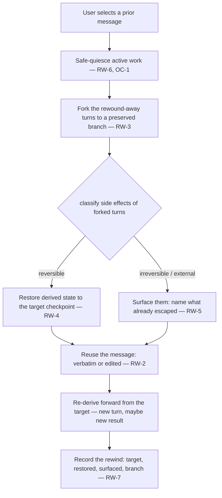

# Conversation Rewind

**Version:** 1.0.0
**Status:** Stable
**Layer:** concept

## Overview

The technology-agnostic mechanic that lets a user go **back** to an earlier point in a chat and **reuse** the message there — re-running it unchanged, or editing it and running the revised version — continuing the conversation from that point instead of the latest one. This is "rewind": select a prior message, restore the conversation and the office's derived state to their condition as of that message, and proceed forward again.

Rewind in an autonomous office is deliberately **not** a stateless transcript truncation. Between the rewind target and now, the office may have done real work — created board cards, changed files, written memory, made commits, sent a message through a connector. So a rewind must **reconcile those side effects honestly**: restore what it can reverse, and *surface* what it cannot (an email already sent, an external record already created) rather than pretend it never happened. And rewinding **forks** rather than destroys — the abandoned continuation is preserved as a branch, so a rewind is itself reversible. Rewind restores the *starting state*; because the office re-derives rather than replays a recording, the re-run may reach a different result.

Rewind is the user's direct control over conversation history — a steering act on the chat, optional and never something the office does to itself.

## Related Specifications

- [l1-crash-recovery.md](l1-crash-recovery.md) - The snapshot/restore + work-reconciliation + honest-accounting machinery (CR-2/CR-6/CR-7) rewind reuses; distinct trigger — rewind is *user-initiated* and targets a *chosen* point, crash recovery is *involuntary* and restores the *newest valid* state. The "resurrection risk" CR-6/CR-7 handle for crashes is rewind's central case.
- [l2-session-checkpoint.md](l2-session-checkpoint.md) - Session context-window checkpoints; a per-turn rewind point captures the conversation context like any checkpointed session state.
- [l2-agent-session.md](l2-agent-session.md) - The turn lifecycle whose user-message boundaries are the rewind points (RW-1).
- [l1-conversational-control.md](l1-conversational-control.md) - The chat surface rewind operates on; a reused message re-enters as an intent-resolved turn (CC-3).
- [l1-directability.md](l1-directability.md) - Rewind is a first-class steer on the chat lens (DIR-1); surfacing irreversible effects rather than faking their undo is DIR-9 honest-control applied to history.
- [l1-office-control.md](l1-office-control.md) - OC-1 safe-checkpoint-before-freeze is how a rewind quiesces an actively-working office before restoring (RW-6).
- [l1-work-liveness.md](l1-work-liveness.md) / [l1-work-convergence.md](l1-work-convergence.md) - Rewound-away board cards are reconciled through the liveness sweep (WL-5) onto the one board (CONV-1), never silently deleted (RW-4).
- [l1-version-control.md](l1-version-control.md) / [l1-change-merge.md](l1-change-merge.md) - The branch/fork discipline rewind mirrors for history, and the delta-reversal path for file-level side effects.
- [l1-office-model.md](l1-office-model.md) - Office-per-project isolation (OFF-1) bounds what a rewind may restore or reach (RW-8).

## 1. Motivation

Reusing an earlier message is one of the most natural things a person wants in a chat: "let me take that back and say it differently," "run that again," "go back to where it was still right." In a plain chatbot this is trivial — drop the later messages and resend. In Cronus it is not, because the office **acts** on what it is told: a message can spawn tasks, edit a repository, spend budget, or reach the outside world. That makes a naive rewind dangerous in three specific ways:

- **The silent orphan.** If rewind just deletes later turns, the cards, files, and commits those turns produced are stranded — present in the world but absent from the conversation that explains them. The office is left with work no message accounts for.
- **The false undo.** Some effects cannot be reversed — a sent email, an external API record, a pushed commit. A rewind that quietly "rolls back" to before them lies to the user about the state of the world, which is the most corrosive failure a control affordance can have.
- **The torn step.** Rewinding an office that is mid-work, by cutting its current step, corrupts state — the same hazard pausing already had to solve.

The resolving idea reuses machinery Cronus already has and adds the missing user-facing mechanic. Restore points already exist (crash-recovery snapshots, session checkpoints); rewind lets the *user* pick one by pointing at a message. Reconciliation of restored work already exists (the liveness sweep); rewind runs it against a chosen target instead of the newest. Honesty about a lossy restore already exists (the recovery report); rewind reports what it could not reverse. Forking-not-destroying already exists in the versioning discipline; rewind applies it to conversation history so a rewind can be undone. What is genuinely new is the **user-selected, message-anchored** entry point and the discipline that a rewind reconciles-and-surfaces rather than truncates.

## 2. Constraints & Assumptions

- A rewind point exists at each **user message boundary**; the office's own intermediate steps are not independently rewind-addressable (the user rewinds the conversation, not the office's internal loop).
- Restoring **derived, reversible** state (context, cards, plans, memory writes) is in scope; reversing **externally-observable** effects is out of scope by nature — those are surfaced, not undone.
- Rewind is **non-destructive**: the abandoned continuation is preserved as a branch, never deleted, so rewind is reversible.
- Rewind **restores state, not outcomes**: re-running a reused message re-derives; the office does not replay a recording and does not promise an identical result.
- Rewind is **user-initiated and optional**; the office never rewinds itself as a work strategy (that is re-planning, a different concept).
- Rewind respects **office isolation** (OFF-1) and the user's access scope; it neither reaches other offices nor exposes state the user could not otherwise see.

## 3. Core Invariants (Layer 1 only)

Rules every Layer 2 implementation MUST NOT violate:

- **RW-1 (Message-anchored rewind points):** the conversation maintains a restore point at each user-message boundary, capturing both the conversation context and the office's derived state as of that boundary (composing the checkpoint/snapshot mechanism, CR-2 / session checkpoints). A user MAY select any prior user message as a rewind target.

- **RW-2 (Reuse — verbatim or edited):** rewinding to a message lets the user **reuse** it — re-run it unchanged or edit it and run the revised version — and the reused message re-enters as a fresh, intent-resolved turn (CC-3). Rewind restores the *starting state*; the office re-derives from it, so the re-run MAY produce a different result and MUST NOT be presented as a guaranteed replay of the prior outcome.

- **RW-3 (Fork, never destroy — rewind is reversible):** rewinding MUST NOT delete the rewound-away turns; it **forks** them into a preserved, inspectable branch so the rewind can itself be undone. Conversation history is a tree of branches, not a mutable line; no turn is silently lost (non-destructive, consistent with CR-9 and the versioning fork discipline).

- **RW-4 (Reversible state restored to the target, atomically-or-reported):** on rewind, the office's derived, reversible state attributable to the rewound-away turns — conversation context, board cards, plans, memory writes — is restored to its condition as of the target checkpoint (composing CR-6 reconciliation, OC-2 exact-state resume). Rewound board work is reconciled through the liveness sweep (WL-5) onto the one board (CONV-1), never silently deleted. Restoration either reaches the checkpoint state or **names precisely what it could not restore** — a partial restore is reported, never disguised as complete.

- **RW-5 (Irreversible effects surfaced, never pretended-away):** side effects the rewound-away turns performed that are **externally observable or irreversible** — a sent message/email, an external record created through a connector, a pushed commit, any effect already past the office's undo boundary — CANNOT be un-happened by a rewind and MUST be **surfaced to the user as part of the rewind** (named, so the user knows what already escaped), never silently orphaned and never falsely rolled back. A rewind reconciles what it can and reports what it cannot; presenting an irreversible rewind as clean is forbidden (composing CR-7 honesty, DIR-9 honest-control, the effect-sink boundary).

- **RW-6 (Safe quiesce before restore):** if the office is actively working when a rewind is requested, it completes or safely checkpoints the current atomic step before restoring — a rewind MUST NOT tear an in-progress step (composing OC-1). In-flight work belonging to the rewound-away turns is drained and reconciled (CR-6/WL-5), not killed mid-step.

- **RW-7 (Legible, attributed, auditable):** a rewind is a first-class recorded action — the target point, what was restored, what was surfaced as irreversible, and which branch was forked — on the same audit/event path as any office action (composing CC-5, EXT-8). The user can always see what a rewind did, and undo it (RW-3).

- **RW-8 (Isolation & access scope):** a rewind operates only within its own conversation's office (OFF-1) and reconciles side effects only within that office's scope. It MUST NOT reach across offices, nor restore or expose state the user is not entitled to (inherits office isolation and access scope).

- **RW-9 (User-initiated and optional — not an autonomous behavior):** rewind is a user-initiated affordance, never required and never performed by the office on itself as a work strategy (course-correction inside a run is re-planning, a distinct concept). Rewind is the user's control over conversation history — a steering act consistent with directability's optional-steering stance (DIR-6/DIR-1).

> L2 specs cannot reach RFC status until all invariants here are addressed in their "Invariant Compliance" section.

## 4. Detailed Design

### 4.1 What a rewind does



The two arms of `classify` are the heart of the mechanic: reversible effects are rolled back to the checkpoint, irreversible ones are reported. Rewind never merges the two into a false "everything undone."

### 4.2 Reversible vs irreversible — the classification (RW-4/RW-5)

```text
[REFERENCE]
REVERSIBLE (restore to checkpoint):
  conversation context/turns · board cards created by forked turns · plan edits ·
  memory writes attributable to forked turns · local uncommitted file edits (delta-reversed, l1-change-merge)
IRREVERSIBLE / EXTERNALLY-OBSERVABLE (surface, do not pretend to undo):
  a sent email/message · an external record created via a connector · a pushed/published commit ·
  budget already spent · any effect past the office's undo boundary
The boundary is "has this effect left the office's control?" — if no, restore it; if yes, name it.
```

An effect's reversibility is a property the office already tracks for its actions (reversible-where-the-operation-is, per CC-5/DIR-7); rewind consumes that classification rather than re-deciding it.

### 4.3 Fork, not destroy (RW-3)

Rewinding to message *k* does not erase messages *k+1…n*; it moves the conversation onto a new branch from *k* and keeps the old continuation as a sibling branch.

```text
[REFERENCE]
        ... → m_{k-1} → m_k ─┬─→ m_{k+1} → ... → m_n      (branch A: abandoned, preserved)
                             └─→ m_k' → ...                (branch B: the reused/edited message forward)
Undo-rewind = switch active branch back to A. No branch is deleted; history is a tree.
```

This is the versioning fork discipline applied to conversation history — the same reason version control branches rather than overwrites — and it is what makes RW-3's "rewind is reversible" true.

### 4.4 Relationship to neighboring mechanisms

- **Crash recovery (l1-crash-recovery).** Same restore + reconcile + honest-report machinery, different trigger: crash recovery is involuntary and restores the *newest valid* snapshot; rewind is a *user* pointing at a *chosen* message. Rewind is, in effect, a deliberate, targeted, forward-forking application of the recovery ladder.
- **Review checkpoint (l1-review-checkpoint).** Opposite direction: a review checkpoint halts *forward* progress to ask a human before an expensive/irreversible step; rewind goes *backward* to a past point. They are complementary — a review checkpoint can *prevent* an irreversible effect that, once done, rewind can only *surface* (RW-5).
- **Re-planning.** The office correcting its own course mid-run is re-planning (drift-driven), an autonomous behavior; rewind is user-initiated and never something the office does to itself (RW-9). The two must not be conflated.

## 5. Drawbacks & Alternatives

- **Reconciliation complexity.** Classifying and reversing side effects is more work than truncating a transcript. It is the irreducible cost of rewind in an office that *acts*; RW-5 keeps the hard cases honest rather than hiding them.
- **Branch sprawl.** Forking on every rewind (RW-3) accumulates abandoned branches. Mitigated by bounded retention on abandoned branches (the same rotation discipline as snapshots, CR-5). <!-- TBD: retention/rotation policy for abandoned rewind branches -->
- **Expectation of a clean undo.** Users may expect rewind to erase all consequences. RW-5 deliberately refuses that illusion and names what escaped — a smaller promise kept beats a larger one broken.
- **Alternative — truncate the transcript (stateless rewind).** Rejected: it silently orphans real side effects (the failure §1 names) and cannot exist safely in a side-effecting office.
- **Alternative — forbid rewind once any side effect occurred.** Rejected: too restrictive — most effects are reversible; the useful design reconciles the reversible majority and surfaces the irreversible minority.
- **Alternative — destroy the rewound branch (mutable history).** Rejected (RW-3): a non-reversible rewind is a trap; forking makes rewind safe to try.

## nodus-relevance mapping

Primarily a main-workspace host mechanic. The runtime participates where a rewound conversation drove a workflow run.

| Element | nodus seam | Note |
| --- | --- | --- |
| Restore/quiesce a driven run (RW-4/RW-6) | `Status::Paused` + resume-descriptor (DG-4 / NL-12) | A run driven by a rewound turn is checkpointed/suspended on the existing pause seam, not torn. |
| Reversible-vs-irreversible classification (RW-5) | effect sinks gated per NL-21 / LP-11 decide-effect-observe | An already-committed external effect is past the undo boundary; the host, not the workflow, tracks it. |
| Audit of a rewind (RW-7) | executor audit stream (HO-8) | The rewind and its restored/surfaced set are traced events like any other. |

## Canonical References

| Alias | Path | Purpose |
| --- | --- | --- |
| `[CRASH]` | `.design/main/specifications/l1-crash-recovery.md` | Snapshot/restore + reconciliation + honest-report machinery rewind reuses (RW-1/RW-4/RW-5) |
| `[DIRECT]` | `.design/main/specifications/l1-directability.md` | Rewind as a chat-lens steer (DIR-1) and honest-control (DIR-9) applied to RW-5 |
| `[OFFICE-CTRL]` | `.design/main/specifications/l1-office-control.md` | OC-1 safe-quiesce before a rewind restores (RW-6) |
| `[LIVENESS]` | `.design/main/specifications/l1-work-liveness.md` | WL-5 reconciliation of rewound board work (RW-4) |
| `[VERSION]` | `.design/main/specifications/l1-version-control.md` | The branch/fork discipline rewind mirrors for history (RW-3) |
| `[CONV-CTRL]` | `.design/main/specifications/l1-conversational-control.md` | The chat surface a reused message re-enters through (RW-2) |

## Document History

| Version | Date | Author | Notes |
| --- | --- | --- | --- |
| 1.0.0 | 2026-07-24 | Core Team | Initial spec — conversation rewind: message-anchored rewind points (RW-1); reuse a message verbatim or edited, restoring state not replaying an outcome (RW-2); fork-not-destroy so rewind is itself reversible (RW-3); reversible derived state restored atomically-or-reported and board work reconciled via the liveness sweep (RW-4); irreversible/external side effects surfaced honestly, never pretended-away (RW-5); safe-quiesce before restore (RW-6); legible/attributed/auditable (RW-7); office-isolation and access-scope bounded (RW-8); user-initiated, optional, never an autonomous behavior (RW-9). Reuses the crash-recovery restore/reconcile/honesty machinery under a user-selected, message-anchored trigger; composes directability (steer + honest control), office-control (safe quiesce), work-liveness/convergence (board reconciliation), and version-control (fork discipline). Main-only host mechanic. |
