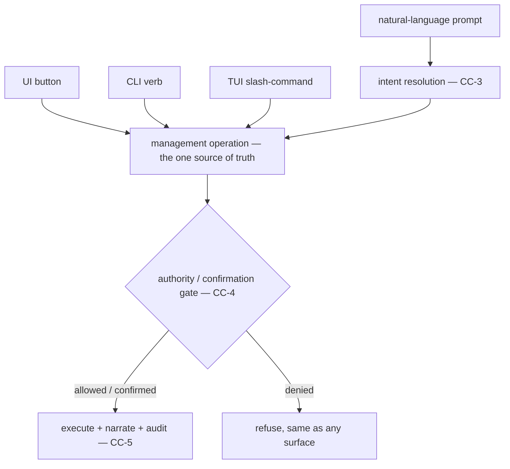

# Conversational Control

**Version:** 1.0.0
**Status:** Stable
**Layer:** concept

## Overview

Managing the application should not require hunting for the right button. This spec
makes the **conversational surface — natural-language chat and prompts — a first-class
control plane** over the application's own management operations: creating a project
office, setting up a cron/schedule, hiring a role, wiring an automation, changing a
setting. "Create a project for the Q3 launch" and "remind me every weekday at 9" are
management commands, not just conversation — resolved through intent understanding into
the *same* operations the UI and CLI perform, under the *same* authority and
confirmation gates.

Conversational control is a **binding**, not a new mechanism: the chat joins the UI,
CLI, and TUI as another surface over the one source-of-truth library operation. It does
not re-implement management, weaken its gates, or become a back-channel that bypasses
what a button would require. It is control *by talking*, held to exactly the standards
of control by clicking.

## Related Specifications

- [l1-intent-resolution.md](l1-intent-resolution.md) — a conversational command is understood through intent resolution (ground-before-ask, assume-and-record), not brittle keyword parsing (CC-3).
- [l1-architecture.md](l1-architecture.md) — INV-3 command parity: the chat is a fourth binding over the one library operation the UI/CLI/TUI also invoke (CC-2).
- [l1-office-model.md](l1-office-model.md) — the manager is what executes a conversational management command within an office (CC-1/CC-6).
- [l1-workspace-lifecycle.md](l1-workspace-lifecycle.md) — creating/editing/deleting workspaces is a primary conversational-control target; home-manager cross-workspace authority scopes it (WSL-2, CC-6).
- [l1-scheduler-model.md](l1-scheduler-model.md) — creating a cron/reminder by prompt is a primary target (CC-1).
- [l1-security.md](l1-security.md) — destructive management via prompt is subject to the same human-confirmation and authority gates as any surface (CC-4, SEC-9/SEC-10).
- [l1-work-convergence.md](l1-work-convergence.md) — a control command mutates management state; a work request enters the board — distinguished, not conflated (CC-7).
- [l1-office-control.md](l1-office-control.md) — distinct: that spec is office lifecycle *states* (pause/hibernate), this is NL invocation of *management operations*.

## 1. Motivation

Cronus already exposes management through a UI and a verb-first CLI, and the office
manager already understands natural language. What is missing is the *contract* that
ties them together: that the things you can do by clicking or typing a command, you can
also do by *asking*, and that asking is held to the same standards.

Without this contract, two failures appear:

- **A capability gap between surfaces.** Some operations get a chat path, others only a
  button; the user learns an inconsistent map of "what can I ask for vs. what must I go
  find." Parity across surfaces (INV-3) should include the conversational one.
- **A safety gap through the back door.** If a prompt can create or delete management
  state on a path that skips the confirmation a button enforces, natural language
  becomes an escalation route — exactly the boundary a prompt-injected or careless
  request must not cross. The conversational plane must inherit every gate, not route
  around it.

The resolving idea: treat conversation as a binding over the same operations, resolved
by the intent layer, gated by the same authority. The user gets the ergonomics of "just
ask," and the system keeps one source of truth, one set of gates, and one audit trail.

## 2. Constraints & Assumptions

- A conversational command maps to an existing management operation; this spec does not
  invent new operations, it makes the existing ones reachable by language.
- Understanding is by intent resolution, which may record assumptions or ask when
  blocking-and-costly — not a fixed grammar.
- Every authority, autonomy, and confirmation rule that applies to an operation from any
  surface applies identically here.
- Control (managing the app) and work (asking an office to do a task) are different acts
  that may share the same chat.

## 3. Core Invariants

Rules every Layer 2 implementation MUST NOT violate:

- **CC-1 (Chat is a first-class control plane):** natural-language chat/prompts can
  invoke the application's management operations — create/edit/delete workspaces and
  offices, schedules (crons), roles, automations, and settings — not merely discuss
  work. An operation reachable through the UI or CLI is reachable through conversation.

- **CC-2 (Same operation, one source of truth — parity):** a conversational command
  invokes the *same* underlying library operation the UI, CLI, and TUI invoke — a fourth
  binding over one source-of-truth operation, never a parallel re-implementation.
  Creating a project by prompt and by button produce an identical result (consistent
  with command parity, INV-3).

- **CC-3 (Intent-resolved, not keyword-parsed):** a conversational command is understood
  through intent resolution — grounding under-specified intent from context and defaults,
  recording explicit reversible assumptions rather than silently guessing, and asking
  only when blocking *and* costly (IR-1/IR-2/IR-3) — not a brittle fixed-keyword grammar.
  "Set up a daily 9am standup reminder" resolves to a concrete schedule-create with its
  assumptions recorded.

- **CC-4 (Same authority & confirmation gates):** a conversational command is subject to
  the identical authority, autonomy, and confirmation gates as the same operation from
  any other surface. A destructive or irreversible management action (delete a workspace,
  delete a schedule) requires the same human confirmation whether it arrives as a
  button-press or a prompt (composes SEC-9/SEC-10 and the human-checkpoint discipline).
  Natural language MUST NOT become a bypass around a gate another surface enforces.

- **CC-5 (Legible, reversible, traceable execution):** a conversational command's effect
  is narrated back legibly (what was created or changed), recorded on the same
  audit/event path as any management action, and reversible wherever the operation is. A
  prompt that creates or changes management state MUST NOT do so silently — the user can
  always see, and undo, what a prompt did.

- **CC-6 (Scope-respecting):** a conversational command executes in the scope it is
  issued in — a prompt inside a project office acts on that office; a prompt at the
  home/building surface may act across offices (e.g. create a new project) consistent
  with the home manager's cross-workspace authority (WSL-2) — and never crosses an
  isolation boundary the same operation would respect from the UI (composes workspace
  isolation).

- **CC-7 (Control distinct from work):** conversational *control* (managing the
  application — create/edit/delete offices, schedules, roles, settings) is distinct from
  conversational *work* (asking an office to perform a task). The same chat may carry
  both, but a control command mutates management state through a management operation
  while a work request enters the work pipeline (the board); the system classifies and
  routes each correctly. "Create a project" is control; "build me a website" is work.

> L2 specs cannot reach RFC status until all invariants here are addressed in their
> "Invariant Compliance" section.

## 4. Detailed Design

### 4.1 One operation, four bindings



The chat differs from the other bindings only by needing an intent-resolution step to
turn language into a concrete operation call (CC-3). From the operation onward — gate,
execute, audit — every surface is identical (CC-2/CC-4/CC-5).

### 4.2 Control vs. work classification (CC-7)

```text
[REFERENCE]
classify(prompt):
    if it names a management operation on the app itself
       (make/change/remove an office, schedule, role, automation, setting)
        -> CONTROL  -> resolve to a management operation (this spec)
    else (it asks for a task to be done)
        -> WORK     -> enter the work pipeline / board (l1-work-convergence)
```

A request that is genuinely ambiguous is resolved by the intent layer (CC-3) — grounded
from context, or, if blocking-and-costly, asked — never silently sent down the wrong
path.

### 4.3 Examples

| Prompt | Class | Resolves to |
| --- | --- | --- |
| "Create a project for the Q3 launch." | control | workspace-create (WSL-3) |
| "Remind me every weekday at 9am to review PRs." | control | schedule-create, reminder (SCH) |
| "Hire a security reviewer for this office." | control | role-hire (roles) |
| "Delete the old marketing office." | control (destructive) | workspace-delete → human-confirm (CC-4) |
| "Build me a landing page." | work | enters the board (l1-work-convergence) |

## 5. Drawbacks & Alternatives

- **Misclassification risk (control vs work).** A prompt could be read as the wrong
  class. Mitigated by CC-3/CC-7: ambiguity is intent-resolved (grounded or asked when
  blocking-and-costly), and control operations still pass their confirmation gate (CC-4)
  before mutating anything.
- **Safety via a chattier path.** The worry that NL weakens gates is met head-on by
  CC-4: the gate is on the *operation*, not the surface, so every binding hits it
  equally.
- **Alternative — UI/CLI only, chat for work discussion only.** Rejected (CC-1): it
  leaves an inconsistent capability map across surfaces and denies the natural "just ask"
  ergonomics the conversational surface is best placed to offer.
- **Alternative — a rigid chat command grammar (fixed keywords).** Rejected (CC-3): it
  is brittle and unnatural; intent resolution already exists to turn language into action
  robustly, and reusing it keeps one understanding path.

## Canonical References

| Alias | Path | Purpose |
| --- | --- | --- |
| `[INTENT]` | `.design/main/specifications/l1-intent-resolution.md` | The understanding layer a conversational command is resolved through (CC-3). |
| `[ARCH]` | `.design/main/specifications/l1-architecture.md` | INV-3 command parity: chat as a binding over one operation (CC-2). |
| `[SECURITY]` | `.design/main/specifications/l1-security.md` | The authority/confirmation gates a prompt inherits unchanged (CC-4). |
| `[WORK-CONV]` | `.design/main/specifications/l1-work-convergence.md` | The work pipeline a work request routes to, distinct from control (CC-7). |

## Document History

| Version | Date | Author | Notes |
| --- | --- | --- | --- |
| 1.0.0 | 2026-07-07 | Core Team | Initial spec — the conversational surface as a first-class control plane over the application's management operations: chat/prompts invoke create/edit/delete of workspaces, schedules (crons), roles, automations, settings (CC-1); the same operation as UI/CLI/TUI, one source of truth, a fourth binding not a re-implementation (CC-2, INV-3); understood via intent resolution not keyword grammar (CC-3); the identical authority & confirmation gates as any surface, NL never a bypass (CC-4, SEC-9/SEC-10); legible, reversible, traceable execution, never silent (CC-5); scope-respecting per the surface it is issued in (CC-6, WSL-2); control distinct from work, classified and routed correctly (CC-7, l1-work-convergence). Distinct from office-control (lifecycle states, not NL management-op invocation). Main-only (a host control-surface concept). |
