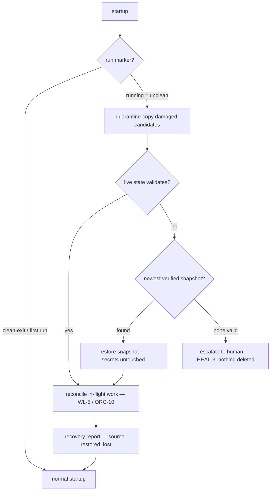

# Crash Recovery & State Snapshots

**Version:** 1.0.0
**Status:** Stable
**Layer:** concept

## Overview

The mechanism layer that lets the system survive abnormal termination and **resume working**: (1) a crash-safe write discipline so routine persistence never leaves a torn artifact, (2) automatic, consistent, point-in-time **snapshots** of the durable state as verified restore points, and (3) a **startup recovery protocol** that detects an unclean shutdown, restores the newest valid state — live state first, snapshot fallback — reconciles the work that was in flight, and reports honestly what was recovered and what was lost.

Neighboring contracts already promise the *outcome*: durable restartable state (STO-2), self-recovery after crash (HEAL-6), stranded-work reconciliation (WL-5), resumable plans (ORC-10). None of them owns the *mechanism* — how a crash is even detected at startup, what guarantees a restore point is internally consistent rather than a torn mid-write copy, in what order recovery sources are tried, and what the user is told afterward. This spec supplies that mechanism; the doctor triggers it, the storage model shapes what it protects, and work liveness consumes what it restores.

## Related Specifications

- [l1-storage-model.md](l1-storage-model.md) - The durable state tier this protects (STO-2/STO-7/STO-8); the STO-9 pre-migration timestamped backup is one event-trigger class of the same snapshot mechanism.
- [l1-doctor.md](l1-doctor.md) - HEAL-6 self-recovery is the owning contract; this spec is its crash-path realization at concept level; unrecoverable outcomes escalate per HEAL-3; every recovery action is logged per HEAL-5.
- [l1-work-liveness.md](l1-work-liveness.md) - After state restore, in-flight work is reconciled through the reap/resume/reconcile sweep (WL-5) and the liveness contract (WL-3) — recovery delivers a working office, not just data.
- [l1-orchestration.md](l1-orchestration.md) - ORC-10 resumable goal/plan state is among the artifacts a snapshot captures and recovery reloads.
- [l1-security.md](l1-security.md) - Secret isolation (SEC-1, STO-6): snapshots exclude the secret store; recovery never rolls secrets back.
- [l2-backup.md](l2-backup.md) - The archival sibling: user-initiated/scheduled, restore-anywhere disaster recovery; snapshots are automatic, local, rapid restore points — demarcated in §4.5.
- [l2-session-checkpoint.md](l2-session-checkpoint.md) - The session-granularity sibling: resuming an LLM turn across context-window boundaries; a snapshot captures checkpoint files like any other durable state.

## 1. Motivation

An autonomous office is a long-running process that is *guaranteed* to eventually die uncleanly — power loss, OS kill, out-of-memory, a panic in a native dependency. Today the design says the system "resumes from durable state" (STO-2) and "recovers to a consistent state" (HEAL-6), but three failure modes fall between those promises:

1. **The torn write.** A crash in the middle of persisting an artifact can leave it half-written. A system that resumes from a half-written board file does not resume — it crashes again, or worse, silently loads garbage.
2. **The undetected crash.** Without an explicit unclean-shutdown signal, startup cannot distinguish "fresh boot after clean exit" from "boot after catastrophe" — so it never knows it should check anything, quarantine anything, or tell the user anything.
3. **The data-without-work restore.** Restoring files is not restoring *work*: cards mid-pipeline, runs mid-execution, schedules mid-fire need reconciliation, or the office reboots amnesiac — data intact, activity dead.

A snapshot mechanism with a startup recovery protocol closes all three: crash-safe writes make the live state the usual survivor; verified point-in-time snapshots provide the fallback when it is not; crash detection makes recovery deliberate rather than accidental; and work reconciliation turns restored data back into running work. The user's experience matches the promise: the application terminated abnormally — on next launch it picks up where it left off, and says so.

## 2. Constraints & Assumptions

- **Crashes are normal, not exceptional.** The design budget assumes unclean termination happens routinely over a deployment's life; recovery is a standard startup path, not an emergency tool.
- **Local-first.** Snapshots live on the same device inside the state tier; they are not an off-device backup (that is l2-backup's job) and never leave the device by themselves.
- **Bounded footprint.** Snapshots consume disk; rotation must bound their count/age. Regenerable caches and indices (STO-8 derived data) need not be snapshotted — they are rebuilt.
- **Recovery races nothing.** The recovery protocol runs before normal operation begins — before schedules fire, sessions resume, or frontends accept commands.
- **Some loss is honest.** Work performed between the last durable write and the crash may be unrecoverable; the contract is a *bounded and reported* loss window, not a zero-loss illusion.

## 3. Core Invariants

Rules every Layer 2 implementation MUST NOT violate. They are technology-neutral.

- **CR-1 (Unclean-shutdown detection):** the system maintains a durable run/shutdown marker such that every startup can classify the previous termination as *clean* or *unclean*. An unclean classification MUST route startup through the recovery protocol before normal operation; the classification and the taken path are recorded and surfaced, never silent.

- **CR-2 (Consistent point-in-time snapshots):** a snapshot captures the durable state as of a **single instant** — it is never a torn view mixing pre- and post-write content of one logical update. Each snapshot is a self-sufficient restore point (STO-7 spirit), is **verified at capture time** (structural validity, integrity checksum), and a snapshot that fails verification is discarded and flagged — it is never counted among available restore points.

- **CR-3 (Crash-safe routine writes):** every routine durable write is atomic-or-journaled: interruption at any instant leaves either the previous version or the new version readable, never an unreadable hybrid. The live state is thereby the *first* recovery source; snapshots are the second line of defense, never a license for torn writes.

- **CR-4 (Recovery ladder, never silent-empty):** on unclean startup, recovery proceeds in strict order — validate the live state and resume from it; on validation failure, restore the newest snapshot that passes verification, then older ones in order. Only when every source is exhausted does recovery escalate to the human (HEAL-3) — starting with an empty state while recovery material exists is forbidden, and the damaged state is quarantined for inspection, never deleted.

- **CR-5 (Bounded loss window):** snapshots are captured automatically — on a configurable cadence and on high-value events (completion of a work unit, pre-migration per STO-9, before a risky repair per HEAL-3) — so the maximum work-loss window is a **declared, configured property**, not an accident of when someone last ran a backup. Cadence, retention, and event triggers are policy (configurable with sensible defaults).

- **CR-6 (Work resumption, not data reboot):** recovery is complete only when in-flight work is reconciled, not merely when files are restored: interrupted runs, mid-pipeline cards, pending schedules, and open sessions pass through the ownership/liveness reconciliation (WL-5 reap/resume/reconcile, WL-3 next-move) and resumable-plan reload (ORC-10), so each work unit either continues, is cleanly re-queued, or is surfaced as stalled — never silently lost in a `running` limbo that no longer exists.

- **CR-7 (Honest recovery accounting):** every recovery produces a report: what source was used (live state, or which snapshot and its age), what was restored, and what was lost (the gap between the restore point and the crash). Items that could not be recovered are named, not dropped. Recovery MUST NOT present a lossy restore as lossless.

- **CR-8 (Secrets never roll back):** snapshots exclude the secret store (consistent with STO-6/SEC-1), and recovery never reverts secrets to an earlier version — a revoked or rotated credential MUST NOT be resurrected by a state rollback. The secret store is protected by the CR-3 write discipline alone.

- **CR-9 (Recovery is itself crash-safe):** the recovery protocol is non-destructive (the damaged live state is preserved before any restore overwrites it), idempotent (a crash *during* recovery re-enters recovery cleanly on the next startup), logged (HEAL-5), and bounded (repeated recovery failures escalate rather than loop). Quarantined copies fall under the same bounded retention policy as snapshots (CR-5) — preserved long enough for inspection, never an unbounded disk liability.

> L2 specs cannot reach RFC status until all invariants here are addressed in their "Invariant Compliance" section.

## 4. Detailed Design

### 4.1 Run marker lifecycle (crash detection)

```text
[REFERENCE]
startup:
    marker := read(run_marker)
    if marker is "running":  classification := unclean     // previous process died mid-run
    else:                    classification := clean       // "clean-exit" or first run
    write(run_marker, "running", atomic)                   // CR-3 discipline applies
    if classification is unclean:  enter_recovery()        // CR-1: before normal operation

clean_shutdown:
    flush_pending_writes()
    write(run_marker, "clean-exit", atomic)
```

A heartbeat MAY refresh the marker while running so diagnostics can also estimate *when* the crash happened; the classification itself needs only the marker state.

### 4.2 Snapshot mechanism

- **Triggers:** cadence (periodic), event (work-unit completion, pre-migration STO-9, pre-risky-repair), and manual (user command). All trigger classes converge on the same capture path.
- **Consistency (CR-2):** the capture MUST represent a single instant. Whether that is achieved by briefly quiescing writers, capturing at a journal boundary, or a copy-on-write view is Layer 2's choice — the invariant is the single-instant property, not the technique.
- **Scope:** the durable non-secret state tier (offices, boards, sessions, schedules, memory, plans, checkpoints). Excluded: the secret store (CR-8), regenerable caches/indices (rebuilt after restore, STO-8).
- **Verification at capture:** structural validation plus an integrity checksum stored with the snapshot; failure discards and flags (CR-2).
- **Rotation:** bounded by count and age with a retention policy; event-triggered snapshots may carry a longer retention than cadence ones. <!-- TBD: default cadence and retention numbers (e.g. cadence 15m / keep 24h hourly + 7d daily) — tune once field data exists -->

### 4.3 Startup recovery protocol



The protocol runs to completion before schedules fire or commands are accepted (§2). A crash anywhere inside it re-enters at `BOOT` with the same classification (CR-9): quarantine copies are made before any overwrite, restore is atomic-or-journaled like any other write (CR-3), and the reconcile step is the same idempotent sweep work liveness already defines.

### 4.4 Recovery report

The report is a durable artifact surfaced at the first user contact after recovery (and in the recovery log):

```text
RecoveryReport {
  detected_at        : Timestamp
  source             : live_state | snapshot { id, captured_at, age }
  restored           : summary of scopes/artifacts brought back
  lost_window        : Duration            // restore point → crash estimate
  unrecovered        : NamedItem[]         // surfaced, never silently dropped
  work_reconciliation: { resumed, requeued, stalled }   // CR-6 outcome counts
}
```

### 4.5 Demarcation within the persistence family

| Mechanism | Trigger | Granularity | Purpose |
| --- | --- | --- | --- |
| **This spec — snapshots + recovery** | Automatic (cadence/event) + startup | Whole durable state, single instant | Survive abnormal termination in place |
| l2-backup | User / schedule | State tier archive | Disaster recovery, restore anywhere |
| l2-session-checkpoint | Context-window boundary | One session's task context | Resume an LLM turn mid-task |
| STO-9 pre-migration backup | Schema migration | One artifact | Reversible upgrade — an event-trigger instance of this snapshot mechanism |
| WL-5 reconciliation | Post-restore / sweep | Work units | Turn restored data back into running work |

None substitutes for another: a backup restored on a new machine still passes through the same startup recovery and reconciliation; a snapshot is never the archival copy a user takes off-device.

### 4.6 Command surface

Automatic recovery needs no command. The snapshot artifact gets a first-class verb-first command group with frontend parity (CLI/TUI/GUI): list snapshots, create one manually, restore a chosen one explicitly (an explicit restore is a destructive-class action gated by confirmation), inspect the last recovery report.

## 5. Implementation Notes

1. **Write discipline first (CR-3)** — atomic-replace/journaled writes across the state tier; everything else assumes it.
2. **Run marker + startup classification (CR-1)** — smallest piece, immediately useful for diagnostics.
3. **Snapshot capture + verification + rotation (CR-2/CR-5)** — cadence and event triggers.
4. **Recovery ladder + quarantine (CR-4/CR-9)** — wired into startup before subsystem boot.
5. **Work reconciliation handoff (CR-6)** — invoke the existing liveness sweep; then the recovery report (CR-7).

## 6. Drawbacks & Alternatives

- **Snapshot cost on large state:** point-in-time capture of a big state tier costs disk and I/O. Mitigated by excluding regenerable data, rotation, and leaving incremental/differential capture as an L2 optimization — the invariant constrains consistency, not the storage format.
- **Alternative — rely on l2-backup alone:** rejected. Backups are user/schedule-triggered archival with no consistency guarantee against mid-write capture, no crash detection, and no work reconciliation; the loss window would be "since the user last backed up".
- **Alternative — transactional database for all state:** a single ACID store would give CR-3 nearly for free but violates STO-8 human-inspectable state and complicates restore-by-copy (STO-7); rejected at concept level — L2 may still use transactional stores for derived indices.
- **Alternative — journal/event-sourcing everything:** replaying an append-only journal gives near-zero loss windows but makes state opaque (STO-8) and recovery time proportional to history; snapshots + crash-safe writes reach a bounded window at far lower complexity. A hybrid (journal since last snapshot) remains open to L2. <!-- TBD: whether an L2 write-ahead journal between snapshots is worth the complexity for near-zero loss windows -->
- **Rollback resurrection risk:** restoring an old snapshot can resurrect since-completed work (a card done after the snapshot reappears as in-progress). Mitigated by CR-6 reconciliation (liveness sweep re-detects completion evidence where it exists) and CR-7 honesty (the report names the rewound window).

## Document History

| Version | Date | Change |
| --- | --- | --- |
| 1.0.0 | 2026-07-02 | Initial concept: crash-safe write discipline, verified single-instant state snapshots (cadence/event/manual), unclean-shutdown detection via run marker, strict recovery ladder (live → snapshots → escalate, never silent-empty), work reconciliation handoff (WL-5/ORC-10), honest recovery reporting, secrets-never-roll-back, recovery itself crash-safe (CR-1…CR-9). |

## Canonical References

| Alias | Path | Purpose |
| --- | --- | --- |
| `[STORAGE]` | `.design/main/specifications/l1-storage-model.md` | The state tier being protected; STO-9 migration backup as an event-trigger instance |
| `[DOCTOR]` | `.design/main/specifications/l1-doctor.md` | HEAL-6 owning trigger, HEAL-3 escalation, HEAL-5 logging |
| `[LIVENESS]` | `.design/main/specifications/l1-work-liveness.md` | WL-5 reap/resume/reconcile sweep that CR-6 hands restored work to |
| `[BACKUP]` | `.design/main/specifications/l2-backup.md` | The archival sibling demarcated in §4.5 |
