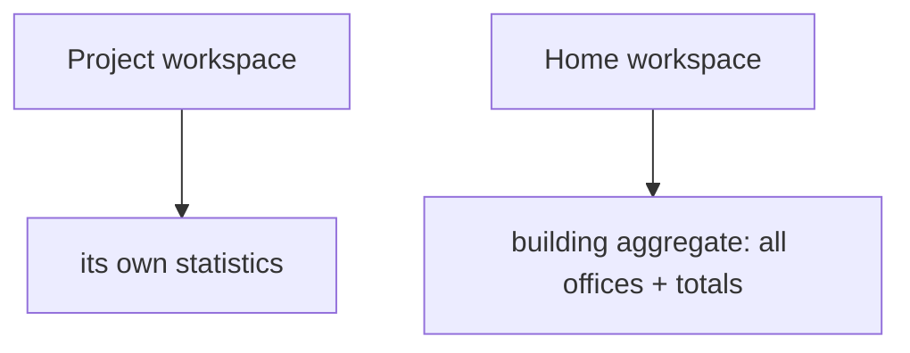

# Dashboard & Statistics

**Version:** 1.0.0
**Status:** Stable
**Layer:** concept

## Overview

The technology-agnostic model of the dashboard: a live, read-only statistics view of a workspace — work throughput, activity, cost, schedules, memory — derived from existing state. Each office shows its own metrics; the home workspace shows a building-level aggregate. It is the metrics projection, complementary to the office graph view.

## Related Specifications

- [l1-office-visualization.md](l1-office-visualization.md) - Sibling projection (graph/spatial); same projection-not-source principle.
- [l1-kanban-model.md](l1-kanban-model.md) - Board metrics (throughput, cards by state).
- [l1-telemetry.md](l1-telemetry.md) - Local metrics; sharing follows telemetry opt-in.
- [l2-dashboard.md](l2-dashboard.md) - Concrete metrics, sources, and the dashboard command.

## 1. Motivation

The user wants visibility into how the office is doing — at a glance — without operating it. A dashboard turns the raw state (board, sessions, costs, schedules, memory) into legible statistics, and rolls up across offices in the home workspace so the owner sees the whole building's health.

## 2. Constraints & Assumptions

- All metrics derive from state that already exists; the dashboard stores nothing authoritative.
- Metrics are local-first; nothing leaves the device except under telemetry opt-in.
- The dashboard is observational; the client does not operate the office through it.

## 3. Core Invariants (Layer 1 only)

- **DSH-1 (Projection, not source):** dashboard metrics are derived from existing state (board, sessions, cost ledger, schedules, memory); the dashboard MUST NOT be an independent source of truth.
- **DSH-2 (Live):** metrics reflect current state in near-real-time.
- **DSH-3 (Per-office + building aggregate):** each workspace shows its own statistics; the home workspace additionally shows a building-level aggregate across offices (consistent with WSL home/building).
- **DSH-4 (Observational):** the dashboard is read-only insight; it does not require the client to act (consistent with OFF-5).
- **DSH-5 (Privacy):** metrics stay local; any external sharing follows telemetry opt-in (TEL-1/2).
- **DSH-6 (Isolation):** a workspace dashboard shows only that office's data; the building aggregate reads across offices read-only (consistent with OFF-1).

> L2 specs cannot reach RFC status until all invariants here are addressed in their "Invariant Compliance" section.

## 4. Detailed Design

### 4.1 Metric groups

| Group | Examples |
| --- | --- |
| Work | cards by state, throughput, blocked count, cycle time |
| Activity | active agents, running tasks, recent sessions |
| Cost | token/cost usage vs budget (per office/agent) |
| Schedules | upcoming/overdue routines, heartbeat status |
| Memory | memory size by scope, recent learnings |

### 4.2 Scope

## 5. Drawbacks & Alternatives

- **Metric overload:** too many numbers obscure signal; mitigated by curated default metric groups. <!-- TBD: default metric set and refresh cadence -->
- **Alternative — no dashboard (status command only):** rejected; a visual dashboard is an explicit product need.

## Canonical References

| Alias | Path | Purpose |
| --- | --- | --- |
| `[OFFICE-VIZ]` | `.design/main/specifications/l1-office-visualization.md` | Sibling projection principle |
| `[DASHBOARD]` | `.design/main/specifications/l2-dashboard.md` | Concrete realization |
