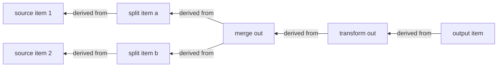

# Data Lineage

**Version:** 1.0.1
**Status:** Stable
**Layer:** concept

## Overview

When data flows through a multi-step process — an automation, an agent pipeline, a chain of tool calls — a natural and repeatedly-needed question is *"where did this particular output come from?"*. This spec names the discipline that keeps that answerable: **data lineage** — every data item a step produces carries a traceable **derivation link** back to the item(s) it was derived from, so any datum, at any point, is traceable through every transformation to its originating source(s).

The enabling granularity is the **item**: data moves between steps not as one opaque blob but as a collection of discrete items, and a step maps its logic over them, so lineage is recorded at the item grain — output item *j* names the input item(s) it came from. Following those links transitively reconstructs the full derivation graph over the data, independent of the step-event graph the ledger already records. Lineage is deliberately **side-band metadata**: it never changes what a step computes, only what can be traced afterward. It answers a question none of the existing provenance contracts do — not "is this trusted" (context provenance), not "is this authentic" (attestation), not "is this claim supported" (grounding), but **"what produced this."**

## Related Specifications

- [l1-automation-pipeline.md](l1-automation-pipeline.md) — the dataflow whose items lineage tracks; AP payload items/descriptors are the units a derivation link connects.
- [l1-execution-graph.md](l1-execution-graph.md) — the step graph the data-derivation graph overlays; lineage is the data-grain complement to the step-grain execution record.
- [l1-operational-ledger.md](l1-operational-ledger.md) — the append-only record of *events*; lineage is the parallel record of *data derivation*, composed at LN-6 so an interaction's data is traceable, not only its steps.
- [l1-claim-verification.md](l1-claim-verification.md) — output grounding: a produced claim/artifact is traceable to the source data it derived from (LN-6), strengthening grounding with a derivation path.
- [l1-context-provenance.md](l1-context-provenance.md) — trust-labeling of values for injection defense; **distinct** from lineage — provenance answers *is this trusted*, lineage answers *what produced this* (LN-6 demarcation).
- [l1-attestation.md](l1-attestation.md) — artifact integrity/authorship; a third distinct provenance-family question, demarcated at LN-6.
- [l1-output-contracts.md](l1-output-contracts.md) — the typed shape of the items a derivation link connects.
- [l1-security.md](l1-security.md), [l1-storage-model.md](l1-storage-model.md) — the retention/consent boundary lineage records stay within (LN-8).
- [../../nodus/specifications/l1-nodus-observability.md](../../nodus/specifications/l1-nodus-observability.md) — HO-13 per-item derivation lineage is the nodus-workflow realization: an optional side-band derivation descriptor on collection-mapping execution events.
- [l1-reproduction-recipe.md](l1-reproduction-recipe.md) — [ADDED v1.0.1] the deliberately opposite placement: lineage stays in the trace as side-band metadata (LN-5), the recipe travels embedded with the artifact once it leaves the system.

## 1. Motivation

Without lineage, a multi-step dataflow is a one-way street: an output arrives and there is no reliable way to say which input produced it. When an automation emits a wrong record, debugging means re-running and guessing which upstream item and which transformation is at fault. When an agent's answer cites a figure, "which source row did that figure come from" is unanswerable without re-deriving it. When a pipeline fans a list out, transforms each element, filters some, and merges the rest, the correspondence between what came in and what went out is lost the moment it is not recorded.

Lineage makes the derivation explicit and captured **at the moment it happens**. Because each step records how its outputs map to its inputs (one-to-many for a fan-out, many-to-one for a merge, some-to-none for a filter), the individual links compose into an end-to-end derivation graph: any output item is walkable back to its originating source items across the whole flow. That buys precise debugging ("this bad output traces to that input through this transform"), data-grain auditability ("this deliverable was derived from exactly these sources"), and stronger grounding ("this claim's number came from this row"). And because lineage is side-band metadata — references, not copies — it delivers all of that without altering the data or duplicating it.

## 2. Constraints & Assumptions

- Lineage is **observational**: capturing it must not change any step's business result. Stripping every lineage link yields byte-identical business output.
- Lineage is captured **at production time by the runtime**, not reconstructed post-hoc by re-execution or inference.
- Lineage records **references** to source items (identifiers/positions), never copies of their content — it is a traceability index, not a second data store.
- This is a Layer 1 concept: it names no serialization, id scheme, or storage engine. The concrete lineage encoding is a Layer-2 concern.
- Lineage answers a distinct question from the trust-provenance, integrity-attestation, and claim-grounding contracts; it composes them (LN-6) but does not replace any.

## 3. Core Invariants

Rules every Layer 2 realization MUST NOT violate. They are technology-neutral.

- **LN-1 (Item-grained dataflow):** data moves between steps as a **collection of discrete items**, each a self-contained record (optionally with a structured payload plus an out-of-band binary attachment), and a step **maps its logic over the items**. The item is the unit of both processing and lineage; a step that treats its whole input as one opaque blob forfeits item-grained traceability.

- **LN-2 (Every derived item records its immediate source):** each item a step **produces** carries a **derivation link** naming the input item(s) it was **derived from**. The link is captured **when the item is produced**, by the runtime, from the actual data path — not inferred afterward. An item with no recorded source where one exists is a lineage defect.

- **LN-3 (Transitive end-to-end traceability):** because each step records immediate derivation (LN-2), **any item at any point is traceable back to its originating source item(s)** by following derivation links across every intervening step. "Where did this come from?" is answerable for any datum across the whole flow, without re-execution or guesswork.

- **LN-4 (Faithful links — neither fabricated nor lost):** a derivation link is recorded **only** when a real derivation occurred and **whenever** one did. A step must not name a source it did not use (fabrication) nor omit a source it did (loss). The true mapping is recorded for each shape: **fan-out** (one input → many outputs) links every output to its one source; **fan-in / merge** (many inputs → one output) links the output to all contributing sources; **filter** (some inputs → no output) records the drop. Many-to-many mappings are recorded as they truly are.

- **LN-5 (Metadata, never payload):** the derivation link is **side-band metadata** attached to an item; it is not part of the item's business content and it never influences how a step computes. Removing lineage changes only what can be traced, never the result. Lineage is observational — data, like an audit record, not control.

- **LN-6 (Composes the run record and grounding; distinct from trust and integrity):** the derivation graph **composes** the operational ledger (data is traceable, not only events) and output grounding (a produced claim traces to its source data), delivering auditability at the **data grain**. It answers a **different** question than context-provenance (is this datum trusted), attestation (is this artifact authentic), and claim-verification (is this claim supported): lineage answers **what produced this**. The four are complementary provenance-family contracts, never conflated.

- **LN-7 (Survives suspension and sub-flows):** derivation links are **preserved across a suspended/resumed run** (a paused step's items keep their lineage on resume) and **across a nested sub-flow boundary** (an item entering a sub-flow, and the results it yields, retain the link across the boundary). Pausing, checkpointing, or composing flows never severs traceability.

- **LN-8 (Bounded and privacy-respecting):** lineage records **references** to source items — identifiers or positions — not **copies** of their content, so tracing neither duplicates nor leaks payloads; and lineage is retained under the **same retention and consent boundary** as the data it describes (composing the storage/security posture). Traceability must never become a covert second copy of user data or outlive the data it points at.

> L2 specs cannot reach RFC status until all invariants here are addressed in their "Invariant Compliance" section.

## 4. Detailed Design

### 4.1 The item and its link

```text
[REFERENCE]
item := { payload, attachment?, lineage }          // LN-1 / LN-5
lineage := [ source_ref ]                            // LN-2: references, not copies (LN-8)
source_ref := (producing_step, source_item_index)    // an identifier, never source content
```

The `lineage` field is side-band (LN-5): a step's business logic reads `payload`/`attachment` and never `lineage`; the runtime writes `lineage` as it produces each output item, from the real input-to-output correspondence (LN-2/LN-4).

### 4.2 Shapes of derivation

| Step shape | Input → output | Recorded lineage (LN-4) |
| --- | --- | --- |
| map / transform | N → N (1:1) | each output → its one source |
| fan-out / split | 1 → M | each of the M outputs → the one source |
| fan-in / merge | K → 1 | the output → all K contributing sources |
| filter | N → ≤N | surviving outputs → their source; drops recorded |
| aggregate | N → 1 (summary) | the summary → all N inputs it summarized |

Each shape records its true many-to-many correspondence, so no shape silently breaks the chain.

### 4.3 Tracing back



Walking the derivation links (right-to-left) from any output reaches its originating sources (LN-3) — here one output traces through a transform and a merge back to two distinct source items. The walk uses only references (LN-8); it reads no source content unless the tracer explicitly dereferences one within the retention/consent boundary.

### 4.4 Why side-band, not payload

Keeping lineage out of the payload (LN-5) is what makes it safe and cheap: business logic and business results are unchanged, so lineage can be added to an existing flow without touching a single transform; and because it holds references not copies (LN-8), the traceability index stays small and does not become a second, unmanaged copy of user data. This is the same discipline an audit record follows — observe without perturbing, reference without duplicating.

## 5. Drawbacks & Alternatives

**Alternative: reconstruct lineage by re-running.** Rejected by LN-2 — re-execution is expensive, non-deterministic for LLM steps, and cannot recover a past run's actual data path; lineage must be captured when it happens.

**Alternative: inline lineage into the payload.** Rejected by LN-5 — it entangles traceability with business data, changes step results, and risks lineage driving logic; side-band metadata keeps the concerns separate.

**Alternative: copy source content into each link.** Rejected by LN-8 — it duplicates and leaks user data and bloats the index; references plus a boundary-respecting dereference give tracing without a second copy.

**Risk: cost at high fan-out.** A large fan-out or aggregate records many links. Mitigation: references are compact (LN-8), and lineage is optional per flow — a flow that needs no traceability records none (composing the observability opt-in stance).

## Canonical References

| Alias | Path | Purpose |
| --- | --- | --- |
| `[PIPELINE]` | `.design/main/specifications/l1-automation-pipeline.md` | The item dataflow lineage tracks (LN-1) |
| `[LEDGER]` | `.design/main/specifications/l1-operational-ledger.md` | The event record lineage composes at the data grain (LN-6) |
| `[GROUNDING]` | `.design/main/specifications/l1-claim-verification.md` | Output grounding a derivation path strengthens (LN-6) |
| `[NODUS]` | `.design/nodus/specifications/l1-nodus-observability.md` | The host-neutral realization: HO-13 per-item derivation lineage on execution events |

## Document History

| Version | Date | Author | Notes |
| --- | --- | --- | --- |
| 1.0.0 | 2026-07-09 | Core Team | Initial stable spec — data lineage: derivation traceability across a dataflow. Item-grained dataflow with per-item mapping (LN-1); every derived item records its immediate source at production time (LN-2); transitive end-to-end traceability (LN-3); faithful links neither fabricated nor lost, recording true fan-out/merge/filter/aggregate mappings (LN-4); side-band metadata that never alters payload or logic (LN-5); composes the operational ledger + grounding at the data grain and is distinct from trust-provenance / attestation / claim-verification (LN-6); survives suspension and sub-flow boundaries (LN-7); references-not-copies, retention/consent-bounded, never a covert second copy (LN-8). Composes l1-automation-pipeline / l1-execution-graph / l1-operational-ledger / l1-claim-verification. Distilled from an adoption pass over an external workflow-automation-engine reference (item-based dataflow with paired-item lineage). |
