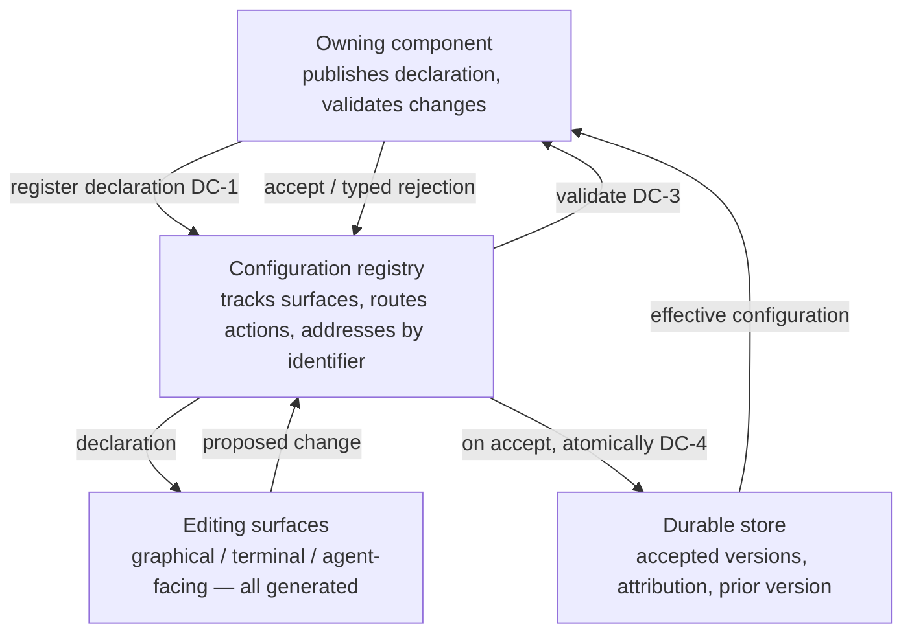

# Declarative Configuration Surfaces

**Version:** 1.0.0
**Status:** Stable
**Layer:** concept

## Overview

The contract that makes everything configurable in the system editable through **one** mechanism, without anyone hand-writing an editor for it.

A configurable component **publishes** its own configuration surface as a machine-readable declaration — fields, types, ranges, defaults, secrecy, human descriptions. Every editing surface (graphical, terminal, agent-facing) is **generated** from that declaration. A proposed change is routed **back to the owning component** for semantic validation and takes effect only if the owner accepts it, wholly or not at all.

The consequence is structural, not cosmetic: adding a new configurable component adds **zero** editor code, produces no second copy of the field list to drift out of date, and cannot be misconfigured into an invalid state, because the only party that knows what "valid" means — the owner — is the party that decides.

## Related Specifications

- [l1-extensions.md](l1-extensions.md) - An extension's manifest declares *capabilities and permissions* (EXT-9); this spec covers its *configuration surface*. Same registry, adjacent declarations.
- [l2-config-hotreload.md](l2-config-hotreload.md) - The runtime application path: which accepted changes apply live and which need a restart. This spec ends at acceptance; hot-reload begins there.
- [l1-security.md](l1-security.md) - Secret isolation, which DC-9 restates at the configuration boundary.
- [l1-action-gating.md](l1-action-gating.md) - A configuration change is an effect and passes the same risk-proportional gate (DC-10).
- [l1-policy-governance.md](l1-policy-governance.md) - Policy is authored on the human authority plane; configuration is not a channel for widening it (DC-10).
- [l1-agent-tool-ergonomics.md](l1-agent-tool-ergonomics.md) - The generated surface is also the agent-facing one; its schema is what makes an agent able to configure safely (DC-2).
- [l1-operational-health.md](l1-operational-health.md) - Alert rules, thresholds, and role-to-channel mappings are configuration surfaces governed by this contract (OH-13).
- [l1-storage-model.md](l1-storage-model.md) - Where accepted configurations durably live (DC-6).
- [../../nodus/specifications/l1-nodus-language.md](../../nodus/specifications/l1-nodus-language.md) - The workflow-language realization: a configuration section declares a validated surface (NL-20).

## 1. Motivation

A system with many components — offices, agents, extensions, connectors, collectors, alert rules, model providers — accumulates configuration faster than anything else in it. Two default approaches both fail, in mirror-image ways.

**Hand-edited files** put the burden on the user and the failure on the system: a typo produces an obscure runtime error long after the edit, invalid combinations are only discovered when something breaks, and there is no discoverable list of what is even configurable. The system's own knowledge of what constitutes a valid value stays trapped in validation code that runs too late.

**Hand-built editors** move the burden to the developers and produce drift: every configurable component needs a form, the form duplicates the field list, and the copy rots. Ten components mean ten forms and ten opportunities for the form to disagree with the code. Worse, the form usually validates *shape* (this is a number) while the component validates *meaning* (this port is reachable, this credential works) — so the user gets a green form and a broken component.

The resolution is to make the declaration the single artifact. If the component publishes its own schema, the editor is derived rather than written; there is no second copy to drift; and the validation the user hits is the component's own, not a weaker shape-check standing in front of it. Both burdens disappear at once.

Three further properties turn this from a convenience into infrastructure. **Templates and instances** make "configure fifteen of the same kind of thing" a first-class operation instead of fifteen near-identical copies. **Uniformity across built-in and external components** means an extension is configured exactly like a core subsystem, with no privileged internal path that external authors cannot reach. And a **generated, schema-described surface is the one an agent can safely drive** — an agent can read a schema and propose a valid change; it cannot reliably guess at an undocumented file format.

## 2. Constraints & Assumptions

- Configuration is data about *how a component behaves*. It is not policy (which authority grants what), not state, and not user content.
- The declaration is machine-readable and self-describing; a component with no declaration is simply not editable through the generic surface (DC-2) — it is never editable by guesswork.
- Acceptance and application are separate steps. This spec governs declaration, editing, validation, and acceptance; the runtime application path (live vs restart-required) is owned by the hot-reload layer.
- Configuration lives and stays on-device by default, like all other durable state.
- The mechanism is uniform but not universal: components may still have compile-time constants and internal tunables that are deliberately not exposed. What is exposed is exposed *only* this way.

## 3. Core Invariants

Rules every Layer 2 implementation MUST NOT violate:

- **DC-1 (The owner publishes its own surface, and it is the only copy):** a configurable component registers a machine-readable declaration of its configuration — field names, types, ranges/enumerations, defaults, required-ness, secrecy, and human-readable descriptions. There is exactly **one** such declaration per surface, owned by the component. A second, separately-maintained copy of the field list anywhere — a hand-written form, a duplicated documentation table, a parallel validation schema — is forbidden, because a second copy will drift and the drift will be invisible.
- **DC-2 (Editing surfaces are generated, never authored per component):** every editing surface — graphical, terminal, and agent-facing — is rendered **from** the declaration. Introducing a new configurable component adds no editor code to any surface. A component that publishes no declaration is not editable through the generic surface at all.
- **DC-3 (The owner validates; rejection is typed and explanatory):** a proposed change is submitted to the **owning component**, which accepts or rejects it *before* it takes effect. Schema-shape validity is necessary and never sufficient — semantic validation (reachability, credential validity, mutual field constraints, conflicts with other instances) belongs to the owner and MUST NOT be approximated by the editing surface. A rejection carries a typed reason and a human-readable explanation naming the offending field.
- **DC-4 (Nothing takes effect until accepted; application is atomic):** a change is applied only after acceptance, and it applies **wholly or not at all**. A partially-applied configuration is forbidden. Until a new configuration is accepted and applied, the previously effective one remains fully effective — a rejected or failed change never leaves the component unconfigured.
- **DC-5 (Three declaration kinds — single, template, instance):** every surface is exactly one of: a **single** standalone configuration; a **template**, a blueprint from which instances are created; or an **instance**, created from a template. The actions available on a surface follow from its kind — a template may be instantiated but never enabled or tested; an instance may be enabled, disabled, tested, and removed. This is what makes configuring many of the same kind of thing a first-class operation rather than a copy-paste discipline.
- **DC-6 (Durable, attributed, revertible):** accepted configurations persist across restarts; each change records **who** changed **what** and **when**; and the previously effective version can be restored. A configuration that exists only in memory, or whose provenance is unknown, is forbidden — an unattributable configuration change is an unauditable one. A configuration whose owning component is no longer present (an uninstalled extension, a removed subsystem) is **retained and marked orphaned** — neither silently discarded nor silently applied; reinstating the owner restores it, and discarding it is an explicit, recorded action.
- **DC-7 (Uniform for built-in and external components):** a component built into the system and one supplied by an extension publish, are edited, are validated, and are persisted through the **same** mechanism and the same surfaces. There is no privileged internal path and no second-class external one. Whatever a core subsystem can express about its configuration, an extension can express too.
- **DC-8 (Stable hierarchical addressing):** every surface has a stable, hierarchical identifier (owner → category → name) which is how it is referenced in audit records, permission grants, and automation. Renaming a surface is a **recorded migration**, never a silent re-point — a permission or automation bound to an identifier must never silently come to mean a different surface.
- **DC-9 (Secrets are write-only through the surface):** a field declared secret may be set, replaced, or cleared through the surface, but its value is **never** returned by a read, never rendered, never included in an exported configuration, and never written to a trace or log. The declaration marks secrecy so that every generated surface honours it automatically rather than each surface remembering to (composing the secret-isolation rules).
- **DC-10 (Permission-gated and authority-preserving):** reading and changing a surface is subject to the same authority model as any other effect: an actor — human or agent — may propose a change only where it holds that capability, and a consequential change passes the same risk-proportional gate as other consequential actions. Configuration MUST NOT be a channel through which an actor widens its own authority: a component's configuration surface can never grant a capability, relax a policy, or raise a limit that the authority plane owns.

> L2 specs cannot reach RFC status until all invariants here are addressed in their "Invariant Compliance" section.

## 4. Detailed Design

### 4.1 The four parties



The registry is a router and an address space, never an authority: it does not decide validity (DC-3) and does not interpret fields.

### 4.2 The change lifecycle

```text
[REFERENCE]
propose(surface_id, values, actor):
    surface := registry.lookup(surface_id)                      // DC-8
    require actor holds change-capability on surface            // DC-10
    shape_ok := check values against surface.declaration        // necessary, not sufficient
    if not shape_ok:      return TypedRejection(field, reason)  // DC-3
    verdict := surface.owner.validate(values)                   // DC-3, semantic
    if verdict is reject:  return TypedRejection(field, reason, explanation)
    atomically:                                                 // DC-4
        store.record(surface_id, values, actor, timestamp, prior)  // DC-6
        surface.owner.apply(values)                             // hot-reload layer owns "how"
    return Accepted
```

The ordering is the point: **capability → shape → owner semantics → atomic commit**. Nothing takes effect at any earlier step, and no step is skippable for convenience.

### 4.3 Kinds and their actions (DC-5)

| Action | Single | Template | Instance |
| --- | --- | --- | --- |
| Read declaration | ✓ | ✓ | ✓ |
| Update values | ✓ | ✓ (changes the blueprint) | ✓ |
| Create instance | — | ✓ | — |
| Enable / disable | ✓ | — | ✓ |
| Test | ✓ | — | ✓ |
| Remove | — | — | ✓ |

An action absent from a kind's row is not merely unused — it is **not offered** by the generated surface, so a kind's semantics cannot be violated through the UI.

### 4.4 Why validation must live with the owner

| Validation class | Example | Can the editing surface check it? |
| --- | --- | --- |
| Shape | "port is an integer in 1–65535" | Yes, from the declaration |
| Cross-field | "credentials required unless auth is `none`" | Only if the declaration expresses it; often it does not |
| Environmental | "this endpoint is reachable and answers" | **No** |
| Cross-instance | "another instance already claims this identity" | **No** |
| Semantic | "this credential is accepted by the remote service" | **No** |

Three of five classes are structurally unavailable to the surface. A design that validates only what the surface can see produces the exact failure this spec exists to prevent: a green form in front of a broken component.

### 4.5 Boundary with neighbouring layers

| Concern | Owner |
| --- | --- |
| What fields exist, what values are valid | This spec (declaration + owner validation) |
| Whether an accepted change applies live or needs a restart | Hot-reload layer |
| What an actor is *allowed* to configure | Authority / action-gating layer (DC-10 defers to it) |
| Where accepted configurations physically live | Storage model |
| What capabilities an extension holds | Extension manifest (adjacent declaration, not this one) |

## 5. Drawbacks & Alternatives

- **A declaration is an extra artifact for a component author to maintain.** Accepted — and it replaces both a hand-written form and a hand-written documentation table, so it is a net reduction. DC-1 makes the trade explicit by forbidding the copies it replaces.
- **Generated surfaces are less polished than hand-crafted ones.** Accepted for the generic path; a component whose configuration genuinely warrants a bespoke experience may still get one, provided it drives the *same* declaration and the *same* validation route (DC-3) rather than a parallel path.
- **A round-trip to the owner for validation is slower than local checking.** Accepted: §4.4 shows local checking cannot answer most of the questions that matter, and a fast wrong answer is worse than a slow right one.
- **Alternative — hand-edited configuration files only.** Rejected: late failure, no discoverability, no attribution, and no safe surface for an agent to drive.
- **Alternative — hand-built editor per component.** Rejected by DC-1/DC-2: it duplicates the field list, guarantees drift, and validates shape while the component validates meaning.
- **Alternative — validate entirely in the editing surface from a rich schema.** Rejected by §4.4: environmental, cross-instance, and semantic validity are unavailable to any surface, no matter how rich the schema.
- **Alternative — separate mechanisms for internal and external components.** Rejected by DC-7: it creates a privileged internal path, and external authors then reimplement a worse version of it.

## Canonical References

| Alias | Path | Purpose |
| --- | --- | --- |
| `[EXTENSIONS]` | `.design/main/specifications/l1-extensions.md` | Adjacent declaration (capabilities/permissions) and the registry both share. |
| `[HOTRELOAD]` | `.design/main/specifications/l2-config-hotreload.md` | The application path that begins where DC-4 acceptance ends. |
| `[SECURITY]` | `.design/main/specifications/l1-security.md` | Secret-isolation rules DC-9 restates at the configuration boundary. |
| `[GATING]` | `.design/main/specifications/l1-action-gating.md` | The risk-proportional gate a consequential configuration change passes (DC-10). |

## Document History

| Version | Date | Author | Notes |
| --- | --- | --- | --- |
| 1.0.0 | 2026-07-23 | Core Team | Initial spec — declarative, owner-validated configuration surfaces: the owner publishes the single machine-readable declaration with no second copy anywhere (DC-1), every editing surface generated from it so a new configurable component adds no editor code (DC-2), owner-side semantic validation with typed explanatory rejection since shape-validity is never sufficient (DC-3), nothing effective until accepted and application atomic with the prior configuration remaining effective until then (DC-4), three kinds single/template/instance with kind-determined actions (DC-5), durable + attributed + revertible (DC-6), identical mechanism for built-in and extension-supplied components with no privileged internal path (DC-7), stable hierarchical addressing with renaming as a recorded migration (DC-8), secrets write-only through the surface and never echoed/rendered/traced (DC-9), permission-gated and never a channel for self-widening authority (DC-10). Concept-only. |
