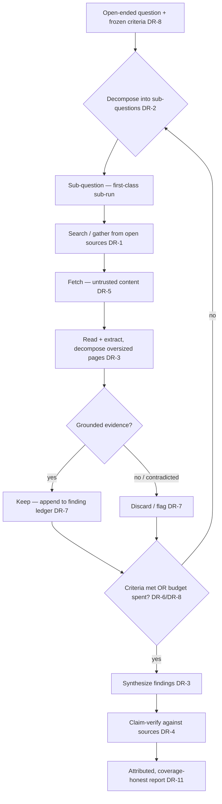

# Deep Research

**Version:** 1.0.0
**Status:** Stable
**Layer:** concept

## Overview

Deep research is the capability to answer an **open-ended question** by autonomously investigating **external, open-ended sources** — searching, fetching, reading, and synthesizing until the question is answered within a fixed budget, then delivering a **claim-verified, source-attributed report**. It is the office's "research assistant" mode: given a goal like *"survey the current approaches to X and recommend one,"* it decomposes the goal into sub-questions, gathers from the open world (web pages, docs, data feeds) whose full extent is not known in advance, reads what it fetched rather than dumping it, and combines grounded findings into an honest deliverable.

The load-bearing distinction from its neighbours is the **subject** of the loop. Recursive decomposition processes a *given, bounded* oversized input that is already in hand; deep research pursues an *open-ended* question whose source set is **discovered during** the investigation. Harness engineering runs the same disciplined iterate-evaluate-keep/discard loop over the *agent's own harness*; deep research runs it over an *external question about the world*. Deep research therefore owns no new loop machinery — it **composes** the existing bounded-loop, budget, grounding, and provenance contracts and adds exactly one uncovered concern: **autonomous investigation of an open question over open sources, ending in a grounded synthesis**.

## Related Specifications

- [l1-recursive-decomposition.md](l1-recursive-decomposition.md) — the sibling that processes a **given, bounded oversized input**; deep research gathers from **external open-ended sources** and reuses RD's map-then-reduce decomposition for its sub-question tree (DR-2).
- [l1-claim-verification.md](l1-claim-verification.md) — the faithfulness gate every deep-research report passes before delivery: claims are verified against the gathered, attributed pages (DR-4 composes CV-9).
- [l1-browser-control.md](l1-browser-control.md) — the live-DOM fetch substrate deep research can ride for pages a static fetch cannot render; static search-and-fetch is the other gather path (DR-1, DR-3).
- [l2-deep-research.md](l2-deep-research.md) — the Layer-2 realization of this concept: the iterative Think→Plan→Search→Extract→Synthesize web-research engine.
- [l1-context-provenance.md](l1-context-provenance.md) — fetched external content is untrusted data neutralized at the prompt boundary; deep research is a prime consumer (DR-5 composes CP-1/CP-2).
- [l1-loop-governance.md](l1-loop-governance.md) — the bounded-loop discipline deep research composes: frozen criteria (LG-3), oracle ownership (LG-4), state externalization (LG-5), hard ceiling (LG-6) — realized as DR-6/DR-8/DR-9/DR-10.
- [l1-generation-budget.md](l1-generation-budget.md) — the accountable spend an investigation runs under and rolls up (DR-6, DR-10).
- [l1-data-lineage.md](l1-data-lineage.md) — every finding traces to the source it was gathered from; the report is attributed by construction (DR-11).
- [l1-harness-engineering.md](l1-harness-engineering.md) — the sibling loop over a **different subject** (the agent's own harness); deep research adopts its append-only history discipline (HE-7) for its finding ledger (DR-7) without duplicating the harness-evolution machinery.
- [l1-orchestration.md](l1-orchestration.md) — the sub-call/delegation and context-isolation machinery each sub-investigation runs on (DR-2, DR-10).
- [l1-work-liveness.md](l1-work-liveness.md) — the affirmative-liveness contract behind DR-9: an autonomous investigation always has a typed next-move or is surfaced stalled.

## 1. Motivation

A capable office is regularly handed questions that no single document answers: *"what are the tradeoffs between these three libraries,"* *"summarize what changed in this domain over the last year,"* *"find and reconcile the conflicting guidance on Y."* Answering these well is not one retrieval — it is an **investigation**: form sub-questions, search, read what comes back, notice gaps, search again, and only then write. Done naively, this fails in predictable ways. An agent that pastes fetched pages into its window drowns; one with no budget searches forever or stops arbitrarily; one that treats fetched text as instructions gets hijacked by a hostile page; one that writes from memory instead of from what it gathered hallucinates a confident, wrong report; one that decides for itself when it is "done" quietly lowers the bar to finish early.

Each of those failure modes already has an owner in this project — bounded recursion, generation budget, context provenance, claim verification, loop oracle-ownership. What is missing is the **concept that ties them into a single named capability** and adds the one piece none of them own: the autonomous outer investigation over open, discovered sources that ends in a grounded synthesis. This spec names that capability, states the invariants a realization must not violate, and proves it duplicates none of its neighbours — it composes them.

## 2. Constraints & Assumptions

- The source set is **open and discovered**, not supplied — deep research does not assume it starts with the documents; it finds them. (This is the line against recursive decomposition, which starts with the input in hand.)
- External fetched content is **untrusted by default** — a fetched page is data, never an instruction the investigation obeys.
- Deep research is **bounded and terminating** — it runs under an explicit budget and against frozen success criteria; "research until satisfied" with no ceiling is out of scope.
- Deep research **composes** existing contracts (recursion, budget, provenance, verification, loop governance, lineage); it does not reinvent decomposition, accounting, injection defense, grounding, or oracle ownership.
- Autonomy is **scoped, not unconditional** — an investigation runs without asking "should I keep going?" *within* its sanctioned budget and egress scope; it never becomes a bypass of the authority/egress gates that govern fetching and reporting.
- Layer 1: it names no search engine, browser, crawler, model, or ranking algorithm. Fetch mechanics, chunking, and ranking are Layer-2 / policy.

## 3. Core Invariants

Rules every Layer 2 realization MUST NOT violate. They are technology-neutral.

- **DR-1 (Open, discovered sources — an environment explored, not a payload ingested):** deep research investigates a question by gathering from **external, open-ended sources** whose full extent is **unknown in advance and discovered during** the investigation. The sources are an environment the agent explores (search, follow, fetch), never a fixed corpus handed in whole — this is the defining line against recursive decomposition (given, bounded input).

- **DR-2 (Question decomposition into a bounded investigation tree):** an open-ended question is **decomposed into sub-questions** forming a **finite, bounded-by-construction** investigation tree, each sub-investigation a first-class sub-call. Deep research **reuses** recursive decomposition's map-then-reduce discipline (RD-2/RD-3/RD-4) for the tree and orchestration's sub-call isolation — it does not define its own recursion. Depth and breadth are capped; exceeding a bound fails safe and surfaces.

- **DR-3 (Gather → read → synthesize, never gather-and-dump):** the unit loop is **search/gather → read and extract from fetched content → synthesize into findings**. Raw fetched pages MUST NOT be dumped wholesale into the answer or forced into the window; an oversized fetched page is itself processed by recursive decomposition. What enters the deliverable is **synthesized findings**, not concatenated source text.

- **DR-4 (Grounded, claim-verified synthesis):** every factual claim in the delivered report is **verified against the gathered, attributed sources** before delivery, composing the claim-verification gate (CV-9). A claim the gathered sources do not support is downgraded or removed — never shipped. Coverage the investigation did not perform is **declared, not faked** (parallel to RD-8): a deep-research report may be honestly partial, but it MUST NOT fabricate findings or citations.

- **DR-5 (Untrusted-by-default source content):** content fetched from external open sources is **untrusted data at the prompt boundary**, neutralized per the context-provenance contract (CP-1/CP-2) — quoted, delimited, and never interpreted as instructions to the investigating agent. A fetched page MUST NOT be able to redirect the investigation, escalate authority, or trigger egress; provenance is sticky (a summary of a hostile page is still untrusted, CP-4).

- **DR-6 (Fixed budget; progress measured against the question, not the fetch count):** an investigation runs under an **explicit resource budget** (wall-clock / calls / tokens / fetch count) that rolls up and is accountable (composing the generation budget and loop-governance's hard ceiling LG-6). Progress and "enough" are measured against the **question's success criteria**, never against *how much was fetched* — a fixed budget is what makes "done" decidable and the investigation terminating.

- **DR-7 (Monotonic finding accretion with a keep/discard ledger):** findings **accrete monotonically** — a sub-investigation that yields grounded evidence is **kept**, one that yields nothing or is contradicted is **discarded or flagged**, and the two are **never silently blended**. An **append-only finding ledger** records each sub-investigation, its sources, and its keep/discard/contradicted disposition (adopting the append-only-history discipline HE-7), so the path to the conclusion is auditable and a later step can reuse a near-miss.

- **DR-8 (Frozen criteria + independently-gated faithfulness):** the success criteria that frame when the question is **answered** are **set at the start** of the investigation (they MAY be proposed by the agent as part of understanding the question) and then **frozen for its duration** — the agent MUST NOT move the goalposts mid-investigation to declare success early; changing them is a **new, recorded investigation**, not a silent in-flight edit (composing loop-governance criteria-immutability LG-3). The semantic "have I answered enough" judgment MAY rest with the agent, but it is bounded two ways it cannot relax: a **frozen hard ceiling** on effort (DR-6) and an **independent faithfulness gate** — the judgment that the deliverable's claims are grounded is decided by a check **separate from the generator** (the claim-verification gate DR-4, composing oracle-ownership LG-4), never by the writing agent's self-assessment. Anti-drift on the criteria and anti-self-grading on the output together stand in for the fully-external metric a closed-world evaluation loop would use.

- **DR-9 (Autonomous, never-stall operation within a hard ceiling):** once launched, the investigation proceeds **autonomously** toward its budget/criteria **without pausing to ask whether it should continue**; running out of near-term ideas is **not** a stop condition — it deepens (combine near-misses, broaden sources, reframe sub-questions) until the budget, the criteria, or an external interrupt ends it. It stalls only into a **surfaced, typed next-move** (composing work-liveness WL-3), never a silent hang, and its autonomy is **bounded by** the same authority/egress gates as any surface (never a bypass, composing DR-5 and the security envelope).

- **DR-10 (Observable, cost-rolled-up, resumable investigation):** every sub-investigation is a **first-class correlated run** whose fetches, token usage, and cost **roll up to the root** (composing RD-5 + the generation budget), and the investigation's live state — the finding ledger and the frontier of open sub-questions — is **externalized** (composing loop-governance state-externalization LG-5) so a crashed or paused investigation is **resumable** without redoing completed sub-investigations.

- **DR-11 (Attributed, coverage-honest deliverable):** the delivered report **attributes every finding to its source** with a locator (composing data-lineage), **distinguishes what was investigated from what was left open**, and reports its own **budget consumed and coverage** honestly (composing honest-reduction). A deep-research deliverable is a claim-verified, source-attributed, coverage-honest artifact — not a confident essay that hides its gaps.

> L2 specs cannot reach RFC status until all invariants here are addressed in their "Invariant Compliance" section.

## 4. Detailed Design

### 4.1 The investigation loop



Each sub-question is a bounded sub-run (DR-2); fetched content is untrusted (DR-5) and read rather than dumped (DR-3); grounded evidence is kept and the rest discarded into an append-only ledger (DR-7); the loop terminates on frozen criteria or budget (DR-6/DR-8); and only a claim-verified, attributed synthesis is delivered (DR-4/DR-11).

### 4.2 Termination is decidable, not vibes-based

```text
[REFERENCE]
investigate(question, criteria, budget):            # criteria + budget frozen up front (DR-8/DR-6)
    ledger := append_only()                          # DR-7
    frontier := decompose(question)                  # DR-2 (reuses recursive-decomposition)
    while frontier not empty and budget.remaining(): # DR-6 hard ceiling
        sq      := frontier.pop()
        pages   := gather(sq)                         # DR-1 open sources, discovered
        content := read(neutralize(pages))            # DR-5 untrusted; DR-3 read not dump
        finding := synthesize_local(sq, content)
        if grounded(finding): ledger.keep(sq, finding, sources_of(finding))   # DR-7
        else:                 ledger.discard(sq, reason)                       # DR-7
        if not criteria.met(ledger): frontier += refine(sq, finding)          # deepen, don't stop (DR-9)
    report := synthesize(ledger.kept())              # DR-3
    report := claim_verify(report, ledger.sources()) # DR-4 (reuses claim-verification)
    return attribute(report, ledger)                 # DR-11 (rides data-lineage)
```

"Done" is `criteria.met(ledger) or budget.exhausted` — an independent, frozen predicate (DR-8), never the agent's own in-flight judgment that it has done enough.

### 4.3 Ideas-to-Adopt Mapping (no-duplication proof)

Deep research draws its **loop discipline** from an external reference on bounded, self-directed experiment loops (a fixed-budget, keep-or-discard iteration against a frozen success metric). Every one of that reference's loop mechanics already has an owner in this project; only the **open-question / open-source investigation + grounded synthesis** concern was genuinely uncovered.

| Reference mechanic | Disposition | Owner |
| --- | --- | --- |
| Fixed per-iteration budget so runs are directly comparable and terminating | Already covered — composed as DR-6 | [l1-generation-budget.md](l1-generation-budget.md) + [l1-harness-optimization.md](l1-harness-optimization.md) HX-11 (budget-normalized evaluation) |
| Frozen evaluation harness / metric the agent cannot modify (no reward-hacking) | Already covered — composed as DR-8 | [l1-loop-governance.md](l1-loop-governance.md) LG-3/LG-4 + [l1-harness-engineering.md](l1-harness-engineering.md) HE-3 |
| Keep-or-discard progress + append-only experiment log | Already covered — adopted as DR-7 | [l1-harness-engineering.md](l1-harness-engineering.md) HE-7 (append-only history) |
| Autonomous never-stop loop until externally interrupted | Already covered — composed as DR-9 | [l1-loop-governance.md](l1-loop-governance.md) LG-6 + [l1-work-liveness.md](l1-work-liveness.md) WL-3 |
| Simplicity criterion — simpler wins, complexity must earn its keep | Already covered — not re-specified | [l1-harness-composition.md](l1-harness-composition.md) HC-1 (anti-bloat) |
| Bounded modification surface — only sanctioned artifacts are mutable | Already covered — not re-specified | [l1-loop-governance.md](l1-loop-governance.md) LG-2 (mutation-rights manifest) |
| Isolated run branch + commit-per-iteration reversibility | Already covered — not re-specified | [l1-version-control.md](l1-version-control.md) (virtual staging) + [l2-execution-workspace.md](l2-execution-workspace.md) (worktrees) |
| **Autonomous investigation of an open question over open, discovered sources → grounded, attributed synthesis** | **Genuinely uncovered — this spec** | **l1-deep-research (DR-1…DR-11)** |

The reference's subject is the agent improving *its own model/harness*; deep research's subject is the agent answering *a question about the world*. Same loop discipline, different subject — which is exactly why deep research composes the harness/loop family rather than duplicating it.

### 4.4 Placement in the research/quality family

| Mechanism | Question it answers |
| --- | --- |
| Recursive decomposition | How do I process a *given, bounded* over-window input in place? |
| **Deep research (this)** | How do I answer an *open question* by investigating *open, discovered* sources? |
| Claim verification | Is the produced text *faithful* to the sources it cites? (deep research's delivery gate) |
| Harness engineering | How do I evolve the *agent's own harness* under a frozen metric? |
| Retrieval evaluation | Did we *recall* the right material? |

### 4.5 nodus Relevance

Deep research maps onto nodus as a composed workflow rather than a new primitive: the investigation loop is a bounded `RUN`/loop over gather → read → synthesize steps, each `^validator`-gated; the untrusted-fetch neutralization is the language's data-boundary discipline (the nodus realization of context-provenance); the finding ledger externalizes through the host `StorageProvider` so the run is resumable; and the whole investigation is a candidate **macro** (a reusable "deep-research loop," matching the loop-runner's deep-research loop kind). Net: a `GATHER`/`VERIFY`-shaped step composition plus a resumable-state contract, not a language change.

## 5. Drawbacks & Alternatives

- **Cost and latency:** an investigation is many fetches and model passes. Mitigated by DR-6's fixed budget (bounded and terminating) and DR-2's bounded tree; deep research is invoked for genuinely open questions, not reflexively for one-shot lookups.
- **Hostile sources:** the open web includes pages crafted to hijack an agent. Mitigated by DR-5 — fetched content is untrusted data, neutralized at the boundary, and can never steer the investigation or trigger egress.
- **Confident-but-ungrounded reports:** the classic research-agent failure. Mitigated by DR-4 (claim-verified before delivery) and DR-11 (coverage-honest, attributed) — the deliverable declares its gaps instead of papering over them.
- **Alternative — one big retrieval + summarize:** rejected; a single retrieval does not discover follow-on sources, cannot decompose a multi-part question, and hides which claim rests on which page (violates DR-1/DR-2/DR-4).
- **Alternative — research until the agent feels satisfied (no budget/criteria):** rejected by DR-6/DR-8; an unbounded loop with agent-owned "done" never terminates predictably and quietly lowers its own bar. Frozen criteria + a hard budget make termination decidable.
- **Alternative — fold into recursive decomposition:** rejected as a merge; recursive decomposition assumes the input is *in hand and bounded*, deep research *discovers* an *open* source set. They compose (an oversized fetched page decomposes) but are distinct concepts.

## Canonical References

| Alias | Path | Purpose |
| --- | --- | --- |
| `[RECURSIVE-DECOMP]` | `.design/main/specifications/l1-recursive-decomposition.md` | The map-then-reduce decomposition deep research reuses for its sub-question tree (DR-2). |
| `[CLAIM-VERIFY]` | `.design/main/specifications/l1-claim-verification.md` | The faithfulness gate every report passes before delivery (DR-4). |
| `[CONTEXT-PROV]` | `.design/main/specifications/l1-context-provenance.md` | The untrusted-content neutralization deep research applies to fetched pages (DR-5). |
| `[LOOP-GOV]` | `.design/main/specifications/l1-loop-governance.md` | Frozen criteria, oracle ownership, ceiling, and state externalization deep research composes (DR-6/DR-8/DR-9/DR-10). |
| `[BUDGET]` | `.design/main/specifications/l1-generation-budget.md` | The accountable spend an investigation runs under and rolls up (DR-6/DR-10). |

## Document History

| Version | Date | Author | Notes |
| --- | --- | --- | --- |
| 1.0.0 | 2026-07-10 | Core Team | Initial stable spec — deep research: autonomous investigation of an open-ended question over external, open, discovered sources ending in a claim-verified, source-attributed, coverage-honest report. Open discovered sources as an explored environment not an ingested payload (DR-1); bounded sub-question investigation tree reusing recursive decomposition (DR-2); gather→read→synthesize never gather-and-dump (DR-3); grounded claim-verified synthesis, coverage declared not faked (DR-4); untrusted-by-default fetched content neutralized at the boundary (DR-5); fixed budget with progress measured against the question not the fetch count (DR-6); monotonic finding accretion with an append-only keep/discard ledger (DR-7); frozen success criteria owned by an independent oracle (DR-8); autonomous never-stall operation within a hard ceiling (DR-9); observable cost-rolled-up resumable investigation (DR-10); attributed coverage-honest deliverable (DR-11). Composes l1-recursive-decomposition / l1-claim-verification / l1-browser-control / l1-context-provenance / l1-loop-governance / l1-generation-budget / l1-data-lineage / l1-orchestration / l1-work-liveness. Loop discipline distilled from an adoption pass over an external reference on bounded, self-directed experiment loops (fixed-budget, keep-or-discard, frozen-metric iteration); every loop mechanic of that reference mapped to an existing owner (budget → generation-budget/HX-11, frozen metric → loop-governance LG-3/LG-4 + HE-3, keep/discard log → HE-7, never-stop → LG-6 + WL-3, simplicity → HC-1, mutation surface → LG-2, run isolation → version-control + execution-workspace) — only the open-question/open-source investigation + grounded synthesis was uncovered and is specified here. Realized by l2-deep-research (browser-control fetch path, loop-runner deep-research loop kind). Additive, no C12 cascade. |
