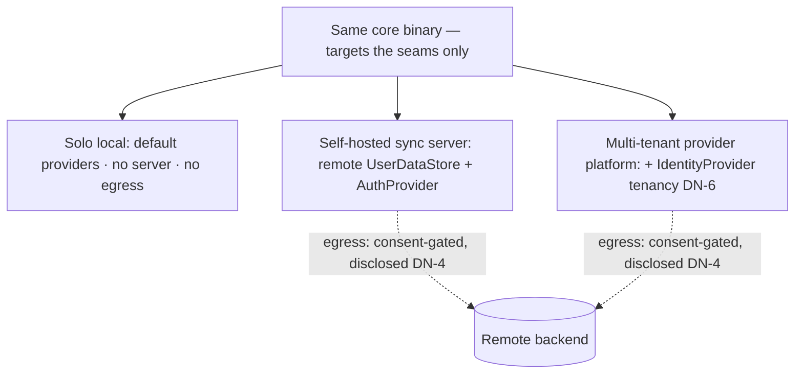

# Deployment Neutrality

**Version:** 1.0.0
**Status:** Stable
**Layer:** concept

## Overview

The product is **local-first and server-free by default**: it runs entirely on one person's machine, with a single local principal, no account, no sign-in, and no remote service in the loop. That default is the whole product, not a degraded offline mode. This spec names the discipline that keeps that true while **leaving the door open**: the planes a hosted deployment would need to change — **principal identity**, **authentication**, and **user-data persistence / sync** — are defined as **abstract provider seams** with built-in on-device defaults, so the *same core*, unmodified, can also run as a self-hosted parameter-sync server or as the base of a multi-tenant AI-providing platform, purely by a downstream supplying implementations of those seams.

The load-bearing rule is that a remote backend changes *where identity and data live*, never *what the core does or assumes*. The core takes **no dependency on a server**; it targets the provider interfaces, whose default implementations are on-device. A fork that wants authentication, a remote user-data database, and cross-device parameter sync adds those as **infrastructure-class plugins** — it does not touch the core. And because the default never phones home, moving any data off the device is always an explicit, consent-gated, disclosed act, never a silent one.

## Related Specifications

- [l1-architecture.md](l1-architecture.md) — INV-8 single-deployable modular monolith; deployment neutrality preserves it (a backend provider is a seam boundary, not a microservice split) and adds the optional-remote-backend dimension INV-8 does not name.
- [l1-security.md](l1-security.md) — the egress consent gate and on-device-first posture DN-4 composes; SEC-10 human-rooted authority DN-8 preserves.
- [l1-extensions.md](l1-extensions.md) — the registry/lifecycle that governs a backend provider as an **infrastructure-class extension** (DN-5): default-deny grant (EXT-3), manifest (EXT-9), sandbox (EXT-4), attestation (EXT-11), vetting.
- [l2-multi-user-auth.md](l2-multi-user-auth.md) — the existing local authentication realization; under this concept it is *one* provider of the identity/auth seam (local, single-user-disabled default), and the seam is what lets a remote auth provider replace it.
- [l1-storage-model.md](l1-storage-model.md) — the immutable-program / mutable-state tiers the user-data seam abstracts; portability of the mutable tier across backends (DN-7).
- [l1-multi-device-sync.md](l1-multi-device-sync.md) — peer device replication of the same engine; DN-3 generalizes "sync" to an optional server-mediated backend without making a server the assumption.
- [l1-user-model.md](l1-user-model.md), [l1-perspective-model.md](l1-perspective-model.md) — the single principal by default; tenancy (DN-6) is an optional overlay of many isolated principals.
- [l1-agent-federation.md](l1-agent-federation.md) — AF-2 human-rooted, never self-minted authority; DN-8 keeps a hosted backend from becoming a source of agent authority.
- [../../nodus/specifications/l1-nodus-portability.md](../../nodus/specifications/l1-nodus-portability.md) — LP-15 host-supplied durable-state seam (StorageProvider concretized) is the nodus-workflow realization of the storage provider seam.

## 1. Motivation

The natural way to add authentication and cross-device sync is to assume a server: a login screen on startup, a user row in a remote database, a service the app cannot function without. That assumption is corrosive for a local-first tool — it forces connectivity, a signup, and a trust relationship with an operator onto a user who wanted a private on-device assistant, and it entangles the core with a backend it now cannot run without. The opposite mistake is to hard-wire *no* server so thoroughly that a fork wanting to build a hosted product — a team sync service, or a company offering this as the base of its own AI-providing platform — has to fork the core and re-plumb identity and storage by hand.

Deployment neutrality avoids both. It states, once, that identity, authentication, and user-data live behind provider seams whose defaults are on-device, so the base case (a solo user, no server, no auth, nothing leaves the machine) needs nothing, and the hosted case (a self-hosted sync server, or a multi-tenant provider platform) is reachable by *adding* provider implementations — not by editing the core. The same binary serves both; the difference is which providers are installed. This is what "leave the door open without walking through it" means concretely: the seams exist, the defaults are local, and stepping to a remote backend is a deliberate, consent-gated deployment choice.

## 2. Constraints & Assumptions

- The **default is complete**: a fresh install is fully functional with zero server, zero auth, zero network egress for its own operation.
- **No core dependency on a backend**: the core compiles, runs, and passes its tests with only the on-device default providers; a remote backend is never required to build or boot.
- A backend provider is a **deployment/operator** choice, distinct from a *user* action; installing one changes the deployment's data topology.
- Remote persistence of user data is **egress** and is governed by the security consent gate; the core cannot persist off-device silently.
- This is a Layer 1 concept: it names no database, auth scheme, transport, or cloud. Concrete providers (local file auth, a specific remote store) are Layer 2 / downstream.

## 3. Core Invariants

Rules every Layer 2 realization MUST NOT violate. They are technology-neutral.

- **DN-1 (Local-first, zero-server default):** out of the box the system runs entirely on the user's device — a **single local principal**, no authentication step, no account, no remote service, and no network egress for its own operation. A working install requires no server, no signup, and no connectivity. The default is the whole product, not a fallback.

- **DN-2 (Identity / auth / storage are provider seams):** the three planes a hosted deployment must change — **principal identity**, **authentication**, and **user-data persistence / sync** — are each defined as an **abstract provider interface** with a built-in **on-device default** (local principal, no-auth, local store). The core targets the interface, never a concrete backend; no core logic assumes a server, an account, or a remote database exists.

- **DN-3 (Remote backend is additive and opt-in — the same core):** supplying a remote provider (auth backend, remote user-data store, sync service) is a downstream/deployment choice the core **enables but never requires**. Installing one changes *where identity and data live*, not *what the core does*; a fork turns the local app into a **self-hosted sync server** or a **multi-tenant provider platform** by **providing seam implementations only**, without modifying the core. The base binary and the hosted binary are the same code with different providers.

- **DN-4 (Remote persistence and egress are consent-gated, never default):** the default **never phones home**. Any provider that moves identity, credentials, or user data **off the device** is an explicit **egress act** behind the security consent gate — disclosed to the user, off by default, and impossible to perform silently. A downstream shipping a remote backend must surface that data leaves the device; the core makes covert remote persistence unrepresentable.

- **DN-5 (Backend providers are infrastructure-class extensions):** a backend provider (identity / auth / storage / sync / tenancy) is registered and governed as an **extension** — default-deny grant, declared manifest, sandbox, attestation, vetting (composing l1-extensions) — but of a distinct **infrastructure class**: it **replaces or backs a core plane** rather than adding a capability (a skill/tool). It declares which plane it provides, and the registry admits **exactly one active provider per plane**, so there is never ambiguity about where identity or data lives.

- **DN-6 (Multi-tenancy is an optional overlay, not a core assumption):** the core models a **single principal** by default. **Tenancy** — many isolated principals or organizations over one deployment — is an optional capability a hosted provider adds through the identity/auth seam, **not** a structure baked into every install. A local single-user install carries no tenancy tax; a provider platform enables tenant isolation without the core assuming multi-tenancy everywhere.

- **DN-7 (The principal's data is portable across backends — no lock-in):** because identity and user-data are seam-abstracted, a principal's data is **exportable and portable** between backends — local → remote, remote → local, or provider → provider — under a verifiable export (composing storage-model / attestation). The **local default is always a valid destination**: a user can always bring their data home, so choosing a backend never locks them in.

- **DN-8 (A backend never widens the core's authority):** installing a remote backend gives the **deployment operator** a place data lives and a gate users authenticate through — it does **not** grant the **agent or core** any new ambient authority. Authorization still descends from the human principal (composing SEC-10 and federation AF-2); a hosted backend is infrastructure, never a source of authority the agent can self-invoke. The seam moves *data and authentication*, never *the agent's right to act*.

> L2 specs cannot reach RFC status until all invariants here are addressed in their "Invariant Compliance" section.

## 4. Detailed Design

### 4.1 The three seams and their defaults

| Plane | Provider seam | On-device default (DN-1/DN-2) | A remote provider enables (DN-3) |
| --- | --- | --- | --- |
| Principal identity | `IdentityProvider` | one local principal, no account | accounts / handles, tenancy (DN-6) |
| Authentication | `AuthProvider` | no-auth (or local `l2-multi-user-auth`) | remote sign-in, SSO, tokens |
| User-data persistence / sync | `UserDataStore` | local on-device store | remote database, cross-device sync |

Exactly one provider is active per plane (DN-5). The default column is fully functional alone (DN-1); the right column is what a fork *adds* without touching the core.

### 4.2 One core, three deployments

The three deployments are the *same code*; only the installed providers differ (DN-3). The dashed edges — the only paths off the device — are consent-gated and disclosed (DN-4), and never exist in the default (D1).

### 4.3 Why a backend is an extension, not a rewrite

A backend provider rides the existing extension machinery (l1-extensions): it is discovered, its manifest declares the plane it backs, it is granted default-deny, sandboxed, attested, and vetted (composing l1-component-scanning) exactly like any other extension. The one distinction (DN-5) is that it backs a *core plane* (one-active-per-plane) rather than adding a capability — so "add authentication and a remote store" is *installing two infrastructure plugins*, and the plugin mechanism the project already has is the mechanism this uses. No new distribution, trust, or lifecycle model is invented; deployment neutrality is the *contract* that makes those planes swappable, and the extension system is the *how*.

## 5. Drawbacks & Alternatives

**Alternative: assume a server (login on startup, remote user row).** Rejected by DN-1/DN-4 — it forces connectivity, signup, and operator trust onto a local-first user and entangles the core with a backend it cannot run without.

**Alternative: hard-wire no server, ever.** Rejected by DN-3 — it forces a downstream building a hosted product to fork and re-plumb identity/storage by hand; the seam lets the same core serve both without a fork.

**Alternative: bake multi-tenancy into the core.** Rejected by DN-6 — every solo install would pay a tenancy tax it never uses; tenancy is a hosted overlay.

**Risk: a remote provider becomes a lock-in.** Mitigation: DN-7 mandates verifiable export and keeps the local default a valid destination, so the user can always come home.

## Canonical References

| Alias | Path | Purpose |
| --- | --- | --- |
| `[ARCH]` | `.design/main/specifications/l1-architecture.md` | INV-8 single-deployable monolith the seam preserves |
| `[SECURITY]` | `.design/main/specifications/l1-security.md` | The egress consent gate and on-device-first posture (DN-4) and SEC-10 authority (DN-8) |
| `[EXTENSIONS]` | `.design/main/specifications/l1-extensions.md` | The plugin registry/lifecycle a backend provider is governed by (DN-5) |
| `[NODUS]` | `.design/nodus/specifications/l1-nodus-portability.md` | The host-neutral realization: LP-15 host-supplied durable-state seam (StorageProvider) |

## Document History

| Version | Date | Author | Notes |
| --- | --- | --- | --- |
| 1.0.0 | 2026-07-09 | Core Team | Initial stable spec — deployment neutrality: local-first server-free default as the whole product (DN-1); principal identity / authentication / user-data persistence-sync as abstract provider seams with on-device defaults (DN-2); a remote backend additive and opt-in, the same core running solo-local, self-hosted sync server, or multi-tenant provider platform by supplying seam implementations only, without editing the core (DN-3); remote persistence and egress consent-gated and never silent (DN-4); a backend provider governed as an infrastructure-class extension, one active provider per plane (DN-5); multi-tenancy an optional hosted overlay not a core assumption (DN-6); the principal's data portable across backends with the local default always a valid destination, no lock-in (DN-7); a backend never widens the core's authority — data and authentication move, the agent's right to act does not (DN-8). Composes l1-architecture / l1-security / l1-extensions / l1-storage-model / l2-multi-user-auth / l1-agent-federation. Authored from an explicit design request to keep Cronus local-first and server-free while leaving a pluggable door open for authentication + remote user-data storage/sync (a fork's parameter-sync server or AI-providing platform) as an infrastructure plugin. |
