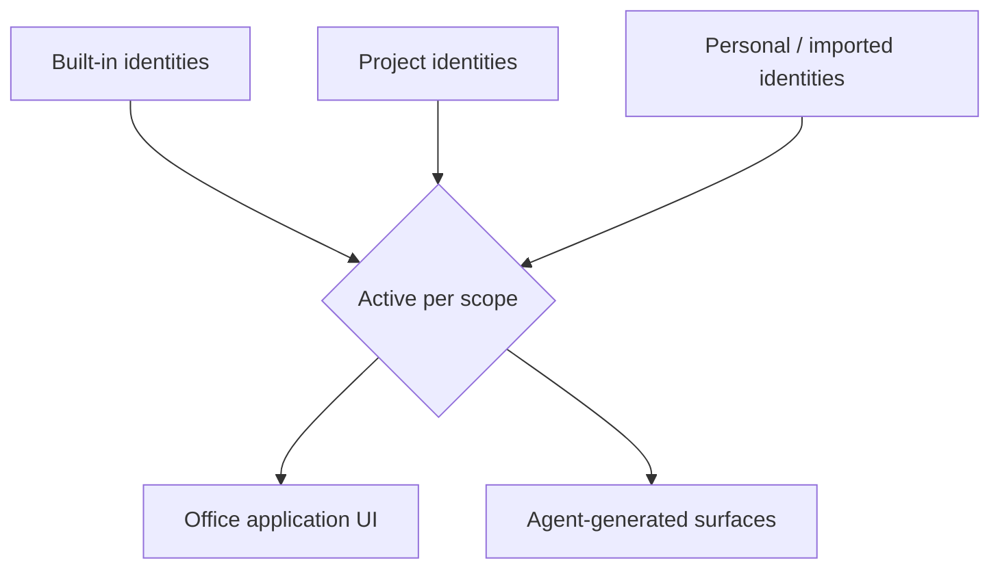

# Design Identity

**Version:** 1.0.0
**Status:** Stable
**Layer:** concept

## Overview

A paradigm-neutral model for **design identity** — the subsystem that supplies the office's
visual surfaces with a *named, swappable visual language* and holds their generated output to
a *checkable craft bar*. It has two faces that share one catalog engine:

1. **Identity catalog** — a layered set of named design systems (a visual language expressed
   as declared tokens, optional component fixtures, prose guidance, and a preview), each a
   schema-validated **data package** rather than hardcoded styling. Exactly one identity is
   active per rendering scope; identities are added, imported, layered, and overridden as
   data.
2. **Craft conformance** — a checkable, tiered definition of *good* visual output that the
   generated result is held to: a small set of blocking must-fix rules (mechanically enforced
   where possible), softer should-fix and nice-to-fix guidance, and an explicit stance against
   generic-default "template" output that reads as machine-generated rather than designed.

The two are linked: an identity declares which craft rules apply to output rendered under it.
Together they answer two questions the existing specs leave open — *what visual language does
the office design with?* and *what makes that output good rather than default?* — for both the
office's own themeable UI and the agent's generated surfaces.

This spec owns the identity/craft contract only. It does not build the concrete UI (that is
the app-UI implementation), define the render-and-perceive loop (that is the generative
surface), or set code-quality gates (that is quality standards). It is the visual-language and
craft layer those compose with.

## Related Specifications

- [l1-generative-surface.md](l1-generative-surface.md) — Agent-rendered interactive surfaces (GS-1…GS-8); a surface renders *under the active identity* and is held to the craft bar (DI-3, DI-5, DI-8), while staying a sandboxed, portable, projection-not-source artifact.
- [l2-app-ui.md](l2-app-ui.md) — The host application's theming; its built-in themes are the identity catalog's built-in layer, and user-defined/imported identities are the user layer (resolves the app-UI custom-theme question — DI-2, DI-8).
- [l1-quality-standards.md](l1-quality-standards.md) — Code definition-of-done gates (QLY-*); the craft bar (DI-5) is the *aesthetic* complement over user-facing visual output, not a duplicate of the code gates.
- [l1-output-contracts.md](l1-output-contracts.md) — Structural bounds/validation of a bounded output; craft conformance is the aesthetic layer above structural validity.
- [l1-facilitation.md](l1-facilitation.md) — FC-1 layered data-driven catalog pattern (built-in < project < personal, id-stable override) reused for both identities and craft rules (DI-2, DI-7).
- [l1-extensions.md](l1-extensions.md) — Identities and craft rules are user-extensible, distributable, importable assets governed by the extension lifecycle; EXT-11 import attestation applies to an imported identity (DI-4).
- [l1-attestation.md](l1-attestation.md) — Provenance/integrity witness for an imported identity package (AT-*); the source-provenance record of DI-4.
- [l1-extension-marketplace.md](l1-extension-marketplace.md) — Addressable, version-pinned, stable-identity resolution (XM-*) for an identity acquired from an external source (DI-4).
- [l1-security.md](l1-security.md) — Local-first, egress-gated import and secret-safe assets (DI-9).
- [l1-nodus-portability.md](../../nodus/specifications/l1-nodus-portability.md) — The workflow-library schema/vocabulary-extension (LP-4) and addressable import (LP-13) seams this pattern already generalizes host-side; see §5.7.

## 1. Motivation

The office produces user-facing visual output in two places: its own application UI, and the
interactive surfaces the agent generates as turn outputs. Both currently rest on a thin base —
a fixed light/dark theme and ad-hoc styling — with two consequences:

1. **No swappable visual language.** There is no first-class way to give the office (or a
   generated surface) a *named identity* — a coherent set of color, type, spacing, radius, and
   motion decisions — that a user can select, a project can pin, or an import can supply. The
   app-UI theming spec leaves "custom themes beyond light/dark" as an open question precisely
   because the concept it needs is unnamed.

2. **No craft floor for generated output.** An agent asked to render a surface, absent a
   quality contract, reaches for stack defaults — the default accent color, the default
   font, the templated section order, filler copy, decorative-but-meaningless flourishes.
   The result is recognizably machine-generated: technically valid (it passes structural and
   code gates) yet visibly *default*. Code-quality gates do not catch this because it is not a
   code defect; it is a *craft* defect.

Naming design identity as one subsystem buys three things:

1. **A swappable visual language as data.** One identity contract — tokens + optional
   components + guidance + preview — that the UI and every generated surface target, so a new
   identity is a data package, never a code change, and switching is instant and cosmetic.
2. **A checkable definition of good.** A tiered craft bar with a mechanically-enforced
   must-fix core turns "looks default" into a named, catchable regression, while keeping the
   softer, taste-dependent rules honestly labeled as advisory.
3. **Distinctiveness by default.** An explicit stance against generic-default output — a
   handful of blocked "default tells" plus an expectation of an intentional, identity-specific
   signature — so generated surfaces read as designed, not templated.

The cost of *not* modeling this is a product that either hardcodes one look (no per-user,
per-project, or imported identity) or generates surfaces that are indistinguishable from any
other tool's default output — passing every code gate and still looking generic.

## 2. Constraints & Assumptions

- **Technology-agnostic.** This is a Layer 1 concept. It names no CSS framework, token format,
  component library, or design tool. Concrete token schemas, the built-in theme set, and the
  linter that enforces the auto-checkable craft rules are Layer 2.
- **Cosmetic, never behavioral.** A design identity governs presentation only. Switching or
  editing an identity never changes behavior, data, or the meaning of any surface — it is a
  strict projection concern (consistent with the app-UI "theme is cosmetic-only" stance and
  the generative-surface projection-not-source rule).
- **Defers where a concern is owned.** The concrete UI build defers to app-UI; the surface
  render/perceive loop defers to generative-surface; code-quality gates defer to quality
  standards; structural output bounds defer to output-contracts; import distribution/attestation
  defer to extensions/marketplace/attestation. This model owns only the identity + craft
  contract.
- **On-device-first.** Identities and craft rules are local-first user/project assets; acquiring
  one from a remote source is an explicit, egress-gated action, never silent.

## 3. Core Invariants

Layer 2 realizations MUST NOT violate these.

- **DI-1 Identity as validated data, not code.** A design system is a named, versioned,
  schema-validated **data package** — declared visual tokens (at minimum color, typography,
  spacing, radius, motion), optional component fixtures, prose design guidance, and an optional
  preview — discoverable through a stable manifest. Adding, editing, or removing an identity is
  a data operation; a visual language is never hardcoded into a rendering surface.

- **DI-2 Layered, swappable, overridable catalog.** Identities form a layered catalog
  (built-in < project < personal) with id-stable override, exactly as the method-catalog
  pattern layers its entries. Exactly one identity is **active per rendering scope** at a time;
  switching the active identity is instant and **cosmetic-only** — it never alters behavior,
  data, or the meaning of any surface.

- **DI-3 Token contract is the single source of visual truth.** Every rendered visual
  attribute (color, type, spacing, radius, motion) derives from the **active identity's declared
  tokens**. A surface — the office's own or an agent-generated one — MUST consume tokens rather
  than hardcode values; hardcoded visual values outside the token layer are a craft defect
  (DI-5), not a stylistic preference.

- **DI-4 Provenance-tagged, fidelity-declared import.** An identity acquired from an external
  source records its **provenance** (a typed source kind — bundled / local / repository /
  registry — plus the resolved reference) and an **import-fidelity mode**: *verbatim* (kept
  as-is), *normalized* (mapped onto the canonical token schema), or *hybrid* (partly mapped,
  partly preserved). The provenance and fidelity are part of the identity's record so a reader
  always knows *where a look came from* and *how faithfully it was transformed*. An imported
  package presents an integrity witness verified before activation (composes attestation /
  extension-import); resolution of an addressable source is version-pinned and reproducible.

- **DI-5 Tiered craft conformance bar.** An identity declares which craft rules **apply**, are
  **suggested**, or are **exempt** for output rendered under it. Generated visual output is held
  to that bar as a **tiered** contract: **must-fix** (a blocking regression), **should-fix**,
  and **nice-to-fix**. The subset that is mechanically checkable is enforced automatically; the
  rest is advisory guidance. The boundary between auto-enforced and advisory is **named, never
  blurred** — an advisory rule is never presented as if it were mechanically guaranteed.

- **DI-6 Distinctiveness over default.** The craft bar explicitly rejects generic-default
  output — the failure mode where a surface is recognizably machine-generated because it reaches
  for stack defaults. A small, named set of **default tells** (a default accent, a default
  display font where the identity binds another, templated filler copy, meaningless decorative
  geometry, invented figures) is blocked at the must-fix tier, and output is expected to carry
  an **intentional, identity-specific signature** rather than a stack-default template.

- **DI-7 Craft rules are data-driven and extensible.** Craft rules are themselves a layered
  catalog (like identities, DI-2), not hardcoded. A rule declares its tier (must/should/nice)
  and whether it is auto-checkable; the rule set grows, layers, and overrides without an engine
  change. A project or user may retune the bar (add, exempt, or re-tier a rule) through the same
  layered-override mechanism.

- **DI-8 Uniform across office UI and generated surfaces.** The same identity + craft contract
  governs both the office's own themeable application UI and the agent's generated surfaces. A
  generated surface renders under the active identity, is held to its craft bar, and remains a
  **portable, degradable** representation across the product's interchangeable frontends
  (composes the generative-surface portability rule and frontend interchangeability). User-
  defined and imported identities are the catalog's user layer — the built-in themes are its
  built-in layer.

- **DI-9 Local-first, secret-safe, non-authoritative.** Identities and craft rules are
  local-first user/project data. Acquiring one from a remote source is an explicit, egress-gated
  action; an identity package, its preview, and its assets never carry or surface secrets. The
  catalog is a **presentation asset** — it is never a source of truth for behavior or data, and
  a preview of an identity is never mistaken for real product data.

> A Layer 2 spec cannot reach RFC status until every DI-n invariant above is addressed in its
> "Invariant Compliance" section.

## 4. Detailed Design

### 4.1 The identity package

A design system is a self-describing data package resolved through a manifest:

| Part | Role |
| --- | --- |
| Manifest | Stable id (slug), name, category, provenance source, fidelity mode, and the file map (DI-1, DI-4). |
| Tokens | The declared visual variables — color, typography, spacing, radius, motion — the single visual source of truth (DI-3). |
| Components *(opt)* | Optional rendered component fixtures demonstrating the tokens in composition. |
| Guidance *(opt)* | Prose describing the identity's intent — what it is, when to use it, how it should feel — the agent-facing design brief. |
| Preview *(opt)* | Indexed preview pages for human review and pull-channel display (never real data — DI-9). |
| Craft binding | Which craft rules apply / are suggested / are exempt under this identity (DI-5). |

The manifest is the stable discovery layer; a picker, an importer, and the prompt-assembly step
find the tokens, guidance, and preview without guessing from folder contents.

### 4.2 The layered catalog



Identities layer built-in < project < personal with id-stable override (DI-2); exactly one is
active per rendering scope. The same active identity drives both the office's own UI theming and
the agent's generated surfaces (DI-8), so a surface never looks foreign to the app hosting it.

### 4.3 Import provenance and fidelity

An identity acquired from outside the built-in set records how it arrived and how faithfully it
was transformed (DI-4):

```text
[REFERENCE]
identity.source := { kind: bundled | local | repository | registry, reference, importedAt? }
identity.importMode := verbatim | normalized | hybrid

# verbatim   — the source's own values, preserved; maximum fidelity, minimum portability
# normalized — mapped onto the canonical token schema; maximum portability, some fidelity loss
# hybrid     — canonical where a mapping exists, preserved where it does not (the import default)
```

An imported package is verified (integrity witness, attestation) before activation, and an
addressable source resolves to a version-pinned, reproducible reference (marketplace resolution).
The fidelity mode is honest metadata: a reader knows a *verbatim* import may not obey the
canonical token contract everywhere, while a *normalized* one trades some source fidelity for
uniform token behavior.

### 4.4 The craft bar

Craft conformance is a tiered, layered, partly-mechanized definition of good (DI-5, DI-6, DI-7):

| Tier | Meaning | Enforcement |
| --- | --- | --- |
| **must-fix** | A blocking craft regression (a default tell, an un-tokenized value, filler/invented content). | Mechanically checked where expressible; failure blocks. |
| **should-fix** | A strong craft signal (templated section order, over-used accent, placeholder image sources). | Advisory; surfaced, not blocking. |
| **nice-to-fix** | Polish (missing targetable ids, decorative-but-empty geometry, symmetric-without-tension layout). | Guidance only. |

Two disciplines keep the bar honest:

- **Auto vs advisory is named (DI-5).** The mechanically-enforced subset and the advisory subset
  are distinguished explicitly, so the contract with the checker stays honest — an advisory rule
  is never dressed up as a guarantee.
- **Distinctiveness is expected (DI-6).** Beyond blocking the default tells, the bar expects a
  deliberate, identity-specific signature — a bold visual move, product-specific voice, a
  memorable micro-interaction, a detail only someone who understood the intent would add. The
  working heuristic: mostly proven patterns, a deliberate minority of distinctive choice; if the
  output could belong to any product, it is templated, not designed.

### 4.5 Ideas-to-adopt mapping

What the studied open-source design-agent platform contributes, and where each lands. Sources
are named by structural idea, not by product.

| Source idea | Worth adopting | Where it lands |
| --- | --- | --- |
| A visual language shipped as a schema-validated data package (manifest + tokens + guidance + preview) | Identity as validated data, not code. | **New** as DI-1; §4.1 |
| A large swappable catalog of named design systems | Layered, one-active-per-scope, cosmetic-only catalog. | **New** as DI-2; §4.2 (reuses the facilitation catalog-layering pattern) |
| Tokens are the source of truth; hardcoded values are a defect | Token contract as the single visual source of truth. | **New** as DI-3 |
| Import records source kind + a normalized/hybrid/verbatim fidelity mode | Provenance-tagged, fidelity-declared import. | **New** as DI-4; §4.3 (reuses attestation + marketplace resolution) |
| A concrete, tiered "anti-default" craft rubric, part linter-enforced | Tiered craft bar with a named auto-vs-advisory boundary. | **New** as DI-5; §4.4 |
| "~80% proven + 20% distinctive"; blocked default tells; "identifiable = has soul" | Distinctiveness-over-default as an explicit invariant. | **New** as DI-6; §4.4 |
| Craft rules a skill/identity opts into (`applies`/`suggested`/`exempt`) | Data-driven, layered, per-identity craft binding. | **New** as DI-7; DI-5 binding |
| One theming contract for app + generated artifacts | Uniform identity across office UI and surfaces. | DI-8; composes generative-surface + app-UI (resolves the custom-theme TBD) |
| Provenance/attestation for imported packages | Verified, egress-gated, secret-safe import. | DI-9; reuses attestation / extensions / security |
| The 152-system bundled catalog at product scale | **Not adopted at that scale** | Out of scope — the office needs the *concept* (a few built-ins + user/imported layer), not a design-authoring product's full catalog. |

### 4.6 Relation to existing quality and surface specs

Design identity is deliberately narrow and composes rather than overlaps:

- **vs quality-standards.** Quality gates prove the *code* is done (tests, lint, types,
  security). The craft bar proves the *visual output* is designed, not default. A surface can
  pass every code gate and still fail the craft bar; the two are orthogonal and both required
  for user-facing visual work.
- **vs generative-surface.** The generative surface owns *how* an interactive artifact is
  rendered, perceived, and bounded. Design identity owns *what visual language* it renders in and
  *what craft bar* it meets — a strict addition, no invariant of GS-1…GS-8 changes.
- **vs output-contracts.** Output contracts bound *structure and size*. The craft bar is the
  *aesthetic* layer above structural validity — a structurally-valid surface can still be
  visually default.

### 4.7 Nodus relevance

The disposition for the workflow library is **Reuse, no new nodus invariant**:

- **Identity-as-catalog is already the vocabulary-extension pattern.** A design system is a
  *schema artifact loaded at runtime* — precisely nodus's layered schema/vocabulary model
  ([l1-nodus-portability.md](../../nodus/specifications/l1-nodus-portability.md) LP-4:
  built-in < host < workflow), not a core constant. Adding an identity vocabulary to nodus core
  would violate LP-4's isolation; an identity is a **host-supplied asset**, loaded through the
  schema-provider seam.
- **Import provenance/fidelity is already LP-13/LP-9.** The provenance-tagged, version-pinned,
  attested import of an identity (DI-4) is exactly the addressable-versioned-import (LP-13) plus
  extraction-attestation (LP-9) the portability contract already owns; the fidelity mode is
  host-side import metadata.
- **Craft-as-data is a host rule catalog.** A workflow that *generates* a surface would declare a
  design/craft capability in its LP-8 manifest and read a host-supplied craft catalog — the
  craft rules and their enforcement are host-supplied (LP-2), never nodus-core vocabulary.

So the concept is recorded here at concept level; if a future host observation shows an identity
or craft concern that genuinely must surface in the portable contract (the LP-7 feedback
lifecycle), it graduates via a spec amendment then — not speculatively now.

## 5. Implementation Notes

1. Define the identity manifest + token schema first (DI-1); the catalog, the app-UI theming, and
   surface rendering all resolve through it.
2. Ship a small built-in identity set (the existing light/dark themes are its built-in layer) and
   the user/project layers (DI-2) before any import path.
3. Build the craft checker as a linter over rendered output: encode only the mechanically-decidable
   must-fix rules as hard checks (DI-5), and keep the advisory rules as surfaced guidance — never
   let the two blur.
4. The import path (DI-4) is additive: verbatim import needs no token mapping; normalized/hybrid
   import is where the token-schema mapping work lives, gated by attestation before activation.
5. Keep identity switching cosmetic (DI-2): it must never touch behavior or data, so it is safe to
   expose as an instant, reversible user action.

## 6. Drawbacks & Alternatives

- **Craft rules encode taste, which dates.** A blocked "default tell" today may be a fine choice
  tomorrow. Mitigation: DI-7 makes the rule set layered data, re-tunable and overridable per
  project/user without an engine change; DI-5's named auto-vs-advisory split keeps only the
  defensible, mechanically-decidable rules blocking.
- **Overlap with app-UI theming.** App-UI already ships themes. Mitigation: those themes are the
  built-in layer of this catalog; this spec adds the user/project/imported layers and the craft
  bar the theming spec explicitly left as an open question — it subsumes, it does not duplicate.
- **Alternative — hardcode one look.** Rejected: it forecloses per-user, per-project, and imported
  identities, and gives generated surfaces no swappable language — the exact rigidity the catalog
  removes.
- **Alternative — treat visual quality as just another code gate.** Rejected: code gates cannot
  see "this is recognizably default"; craft is an orthogonal, partly-subjective dimension that
  needs its own tiered, honestly-labeled bar (DI-5), not a boolean pass/fail folded into linting.
- **Alternative — a full design-authoring catalog at product scale.** Rejected as scope: the
  office needs the *concept* (a lean built-in set plus a user/imported layer and a craft bar), not
  a design tool's exhaustive bundled library.

## Canonical References

| Alias | Path | Purpose |
| --- | --- | --- |
| `[SURFACE]` | `.design/main/specifications/l1-generative-surface.md` | Authoritative render-and-perceive surface contract identities render into (DI-8). |
| `[APP-UI]` | `.design/main/specifications/l2-app-ui.md` | Authoritative host theming whose built-in themes are this catalog's built-in layer (DI-2, DI-8). |
| `[QUALITY]` | `.design/main/specifications/l1-quality-standards.md` | Authoritative code definition-of-done gates the craft bar complements, not duplicates (DI-5). |
| `[CATALOG]` | `.design/main/specifications/l1-facilitation.md` | Authoritative layered data-driven catalog pattern (FC-1) reused for identities and craft rules (DI-2, DI-7). |
| `[EXT]` | `.design/main/specifications/l1-extensions.md` | Authoritative extension lifecycle + import attestation for distributed/imported identities (DI-4). |

## Document History

| Version | Date | Change |
| --- | --- | --- |
| 1.0.0 | 2026-07-09 | Initial model: design identity — a named, layered, schema-validated visual-language catalog as data (DI-1) with one-active-per-scope cosmetic-only switching (DI-2), token contract as the single visual source of truth (DI-3), provenance-tagged + fidelity-declared (verbatim/normalized/hybrid) attested import (DI-4); a tiered craft-conformance bar with a named auto-vs-advisory boundary (DI-5), distinctiveness-over-default rejecting generic template output (DI-6), data-driven extensible craft rules (DI-7), uniform application across office UI and agent-generated surfaces resolving the app-UI custom-theme question (DI-8), and local-first secret-safe non-authoritative assets (DI-9); ideas-to-adopt mapping (mined from a studied open-source design-agent platform's design-system-as-data catalog + anti-default craft rubric) + nodus-relevance disposition (Reuse behind the LP-4 schema-provider / LP-13 import seams, no new nodus invariant). |
