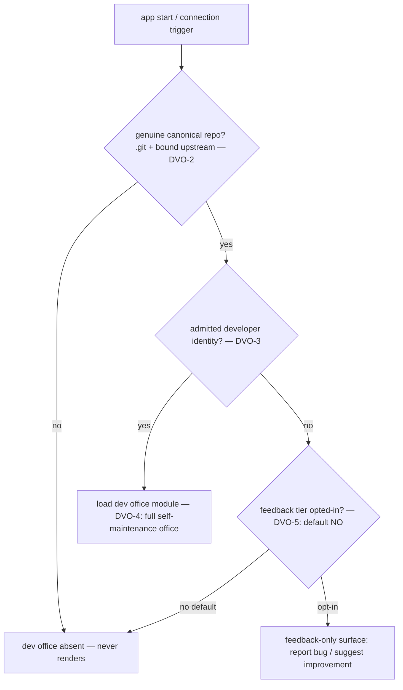

# Developer (Self-Hosting) Office

**Version:** 1.0.0
**Status:** Stable
**Layer:** concept

## Overview

Cronus is built to improve, fix, and maintain software — including *itself*. This
spec defines the **developer office**: a special system workspace, distinct from the
permanent home floor and from user-created project floors, dedicated to maintaining
Cronus's own codebase (dogfooding). It is bound to a verified checkout of the
project's own repository, gated behind an admitted developer identity, hidden from
ordinary users by default, and loaded on demand as a module when its activation
trigger fires.

Because the dev office acts on the product's own source and engine, its capabilities
are elevated — and elevated capability is an attack surface. The contract therefore
pairs the capability with hard gates: it exists only in a genuine clone of the
canonical repository, it is admitted only by the human principal (never self-granted
by an agent), it never appears in a default user install, and — by default — a
non-developer reaches nothing at all: the constrained feedback surface is a *ceiling* a
deployment may optionally expose, never a default-shipped surface. Self-hosting
maintenance becomes a first-class office without becoming a backdoor.

## Related Specifications

- [l1-workspace-lifecycle.md](l1-workspace-lifecycle.md) — home vs project workspace kinds (WSL-1/WSL-3); the dev office is a third, *system* kind added beside them.
- [l1-navigation-model.md](l1-navigation-model.md) — the L1 floor/tab bar where the dev office surfaces as a conditional system floor beside the pinned home floor.
- [l1-development-workflow.md](l1-development-workflow.md) — the Design→Plan→Execute→Review→Deliver pipeline the dev office runs (DVO-8); the dev office changes *who/where*, not *how*.
- [l1-quality-standards.md](l1-quality-standards.md) — QLY-6 dogfooding: Cronus's own codebase held to the same bar; the dev office is where that work happens.
- [l1-security.md](l1-security.md) — SEC-10 authority self-containment (admission is human-principal-write-only, never self-granted) and SEC-8 confinement.
- [l1-attestation.md](l1-attestation.md) — verifiable witness backing repository authenticity (DVO-2) and admitted-developer membership (DVO-3).
- [l1-extensions.md](l1-extensions.md) — the module/extension loading model the dev office is loaded through on its activation trigger (DVO-4).
- [l1-issue-reporting.md](l1-issue-reporting.md) — the consent-gated feedback path that is the non-developer ceiling (DVO-5).
- [l1-architecture.md](l1-architecture.md) — INV-8 sanctioned process boundaries confining the dev office's elevated authority (DVO-7).

## 1. Motivation

A product that maintains software should be able to maintain itself — but
self-modification is the most dangerous capability a system can hold, and it must not
be a capability an ordinary user stumbles into. Two failures must both be prevented:

- **Exposing self-maintenance to everyone.** If any install could open an office with
  write access to the product's own source and engine, a prompt-injected agent or a
  curious user becomes a supply-chain risk to the product itself. Elevated capability
  cannot be an always-present, ungated surface.
- **Making self-maintenance second-class.** If working on Cronus itself had no
  first-class home — no dedicated office, no proper workflow, no quality gates — then
  the product's own development would be ad-hoc and inconsistent with the rigor it
  imposes on every project it builds (QLY-6 dogfooding).

The developer office resolves both: a real, first-class maintenance office that only
materializes in a genuine checkout of the project's repository, only for an admitted
developer, and never in a default user install. It makes "the product works on
itself" a governed capability rather than either an unguarded backdoor or an informal
side-channel. The feedback-tier default (DVO-5) is resolved in favor of the smaller
surface: by default ordinary users see nothing at all, because the feedback need is
already met by the product's shipped consent-gated reporting pipeline
(`l1-issue-reporting`) independent of the dev office — a default-exposed dev-office
feedback surface would be redundant attack surface, not additive value. The feedback
tier remains defined as an opt-in ceiling a deployment may enable.

## 2. Constraints & Assumptions

- The dev office is a *system* workspace, not a user-created project; it is provisioned
  and governed by the product, not by the normal project-creation flow.
- Repository authenticity is verifiable locally (a version-control marker plus a bound
  upstream identity), without requiring a network call to activate.
- Elevated access is admitted by the human principal; no agent can admit itself.
- The dev office's scope is the bound repository only; it is never a lever over user
  project data or other workspaces.
- The feedback-only tier is **not** exposed by default (DVO-5, resolved): ordinary-user
  feedback flows through the shipped `l1-issue-reporting` pipeline, so the dev-office
  feedback surface is an opt-in ceiling, absent unless a deployment enables it.

## 3. Core Invariants

Rules every Layer 2 implementation MUST NOT violate:

- **DVO-1 (Distinct, conditional system floor):** beyond the permanent home floor and
  user-created project floors, the application MAY surface exactly one additional
  **system developer floor** dedicated to maintaining Cronus itself. It is
  system-owned, not a user project: it is not created through the normal project flow
  and cannot be renamed or deleted like one, and it appears only while its activation
  conditions (DVO-2 + DVO-3) hold. Absent those conditions it does not render at all.

- **DVO-2 (Repository-authenticity binding):** the dev office activates only in an
  environment verified to be a genuine checkout of the canonical Cronus repository — a
  local version-control marker (a working tree) whose bound upstream/remote identity
  matches the canonical project. An environment that is not this repository (no
  version-control marker, or an upstream bound elsewhere) MUST NOT activate it. The
  office's working scope is that local repository and nothing else; it operates on
  Cronus's own source, never on a user's project data.

- **DVO-3 (Identity-gated, human-admitted elevated access):** the dev office's
  capabilities act on the product's own source and engine and are therefore elevated;
  admission requires a verified developer identity (a credential/key, an
  external-account verification, or an attested membership) and is granted by the human
  principal, never self-granted by an agent (consistent with authority self-containment,
  SEC-10). A prompt-injected or ordinary-office agent MUST NOT be able to escalate
  itself into the dev office; the authority plane that admits it is
  human-principal-write-only.

- **DVO-4 (Hidden by default, trigger-loaded module):** the dev office is invisible to
  ordinary users by default and is loaded on demand as a module/extension when its
  activation trigger fires (repository authenticity DVO-2 + admitted identity DVO-3). It
  is not shipped as an always-present surface; a default install with no developer
  admission never renders it. Deactivating the trigger unloads it cleanly, leaving no
  elevated surface behind.

- **DVO-5 (Tiered admission — feedback is the non-developer ceiling):** admission is
  graded. A verified, admitted developer receives the full dev office (self-maintenance
  capabilities). A non-developer NEVER receives dev capabilities; the most an unverified
  user may be offered is a constrained **feedback surface** — submitting bug reports and
  improvement suggestions through the existing consent-gated reporting path — with no
  ability to read or modify the product's source, engine, or the dev office's work. The
  elevated tier and the feedback tier are distinct admission levels; no path promotes
  the feedback tier into the elevated tier without a fresh DVO-3 admission.
  **Default exposure (resolved):** the feedback tier is **off by default** — a normal
  install ships no dev-office surface at all, feedback or otherwise. The tiebreaker is
  the security-minimization principle this whole contract rests on (DVO-2/DVO-4: remove
  the surface where it does not belong), and the decision is non-lossy because
  ordinary-user feedback is already fully served by the shipped consent-gated reporting
  pipeline (`l1-issue-reporting`), independent of the dev office — a default-exposed
  dev-office feedback surface would be redundant attack surface, not additive signal.
  The feedback tier stays *defined* so a deployment MAY opt into exposing it; the
  DEFAULT is absent.

- **DVO-6 (Purpose confinement — self-maintenance only):** the dev office exists to
  improve, fix, and support Cronus itself. Its work targets the product's own codebase
  and is held to the same dogfooding quality bar as any project the office builds
  (QLY-6). It MUST NOT be repurposed as a general-purpose elevated office over user
  projects, and its elevated reach never extends beyond the bound repository (DVO-2) —
  it is a self-hosting maintenance office, not a backdoor into other workspaces.

- **DVO-7 (Contained & audited elevated authority):** because the dev office can modify
  the product's own source and engine, its authority is confined and audited: it runs
  under the same human-checkpoint discipline for irreversible or externally-visible
  actions as the development workflow (DW-8), every elevated action is recorded on the
  durable audit/receipt path, and its capabilities are structurally isolated from
  ordinary offices — a fault or compromise in a user office cannot reach dev-office
  authority (consistent with the sanctioned process boundaries of INV-8 and transitive
  guard enforcement). Removing admission (DVO-3/DVO-4) revokes the elevated reach.

- **DVO-8 (Uses the standard development workflow, no exception lane):** work inside the
  dev office runs through the standard agent-assisted development pipeline
  (Design→Plan→Execute→Review→Deliver) and quality gates; self-maintenance is subject to
  the same design gate, task isolation, two-stage quality gate, workspace isolation, and
  human delivery checkpoints as any other software work. The dev office changes *who is
  admitted* and *where the work happens*, never *how rigorously it is done*.

> DVO-5's feedback-exposure default is resolved (off by default); L2 realizations bind
> the feedback tier as an opt-in, absent unless a deployment explicitly enables it.

## 4. Detailed Design

### 4.1 A third workspace kind

The dev office extends the workspace taxonomy (`l1-workspace-lifecycle` §4.1) with a
conditional system kind:

| Kind | Count | Created by | Visible | Deletable | Purpose |
| --- | --- | --- | --- | --- | --- |
| Home | exactly 1 | system (permanent) | always | no | personal organizer, cross-office oversight |
| Project | 0..n | user | always | yes | execute a user's project |
| **Developer** (this spec) | 0..1 | system, conditional | only when DVO-2 + DVO-3 hold | n/a (system-owned) | maintain Cronus itself |

It renders as a system floor on the navigation tab bar (`l1-navigation-model` L1
floors) beside the pinned home floor — but only while active.

### 4.2 Activation gate



Both gates must hold for the elevated office to load. The repository gate is a local,
network-free check; the identity gate is a human-principal admission. Neither an agent
nor an ordinary user can satisfy the identity gate on its own.

### 4.3 Two admission tiers (DVO-5)

```text
[REFERENCE]
elevated tier   (admitted developer): full dev office — read/modify source, run the
                dev workflow, deliver changes under human checkpoints (DVO-7/DVO-8).
feedback tier   (non-developer, only if a deployment opts in — default OFF): submit bug
                reports / improvement ideas through the consent-gated reporting path
                only. No source access, no engine access, no visibility into dev work.

no promotion: feedback → elevated requires a fresh DVO-3 admission; there is no
              in-band upgrade path.
```

### 4.4 Why the repository binding matters

The repository gate (DVO-2) is what keeps the dev office from ever appearing in a
user's ordinary install: the office is meaningless — and dangerous — anywhere that is
not the product's own source tree. Binding to a verified local checkout (with an
upstream identity matching the canonical project) means the elevated surface simply
does not exist in a normal deployment, independent of any credential. The credential
gate (DVO-3) then governs *who*, among people who do have the source, may act.

## 5. Drawbacks & Alternatives

- **Resolved — feedback-tier default (DVO-5): off by default.** The trade-off (every
  install ships a feedback surface for more community signal vs. developer-credential-only
  for a smaller surface) resolves to the smaller surface: the community-signal side is
  already met by the shipped `l1-issue-reporting` pipeline independent of the dev office,
  so default-off loses no signal while removing redundant attack surface. A deployment
  may still opt the feedback tier on where it wants a dev-office-attached report surface.
- **Alternative — no special office; maintain Cronus like any external project.**
  Rejected: loses the repository-authenticity gate and the hidden-by-default property,
  so self-maintenance capability would leak into ordinary installs.
- **Alternative — always-present dev tab guarded only by a credential.** Rejected:
  a credential-only gate still renders the surface everywhere; DVO-2's repository
  binding removes the surface entirely where it does not belong, which is strictly
  safer.
- **Alternative — let the dev office bypass the standard workflow for speed.**
  Rejected (DVO-8): the product's own code deserves at least the rigor it imposes on
  others; an exception lane for self-maintenance is exactly where dogfooding would rot.

## Canonical References

| Alias | Path | Purpose |
| --- | --- | --- |
| `[WSL]` | `.design/main/specifications/l1-workspace-lifecycle.md` | Workspace kinds the dev office extends (DVO-1). |
| `[SECURITY]` | `.design/main/specifications/l1-security.md` | SEC-10 human-only authority admission (DVO-3). |
| `[DEV-WORKFLOW]` | `.design/main/specifications/l1-development-workflow.md` | The pipeline the dev office runs (DVO-8). |
| `[QUALITY]` | `.design/main/specifications/l1-quality-standards.md` | QLY-6 dogfooding bar (DVO-6). |

## Document History

| Version | Date | Author | Notes |
| --- | --- | --- | --- |
| 0.1.0 | 2026-07-07 | Core Team | Initial RFC — the developer (self-hosting) office: a conditional system floor beside home/project (DVO-1); repository-authenticity binding to a genuine canonical-repo checkout, local + network-free (DVO-2); identity-gated, human-admitted elevated access never self-granted (DVO-3, SEC-10); hidden-by-default, trigger-loaded module (DVO-4); tiered admission with a feedback-only ceiling for non-developers (DVO-5, with the feedback-exposure default left as an open TBD); purpose-confined to Cronus self-maintenance (DVO-6, QLY-6 dogfooding); contained & audited elevated authority isolated from user offices (DVO-7, INV-8); runs the standard dev workflow with no exception lane (DVO-8, DW). Status RFC pending resolution of the DVO-5 exposure policy. |
| 1.0.0 | 2026-07-19 | Core Team | RFC→Stable — resolved the sole open policy question (DVO-5) to **feedback tier off by default** (developer-credential-only; a normal install ships no dev-office surface at all). Tiebreaker: the security-minimization principle the whole contract rests on (DVO-2/DVO-4 — remove the surface where it does not belong), and the decision is non-lossy because ordinary-user feedback is already fully served by the shipped `l1-issue-reporting` consent-gated pipeline independent of the dev office, so a default-exposed dev-office feedback surface would be redundant attack surface, not additive signal. The feedback tier stays defined as an opt-in ceiling a deployment MAY enable. DVO-1…DVO-8 otherwise unchanged; §1/§2/§4.2/§4.3/§5 reconciled to the resolved default; the L2-realization caution note updated to "resolved". No new invariants. |
