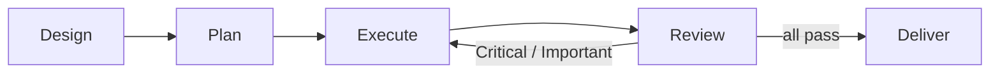

# Agent-Assisted Development Workflow

**Version:** 1.0.0
**Status:** Stable
**Layer:** concept

## Overview

The technology-agnostic model for human-agent collaborative software development. A feature request enters a five-stage pipeline — **Design → Plan → Execute → Review → Deliver** — governed by ten invariants. Agents handle mechanical execution; humans decide direction, approve designs, and authorize irreversible actions.

## Related Specifications

- [l1-orchestration.md](l1-orchestration.md) — Coordination protocol, delegation, budget, and error containment.
- [l1-extensions.md](l1-extensions.md) — Skills are the extension kind that carries workflow procedures.
- [l1-quality-standards.md](l1-quality-standards.md) — Mandatory quality gates apply at the Review stage.
- [l1-version-control.md](l1-version-control.md) — Workspace isolation and commit authority during development.
- [l1-harness-engineering.md](l1-harness-engineering.md) — Evaluation loop for continuous improvement of the workflow itself.
- [l2-development-workflow.md](l2-development-workflow.md) — Cronus implementation of this pipeline.

## 1. Motivation

Building software with agents requires more than raw capability — it requires a process that keeps humans in control of direction, keeps agents focused on execution, and produces reliable, reviewable results. Without a structured workflow:

- Agents start implementing before requirements are clear, wasting effort on wrong solutions.
- Implementation context bleeds across tasks, causing interference and confusion.
- Review happens too late or not at all, allowing defects to compound across tasks.
- Context compaction silently loses progress records, causing completed work to be repeated.
- Irreversible actions (merges, deletions) happen without the human's awareness.

This specification defines the process invariants that prevent these failure modes regardless of which technology stack or agent model is in use.

## 2. Constraints & Assumptions

- A human partner is always present; the workflow is collaborative, not fully autonomous.
- Implementation tasks are mostly independent; sequential dependency chains are handled within a task, not between tasks.
- The version-controlled workspace is the single source of truth for implementation artifacts.
- Agent context windows are bounded; the workflow must survive context compaction at any point.
- The human has final authority on direction, design approval, and destructive actions.

## 3. Core Invariants

Rules every Layer 2 implementation MUST NOT violate:

- **DW-1 (Mandatory pipeline):** Every feature progresses through all five stages in order: Design → Plan → Execute → Review → Deliver. No stage may be skipped without explicit human authorization.
- **DW-2 (Design gate):** No implementation task may begin until the human has approved the design document. A design-less execution attempt is blocked, not warned.
- **DW-3 (Task isolation):** Each implementation task runs in a fresh agent context containing exactly what that task needs — its brief, the relevant prior-task interfaces, and global constraints. Accumulated session history must not enter an implementation agent's context.
- **DW-4 (Two-stage quality gate):** Every implementation task has two mandatory verdicts before it is marked complete: (a) *spec compliance* — correct requirements, nothing missing, nothing extra; (b) *code quality* — clean, tested, maintainable. Both must pass.
- **DW-5 (Durable progress ledger):** Task completion records are written to the version-controlled workspace immediately on approval. After any context compaction event, the ledger and git log are authoritative; agent memory is not.
- **DW-6 (Workspace isolation):** Feature work runs on an isolated branch created at the start of the workflow. The main/trunk branch is never modified directly during active development.
- **DW-7 (Model-tier assignment):** Agent model selection is task-type-sensitive. Mechanical transcription tasks use the cheapest viable tier. Multi-file integration and judgment tasks use a capable tier. The final whole-branch review always uses the most capable available tier.
- **DW-8 (Human checkpoints):** Irreversible or externally visible actions — branch merge, push, force-push, discard — require explicit human authorization at the Deliver stage.
- **DW-9 (Review neutrality):** A task reviewer agent receives no prior knowledge of the implementer's decisions or rationale. Stated implementation rationale is a claim, not evidence; the reviewer judges the code on its merits.
- **DW-10 (Critical findings block):** Critical or Important review findings block advancement to the next task. Minor findings are recorded in the progress ledger for the final whole-branch review.

> L2 specs cannot reach RFC status until all ten invariants here are addressed in their "Invariant Compliance" section.

## 4. Detailed Design

### 4.1 Pipeline Stages

| Stage | Entry Condition | Primary Agent | Exit Artifact |
| --- | --- | --- | --- |
| Design | Human request | Coordinator + human dialogue | Approved design document |
| Plan | Approved design | Coordinator | Detailed plan file with bite-sized tasks |
| Execute | Approved plan | Implementer agent (one per task) | Committed code + task report file |
| Review | Task report | Reviewer agent (one per task) + whole-branch reviewer | Review report (two verdicts) |
| Deliver | All tasks approved | Coordinator + human | Merged / pushed / archived branch |

### 4.2 Design Stage

The coordinator asks one question at a time to refine the human's idea into a concrete design. The coordinator surfaces 2–3 approaches with trade-offs and recommends one. The design is presented in sections scaled to complexity; the human approves each section. The coordinator self-reviews the design document before requesting human sign-off.

Design documents record: architecture, components, data flow, error handling, testing approach, and global constraints (exact values, version floors, naming rules, platform requirements).

### 4.3 Plan Stage

The coordinator decomposes the design into bite-sized tasks. Each task:

- Touches the smallest independent set of files that yields a self-contained, testable deliverable.
- Specifies exact file paths, complete code (no placeholders), and exact test commands with expected output.
- Lists the interfaces it consumes from earlier tasks (exact signatures) and the interfaces it produces for later tasks (exact names and types).
- Ends with a commit.

The plan's Global Constraints section captures project-wide requirements that every task must honour. The coordinator self-reviews the plan for spec coverage, placeholder absence, and type/signature consistency before offering execution.

### 4.4 Execute Stage

The coordinator dispatches a fresh implementer agent per task. The implementer:

- Reads its task brief — a task-specific extract of the plan, not the full plan file.
- Asks clarifying questions before beginning work, not after.
- Implements exactly the specified requirements (nothing more, nothing less).
- Follows test-driven development for any feature or fix.
- Self-reviews for completeness, quality, and discipline before reporting back.

The coordinator receives a short status line (DONE / DONE_WITH_CONCERNS / NEEDS_CONTEXT / BLOCKED) and the path to a detailed report file. The coordinator never pastes the full report into its own context.

Context handed to an implementer: the brief file path, one-paragraph scene context (where this task fits), interfaces from prior tasks that the brief cannot know, and the report file path. Accumulated prior-task summaries must never appear in later dispatches (DW-3).

### 4.5 Review Stage

For each task, the coordinator dispatches a reviewer agent with: the brief file, the implementer's report file, and a diff package file (commit list + stat summary + full diff). The reviewer:

- Returns two verdicts: spec compliance and code quality (DW-4).
- Cites file:line evidence for every finding.
- Does not re-run tests already documented by the implementer.
- Does not read files outside the diff unless a specific, named cross-cutting risk requires one focused check.

Critical and Important findings trigger a fix dispatch. The coordinator dispatches ONE fix agent with all findings combined — not one per finding. The reviewer re-reviews after fixes. Minor findings are recorded in the progress ledger (DW-10).

After all tasks pass, the coordinator dispatches a final whole-branch reviewer. This reviewer reads the full branch diff from the base commit and returns the same two-verdict format. The coordinator dispatches this review to the most capable available tier (DW-7).

### 4.6 Deliver Stage

The coordinator presents the human with exactly four structured options (DW-8):

1. **Merge** to base branch locally (verifies tests after merge; then cleans up workspace).
2. **Push** and create a pull request (preserves workspace for PR feedback iteration).
3. **Keep** the branch as-is (deferred decision; workspace preserved).
4. **Discard** all work (requires explicit typed confirmation; workspace cleaned up).

Cleanup of the isolated workspace happens only for options that invalidate the branch (Merge, Discard). PR and Keep preserve the workspace intact.

### 4.7 Progress Ledger

The progress ledger is a workspace file (persisted on disk, not in agent context) that records:

- One entry per task: task number, name, status, commit range, review verdict, minor findings.
- The coordinator checks the ledger at startup; tasks marked complete are skipped without re-dispatch.
- After context compaction, the ledger and `git log` supersede agent memory (DW-5).

### 4.8 Context Discipline

Accumulated session history is the primary cause of context pollution and inflated dispatch costs. Three rules enforce DW-3:

1. **Brief as single source of truth:** Exact values (numbers, magic strings, function signatures) appear only in the task brief. The coordinator dispatch references the brief file; it does not paste brief contents into the prompt.
2. **File handoffs for bulk artifacts:** The review diff package, the implementer's detailed report, and the task brief are files on disk. Their paths appear in dispatch prompts; their contents never do.
3. **No accumulated context in later dispatches:** A dispatch prompt for Task N describes Task N — its task, the interfaces it touches, and global constraints. It does not include summaries from Tasks 1 through N-1.

## 5. Drawbacks & Alternatives

**More overhead than direct implementation:** Each task dispatches at least two agents (implementer + reviewer). For trivial changes, this overhead may exceed the benefit. *Mitigation:* The Plan stage consolidates trivially small steps into larger tasks; minimum task size is "independently reviewable."

**Sequential by default:** Tasks dispatch one at a time to prevent file conflicts. *Alternative:* For tasks with provably disjoint file sets, parallel dispatch is safe — DW-3 context isolation is compatible with parallel execution when no files overlap. The Plan stage can annotate disjoint task groups.

**Human availability at Deliver:** Irreversible actions require human presence (DW-8). If the human is unavailable, the workflow parks at Deliver. *By design:* human authorization for destructive actions is non-negotiable in this model.

## Canonical References

| Alias | Path | Purpose |
| --- | --- | --- |
| `[L1-ORCH]` | `.design/main/specifications/l1-orchestration.md` | Delegation, budget, and error containment |
| `[L1-EXT]` | `.design/main/specifications/l1-extensions.md` | Skill extension kind and lifecycle |
| `[L1-VC]` | `.design/main/specifications/l1-version-control.md` | Workspace isolation invariants |
| `[L1-QS]` | `.design/main/specifications/l1-quality-standards.md` | Quality gate requirements |
| `[L2-DW]` | `.design/main/specifications/l2-development-workflow.md` | Cronus implementation |

<!-- Downstream agent instruction: Load ALL files listed above BEFORE writing any code.
     Do not rely on memory or inference for content from these files. -->

## Document History

| Version | Date | Change |
| --- | --- | --- |
| 1.0.0 | 2026-06-24 | Initial Stable — DW-1…DW-10 invariants, five-stage pipeline, context discipline rules |
