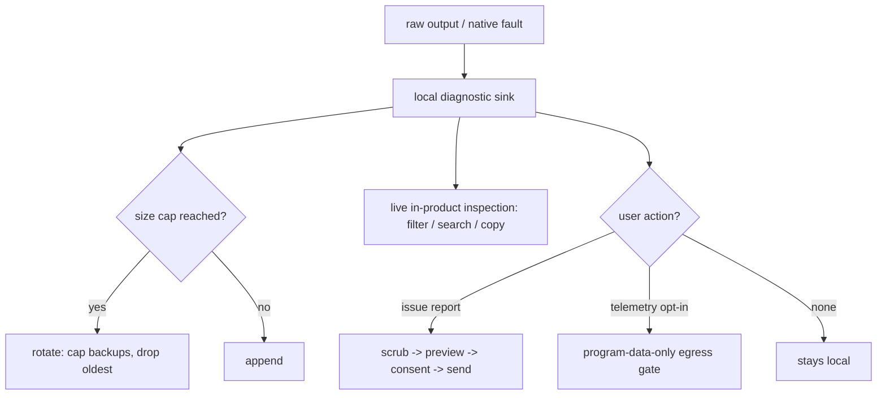

# Diagnostic Log Plane

**Version:** 1.0.0
**Status:** Stable
**Layer:** concept

## Overview

The diagnostic log is the **forensic observation plane of last resort** — the raw,
local, developer-and-operator-facing record of what the running process actually
did, captured at a level low enough to survive failures that the higher observation
planes structurally cannot witness. Where the semantic run-trace records *what the
agent decided* and the health layer records *how the system is trending*, the
diagnostic log records *what the process emitted* — including native crashes,
pre-initialization boot failures, and the unstructured output of dependencies.

Cronus keeps several distinct observation channels, each with its own consumer,
retention, and egress rule. This spec fixes the diagnostic log as one of them and
forbids conflating it with the others: it is rotating and ephemeral (not a durable
ledger), local-first and consent-gated (not outward telemetry), and raw and
forensic (not the semantic trace). Its single defining property is **survival** —
a session that dies before, or without ever reaching, structured-event emission
still leaves a diagnosable record behind.

## Related Specifications

- [l1-operational-health.md](l1-operational-health.md) - Scores and alerts over *aggregated* traces; the diagnostic log is the raw per-process record health *consumes*, never the scorer. Both are observe-only (OH-1 ↔ DL-8).
- [l1-process-monitor.md](l1-process-monitor.md) - Live read-only process-tree view; shares the observer-neutrality and frontend-parity posture (PM-1/PM-5 ↔ DL-8/DL-7) but reports *live metrics*, not the historical output stream.
- [l1-telemetry.md](l1-telemetry.md) - Outward, anonymized, opt-in program metrics; one of the two consent-gated egress paths a diagnostic log may take (DL-6).
- [l1-issue-reporting.md](l1-issue-reporting.md) - The user-triggered report whose opt-in diagnostics bundle (ISS-4) is the diagnostic log's primary egress channel (DL-6).
- [l1-error-reporting.md](l1-error-reporting.md) - Consent-gated error egress; shares the scrub/redaction discipline the diagnostic log must obey before any send (DL-6).
- [l1-security.md](l1-security.md) - Secret isolation and the egress authorization gate the diagnostic log crosses only under consent (DL-6).
- [l1-tool-receipts.md](l1-tool-receipts.md) - The execution-authenticity (semantic/provable) plane; the diagnostic log is its raw-forensic complement, distinct consumer and trust level (DL-1).
- [l1-doctor.md](l1-doctor.md) - Crash-recovery consumer: a self-describing diagnostic log (DL-3) is the evidence the self-healing subsystem reads after an abnormal exit.
- [l1-architecture.md](l1-architecture.md) - Command parity (INV-3) behind DL-7, sanctioned process boundaries (INV-8) behind the sidecar/early-sink placement, local-first client-data security (INV-7) behind DL-6.

## 1. Motivation

Every structured observation plane assumes the process lives long enough to report.
The semantic run-trace is emitted step-by-step by an in-process observer that must
first be constructed and attached; the health layer derives from traces the runtime
has already durably written. Both are blind to an entire class of failure:

- A **native crash** — a segmentation fault, an out-of-memory kill, an abort in a
  native extension — terminates the process without giving any in-language handler
  a chance to record it. No semantic event, no manifest, no health sample.
- A **pre-initialization boot failure** — a bad configuration, a missing runtime, a
  crash during startup — happens before any structured-observation subsystem
  exists to witness it.
- **Dependency output** — a third-party library writing directly to standard error,
  or a subprocess printing a stack trace — never passes through the semantic
  taxonomy at all.

When one of these happens, the only thing that can save a diagnosis is a record that
was already capturing raw output *before* the higher planes came online and at a
level *below* where they operate. That record is the diagnostic log. Its value is
not a richer format — it is that it exists at all when nothing else does. A system
that has only semantic traces and health scores is a system whose worst failures are
invisible after the fact.

A second motivation is **plane hygiene**. Folding raw diagnostics into the semantic
trace pollutes the record an outer analysis loop reads; folding it into telemetry
risks egressing operator ground truth; treating it as a durable ledger turns an
ephemeral debugging aid into an unbounded data-retention liability. Naming the
diagnostic log as its own plane, with its own rules, keeps every channel honest.

## 2. Constraints & Assumptions

- The diagnostic log is a host/runtime concern: it captures process-level output
  and native faults, not domain semantics. The semantic trace remains the owner of
  step-level attribution.
- The plane is local by construction; egress is the exception, always gated, never
  the default.
- Retention is bounded and ephemeral by design — the diagnostic log is not the
  system of record for anything; losing an old rotation is acceptable.
- "Diagnosable offline" is a hard requirement: a captured log must be interpretable
  without access to the machine that produced it.
- The plane must never be able to affect the process it observes — an observability
  aid that can crash its host is worse than none.

## 3. Core Invariants

Rules every Layer 2 implementation MUST NOT violate:

- **DL-1 (Distinct, non-conflated plane):** the diagnostic log is a separate
  observation channel from the semantic run-trace, the governance/execution-
  authenticity audit, aggregate health scoring, the live process view, and outward
  telemetry. Each of those has its own consumer, retention, and egress rule; the
  diagnostic log MUST NOT be folded into any of them, nor any of them into it. Its
  consumer is the developer/operator diagnosing a fault; its content is raw runtime
  output, not semantic decisions, not aggregate scores.

- **DL-2 (Survives what the semantic planes cannot):** the diagnostic-log sink is
  installed at the earliest point of process life and captures output the structured
  observation planes structurally cannot witness — a native crash or fault, output
  emitted before any structured-observation subsystem is initialized, and the
  unstructured output of dependencies and subprocesses. A session that crashes
  *before*, or *without ever reaching*, structured-event emission still leaves a
  diagnostic record. This is the defining invariant: the plane's worth is its
  survival of failures the higher planes miss, and the boundary between "what the
  semantic trace witnessed" and "what only the diagnostic log witnessed" is named,
  never blurred.

- **DL-3 (Self-describing session header):** each session's diagnostic log opens
  with an environment header — at minimum the platform, the runtime identity and
  version, the invocation arguments, the working directory, and the start
  timestamp — so a captured log is diagnosable offline, without access to the live
  system that produced it. A crash log that cannot be interpreted in isolation has
  failed its purpose.

- **DL-4 (Own-scope fidelity, dependency noise clamped):** the plane records the
  product's own diagnostics at its full configured verbosity while third-party and
  dependency output is admitted only at a higher severity floor, so the forensic
  record stays legible and is not drowned by framework chatter. The product's
  verbosity floor is configurable; the dependency floor keeps low-value noise out
  by default.

- **DL-5 (Bounded, ephemeral retention):** the diagnostic log is ephemeral
  operational data, not a durable ledger. It is size-capped, rotated, and limited to
  a bounded backup count, so it never grows without limit and never becomes a
  data-retention liability. Losing the oldest rotation under pressure is correct
  behaviour, not data loss — anything that must be durable belongs on another plane.

- **DL-6 (Local-first, consent-gated egress, secret-safe):** the diagnostic log is
  local operational data. It MUST NOT egress automatically or silently. It leaves
  the device only bundled into a user-previewed report (the issue-reporting
  diagnostics bundle) or under the telemetry opt-in, and only after passing the same
  scrub discipline error-reporting applies — secrets, credentials, and sensitive
  arguments are never surfaced in the log nor in any egress of it.

- **DL-7 (Live in-product inspection, frontend parity):** the operator can view and
  tail the diagnostic log from within the product — filter by severity, search its
  text, and copy a selection — across every frontend at parity, without external
  tools or direct file-system access. The library capability is the source of truth;
  frontends differ only in rendering, never in which log or which controls are
  available (consistent with command parity).

- **DL-8 (Resilient, neutral sink):** writing or rotating the diagnostic log MUST
  NOT crash, block, or alter the behaviour of the process it observes. A sink
  failure — a locked file, a full disk, a permission error — degrades gracefully
  (reopen the stream, defer rotation to the next write, or drop with an internal
  notice) and is never allowed to propagate into the observed execution path. The
  plane witnesses; it never perturbs.

> L2 specs cannot reach RFC status until all invariants here are addressed in their
> "Invariant Compliance" section.

## 4. Detailed Design

### 4.1 The Observation Planes, and Where the Diagnostic Log Sits

Cronus separates observation into distinct planes. The diagnostic log is one of
them; its identity is fixed by contrast with its neighbours (DL-1):

| Plane | Consumer | Records | Retention | Egress |
| --- | --- | --- | --- | --- |
| **Diagnostic log** (this spec) | developer / operator | raw process output + native faults | rotating, ephemeral, bounded | local-first, consent-gated (DL-6) |
| Semantic run-trace | user + outer analysis loop | structured per-step decisions | per-run | as the run record allows |
| Execution-authenticity audit | security / verifier | provable per-action receipts | durable, tamper-evident | surfaced, secret-free |
| Aggregate health | operator | scores, alerts, trends | rolling windows | local, never egressed |
| Live process view | operator | live per-process metrics | none (live only) | local, telemetry-gated |
| Telemetry | product vendor | anonymized program metrics | as sent | opt-in, outward |

The rows are not interchangeable. A common failure mode — dumping everything into a
single log — collapses these distinctions and makes each channel worse at its job.

### 4.2 The Last-Resort Sink

The diagnostic log's survival property (DL-2) comes from *where* and *how early* its
sink is installed, not from the richness of its records:

```text
[REFERENCE]
process start
  └─ install diagnostic sink            ← earliest point of process life
        ├─ write session header          (DL-3: platform, runtime, argv, cwd, ts)
        ├─ mirror raw stdout / stderr     (captures dependency + subprocess output)
        └─ arm native-fault handler       (captures crashes no in-language handler sees)
  └─ initialize structured-observation subsystems   ← semantic trace begins HERE
  └─ run
        ├─ normal path → semantic trace + diagnostic log both record
        └─ native crash / OOM kill → ONLY the diagnostic log + fault handler record
```

Everything between "process start" and "structured-observation subsystems
initialized" is a blind spot for every other plane and a covered window for the
diagnostic log. The native-fault handler is the piece that survives an abnormal
termination: it writes a native traceback at the moment of the fault, when no
in-language observer will ever run again.

### 4.3 Own-Scope vs. Dependency Noise (DL-4)

The plane distinguishes the product's own output from everything else:

```text
[REFERENCE]
own-namespace records   → admitted at the configured verbosity floor (e.g. debug+)
dependency records      → admitted only at a higher floor (e.g. warning+)
```

This keeps the forensic record dominated by signal the operator can act on. It is a
scoping rule, not a suppression rule: dependency failures still appear (at the higher
floor), but routine framework chatter does not bury the product's own trace.

### 4.4 Retention and Egress Lifecycle



Rotation (DL-5) and egress (DL-6) are the two lifecycle boundaries. Both default to
the conservative side: rotation drops history rather than growing unbounded, and
egress stays local rather than sending. Neither the live inspection surface (DL-7)
nor rotation is ever allowed to be the thing that wedges the process (DL-8).

### 4.5 Relationship to the Semantic Trace

The diagnostic log and the semantic trace are complements, not competitors. The
semantic trace is the authoritative record of the agent's decisions when the process
runs to completion; the diagnostic log is the authoritative record of what happened
when it did not. The boundary is explicit (DL-2): the semantic trace never claims to
cover a crash it could not witness, and the diagnostic log never tries to reconstruct
semantics it did not observe. The nodus realization of the semantic side's honesty
about its own truncation is `l1-nodus-observability` HO-10.

## 5. Drawbacks & Alternatives

- **Alternative — a single unified log for everything.** Rejected: collapses DL-1's
  plane separation. A unified log is simultaneously too noisy to be a good semantic
  trace, too raw to be a good telemetry source, and too unbounded to be a safe
  durable audit. Each plane is better precisely because it is separate.
- **Alternative — make the diagnostic log durable and queryable like the audit.**
  Rejected: violates DL-5. Durability is the governance-audit plane's job;
  conflating the two turns an ephemeral debugging aid into a retention liability and
  a privacy surface.
- **Alternative — reconstruct crashes from the semantic trace after the fact.**
  Rejected: violates DL-2. A crash-truncated semantic trace has no record of the
  crash; the information simply does not exist unless a lower plane captured it live.
- **Native-fault capture is platform-specific.** Accepted: the *contract* (a native
  fault leaves a record) is platform-agnostic even though the mechanism is not; an
  implementation reports the capability as unavailable rather than faking coverage on
  a platform that cannot provide it (consistent with the "never fabricate" posture of
  the process monitor).

## Canonical References

| Alias | Path | Purpose |
| --- | --- | --- |
| `[OP-HEALTH]` | `.design/main/specifications/l1-operational-health.md` | The aggregate scorer that *consumes* diagnostic traces; boundary DL-1 must not cross into scoring. |
| `[ISSUE-REPORT]` | `.design/main/specifications/l1-issue-reporting.md` | The consent-gated diagnostics bundle (ISS-4) that is the diagnostic log's egress channel (DL-6). |
| `[TELEMETRY]` | `.design/main/specifications/l1-telemetry.md` | The outward-sharing boundary; defines what the diagnostic log may and may not egress. |
| `[SECURITY]` | `.design/main/specifications/l1-security.md` | Secret isolation and the egress authorization gate crossed only under consent (DL-6). |

## Document History

| Version | Date | Author | Notes |
| --- | --- | --- | --- |
| 1.0.0 | 2026-07-07 | Core Team | Initial spec — the forensic diagnostic-log plane: distinct non-conflated channel (DL-1), survives native crashes / pre-init boot failures / dependency output the semantic planes cannot witness (DL-2), self-describing session header for offline diagnosis (DL-3), own-scope fidelity with dependency noise clamped (DL-4), bounded ephemeral rotating retention (DL-5), local-first consent-gated secret-safe egress (DL-6), live in-product inspection at frontend parity (DL-7), resilient neutral sink that never perturbs its host (DL-8). Complements the semantic trace (nodus l1-nodus-observability HO-10 on the truncation-honesty side) and the aggregate health / telemetry / execution-authenticity planes. |
