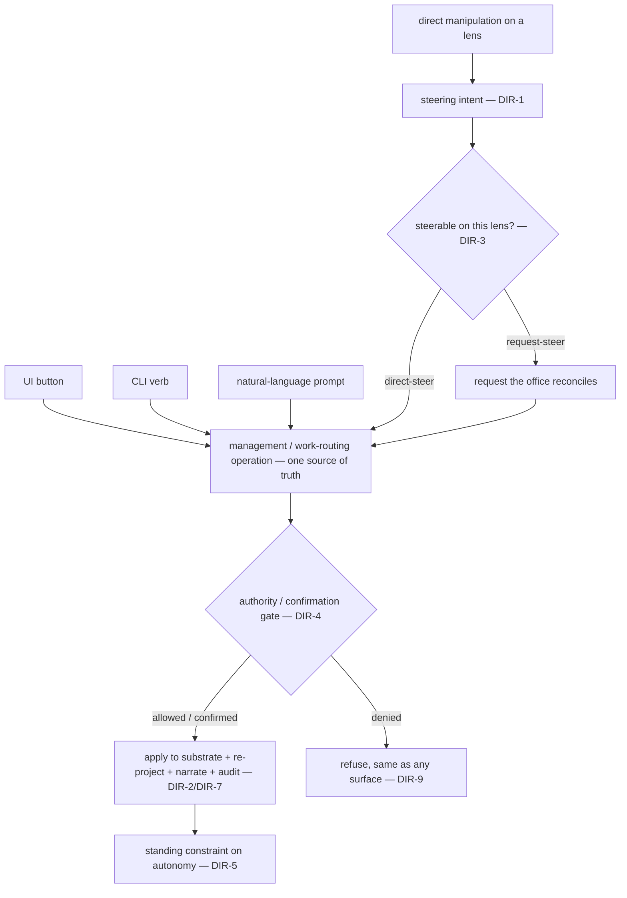

# Directability

**Version:** 1.0.0
**Status:** Stable
**Layer:** concept

## Overview

The office is **directable, not co-driven**. Its foundation is full automation — the office plans, staffs, and executes on its own and runs to completion with no client involvement (OFF-5/OFF-8). Directability is the always-available *steering wheel* laid over that autopilot: the client MAY act directly on any lens of the office fabric — move or relabel a board card, reassign or hire a worker on the staffing graph, enable/disable or rewire an automation, request a wiki correction, cut a branch — and every such **direct manipulation is a first-class steering intent**, not a cosmetic edit.

A steer is held to exactly the standards a control command from any other surface is: it invokes the *same* source-of-truth operation (a binding alongside chat, UI, CLI, TUI), passes the *same* authority and confirmation gates, and is legible, reversible, and traceable. Crucially, an *accepted* steer becomes a **standing constraint** the autonomous office honors — not a one-shot suggestion the next automated cycle silently reverts — and a steer the office cannot or will not honor is **refused or surfaced as a conflict, never accepted-then-ignored**. That is what makes the client's sense of control *genuine* while full automation remains the default driver: the client can grab the wheel at any moment, their input binds, and the office never fakes agency it will not deliver.

This is the direct-manipulation twin of [l1-conversational-control.md](l1-conversational-control.md): that spec makes *talking* a control plane; this one makes *manipulating the lens* a control plane. Both are hands-on control over the one set of management operations.

## Related Specifications

- [l1-office-fabric.md](l1-office-fabric.md) - The coordinated lenses a steer acts through; an accepted steer lands on the shared substrate and re-projects coherently across every lens (OFA-5).
- [l1-conversational-control.md](l1-conversational-control.md) - The natural-language control plane this mirrors; a steer is a binding over the same operation (CC-2), under the same gates (CC-4), legible/reversible/traceable (CC-5), scope-respecting (CC-6), and distinct from work (CC-7).
- [l1-office-visualization.md](l1-office-visualization.md) - OVZ-4 observational-with-inspection; directability extends the office view from observe-and-drill-down to observe-and-steer, without making steering required.
- [l1-generative-surface.md](l1-generative-surface.md) - GS-6 "edits flow back as explicit changes to the underlying data, never a hidden second source" and GS-4 user-control; directability applies the same edit-as-intent discipline to the product's fixed lenses.
- [l1-office-model.md](l1-office-model.md) - OFF-5 client-as-client / OFF-8 autonomous operation; DIR-6 keeps steering optional so the automation foundation is never demoted.
- [l1-kanban-model.md](l1-kanban-model.md) - KAN-2 office-managed-not-client-managed; DIR-3 reconciles it — a client steer is an *intervention*, never the required day-to-day management.
- [l1-project-wiki.md](l1-project-wiki.md) - PW-2 office-maintained / PW-4 grounded-and-attributed; DIR-3 keeps authored wiki content office-owned — a client steer on the knowledge lens is a *requested correction*, not a direct overwrite.
- [l1-automation-canvas.md](l1-automation-canvas.md) - AC-7 pinned-partial-re-execution *requested, not run*; the per-lens precedent for request-steers versus direct-steers (DIR-3).
- [l1-security.md](l1-security.md) - The authority and human-confirmation gates a steer inherits unchanged (DIR-4, SEC-9/SEC-10).
- [l1-office-control.md](l1-office-control.md) - Distinct: that spec is office *lifecycle* states (pause/hibernate); directability is *content* steering of the office's work through its lenses.

## 1. Motivation

Cronus's whole stance is that the office does the work and the client need not co-drive it. That is a strength, but taken alone it risks a specific failure: a person watching a fully autonomous system with no way to *touch* it feels not served but sidelined. The office view was deliberately made observational (OVZ-4) to avoid inviting micromanagement — yet the same choice, unqualified, leaves the client with a screen they can look at but never influence. What is missing is the contract that lets the client **steer without being required to**, and that makes their steering *real*.

Three failures appear without that contract:

- **Illusory control.** If a lens exposes editable-looking affordances whose edits the next automation cycle silently discards, the client's control is fake — the worst outcome, because it erodes trust precisely when the client tried to engage.
- **A safety gap through direct manipulation.** If dragging a card or deleting a branch on a lens takes a path that skips the confirmation a button or a prompt enforces, direct manipulation becomes an escalation route around the gates — the same boundary conversational control (CC-4) had to close for natural language.
- **A false choice between control and automation.** Framing it as "either the office is autonomous or the client is in charge" is a trap. The resolving idea is a layered one: **autonomy is the foundation; steering is an optional override that, once accepted, binds.** The client gets a genuine wheel; the office keeps the autopilot.

Directability names that contract. It reuses the binding-over-one-operation discipline conversational control already established (a steer is the visual sibling of "just ask"), adds the reconciliation-with-autonomy semantics that make an accepted steer a standing constraint, and forbids dead controls so control is never faked.

## 2. Constraints & Assumptions

- A steer maps to an **existing** management or work-routing operation reachable from another surface; directability invents no new operations, it makes the existing ones reachable by direct manipulation on a lens.
- The set of *directly steerable* affordances is defined by **each lens's own authority contract**; directability provides a uniform steering model but grants no write authority a lens's spec withholds.
- Every authority, autonomy, and confirmation rule that applies to an operation from any surface applies **identically** to the same operation reached by manipulation.
- Steering is **optional in every case**; the office completes work with zero client manipulation (the automation foundation, OFF-5/OFF-8).
- A steer is a **control/steering act**, distinct from a *work request* (which enters the board, CC-7). Manipulating a lens steers the office; it does not itself perform the specialist work.
- The client may be **non-technical**; a steer's meaning and its acceptance/refusal must be legible without systems knowledge.

## 3. Core Invariants

Rules every Layer 2 implementation MUST NOT violate:

- **DIR-1 (Direct manipulation is a first-class control binding):** a direct manipulation on any fabric lens (move/relabel a card, reassign/hire a worker, enable/disable or rewire an automation, edit/pin a wiki node, cut a branch or commit) is a first-class control act — a binding over the *same* source-of-truth operation the UI, CLI, TUI, and chat invoke (composing CC-2, INV-3). It MUST NOT be a lens-local edit that mutates only the projection. Direct manipulation joins conversational control as a second hands-on control plane over the same operations.

- **DIR-2 (Edit-as-intent — projection stays derived):** a client manipulation is applied to the lens's authoritative substrate through that operation, and the lens re-projects from the changed substrate; the manipulation is an *intent against the source*, never a write to the projection itself (composing OVZ-1, PW-3, AC-1, GS-6). A lens MUST NOT become an independent source of truth because the client manipulated it.

- **DIR-3 (Per-lens steerability — authority-respecting):** the steerable affordances of a lens are those its own authority contract permits. Directability supplies a uniform steering *model* but MUST NOT grant the client a write authority a lens withholds. Where a lens reserves authorship to the office — office-authored, grounded wiki content (PW-2/PW-4), a pinned automation re-run (AC-7) — a client steer is a **request the office reconciles**, not a direct overwrite; where a lens permits client intervention — board card placement, worker assignment, automation enable/disable, branching — the steer applies directly. Every steer is one or the other; none silently exceeds its lens's authority.

- **DIR-4 (Same gates and authority as any surface):** a steer passes the identical authority, autonomy, and confirmation gates as the same operation from any other surface. A destructive or irreversible steer (delete a workspace, drop a branch, disband a role) requires the same human confirmation whether it arrives as a button-press, a prompt, or a direct manipulation (composing CC-4, SEC-9/SEC-10). Direct manipulation MUST NOT become a bypass around a gate another surface enforces.

- **DIR-5 (Steering reconciled with autonomy — an accepted steer is a standing constraint):** where a client steer and the office's autonomous decision touch the same entity, an *accepted* steer is a standing constraint the office honors going forward — **not** a one-shot hint the next autonomous cycle silently reverts. The office MAY later act against a client steer only by surfacing the conflict and its reason to the client (never silently) — an escalated, disclosed necessity, not a quiet override. This persistence is the operational meaning of "the client is in control": their steers bind until they, or a disclosed necessity, change them.

- **DIR-6 (Directable, not co-driven — steering is optional):** every steer is optional; the office runs to completion with no client manipulation at all, because full automation is the foundation and the default driver (OFF-5/OFF-8). Directability MUST NOT introduce any step that *requires* the client to manipulate a lens for work to proceed. It adds a steering wheel; it MUST NOT demote the autopilot to a manual transmission.

- **DIR-7 (Legible, reversible, traceable steers):** a steer's effect is narrated back legibly (what changed), recorded on the same audit/event path as any control action, and reversible wherever the operation is (composing CC-5). A steer MUST NOT change office state silently; the client can always see what a manipulation did and undo it wherever the operation permits.

- **DIR-8 (Scope-respecting):** a steer executes in the scope of the lens it is issued in — a manipulation inside a project office acts on that office; a manipulation on the home building-overview may act across offices only within the home manager's cross-workspace authority (composing CC-6, WSL-2, OVZ-6) — and never crosses an isolation boundary the same operation would respect from another surface.

- **DIR-9 (Honest control — no dead controls, no faked agency):** the client's control is *genuine*. A steer the system cannot or will not honor MUST be refused or surfaced as a conflict at the moment it is attempted — never accepted-then-ignored. A lens MUST NOT present an editable affordance for something that is not actually steerable (no controls that imply agency the office will not deliver). Honest control means: an accepted steer binds (DIR-5), a request-steer is acknowledged as a request (DIR-3), and an impossible steer is declined visibly.

> L2 specs cannot reach RFC status until all invariants here are addressed in their "Invariant Compliance" section.

## 4. Detailed Design

### 4.1 A steer is a binding over one operation

Direct manipulation is the visual sibling of conversational control: both turn a client act into the *same* underlying operation and hit the *same* gates. Only the front edge differs — a manipulation is interpreted from a gesture on a lens rather than resolved from language.



From the operation onward — gate, execute, audit — every binding is identical (parity with CC-2/CC-4/CC-5). The manipulation adds only the front-edge interpretation of the gesture and the DIR-3 fork between a direct-steer and a request-steer.

### 4.2 Steer → substrate → re-project (never edit the projection)

The anti-pattern directability forbids is "let the client edit the picture." A lens is a projection (OFA-2); a steer must reach the substrate, not the picture.

```text
[REFERENCE]
WRONG:  client drags card  →  card position rewritten in the view only  →  next projection erases it
RIGHT:  client drags card  →  work-state operation invoked (DIR-1/DIR-2)  →  gate (DIR-4)
                           →  substrate updated  →  ALL lenses re-project from it (OFA-5)
                           →  the placement is now a standing constraint (DIR-5), visible & undoable (DIR-7)
```

Because the effect lands on the shared substrate, it re-projects everywhere the entity appears (OFA-5): reassigning a worker on the staffing lens changes the assignment edge the work lens shows on that card, and both agree within one event cycle.

### 4.3 The spectrum of steer strength (DIR-3)

Not every lens grants the client the same authority; directability is uniform in *model* but honest about *strength*.

| Lens | Direct-steer (applies immediately, gated) | Request-steer (office reconciles) | Read-only |
| --- | --- | --- | --- |
| Work (board) | move/relabel/reprioritize a card (an intervention over KAN-2 management) | — | archived history |
| Staffing (graph) | reassign / hire / disband (destructive → DIR-4 confirm) | — | live activity feed |
| Automation (canvas) | enable/disable, rewire, edit a pipeline | pinned partial re-run (AC-7) | implicit surfaces (AC-2) |
| Knowledge (wiki) | pin / annotate / flag | request a correction to office-authored grounded content (PW-2/PW-4) | generated page bodies |
| Change-history | cut a branch, commit within authority (VC-1) | — | past commits (immutable) |

The client experiences one consistent "grab the wheel" gesture; DIR-9 keeps the response honest about whether a given affordance is a direct-steer, a request, or not steerable at all — so nothing looks editable that the office will not honor.

### 4.4 Reconciliation with autonomy — directable, not co-driven

The foundation is the autopilot (OFF-5/OFF-8): the office drives. A steer is the client briefly taking the wheel. The reconciliation rule (DIR-5) is what makes the wheel real rather than decorative:

```text
[REFERENCE]
autonomy proposes a change to entity E
    ├─ no accepted client steer binds E   → office proceeds autonomously (the default, DIR-6)
    └─ an accepted client steer binds E
          ├─ autonomy's change agrees with the steer   → proceed
          └─ autonomy's change conflicts with the steer → DO NOT silently override (DIR-5)
                → honor the steer, OR surface the conflict + reason to the client and let them decide
```

A steer is therefore neither ignored (which would fake control) nor permanent-at-all-costs (which would demote automation into manual mode). It is a *standing constraint* that binds until the client or a disclosed necessity changes it — the precise middle the tension "full control vs full automation" seemed to exclude.

### 4.5 Relationship to conversational control and office control

Three control concepts sit side by side without overlap:

- **Conversational control** — steer by *talking* ("reassign this to the security reviewer"). NL front edge, same operation.
- **Directability** (this spec) — steer by *manipulating a lens* (drag the card onto the security reviewer). Gesture front edge, same operation.
- **Office control** — start/pause/resume/hibernate the office as a whole (lifecycle *states*, not content steering).

The first two are the same control plane reached two ways and MUST produce identical results for the same operation (DIR-1, CC-2); the third is a different axis entirely.

## 5. Drawbacks & Alternatives

- **Micromanagement risk.** Making lenses steerable could invite the client to co-drive, against the product's stance. Mitigated by DIR-6 (steering is always optional; the office needs none of it) and by keeping the office the default manager (KAN-2, PW-2) — directability is an *intervention* affordance, not a duty roster.
- **Reconciliation complexity.** Treating an accepted steer as a standing constraint (DIR-5) is more to build than fire-and-forget edits. Justified: without it, control is illusory (the worst failure in §1), and the standing-constraint rule is exactly what converts a gesture into genuine agency.
- **Authority confusion across lenses.** A client might expect every lens to be equally editable. Mitigated by DIR-3's explicit direct/request/read-only spectrum and DIR-9's ban on dead controls, so each lens is honest about what a steer there means.
- **Alternative — observation-only (status quo, OVZ-4 unqualified).** Rejected: it leaves the client with a screen they cannot influence, producing the sidelined feeling §1 identifies. Directability keeps observation the default and adds steering as an option.
- **Alternative — full client authorship of every lens.** Rejected: it would violate DIR-3/OFA-2 (each substrate's own authority), collapse the office into a manually-operated tool, and contradict the automation foundation (DIR-6). Steering over autonomy, not authorship of everything, is the design.
- **Alternative — accept steers but let automation freely override them.** Rejected (DIR-5, DIR-9): silent override is faked control; it is the single most trust-destroying behavior directability exists to forbid.

## nodus-relevance mapping

Primarily a main-workspace host control concept. The portable runtime participates only where a steer must reach in-flight execution.

| Element | nodus seam | Note |
| --- | --- | --- |
| Steer as host-supplied constraint (DIR-5) | host-authorized decision (LP-10); no workflow self-authorization | A steer is a human-rooted decision the host injects; a workflow can neither mint nor override it. |
| Mid-run steer honoring | `Status::Paused` + resume-descriptor (DG-4 / NL-12) | A steer landing on a running unit rides the existing pause/resume seam, not a new interrupt path. |
| Reversibility & audit (DIR-7) | executor audit stream (HO-8) | Every steer is a traced, attributable event on the same stream as any effect. |

## Canonical References

| Alias | Path | Purpose |
| --- | --- | --- |
| `[FABRIC]` | `.design/main/specifications/l1-office-fabric.md` | The lenses a steer acts through; coherent re-projection of an accepted steer (DIR-2, OFA-5) |
| `[CONV-CTRL]` | `.design/main/specifications/l1-conversational-control.md` | The NL control-plane sibling; one operation, same gates (DIR-1/DIR-4, CC-2/CC-4) |
| `[OVZ]` | `.design/main/specifications/l1-office-visualization.md` | Observational stance directability extends to observe-and-steer (OVZ-4) |
| `[GEN-SURFACE]` | `.design/main/specifications/l1-generative-surface.md` | Edit-as-intent, projection-not-source discipline (GS-6) reused for fixed lenses (DIR-2) |
| `[OFFICE]` | `.design/main/specifications/l1-office-model.md` | Automation foundation kept intact by optional steering (DIR-6, OFF-5/OFF-8) |
| `[SECURITY]` | `.design/main/specifications/l1-security.md` | Authority / confirmation gates a steer inherits unchanged (DIR-4, SEC-9/SEC-10) |

## Document History

| Version | Date | Author | Notes |
| --- | --- | --- | --- |
| 1.0.0 | 2026-07-24 | Core Team | Initial spec — directability: the office is directable, not co-driven. Direct manipulation on any fabric lens is a first-class control binding over the one operation (DIR-1), applied to the substrate not the projection (DIR-2), respecting each lens's own authority via a direct/request-steer spectrum (DIR-3), under identical gates to any surface (DIR-4); an accepted steer becomes a standing constraint reconciled with autonomy, never silently reverted (DIR-5); steering is always optional so full automation stays the foundation (DIR-6); legible/reversible/traceable (DIR-7); scope-respecting (DIR-8); honest control — no dead controls, no faked agency (DIR-9). The direct-manipulation sibling of conversational-control; rides on l1-office-fabric; the steering half of the office-integration pair. Main-only host control concept. |
