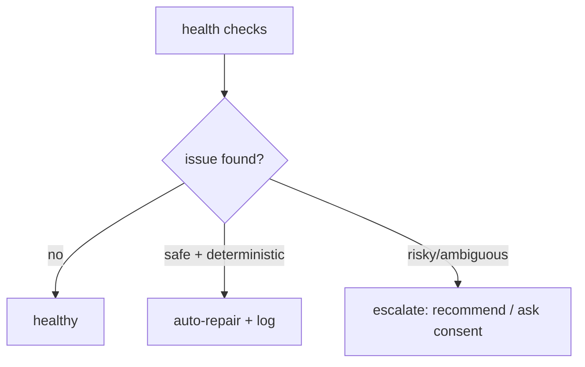

# Doctor & Self-Healing

**Version:** 1.0.0
**Status:** Stable
**Layer:** concept

## Overview

The technology-agnostic model of how Cronus keeps itself and its offices healthy: continuous self-checks, automatic repair of safe problems, escalation of risky ones, and recovery to a consistent state after failures. It is the "doctor" that diagnoses and heals without making things worse.

## Related Specifications

- [l1-storage-model.md](l1-storage-model.md) - Durable, restartable state the doctor restores to (STO-2).
- [l1-office-model.md](l1-office-model.md) - Autonomous operation the doctor keeps alive (OFF-8).
- [l1-error-reporting.md](l1-error-reporting.md) - Unrepairable issues may be reported (with consent).
- [l2-doctor.md](l2-doctor.md) - Concrete checks, repairs, and the `doctor` command.

## 1. Motivation

An autonomous, long-running office accumulates drift: orphaned sessions, stuck cards, inconsistent state, broken config. A self-healing layer keeps it running unattended and recovers cleanly from crashes, so the user rarely has to intervene.

## 2. Constraints & Assumptions

- Diagnosis must never worsen state.
- Only safe, deterministic problems are auto-repaired; risky fixes need consent.
- Recovery after a crash/restart must reach a consistent state.

## 3. Core Invariants (Layer 1 only)

- **HEAL-1 (Continuous checks):** the system periodically checks its own and each office's health (integrity, stuck work, broken/inconsistent state, resource limits).
- **HEAL-2 (Safe self-repair):** deterministic, safe problems are repaired automatically and the action is recorded.
- **HEAL-3 (Escalate the risky):** ambiguous or destructive fixes are surfaced, not silently applied; destructive repair requires consent (consistent with OFF-6).
- **HEAL-4 (Non-destructive diagnosis):** checking never degrades state; repairs are reversible where possible.
- **HEAL-5 (Traceable):** every check and repair is logged.
- **HEAL-6 (Self-recovery):** after a crash or restart the office recovers to a consistent state (consistent with OFF-8 / STO-2).

> L2 specs cannot reach RFC status until all invariants here are addressed in their "Invariant Compliance" section.

## 4. Detailed Design

### 4.1 Check → repair → escalate

### 4.2 What is checked (categories)

State integrity, orphaned/stuck work (cards stuck in `running`, dangling sessions), config validity, store consistency, resource pressure (disk), and crash-recovery consistency.

## 5. Drawbacks & Alternatives

- **Over-eager repair risk:** mitigated by HEAL-3 (escalate the risky) and HEAL-4 (reversible).
- **Alternative — manual maintenance only:** rejected; defeats unattended autonomy. <!-- TBD: default self-check cadence -->

## Canonical References

| Alias | Path | Purpose |
| --- | --- | --- |
| `[STORAGE]` | `.design/main/specifications/l1-storage-model.md` | Recovery target |
| `[DOCTOR]` | `.design/main/specifications/l2-doctor.md` | Concrete checks and repairs |
