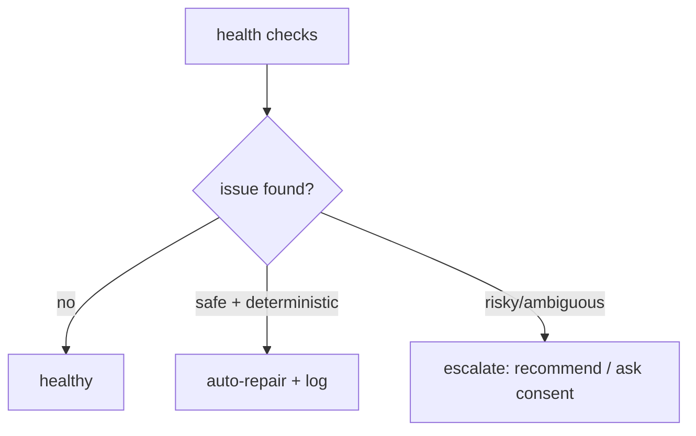

# Doctor & Self-Healing

**Version:** 1.2.0
**Status:** Stable
**Layer:** concept

## Overview

The technology-agnostic model of how Cronus keeps itself and its offices healthy: continuous self-checks, automatic repair of safe problems, escalation of risky ones, and recovery to a consistent state after failures. It is the "doctor" that diagnoses and heals without making things worse. Whether the doctor may *act* is the user's call: healing authority is a user-visible setting (HEAL-7), while diagnosis and crash-recovery remain constitutive.

## Related Specifications

- [l1-storage-model.md](l1-storage-model.md) - Durable, restartable state the doctor restores to (STO-2).
- [l1-office-model.md](l1-office-model.md) - Autonomous operation the doctor keeps alive (OFF-8).
- [l1-error-reporting.md](l1-error-reporting.md) - Unrepairable issues may be reported (with consent).
- [l1-improvement-loop.md](l1-improvement-loop.md) - Upstream complement: what healing cannot fix becomes a product finding (IMP-1).
- [l1-security.md](l1-security.md) - Healing authority is a setting on the human-write-only authority plane (SEC-10).
- [l2-doctor.md](l2-doctor.md) - Concrete checks, repairs, and the `doctor` command.

## 1. Motivation

An autonomous, long-running office accumulates drift: orphaned sessions, stuck cards, inconsistent state, broken config. A self-healing layer keeps it running unattended and recovers cleanly from crashes, so the user rarely has to intervene.

## 2. Constraints & Assumptions

- Diagnosis must never worsen state.
- Only safe, deterministic problems are auto-repaired; risky fixes need consent.
- Recovery after a crash/restart must reach a consistent state.

## 3. Core Invariants (Layer 1 only)

- **HEAL-1 (Continuous checks):** the system periodically checks its own and each office's health (integrity, stuck work, broken/inconsistent state, resource limits).
- **HEAL-2 (Safe self-repair):** deterministic, safe problems are repaired automatically and the action is recorded.
- **HEAL-3 (Escalate the risky):** ambiguous or destructive fixes are surfaced, not silently applied; destructive repair requires consent (consistent with OFF-6).
- **HEAL-4 (Non-destructive diagnosis):** checking never degrades state; repairs are reversible where possible.
- **HEAL-5 (Traceable):** every check and repair is logged.
- **HEAL-6 (Self-recovery):** after a crash or restart the office recovers to a consistent state (consistent with OFF-8 / STO-2).
- **HEAL-7 (User-governed healing authority):** whether the doctor may repair is a user-visible setting held on the human-write-only authority plane (SEC-10): at minimum **observe** (checks run; every would-be repair surfaces as a recommendation, nothing is applied) and **heal** (default: safe deterministic repairs apply automatically per HEAL-2; risky ones still escalate per HEAL-3). Constitutive integrity actions are outside the setting's reach: non-destructive checks (HEAL-1/HEAL-4) and crash-recovery to a consistent state (HEAL-6) are never disableable. Every repair suppressed by the setting is surfaced and recorded (HEAL-5).

> L2 specs cannot reach RFC status until all invariants here are addressed in their "Invariant Compliance" section.

## 4. Detailed Design

### 4.1 Check → repair → escalate



### 4.2 What is checked (categories)

State integrity, orphaned/stuck work (cards stuck in `running`, dangling sessions), config validity, store consistency, resource pressure (disk), and crash-recovery consistency.

### 4.3 Restore-on-access (lazy self-recovery) [ADDED v1.1.0]

Self-recovery (HEAL-6) is realized by two complementary triggers, not the periodic
sweep alone:

- **Scheduled** — the continuous check loop (HEAL-1) reconciles at a cadence.
- **On-access** — a heartbeat-touch guards each interaction with a recoverable
  resource (a session, an office, a sandbox). Before the real operation runs, a
  lightweight guard resolves the resource's liveness context, refreshes its
  **heartbeat**, and — if the resource "needs restore" (idle-evicted, cold, or
  gone since last touch) — transparently restores it *before* proceeding.

```text
[REFERENCE]
touch(resource):                          // wraps every access; HEAL-4 non-destructive
    try:
        ctx := resolve_liveness(resource)
        refresh_heartbeat(ctx)
        if needs_restore(ctx):  restore(ctx)   // HEAL-6 lazy recovery
    except any e:
        log_debug(e)                      // touch failures are SWALLOWED — never fail the call
    return proceed(resource)
```

Two properties are load-bearing. First, restore happens **just-in-time on the
first access after loss**, so a resource idle-evicted to save memory is silently
rehydrated when next needed rather than waiting for the next sweep. Second, the
guard is **best-effort and non-blocking**: any failure in the touch path is logged
and ignored, never propagated — a health mechanism must not itself become a failure
mode for the operation it protects (HEAL-4). Heartbeat freshness feeds the liveness
watchdog that classifies silent-but-alive work (see `l1-work-liveness.md` WL-8).

### 4.4 Healing authority tiers [ADDED v1.2.0]

| Tier | Checks (HEAL-1/4) | Safe repairs (HEAL-2) | Risky repairs (HEAL-3) | Crash recovery (HEAL-6) |
| --- | --- | --- | --- | --- |
| observe | run | recommended only | recommended only | runs |
| heal (default) | run | auto-applied + logged | escalated for consent | runs |

The tier is an authority grant, not a preference: it lives where permission rules live,
readable by the agent but writable only by the human principal (SEC-10). Suppressed
repairs in `observe` surface through the normal escalation channel — the same surface
that feeds report-prompting's inconsistency trigger — so a user who disables healing
still sees what the doctor *would have* fixed, and unrepairable findings still reach
the improvement loop (IMP-1) as product findings.

## 5. Drawbacks & Alternatives

- **Over-eager repair risk:** mitigated by HEAL-3 (escalate the risky) and HEAL-4 (reversible).
- **Alternative — manual maintenance only:** rejected; defeats unattended autonomy. <!-- TBD: default self-check cadence -->

## Canonical References

| Alias | Path | Purpose |
| --- | --- | --- |
| `[STORAGE]` | `.design/main/specifications/l1-storage-model.md` | Recovery target |
| `[DOCTOR]` | `.design/main/specifications/l2-doctor.md` | Concrete checks and repairs |
| `[LIVENESS]` | `.design/main/specifications/l1-work-liveness.md` | Heartbeat/watchdog contract the restore-on-access guard feeds (WL-8) |

## Document History

| Version | Date | Author | Notes |
| --- | --- | --- | --- |
| 1.2.0 | 2026-07-16 | Core Team | Added HEAL-7 user-governed healing authority + §4.4 tiers (observe/heal): repair autonomy is a user setting on the human-write-only authority plane (SEC-10); constitutive checks and crash recovery are never disableable; suppressed repairs surface as recommendations. Related links to l1-improvement-loop and l1-security. |
| 1.1.0 | 2026-07-01 | Core Team | Added §4.3 Restore-on-access — heartbeat-touch guard that refreshes liveness and lazily restores an idle-evicted/cold resource just-in-time on first access after loss, complementing the scheduled sweep; touch failures are swallowed (best-effort, never a failure mode for the guarded call); feeds the WL-8 liveness watchdog. Concrete realization of HEAL-6. |
| 1.0.0 | 2026-06-24 | Core Team | Initial spec — HEAL-1…HEAL-6, check→repair→escalate, check categories. |
