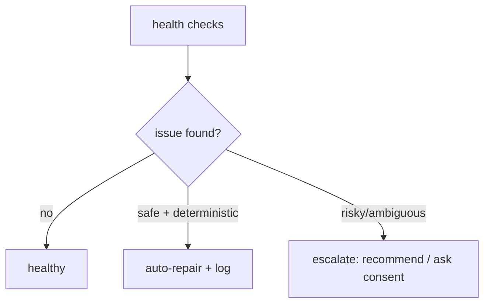

# Doctor & Self-Healing

**Version:** 1.3.0
**Status:** Stable
**Layer:** concept

## Overview

The technology-agnostic model of how Cronus keeps itself and its offices healthy: continuous self-checks, automatic repair of safe problems, escalation of risky ones, and recovery to a consistent state after failures. It is the "doctor" that diagnoses and heals without making things worse. Whether the doctor may *act* is the user's call: healing authority is a user-visible setting (HEAL-7), while diagnosis and crash-recovery remain constitutive.

## Related Specifications

- [l1-storage-model.md](l1-storage-model.md) - Durable, restartable state the doctor restores to (STO-2).
- [l1-office-model.md](l1-office-model.md) - Autonomous operation the doctor keeps alive (OFF-8).
- [l1-error-reporting.md](l1-error-reporting.md) - Unrepairable issues may be reported (with consent).
- [l1-improvement-loop.md](l1-improvement-loop.md) - Upstream complement: what healing cannot fix becomes a product finding (IMP-1).
- [l1-security.md](l1-security.md) - Healing authority is a setting on the human-write-only authority plane (SEC-10).
- [l2-doctor.md](l2-doctor.md) - Concrete checks, repairs, and the `doctor` command.
- [l1-architecture.md](l1-architecture.md) - [ADDED v1.3.0] INV-9 shipped-surface honesty is HEAL-8's build-time counterpart: INV-9 governs what a surface *advertises*, HEAL-8 governs whether the two halves *currently running* are the same build.
- [l1-acp.md](l1-acp.md) - [ADDED v1.3.0] ACP-2's capability declaration before interaction is where two independently-deployed halves meet, and therefore where HEAL-8's build identities are exchanged.
- [l1-background-activation.md](l1-background-activation.md) - [ADDED v1.3.0] BA-11 (one engine per state root; frontends attach rather than duplicate) is what makes skew a routine condition rather than an exotic one — an attaching frontend was deployed on its own schedule.

## 1. Motivation

An autonomous, long-running office accumulates drift: orphaned sessions, stuck cards, inconsistent state, broken config. A self-healing layer keeps it running unattended and recovers cleanly from crashes, so the user rarely has to intervene.

## 2. Constraints & Assumptions

- Diagnosis must never worsen state.
- Only safe, deterministic problems are auto-repaired; risky fixes need consent.
- Recovery after a crash/restart must reach a consistent state.

## 3. Core Invariants (Layer 1 only)

- **HEAL-1 (Continuous checks):** the system periodically checks its own and each office's health (integrity, stuck work, broken/inconsistent state, resource limits).
- **HEAL-2 (Safe self-repair):** deterministic, safe problems are repaired automatically and the action is recorded.
- **HEAL-3 (Escalate the risky):** ambiguous or destructive fixes are surfaced, not silently applied; destructive repair requires consent (consistent with OFF-6).
- **HEAL-4 (Non-destructive diagnosis):** checking never degrades state; repairs are reversible where possible.
- **HEAL-5 (Traceable):** every check and repair is logged.
- **HEAL-6 (Self-recovery):** after a crash or restart the office recovers to a consistent state (consistent with OFF-8 / STO-2).
- **HEAL-7 (User-governed healing authority):** whether the doctor may repair is a user-visible setting held on the human-write-only authority plane (SEC-10): at minimum **observe** (checks run; every would-be repair surfaces as a recommendation, nothing is applied) and **heal** (default: safe deterministic repairs apply automatically per HEAL-2; risky ones still escalate per HEAL-3). Constitutive integrity actions are outside the setting's reach: non-destructive checks (HEAL-1/HEAL-4) and crash-recovery to a consistent state (HEAL-6) are never disableable. Every repair suppressed by the setting is surfaced and recorded (HEAL-5).

- **HEAL-8 (Build-parity skew is a named constitutive check, never a mystery error):** two halves of the product that are **deployed independently and loaded at different moments** — a frontend and the engine it attaches to, a hot-reloaded module and the process that still holds the old one, a client and a session it reconnects to — can be running **different builds of the same product**, and the symptom is an ordinary-looking error: an unrecognized verb, a rejected field, a shape the other side has never heard of. Undiagnosed, that error is indistinguishable from a defect, and the whole investigation goes to the wrong place.

  The doctor therefore carries a **build-parity check** that compares the identity of the build a component actually **loaded** against the identity present at the seam it is talking to, and reports skew as its own named condition rather than letting it surface as a downstream failure. Three properties are binding:

  - **Identity is content-derived, never timestamp-derived.** A build's identity is computed from what it *is*, not from when its files were last touched. A modification-time heuristic fails in every direction that matters: a synchronizing deploy commonly lands files **older** than what they replace, a deletion changes no timestamp at all, an edit to anything but the newest file leaves the maximum untouched, and coarse timestamp resolution hides recent edits. Each of those reports *nothing to do* while a stale build keeps running. (Same argument as HNR-6 and SG-2: an identity that is really a proxy for location or time is not an identity.)
  - **Skew is surfaced with its remedy, and the remedy is honest.** The report names which halves disagree and what actually clears it — commonly a full restart rather than a reload, because a reload that re-runs setup without re-importing leaves the old code in place. A check that says *something is wrong* without naming the action is a check the user learns to ignore.
  - **It is constitutive, and not auto-repairable.** Under HEAL-7's tiers this check is never disableable, and it does **not** self-heal: restarting the product to resolve skew is a disruptive act belonging to the human (HEAL-3), so the doctor reports and recommends. It is also the correct owner of the diagnosis, not the failing call site — a component receiving an unknown verb cannot know whether it is a bug, a version gap, or a capability the peer never had (composing `l1-acp` ACP-2's capability declaration, which is where the identities meet, and `l1-architecture` INV-9's shipped-surface honesty, whose *runtime* counterpart this is: INV-9 governs what a surface advertises, HEAL-8 governs whether the two halves currently running are the same product).


> L2 specs cannot reach RFC status until all invariants here are addressed in their "Invariant Compliance" section.

## 4. Detailed Design

### 4.1 Check → repair → escalate


```mermaid
graph TD
    CHK[health checks] --> ISS{issue found?}
    ISS -->|no| OK[healthy]
    ISS -->|safe + deterministic| FIX[auto-repair + log]
    ISS -->|risky/ambiguous| ESC[escalate: recommend / ask consent]
```

### 4.2 What is checked (categories)

State integrity, orphaned/stuck work (cards stuck in `running`, dangling sessions), config validity, store consistency, resource pressure (disk), and crash-recovery consistency.

### 4.3 Restore-on-access (lazy self-recovery) [ADDED v1.1.0]

Self-recovery (HEAL-6) is realized by two complementary triggers, not the periodic
sweep alone:

- **Scheduled** — the continuous check loop (HEAL-1) reconciles at a cadence.
- **On-access** — a heartbeat-touch guards each interaction with a recoverable
  resource (a session, an office, a sandbox). Before the real operation runs, a
  lightweight guard resolves the resource's liveness context, refreshes its
  **heartbeat**, and — if the resource "needs restore" (idle-evicted, cold, or
  gone since last touch) — transparently restores it *before* proceeding.

```text
[REFERENCE]
touch(resource):                          // wraps every access; HEAL-4 non-destructive
    try:
        ctx := resolve_liveness(resource)
        refresh_heartbeat(ctx)
        if needs_restore(ctx):  restore(ctx)   // HEAL-6 lazy recovery
    except any e:
        log_debug(e)                      // touch failures are SWALLOWED — never fail the call
    return proceed(resource)
```

Two properties are load-bearing. First, restore happens **just-in-time on the
first access after loss**, so a resource idle-evicted to save memory is silently
rehydrated when next needed rather than waiting for the next sweep. Second, the
guard is **best-effort and non-blocking**: any failure in the touch path is logged
and ignored, never propagated — a health mechanism must not itself become a failure
mode for the operation it protects (HEAL-4). Heartbeat freshness feeds the liveness
watchdog that classifies silent-but-alive work (see `l1-work-liveness.md` WL-8).

### 4.4 Healing authority tiers [ADDED v1.2.0]

| Tier | Checks (HEAL-1/4) | Safe repairs (HEAL-2) | Risky repairs (HEAL-3) | Crash recovery (HEAL-6) |
| --- | --- | --- | --- | --- |
| observe | run | recommended only | recommended only | runs |
| heal (default) | run | auto-applied + logged | escalated for consent | runs |

The tier is an authority grant, not a preference: it lives where permission rules live,
readable by the agent but writable only by the human principal (SEC-10). Suppressed
repairs in `observe` surface through the normal escalation channel — the same surface
that feeds report-prompting's inconsistency trigger — so a user who disables healing
still sees what the doctor *would have* fixed, and unrepairable findings still reach
the improvement loop (IMP-1) as product findings.

## 5. Drawbacks & Alternatives

- **Over-eager repair risk:** mitigated by HEAL-3 (escalate the risky) and HEAL-4 (reversible).
- **Alternative — manual maintenance only:** rejected; defeats unattended autonomy. <!-- TBD: default self-check cadence -->

## Canonical References

| Alias | Path | Purpose |
| --- | --- | --- |
| `[STORAGE]` | `.design/main/specifications/l1-storage-model.md` | Recovery target |
| `[DOCTOR]` | `.design/main/specifications/l2-doctor.md` | Concrete checks and repairs |
| `[LIVENESS]` | `.design/main/specifications/l1-work-liveness.md` | Heartbeat/watchdog contract the restore-on-access guard feeds (WL-8) |

## Document History

| Version | Date | Author | Notes |
| --- | --- | --- | --- |
| 1.3.0 | 2026-08-06 | Core Team | HEAL-8 added — **build-parity skew as a named constitutive check**. Two halves of the product deployed independently and loaded at different moments (a frontend and the engine it attaches to under BA-11, a hot-reloaded module and the process still holding the old one, a client reconnecting to a session) can run **different builds of the same product**, and the symptom is an ordinary-looking error — an unrecognized verb, a rejected field — that is indistinguishable from a defect and sends the whole investigation to the wrong place. Three binding properties: identity is **content-derived, never timestamp-derived** (a synchronizing deploy commonly lands files *older* than what they replace, a deletion changes no timestamp, an edit to anything but the newest file leaves the maximum untouched, and coarse resolution hides recent edits — each reporting *nothing to do* while stale code runs; the HNR-6 / SG-2 argument again); skew is **surfaced with an honest remedy**, commonly a full restart rather than a reload, since a reload that re-runs setup without re-importing leaves the old code in place; and it is **constitutive and not auto-repairable** under HEAL-7, because restarting is a disruptive act belonging to the human (HEAL-3). The doctor is the correct owner of the diagnosis rather than the failing call site, which cannot distinguish a bug from a version gap from a capability the peer never had. Composes ACP-2 (where the identities meet) and is the runtime counterpart of INV-9. |
| 1.2.0 | 2026-07-16 | Core Team | Added HEAL-7 user-governed healing authority + §4.4 tiers (observe/heal): repair autonomy is a user setting on the human-write-only authority plane (SEC-10); constitutive checks and crash recovery are never disableable; suppressed repairs surface as recommendations. Related links to l1-improvement-loop and l1-security. |
| 1.1.0 | 2026-07-01 | Core Team | Added §4.3 Restore-on-access — heartbeat-touch guard that refreshes liveness and lazily restores an idle-evicted/cold resource just-in-time on first access after loss, complementing the scheduled sweep; touch failures are swallowed (best-effort, never a failure mode for the guarded call); feeds the WL-8 liveness watchdog. Concrete realization of HEAL-6. |
| 1.0.0 | 2026-06-24 | Core Team | Initial spec — HEAL-1…HEAL-6, check→repair→escalate, check categories. |
