# Document Understanding

**Version:** 1.0.0
**Status:** Stable
**Layer:** concept

## Overview

Turning a heterogeneous source document into a faithful, structured, positionally-anchored representation *before* it is chunked, embedded, or reasoned over. Real-world sources — rich-text documents, slides, spreadsheets, PDFs, scanned images, web pages — carry meaning in their *layout*: reading order across columns, heading hierarchy, tables, figures with captions, headers/footers. A flat "extract the text" pass discards that structure and produces low-fidelity retrieval and ungrounded citations. Document understanding is the ingestion stage that reconstructs structure and provenance, so every downstream stage (segmentation, indexing, graph construction, grounded answering) works from a high-fidelity, inspectable model of the source rather than a de-structured blob.

## Related Specifications

- [l1-knowledge-base.md](l1-knowledge-base.md) - The knowledge base consumes this stage as the first step of its ingestion pipeline (KB-12); "parse & extract text" is the degraded fallback for this contract.
- [l1-content-segmentation.md](l1-content-segmentation.md) - Segmentation cuts on the structural boundaries this stage surfaces; the two form the parse→segment front of ingestion.
- [l1-file-management.md](l1-file-management.md) - Files are the raw sources this stage understands.
- [l1-context-provenance.md](l1-context-provenance.md) - Positional back-references established here are the origin of downstream provenance.
- [l1-data-lineage.md](l1-data-lineage.md) - Extracted units are the leaf sources of the corpus lineage graph.
- [l1-deployment-neutrality.md](l1-deployment-neutrality.md) - Optical/layout/vision models are host-supplied provider seams, on-device by default.
- [l1-model-runtime.md](l1-model-runtime.md) - The understanding models run through the same host model-capability plane.

## 1. Motivation

Retrieval quality is capped by ingestion fidelity. If a two-column research paper is read top-to-bottom as raw bytes, its sentences interleave into nonsense; if a financial table is flattened into a run of numbers, its rows and headers are lost; if a scanned contract is an image, a text pass yields nothing. Downstream stages cannot recover information that ingestion threw away. The remedy is to *understand* the document the way a person skimming it does — recognize the title, follow the columns in order, see that a block is a table and read it row by row, notice a figure and pair it with its caption — and to record *where* each piece came from. This turns ingestion from lossy text-scraping into a faithful, inspectable, provenance-carrying transformation, and it is the single largest lever on end-to-end grounded-answer quality.

## 2. Constraints & Assumptions

- Understanding reports *structure*, not semantic truth; a mis-detected element is a diagnosable, correctable outcome, never a hidden one.
- Deep understanding may require heavier models (optical recognition, layout detection) than plain parsing; these are host capabilities, on-device by default, and their absence must degrade gracefully rather than fail ingestion.
- The original source is always preserved in full and re-fetchable; the structured representation is a derived view, not a replacement.
- This stage does not chunk, embed, rank, or answer — it produces the structured document other stages consume.

## 3. Core Invariants

Rules every Layer 2 implementation MUST NOT violate:

- **DU-1 (Fidelity over flattening):** extraction preserves the source's structural and positional information — reading order, heading hierarchy, tables, figures, lists — and MUST NOT collapse a structured document into an undifferentiated text blob. Flattening is the explicitly-degraded fallback, never the default.
- **DU-2 (Positional provenance):** every extracted unit carries a back-reference to its exact location in the source (e.g. page, bounding region, character offset), so a downstream segment, graph element, or cited claim traces to the precise origin. An extracted unit with no locatable origin is invalid.
- **DU-3 (Reading-order reconstruction):** complex and multi-column layouts are linearized into human reading order before anything consumes them; visual adjacency is resolved into logical sequence, never assumed to be naïve top-to-bottom byte order.
- **DU-4 (Typed structural elements):** output is a stream of typed elements drawn from a closed, host-neutral taxonomy — at minimum: title/heading, paragraph text, list, table, figure, caption, header/footer, equation, reference — carrying enough structure for segmentation to make boundary decisions.
- **DU-5 (Tables as first-class, model-legible):** a table is recognized as a structure (rows, columns, header cells, spanning cells) and rendered into a form a model can read as data — linearized sentences or a normalized cell grid — never dropped nor mangled into free-running text. Its source region is retained for inspection.
- **DU-6 (Optical & non-text sources):** image-only or scanned sources are recognized through an optical/visual understanding step; a figure retains its caption and any embedded text. When visual understanding is unavailable, the stage degrades to best-available text extraction **and records the reduced fidelity** — it MUST NOT silently present degraded output as full-fidelity.
- **DU-7 (Host-supplied capability, local-first):** the parsing, optical, layout, and vision models are host-supplied provider seams, on-device by default; understanding a document performs no egress unless the host explicitly authorizes it. A missing capability degrades-and-records (DU-6), never fails the whole ingest and never forces data off-device.
- **DU-8 (Deterministic & inspectable):** for a given source and capability set, extraction is deterministic, and its decisions are inspectable — a human can see what element was detected where. Extraction is non-authoritative: it reports structure and does not assert semantic correctness.
- **DU-9 (One contract, format-parametric):** heterogeneous formats resolve to ONE structured-document contract; downstream stages consume the contract, never the raw format. Adding a format is adding a parser behind the same contract — it changes no downstream stage.

> L2 specs cannot reach RFC status until all invariants here are addressed in their "Invariant Compliance" section.

## 4. Detailed Design

### 4.1 The Structured Document Contract

The stage emits one representation regardless of input format:

```text
StructuredDocument {
  source_ref   : SourceId            // the preserved original (file/url/record)
  elements     : Element[]           // typed, in reconstructed reading order
  fidelity     : "full" | "reduced"  // DU-6: honest self-report of extraction quality
  capability   : CapabilitySet       // which understanding models were available (DU-7)
}

Element {
  kind      : "title" | "text" | "list" | "table" | "figure" | "caption"
            | "header" | "footer" | "equation" | "reference"   // DU-4 closed taxonomy
  level     : int?                   // heading depth for title elements
  content   : Text | TableGrid | FigureRef   // kind-dependent, model-legible (DU-5)
  origin    : SourceLocation         // DU-2 page / region / offset back-reference
}
```

### 4.2 Understanding Pipeline

```mermaid
graph LR
    SRC[Source: doc / slides / sheet / PDF / image / web] --> DETECT[Detect format & acquire pages]
    DETECT --> OPTIC[Optical pass if image/scanned: recognize text regions]
    OPTIC --> LAYOUT[Layout analysis: classify regions into typed elements]
    LAYOUT --> ORDER[Reconstruct reading order]
    ORDER --> TABLE[Table structure recognition: rows/cols/headers to model-legible form]
    TABLE --> ASSEMBLE[Assemble StructuredDocument with per-element provenance]
    ASSEMBLE --> OUT[StructuredDocument]
```



Each stage is capability-gated: when a model (optical, layout, table-structure) is unavailable, the pipeline routes around it and marks `fidelity = reduced` (DU-6), never halting the ingest.

### 4.3 Fidelity Honesty

`fidelity` is a first-class, self-reported field, not a silent quality difference. A consumer (segmentation, the retrieval layer, a human reviewer) can see that a scanned source was processed without optical understanding and treat its output with appropriate caution. Reduced fidelity is surfaced, never masked — the observability analog of honest coverage.

### 4.4 Tables & Figures

A table is the highest-value, highest-loss element under naïve extraction. This stage recognizes the grid — including header rows and spanning cells — and renders it into a form a model reads as data, while retaining the source region so a human can verify the reconstruction. A figure is paired with its caption and any text it contains, so a later retrieval can surface "the figure that shows X" with its explanatory text rather than an orphaned image reference.

## 5. Implementation Notes

1. The optical, layout, and table-structure capabilities are independent seams — a host may supply any subset. Each absent seam narrows fidelity for the affected element kinds only, not the whole document.
2. Reading-order reconstruction is the correctness lynchpin for multi-column sources; a spatial region graph resolved into a linear sequence is the standard approach.
3. Provenance is cheapest to capture at detection time (each region already has coordinates); attaching it later is error-prone.

## 6. Nodus Realization

An ingestion workflow authored in the workflow language orchestrates this stage as a bounded pipeline of host-bound steps — optical, layout, table, assemble — each model a host-supplied provider seam (portability contract), with no understanding logic in the language core. The stage is a host subsystem the language *drives*; it introduces no new language primitive.

## 7. Drawbacks & Alternatives

- **Plain text extraction only:** simplest and dependency-free, but caps retrieval quality and destroys tables/figures/reading-order. Retained as the DU-6 fallback, never the default.
- **Single monolithic parser per format:** simpler than a capability-gated pipeline, but couples format handling to understanding quality and prevents graceful degradation when a model is absent.

## Canonical References

| Alias | Path | Purpose |
| --- | --- | --- |
| `[KB]` | `.design/main/specifications/l1-knowledge-base.md` | The consumer of this stage (KB-12); defines where structured documents enter the index. |
| `[STORE]` | `.design/main/specifications/l2-knowledge-store.md` | Concrete indexing pipeline that will realize the ingestion front. |
| `[SEG]` | `.design/main/specifications/l1-content-segmentation.md` | The immediate downstream consumer of the structured document. |

## Document History

| Version | Date | Author | Notes |
| --- | --- | --- | --- |
| 1.0.0 | 2026-07-22 | Core Team | Initial spec — deep, layout-aware document understanding as the high-fidelity front of ingestion: structured-document contract, reading-order reconstruction, typed element taxonomy, tables/figures as model-legible first-class units, optical understanding for scanned sources, honest fidelity self-report, positional provenance, host-supplied local-first capability seams (DU-1…DU-9). Mined from a studied retrieval/document-intelligence engine's document-understanding subsystem; fidelity-improving and source-faithful. Concept-only. |
