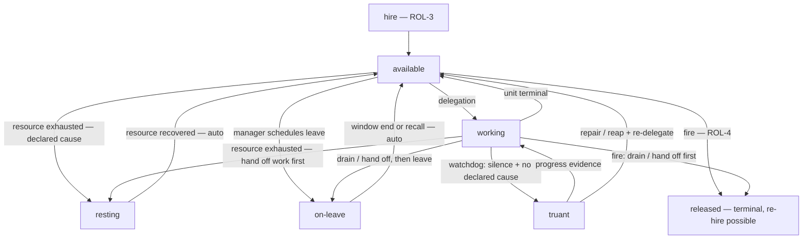

# Employee Availability States

**Version:** 1.0.0
**Status:** Stable
**Layer:** concept

## Overview

The availability model for the office's workforce: at any moment every hired employee is in exactly one of a **closed set of availability states** — *available* (present, no assignment), *working* (executing assigned work), *resting* (a short, resource-driven day-off with automatic return), *on-leave* (a planned, manager-scheduled vacation), or *truant* (assigned work, no progress, no declared reason — a detected anomaly, never a commanded state). *Released* (fired) is the lifecycle exit out of the availability model entirely (ROL-4), from which re-hire returns.

The states are the office metaphor's honest rendering of real runtime facts: "resting until 14:00" is a model-quota window; "on leave until Monday" is a deliberate staffing suspension; "truant for 25 minutes on card X" is a liveness anomaly the watchdog caught. The contract binds the metaphor to the mechanics: every state carries its declared technical cause and expected return, every transition is evented and visible, no work is ever delegated to the unavailable, and no availability state — not even release — destroys what the employee learned.

This model is subordinate to office control: the office's own state (Paused, Hibernating) suspends everyone uniformly — employee availability expresses staffing and resource facts *within* a running office, never a worker-side override of the office switch.

## Related Specifications

- [l1-roles.md](l1-roles.md) - Hire/fire endpoints (ROL-3/ROL-4) this model sits between; manager-driven staffing (ROL-5) owns leave decisions.
- [l1-office-control.md](l1-office-control.md) - Office-level states dominate (workers have no independent pause controls); model substitution before rest (OC-3) and automatic resource-recovery return (OC-4) are the per-employee analogs; no-silent-transitions discipline (OC-5).
- [l1-work-liveness.md](l1-work-liveness.md) - Truancy detection composes the liveness watchdog (WL-8) and the affirmative next-move contract (WL-3); a truant's work re-enters via the recovery ladder (WL-6) and stranded-work path (WL-5).
- [l1-office-model.md](l1-office-model.md) - The office metaphor being rendered honestly; adaptive staffing (OFF-4) reacts to unavailability.
- [l1-orchestration.md](l1-orchestration.md) - Delegation (ORC-3/ORC-4) targets only available capacity; unavailability triggers re-delegation or visible queuing.
- [l1-scheduler-model.md](l1-scheduler-model.md) - Leave windows, rest timers, and return fires are ordinary schedules.
- [l2-budget-engine.md](l2-budget-engine.md) - Quota/cost exhaustion signals that put an employee to rest.
- [l1-office-visualization.md](l1-office-visualization.md) - The live projection where every employee's state, cause, and expected return are visible.
- [l1-doctor.md](l1-doctor.md) - Truancy repair path (HEAL-2/HEAL-3); availability anomalies are health-check categories (HEAL-1).

## 1. Motivation

The office metaphor gives Cronus a workforce — but between "hired" and "fired" the existing design knows only an implicit, binary presence. Reality is richer, and each missing state is a real, currently-unnamed runtime condition:

- An employee whose serving model hit its quota window is not working — but nothing *says* so; work queued on it just gets slow and the client sees nothing.
- A manager (or user) may want a role deliberately suspended for a while — cost saving, a deprecated model awaiting replacement, a noisy experiment paused — without firing it and losing its place in the hierarchy.
- An agent that claimed a card and went silent is the worst case: it *looks* staffed while nothing happens. Work liveness can detect the silence at the run level (WL-8), but no concept renders it at the workforce level where a human instantly understands it: **the employee is truant**.

Naming the availability states once — with causes, visibility, delegation rules, and return semantics — turns "why is nothing happening?" from an investigation into a glance at the office floor: *two working, one resting until the quota resets, one on leave till Monday, one truant and being looked into.*

## 2. Constraints & Assumptions

- **The office switch outranks everyone.** Office Paused/Hibernating suspends all employees uniformly (per office control); the availability model operates within an Active/Idle office.
- **Workers do not set their own availability.** States are set by the manager/orchestrator (leave), by resource signals (rest), by observation (truant), or by the work itself (available/working). An employee never grants itself a vacation.
- **Availability is not identity.** States are runtime facts about a hired instance; they do not alter the role definition, hierarchy placement, memory, or skills.
- **The metaphor must stay honest.** Every metaphorical state is backed by a declared technical cause; rendering must expose it (no "on a break" with no reason attached).

## 3. Core Invariants

Rules every Layer 2 implementation MUST NOT violate. They are technology-neutral.

- **EMP-1 (Closed, exclusive state set):** every hired employee is in exactly one availability state at any time, from the closed set: **available** · **working** · **resting** · **on-leave** · **truant**. **Released** is the terminal lifecycle exit from the model (ROL-4; re-hire re-enters at *available*). Extending the taxonomy is a versioned amendment to this specification, not a runtime option.

- **EMP-2 (Office state dominates):** employee availability is subordinate to office control. When the office is Paused or Hibernating, every employee is uniformly suspended regardless of individual state, and individual states neither block nor override the office switch (workers have no independent pause controls). Employee states express staffing and resource facts within a running office.

- **EMP-3 (Truancy is detected, never declared):** *truant* is an anomaly classification — assigned non-terminal work, no observable progress, and no declared unavailability — produced by liveness observation (WL-8 silence-is-suspect, WL-3 next-move absence). It MUST NOT be settable by command. Detection surfaces the truancy (visible state + alert), opens the recovery path (WL-6 ladder, doctor repair), and reclassifies on evidence: resumed progress returns the employee to *working*; a genuinely wedged one is repaired or its work reaped and re-delegated (WL-5). Truancy MUST NOT resolve silently.

- **EMP-4 (Rest is resource-honest with automatic return):** *resting* is entered only for a **declared resource cause** — serving-model quota/rate exhaustion (after substitution has been attempted per OC-3), cost-window exhaustion, or error-recovery backoff — and carries a known or estimated return condition. Return is automatic when the resource recovers (per-employee analog of OC-4); a resting employee accepts no new delegation, and its in-flight work is handed off or re-queued under the work-liveness contract rather than stranded.

- **EMP-5 (Leave is planned, manager-owned, and drained):** *on-leave* is a deliberate, manager/user-initiated suspension (staffing is manager-driven, ROL-5) with an explicit window or an explicit recall. Entering leave first **drains or hands off** assigned work — no unit may remain owned by an employee on leave (WL-3 next-move preserved). Return at window end (or recall) is automatic and re-enters *available*.

- **EMP-6 (No delegation to the unavailable):** new work is delegated only to *available* or *working* employees. When a needed specialty has no available employee, the orchestrator MUST take a visible action: substitute capacity (model substitution, temporary scaling, or a staffing decision per OFF-4/WSL-6) or queue the work with the unavailability and expected return surfaced — work never silently waits on an absent employee. Unavailability governs *delegation only*: status queries and human conversation with an unavailable employee remain served (consistent with office control's paused-but-queryable stance).

- **EMP-7 (Visible, evented, causal):** the current state of every employee — with its cause and expected return where one exists — is visible in the office's live projection at all times, and every state transition emits an event before the transition is considered complete (no silent transitions; OC-5 discipline at the employee level). The event record makes availability history auditable.

- **EMP-8 (Availability never destroys knowledge):** no availability state modifies or discards the employee's memory, skills, or hierarchy placement. Only release archives — and even release is non-destructive with re-hire restoration (ROL-4). Vacation, rest, and truancy are availability facts, never lifecycle exits.

- **EMP-9 (Honest metaphor binding):** every metaphorical rendering is bound to its mechanical truth: the projection and any report MUST expose the declared cause alongside the metaphor ("resting — model quota, returns ~14:00"; "truant — no heartbeat for 25m on card X"). The metaphor is a lens over the mechanics, never a curtain in front of them.

> L2 specs cannot reach RFC status until all invariants here are addressed in their "Invariant Compliance" section.

## 4. Detailed Design

### 4.1 State machine

### 4.2 State semantics

| State | Metaphor | Technical fact | Entered by | Exits | Accepts new work |
| --- | --- | --- | --- | --- | --- |
| available | at the desk, free | hired instance, no active assignment | hire, unit completion, returns | delegation, rest, leave, fire | yes |
| working | working | owns ≥1 claimed unit with a live run (WL-1/WL-4) | delegation | completion, rest, leave, truancy, fire | yes (within load policy) |
| resting | on a day off | declared resource exhaustion; auto-return condition known | resource signal (post OC-3 substitution attempt) | automatic on recovery | no |
| on-leave | on vacation | planned manager-scheduled suspension window | manager/user decision (ROL-5) | window end / recall | no |
| truant | absent without leave | assigned + silent + no declared cause (WL-8) | watchdog detection only | evidence / repair / reap | no |
| released | fired | instance released, memory archived (ROL-4) | fire | re-hire → available | — |

### 4.3 Truancy detection and resolution

Truancy composes existing machinery rather than inventing new detection: the liveness watchdog (WL-8) classifies a silent-but-owned run; the availability model *renders* that classification at the workforce level and attaches the recovery path — auto-diagnosis first (doctor HEAL-2 safe repair, e.g. restore-on-access), then the bounded recovery ladder (WL-6), then reap-and-re-delegate (WL-5) with escalation (HEAL-3) if the pattern repeats. An employee repeatedly truant on the same class of work is a health signal worth surfacing to the manager (operational-health trend), possibly indicating a mis-fit role configuration or a chronically failing serving model.

### 4.4 Interplay with office control

| Office state | Effect on employee states |
| --- | --- |
| Active / Idle | availability model fully operative |
| Paused / Hibernating | all employees uniformly suspended; individual states frozen as-is, timers (leave windows, rest returns) evaluate on office resume |
| Error / Offline | availability moot; states restore with the office (OC-2 exact-state resume) |

Rest (EMP-4) is the *employee-level* pressure valve that precedes office-level hibernation: one employee's exhausted model puts *that employee* to rest; the office hibernates only when the exhaustion is office-wide (OC-3's "no viable substitute" at office scope).

### 4.5 Command and projection surface

Manager/user-facing operations follow the verb-first command grammar with frontend parity: view workforce states, schedule/recall leave, inspect a truancy. Rest and truancy have no "set" command — they are entered by signals and observation only (EMP-3/EMP-4); leave is the single human-commanded availability state. The office floor projection renders each employee with state, cause, and expected return (EMP-7/EMP-9); the dashboard aggregates availability history.

## 5. Implementation Notes

1. **State field + transition events** on the hired-instance record; event emission before transition completion (EMP-7).
2. **Rest wiring** — budget/quota signals + post-substitution hook (OC-3) set rest with return condition; scheduler fires the auto-return.
3. **Leave commands + drain** — manager verbs, drain/hand-off step reusing the office-control drain discipline (OC-1) at employee scope.
4. **Truancy rendering** — subscribe to the liveness watchdog classification; attach recovery-path state; never expose a setter.
5. **Projection & dashboard** — state/cause/return in the office view; availability history aggregation.

## 6. Drawbacks & Alternatives

- **State sprawl risk:** more states invite ad-hoc additions (sick? training?). Deliberately closed set (EMP-1); anything new must justify a versioned amendment. Training-like conditions (e.g. a role undergoing skill evolution) render as *working* on internal work, not a new state.
- **Alternative — no employee states, run-level liveness only:** rejected; it leaves the workforce-level question ("why is nothing happening?") answerable only by reading run internals, wasting the office metaphor's legibility.
- **Alternative — free-form status strings:** rejected; unclassifiable states break delegation rules (EMP-6), automation, and the projection's meaning.
- **Metaphor over-anthropomorphization:** playful states could obscure operations; countered by EMP-9's mandatory cause binding. <!-- TBD: whether the projection should offer a "plain mode" rendering technical causes only, no metaphor -->
- **Timer drift across office pauses:** leave windows and rest returns freezing during office Paused (§4.4) means wall-clock promises can shift; acceptable — timers re-evaluate on resume, and EMP-7 keeps the displayed expected return current.

## Document History

| Version | Date | Change |
| --- | --- | --- |
| 1.0.0 | 2026-07-02 | Initial concept: closed exclusive availability taxonomy (available/working/resting/on-leave/truant + released exit), office-state dominance, detected-never-declared truancy composing WL-8/WL-6/WL-5, resource-honest rest with automatic return (per-employee OC-3/OC-4 analog), manager-owned drained leave, no delegation to the unavailable, evented causal visibility, knowledge preservation, honest metaphor binding (EMP-1…EMP-9). |

## Canonical References

| Alias | Path | Purpose |
| --- | --- | --- |
| `[ROLES]` | `.design/main/specifications/l1-roles.md` | Hire/fire endpoints and manager-driven staffing the model sits between |
| `[OFFICE-CTL]` | `.design/main/specifications/l1-office-control.md` | Office-state dominance, drain discipline, substitution-before-rest, auto-recovery return |
| `[LIVENESS]` | `.design/main/specifications/l1-work-liveness.md` | Watchdog classification and recovery machinery truancy composes |
| `[OFFICE-VIZ]` | `.design/main/specifications/l1-office-visualization.md` | The projection surface for EMP-7/EMP-9 visibility |
