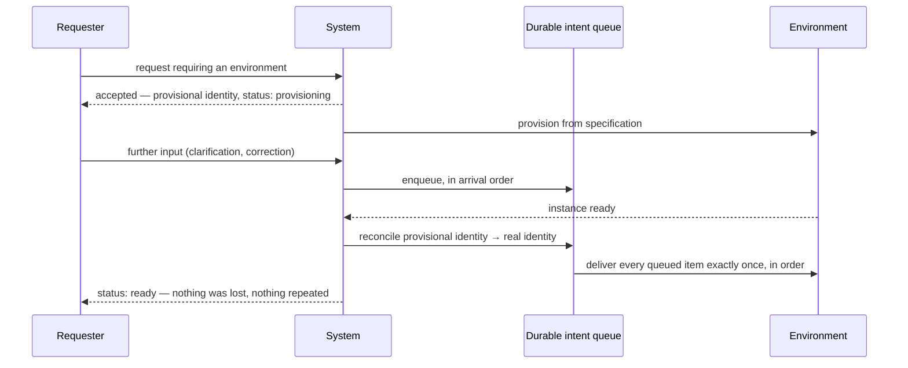

# Execution Environment Lifecycle

**Version:** 1.0.0
**Status:** Stable
**Layer:** concept

## Overview

The life of an **ephemeral execution environment** — the isolated place agent work actually runs — from the instant it is requested to the instant it is gone.

Four things this owns that neither the confinement policy nor the workspace record covers: the **specification/instance split** that makes an environment reproducible from a name; an **observable status model** in which provisioning and suspension are states rather than opaque waits; what happens to **intent that arrives before the environment exists**; and the load-bearing rule that **every path by which an environment can die names the component responsible for capturing its residue**.

Two neighbours are deliberately *not* this spec. The sandbox confinement contract governs *what code may do* once running — a policy question, not a lifetime question. The office workspace lifecycle governs the creation and deletion of *organizational* workspaces — a durable, human-scale concern, where this one is ephemeral and machine-scale.

## Related Specifications

- [l1-execution-sandbox.md](l1-execution-sandbox.md) - Confinement policy applied to a running instance (what code may do); this spec governs when the instance exists.
- [l2-execution-workspace.md](l2-execution-workspace.md) - The concrete workspace record, providers, and finalization protocol; the L2 realization of much of this contract.
- [l1-workspace-lifecycle.md](l1-workspace-lifecycle.md) - Durable *organizational* workspaces (offices). Different subject, different timescale — never conflate the two.
- [l1-crash-recovery.md](l1-crash-recovery.md) - Host-level unclean-shutdown recovery; the crash exit path (EL-5) hands to it.
- [l1-storage-model.md](l1-storage-model.md) - Where a specification, an instance record, and a captured residue durably live.
- [l1-security.md](l1-security.md) - Secret isolation, which EL-10 restates at the provisioning boundary.
- [l1-derived-artifact-handoff.md](l1-derived-artifact-handoff.md) - Handing a rebuildable derived artifact between actors; a captured residue is its lifecycle-driven sibling.
- [l1-change-merge.md](l1-change-merge.md) - Applying a captured delta back into a shared artifact when two changes touch the same thing.
- [l1-work-liveness.md](l1-work-liveness.md) - Ownership and next-move guarantees for the run that occupies an instance.
- [l1-declarative-configuration.md](l1-declarative-configuration.md) - An environment specification is a configuration surface and obeys that contract (DC-1/DC-5 template-and-instance kinship).
- [../../nodus/specifications/l1-nodus-portability.md](../../nodus/specifications/l1-nodus-portability.md) - Host-supplied provider seams; a run whose environment disappears mid-flight fails typed rather than hanging (LP-18).

## 1. Motivation

Agent work needs somewhere isolated to run, and that somewhere is expensive to create and cheap to forget. Three specific failures follow from leaving its lifetime unspecified, and each of them is the kind that is discovered late and in production.

**The cold start is paid by the human.** Provisioning an isolated environment takes seconds to minutes. If the system treats that as a blocking wait, the person who just asked for something sits watching a spinner, unable to add the clarification they thought of two seconds later. The request has already been made; there is no reason the *intent* cannot be accepted immediately even though the *environment* cannot.

**Work dies on the paths nobody enumerated.** An environment can end in more ways than its designers usually list: an explicit destroy while it is running, an idle reap, an expiry, a quota eviction, a host crash, a failed resume. Each of these fires in a different component, and typically only one or two of them were written with "and first, save the work" in mind. The result is a system that reliably preserves work on the path everyone tested and silently loses it on the others — worst of all on the *reap*, which is by volume the dominant one, precisely because it happens quietly and to environments nobody was watching.

**An environment configured ad hoc is not reproducible.** If instances are assembled by whatever code path created them, two "identical" environments are identical only by coincidence, a failure cannot be reproduced by recreating the environment, and there is no artifact to review, version, or share. Splitting the reusable **specification** from the disposable **instance** turns "what environment did that run in?" from an archaeology problem into a lookup.

## 2. Constraints & Assumptions

- Instances are **ephemeral by design**. Nothing durable may live only inside one; anything that must survive is either captured (EL-5/EL-6) or was never in the instance to begin with.
- Environments are local-first: an instance runs on-device unless the host is explicitly configured otherwise, and provisioning creates no egress path by itself.
- This spec is **backend-neutral**: a container, a virtual machine, a remote host, a separate process, or a branch-isolated directory are all admissible realizations. It constrains lifetime and observability, never mechanism.
- A **residue** is what an instance produced that is worth preserving — changed files and their base identity. Logs, traces, and metrics belong to the observability plane and are governed there.
- Confinement (what the code may do) and lifetime (when the environment exists) are independent axes and are specified separately.

## 3. Core Invariants

Rules every Layer 2 implementation MUST NOT violate:

- **EL-1 (Specification and instance are distinct objects):** an environment **specification** is a named, versioned, reusable definition — base template, entry command, initial variables, working root, resource class, and the *names* of the secrets it requires. An **instance** is a running realization of exactly one specification, and every instance names its specification. Configuring an instance ad hoc, outside any specification, is forbidden: it makes two supposedly identical environments identical only by luck, and makes a failure unreproducible.
- **EL-2 (Closed, observable status — provisioning is a state, not a wait):** an instance is always in exactly one status from the closed set *provisioning · ready · suspended · resuming · failed · gone*, observable to any authorized consumer at any moment, with provisioning and resuming exposing **progress** rather than an opaque block. **Failed** (it never became usable, or broke) and **gone** (it no longer exists) are distinct and MUST NOT be collapsed — a consumer needs to tell "this is broken, retry may help" from "this is over, do not wait".
- **EL-3 (Intent is accepted before the environment exists):** a request requiring an environment is accepted **immediately**, issued a **provisional identity**, and its accompanying intent is **durably queued**. The requester may keep acting — adding, correcting, cancelling — while provisioning proceeds. Refusing input until an environment is ready is forbidden: the human's time is not the system's to spend.
- **EL-4 (Exactly-once reconciliation of the provisional identity):** when the instance materializes, the provisional identity is **reconciled** onto the real one — every queued item is delivered **exactly once, in arrival order**, and the provisional identity continues to resolve to the real one for anything still holding it. If provisioning fails, the queued intent is **surfaced together with the failure**, never silently discarded. Losing queued intent, delivering it twice, and leaving a dangling provisional identity are each defects of the same invariant.
- **EL-5 (Every exit path names its capture owner):** an environment can end by several routes — explicit destroy while running, idle or expiry reap, quota eviction, host crash, failed resume, deliberate abandonment. For **each** route the design MUST name the component responsible for capturing the instance's residue **before** the environment becomes unreachable, and that assignment is part of the specification, not an accident of which code happened to execute. A route with no named capture owner is forbidden. This invariant exists because the failure it prevents is invisible: work is preserved on the well-trodden path and vanishes, without an error, on the routes nobody enumerated. A capture that **fails** is recorded as a failed capture naming the instance, the exit path, and the reason; it MUST NOT be swallowed by the destruction it was meant to precede. A reaper or an eviction cannot refuse to proceed forever, so the environment may still be destroyed — but the loss is then a **known, attributed** loss rather than an invisible one, which is the whole difference this invariant is defending.
- **EL-6 (Residue is a base-anchored delta, not a blob):** what is preserved from an ending environment is the **difference from a known, named base**, with the base's identity recorded alongside it (source, revision, root) so the delta is verifiable and replayable. An opaque copy of the whole environment is not a capture: it is too expensive to take on every exit path, unreviewable, and unapplicable elsewhere. A residue that cannot name its base is not a residue.
- **EL-7 (Suspension preserves; destruction captures; a resume is the same instance):** *suspending* preserves an instance for later resumption and MUST NOT require a capture; *destroying* triggers EL-5/EL-6. A **resume restores the same instance**, not a fresh one built from the same specification — and where it cannot, that is reported as a **failed resume** (EL-2) and its residue captured, never silently substituted with a new instance the caller believes is the old one.
- **EL-8 (Bounded lifetime with a declared reaper):** every instance carries a declared maximum lifetime and idle timeout, and on expiry is reaped through a route that satisfies EL-5. An instance that can persist indefinitely because no component owns its expiry is forbidden — an unreaped environment is a standing cost, a standing exposure, and eventually the thing that exhausts the host.
- **EL-9 (Access is scoped, revocable, and never granted early):** access to an instance is granted by a **scoped, revocable credential** bound to that instance and its owner; it is never issued while the instance is anything other than *ready*, and suspending, failing, or destroying the instance **revokes it**. Every service an instance exposes is **enumerated by name**, so a consumer addresses a named service rather than guessing an endpoint.
- **EL-10 (Provisioning secrets are injected, never recorded):** values an instance needs to function (credentials, tokens, keys) are injected at provisioning time and MUST NOT appear in the specification, the instance record, the conversation or execution record, the trace, or the captured residue. A specification names **which** secrets are required; it never carries their values, so a specification is safe to store, share, version, and review.

> L2 specs cannot reach RFC status until all invariants here are addressed in their "Invariant Compliance" section.

## 4. Detailed Design

### 4.1 Status model

```mermaid
stateDiagram-v2
    [*] --> provisioning : request accepted, provisional identity issued (EL-3)
    provisioning --> ready : instance materializes; queued intent reconciled (EL-4)
    provisioning --> failed : provisioning failed; queued intent surfaced with the failure (EL-4)
    ready --> suspended : suspend — state preserved, no capture (EL-7)
    suspended --> resuming : resume requested
    resuming --> ready : same instance restored (EL-7)
    resuming --> failed : cannot restore — reported, never silently replaced (EL-7)
    ready --> gone : destroy / reap / evict — residue captured first (EL-5, EL-6)
    suspended --> gone : reaped while suspended — residue captured first (EL-5, EL-6)
    failed --> gone : cleaned up — residue captured if any exists
```

Every arrow into `gone` passes through a capture. That is the whole point of the diagram: there is no edge on which work can leave without someone having been named to save it.

### 4.2 Specification versus instance (EL-1)

| | Specification | Instance |
| --- | --- | --- |
| Lifetime | Durable, versioned, reusable | Ephemeral, disposable |
| Cardinality | One, many instances refer to it | Many, each naming exactly one specification |
| Contains | Base template, entry command, initial variables, working root, resource class, **names** of required secrets | Live status, exposed services, access credential, current residue base |
| Shareable / reviewable | Yes — carries no secret values (EL-10) | No |
| Answers | "What kind of environment is this?" | "Where is this run actually executing?" |

Because a specification is a reusable, declared, validated surface, it obeys the declarative-configuration contract — it is the *template* kind, and an instance is its *instance* kind, in exactly that contract's sense.

### 4.3 Cold start: accepting intent before the environment exists (EL-3/EL-4)



The failure mode this replaces is not merely a poor experience. A system that refuses input during provisioning pushes the human into re-sending, which is how duplicate work is created; a system that accepts input into memory and then crashes loses it silently. Durability of the queue and exactly-once reconciliation are what make acceptance honest rather than merely polite.

### 4.4 Exit paths and their capture owners (EL-5)

The load-bearing table of this specification. Each row must be filled by an L2; a blank owner is the defect.

| Exit path | Who notices first | Capture owner | Notes |
| --- | --- | --- | --- |
| Explicit destroy while running | The component handling the request | That component, **before** issuing the destroy | The well-tested path — and the reason the others get forgotten |
| Idle timeout / expiry reap | The reaper | **The reaper**, at reap time | By volume the dominant path; it never reaches the requesting component, so it must capture for itself |
| Quota / resource eviction | The resource manager | The resource manager, before eviction | Eviction is involuntary; the instance gets no chance to save itself |
| Host crash | Startup reconciliation | Crash recovery, from the last durable state | Capture at the moment of death is impossible; the guarantee is bounded loss, honestly reported |
| Failed resume | The resume path | The resume path, from the preserved state | Report a failed resume (EL-7); never silently substitute a new instance |
| Deliberate abandonment | The owning run | The owning run, at abandonment | Abandonment is a decision and carries the same obligation as a destroy |

The rule generalizes: **whoever can make an environment unreachable owns capturing it first.** Ownership follows the power to destroy, not the intention to preserve.

### 4.5 What a residue is (EL-6)

```text
[REFERENCE]
Residue {
  base:    { source, revision, root }   // the known point the delta is anchored to
  delta:   changes relative to `base`   // reviewable, replayable, applicable elsewhere
  taken_at, taken_by, exit_path         // which route triggered the capture (EL-5)
}
```

Three properties follow from anchoring rather than copying. Capture is **cheap enough to always do**, so it can be mandatory on every exit path rather than best-effort on the convenient ones. The result is **reviewable** — a human can read what the run changed. And it is **applicable elsewhere**, which is what makes a captured residue reusable as evidence, as a starting point, or as material for evaluation.

### 4.6 Boundary with neighbouring layers

| Concern | Owner |
| --- | --- |
| What the code inside may do (privileges, filesystem, network, resources) | Execution sandbox — a policy axis, independent of lifetime |
| When the environment exists, how it is addressed, and how it ends | **This spec** |
| The concrete workspace record, provider types, and finalize protocol | Execution workspace (L2) |
| Creation and deletion of organizational workspaces (offices) | Workspace lifecycle — durable and human-scale, not ephemeral |
| Recovering the host after an unclean shutdown | Crash recovery (the crash exit path hands to it) |
| Applying a captured delta into a shared artifact under contention | Change merge |
| Keeping the *run* inside the instance owned and alive | Work liveness |

## 5. Drawbacks & Alternatives

- **Mandatory capture on every exit path costs something on every teardown.** Bounded by EL-6: a base-anchored delta is small and fast precisely so the obligation is affordable. The alternative — capture only where convenient — is the failure this spec exists to prevent.
- **A provisional identity is a second identifier to reconcile.** Accepted, and the cost is contained by EL-4's exactly-once requirement being explicit rather than assumed. The alternative is making the human wait, which is worse and less honest.
- **The specification/instance split adds an object.** It pays for itself the first time a failure has to be reproduced, and again every time an environment must be reviewed or shared.
- **Alternative — treat provisioning as a blocking wait.** Rejected by EL-3: it spends the human's time, and it pushes them into re-sending, which manufactures duplicate work.
- **Alternative — capture only on explicit destroy.** Rejected by EL-5: the idle reap is the dominant teardown path by volume and never reaches the component that would have captured. This is exactly how work disappears without an error.
- **Alternative — snapshot the whole environment.** Rejected by EL-6: too expensive to make mandatory, unreviewable, and not applicable anywhere else — three defects that together guarantee it degrades into best-effort.
- **Alternative — fold into the sandbox confinement spec.** Rejected: confinement is about authority and lifetime is about time. Merging them would make every lifetime question a security question and every security question a lifetime question, and both would get worse.
- **Alternative — fold into the office workspace lifecycle.** Rejected: those are durable, human-named, and organizational; these are ephemeral, machine-created, and disposable. The two share a word and nothing else.

## Canonical References

| Alias | Path | Purpose |
| --- | --- | --- |
| `[SANDBOX]` | `.design/main/specifications/l1-execution-sandbox.md` | Confinement policy applied to a running instance — the independent axis. |
| `[WORKSPACE]` | `.design/main/specifications/l2-execution-workspace.md` | Concrete provider types, workspace record, and finalize protocol realizing much of this contract. |
| `[RECOVERY]` | `.design/main/specifications/l1-crash-recovery.md` | Owner of the crash exit path and of bounded-loss accounting. |
| `[CONFIG]` | `.design/main/specifications/l1-declarative-configuration.md` | Contract an environment specification obeys as a template-kind surface. |

## Document History

| Version | Date | Author | Notes |
| --- | --- | --- | --- |
| 1.0.0 | 2026-07-23 | Core Team | Initial spec — the lifetime contract for ephemeral execution environments, distinct from the sandbox confinement policy (authority, not time) and from organizational workspace lifecycle (durable, not ephemeral): specification/instance split so an environment is reproducible from a name and never configured ad hoc (EL-1); a closed observable status set with provisioning and resuming as progress-bearing states and *failed* kept distinct from *gone* (EL-2); intent accepted immediately with a provisional identity and durably queued rather than making the human wait on a spinner (EL-3); exactly-once, in-order reconciliation of the provisional identity onto the real one, with queued intent surfaced on provisioning failure (EL-4); **every exit path names its capture owner** — explicit destroy, idle/expiry reap, quota eviction, host crash, failed resume, deliberate abandonment — since work vanishes silently on precisely the routes nobody enumerated and the reap is the dominant one (EL-5); residue captured as a verifiable base-anchored delta rather than an opaque blob, so capture is cheap enough to be mandatory, reviewable, and applicable elsewhere (EL-6); suspension preserves while destruction captures, and a resume restores the same instance or reports a failed resume rather than silently substituting a new one (EL-7); bounded lifetime with a declared reaper (EL-8); scoped revocable credentials never issued before *ready* and revoked on suspend/fail/destroy, with exposed services enumerated by name (EL-9); provisioning secrets injected and never recorded in the specification, record, trace, or residue (EL-10). Concept-only. |
