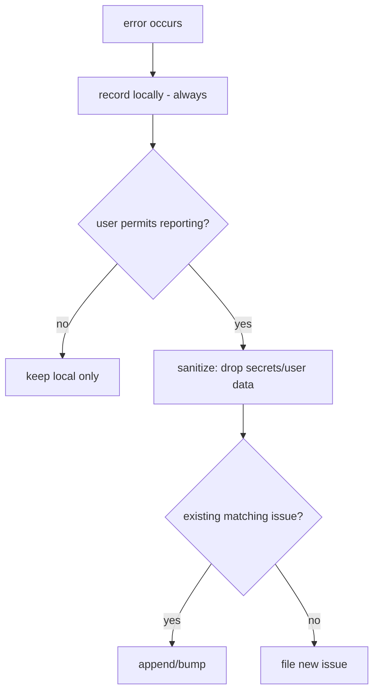

# Error Reporting

**Version:** 1.0.0
**Status:** Stable
**Layer:** concept

## Overview

The technology-agnostic model of how Cronus reports its own failures: on an error it may file an issue to the project's tracker — but only with the user's permission, only with sanitized content, and without spamming duplicates. Errors are always recorded locally regardless.

## Related Specifications

- [l1-security.md](l1-security.md) - Reports must carry no secrets/user data (SEC).
- [l1-doctor.md](l1-doctor.md) - Unrepairable issues feed the reporter.
- [l1-office-model.md](l1-office-model.md) - Consent gating (OFF-6 HITL).
- [l2-github-issue.md](l2-github-issue.md) - Concrete GitHub issue filing.

## 1. Motivation

A self-improving agent should surface its own bugs to its makers — but never leak the user's data or bury the tracker in duplicates. Consent-gated, scrubbed, de-duplicated reporting turns real-world failures into fixes while respecting privacy.

## 2. Constraints & Assumptions

- Reporting off the device is an outbound send and must be authorized (consistent with SEC-3).
- A report must be useful (enough to act on) yet sanitized.
- Repeated identical errors must not create repeated issues.

## 3. Core Invariants (Layer 1 only)

- **ERR-1 (Consent-gated):** an external issue is filed ONLY with the user's permission; never silently.
- **ERR-2 (Privacy-scrubbed):** a report contains only sanitized diagnostics — no secrets, no user data/content (consistent with SEC).
- **ERR-3 (De-duplicated):** equivalent errors coalesce into a single issue (update/append), not many.
- **ERR-4 (Actionable):** a report includes enough context to act — version, sanitized stack/trace, reproduction hints.
- **ERR-5 (Local-first record):** every error is recorded locally whether or not an issue is filed.

> L2 specs cannot reach RFC status until all invariants here are addressed in their "Invariant Compliance" section.

## 4. Detailed Design

## 5. Drawbacks & Alternatives

- **Consent friction:** asking each time can annoy; mitigated by a remembered preference (always/never/ask).
- **Over-scrubbing reduces usefulness:** balance via structured, allowlisted diagnostic fields. <!-- TBD: default consent mode (ask vs off) -->
- **Alternative — silent auto-report:** rejected (ERR-1).

## Canonical References

| Alias | Path | Purpose |
| --- | --- | --- |
| `[SECURITY]` | `.design/main/specifications/l1-security.md` | Sanitization requirements |
| `[GH]` | `.design/main/specifications/l2-github-issue.md` | Concrete filing |
