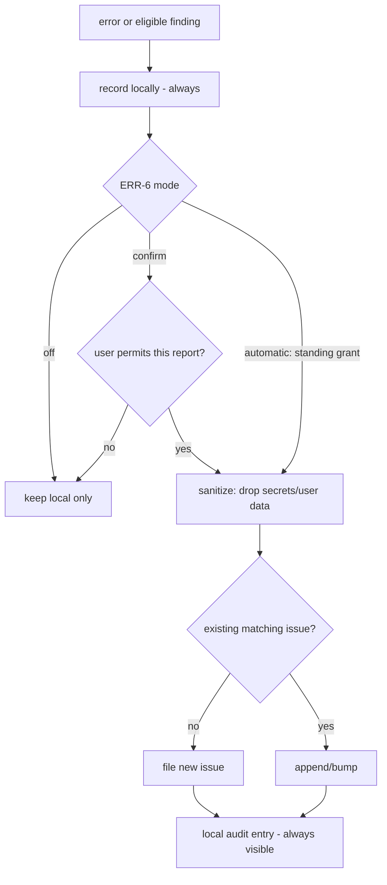

# Error Reporting

**Version:** 1.2.0
**Status:** Stable
**Layer:** concept

## Overview

The technology-agnostic model of how Cronus reports its own failures: on an error it may file an issue to the project's tracker — but only with the user's permission, only with sanitized content, and without spamming duplicates. Errors are always recorded locally regardless. Submission autonomy is a user setting (ERR-6): **off**, **confirm-each** (default), or **automatic** under a standing, revocable, audited grant; under the automatic grant the same pipeline may also carry other system-authored finding reports (e.g. improvement findings per the improvement loop).

## Related Specifications

- [l1-security.md](l1-security.md) - Reports must carry no secrets/user data (SEC); the ERR-6 standing grant lives on the human-write-only authority plane (SEC-9/SEC-10).
- [l1-doctor.md](l1-doctor.md) - Unrepairable issues feed the reporter.
- [l1-office-model.md](l1-office-model.md) - Consent gating (OFF-6 HITL).
- [l1-report-prompting.md](l1-report-prompting.md) - Sibling invitation path; findings auto-filed here are marked *reported* there (RP-4).
- [l1-improvement-loop.md](l1-improvement-loop.md) - The loop contract; improvement findings ride this pipeline only under the ERR-6 automatic grant (IMP-3).
- [l2-github-issue.md](l2-github-issue.md) - Concrete GitHub issue filing.
- [l1-fault-lifecycle.md](l1-fault-lifecycle.md) - [ADDED v1.2.0] Defines what ERR-3's "equivalent" means and the fault state a filed report tracks (ERR-7); this layer files, that layer identifies.

## 1. Motivation

A self-improving agent should surface its own bugs to its makers — but never leak the user's data or bury the tracker in duplicates. Consent-gated, scrubbed, de-duplicated reporting turns real-world failures into fixes while respecting privacy.

## 2. Constraints & Assumptions

- Reporting off the device is an outbound send and must be authorized (consistent with SEC-3).
- A report must be useful (enough to act on) yet sanitized.
- Repeated identical errors must not create repeated issues.

## 3. Core Invariants (Layer 1 only)

- **ERR-1 (Consent-gated):** an external issue is filed ONLY with the user's permission; never silently.
- **ERR-2 (Privacy-scrubbed):** a report contains only sanitized diagnostics — no secrets, no user data/content (consistent with SEC).
- **ERR-3 (De-duplicated):** equivalent errors coalesce into a single issue (update/append), not many.
- **ERR-4 (Actionable):** a report includes enough context to act — version, sanitized stack/trace, reproduction hints.
- **ERR-5 (Local-first record):** every error is recorded locally whether or not an issue is filed.
- **ERR-6 (Submission autonomy modes):** the automatic reporting path operates in one of three user-governed modes — **off** (nothing files; the local record remains, ERR-5), **confirm** (default: each candidate report is individually presented before filing), **automatic** (reports file without per-report interaction under a standing consent). The standing grant is an explicit authority setting: durable, scoped to this channel, independently revocable, audited, held on the human-write-only authority plane — it satisfies ERR-1 by durable grant rather than per-event assent (SEC-9 kinship), and every auto-filed report stays locally visible: automatic never means invisible. Error reports are eligible in confirm and automatic; non-error finding reports (e.g. `improvement` findings, RP-2f) file automatically **only** under the automatic grant — in confirm mode they travel the invitation path instead (report-prompting → issue flow); the prompting mode (RP-3) governs invitations only and never gates this path. Per-category refinement of the mode is permitted (IMP-3).
- **ERR-7 (A report addresses a fault, and tracks its lifecycle):** [ADDED v1.2.0] the unit ERR-3 de-duplicates against is the **fault** — the identity defined by the fault-identity contract — not a textual or ad-hoc similarity judged at filing time. Three consequences bind this pipeline. **One report per fault**: a filed report carries the fault's identity, so every later occurrence updates that report rather than opening a sibling. **Lifecycle travels with it**: when a fault regresses — recurring at or after the version in which it was claimed fixed — the existing report is **reopened as a regression**, never filed as a fresh unrelated report; filing anew erases the fact that a fix was claimed and did not hold, which is the very thing a maintainer most needs to see. **Substatus gates filing volume**: a fault already filed and merely *ongoing* does not re-file; *new*, *regressed*, and *escalating* are the states that warrant reaching outward again. What none of this changes is consent: the fault layer is local and always-on (it records regardless), while ERR-1/ERR-6 continue to govern every crossing of the device boundary.

> L2 specs cannot reach RFC status until all invariants here are addressed in their "Invariant Compliance" section.

## 4. Detailed Design

## 5. Drawbacks & Alternatives

- **Consent friction:** asking each time can annoy; resolved by ERR-6 — the remembered preference is now the contract (off/confirm/automatic), default **confirm**.
- **Over-scrubbing reduces usefulness:** balance via structured, allowlisted diagnostic fields.
- **Alternative — silent auto-report (no consent surface):** rejected (ERR-1). The ERR-6 automatic mode is not this: it is a standing grant the user explicitly enables, sees the audit of, and can revoke in one step — consented automation, not silence.

## Canonical References

| Alias | Path | Purpose |
| --- | --- | --- |
| `[SECURITY]` | `.design/main/specifications/l1-security.md` | Sanitization requirements |
| `[GH]` | `.design/main/specifications/l2-github-issue.md` | Concrete filing |

## Document History

| Version | Date | Author | Notes |
| --- | --- | --- | --- |
| 1.2.0 | 2026-07-23 | Core Team | Added ERR-7 — a report addresses a **fault** (the identity defined by the fault-identity contract), not an ad-hoc textual similarity judged at filing time: one report per fault with later occurrences updating it; a **regression reopens the existing report** rather than filing a fresh unrelated one, since filing anew erases the fact that a fix was claimed and did not hold — the very thing a maintainer most needs to see; and substatus gates filing volume (*new*, *regressed*, *escalating* warrant reaching outward; merely *ongoing* does not). Consent is untouched: the fault layer is local and always-on, ERR-1/ERR-6 continue to govern every crossing of the device boundary. Related Specifications extended with `l1-fault-lifecycle`. |
| 1.1.0 | 2026-07-16 | Core Team | Added ERR-6 submission autonomy modes (off / confirm / automatic): automatic is a standing, scoped, revocable, audited grant on the human-write-only authority plane satisfying ERR-1 by durable consent (SEC-9 kinship); non-error finding reports (improvement, RP-2f) are automatic-grant-only; mode gate added to §4 flow; resolved the default-consent TBD (default = confirm). Added Document History section (§5 RULES compliance). |
| 1.0.0 | 2026-06-24 | Core Team | Initial spec — ERR-1…ERR-5: consent-gated, privacy-scrubbed, de-duplicated, actionable, local-first. |
