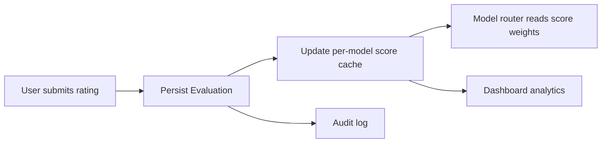

# Evaluations

**Version:** 1.0.0
**Status:** Stable
**Layer:** concept

## Overview

A per-message feedback mechanism that allows users to rate the quality of model responses after delivery. Feedback consists of a discrete sentiment (positive/negative/neutral), optional structured tags (e.g., "inaccurate", "unhelpful"), and optional free-text annotation. Aggregated feedback flows into model-router scoring, improvement signals, and admin analytics. Evaluations are optional, never block delivery, and are never shared with external providers without explicit user consent.

## Related Specifications

- [l1-telemetry.md](l1-telemetry.md) - Opt-in, privacy-first telemetry — evaluations are a local feedback signal, not telemetry.
- [l1-dashboard.md](l1-dashboard.md) - Dashboard surfaces aggregated evaluation statistics.
- [l2-model-router.md](l2-model-router.md) - Router uses evaluation signals as part of its per-model scoring weights.
- [l1-security.md](l1-security.md) - Feedback content is not exfiltrated without consent (consistent with SEC-2).

## 1. Motivation

Model quality is subjective and task-dependent. Without feedback, the system can only observe latency and token cost. User ratings tie performance to human judgment: which responses were useful, which were wrong, which were off-topic. These signals guide model selection in the router, surface patterns for prompt improvement, and help identify systematic failures before they affect more users.

## 2. Constraints & Assumptions

- Feedback is always post-delivery; it cannot modify or replace the response.
- A user may submit only one evaluation per message; changing the rating creates a new evaluation record (the previous stands as historical data).
- Feedback content is never sent to the model provider that generated the response unless the user explicitly opts in via the telemetry consent flow.
- Aggregated, anonymised statistics (e.g., positive-rate per model) may be used internally for routing decisions without individual consent.

## 3. Core Invariants

Rules every Layer 2 implementation MUST NOT violate:

- **EVL-1 (Per-message granularity):** an evaluation is attached to a single message response (identified by message ID); it is not attached to a session, a model, or a conversation in aggregate.
- **EVL-2 (Optional post-delivery):** evaluation is always optional and always post-delivery; no response is withheld or modified pending a rating.
- **EVL-3 (Immutable audit record):** a submitted evaluation is an audit record; it is never silently overwritten. Corrections or reconsiderations are new evaluation records with timestamps; the history is preserved.
- **EVL-4 (Privacy boundary):** individual evaluation content (rating + text + tags) is visible to the message's owner and to admins with explicit audit access; it is never surfaced to third-party model providers without user opt-in per TEL-1.
- **EVL-5 (Signal, not override):** evaluation signals influence routing weights and improvement pipelines; they never directly mutate any message, session, or model state.
- **EVL-6 (Structured + freeform):** an evaluation has a discrete sentiment field (`positive` / `negative` / `neutral`) plus optional structured reason tags (open enumerable set, extensible) plus optional free-text annotation. All three are optional; the sentiment field alone is sufficient.

> L2 specs cannot reach RFC status until all invariants here are addressed in their "Invariant Compliance" section.

## 4. Detailed Design

### 4.1 Evaluation Record

```text
Evaluation {
  id          : EvaluationId
  message_id  : MessageId        // the response being rated
  session_id  : SessionId        // for join queries
  user_id     : UserId           // who submitted
  model_id    : ModelId          // which model produced the rated message
  sentiment   : "positive" | "negative" | "neutral"
  tags        : string[]         // e.g. ["inaccurate", "incomplete", "off-topic"]
  annotation  : string?          // free-text comment
  created_at  : Timestamp
}
```

### 4.2 Standard Reason Tags

| Tag | Meaning |
|---|---|
| `inaccurate` | The response contained factual errors. |
| `incomplete` | The response did not fully address the query. |
| `off-topic` | The response was not relevant to the question. |
| `unhelpful` | The response was correct but not actionable. |
| `harmful` | The response included inappropriate content. |
| `too-verbose` | The response was unnecessarily long. |
| `hallucinated` | The response fabricated citations or facts. |

Tags are an open enumerable set; the system may extend this list without breaking existing records.

### 4.3 Feedback Pipeline



### 4.4 Aggregation

The system maintains a per-model rolling aggregate:

```text
ModelScoreCache {
  model_id         : ModelId
  positive_count   : u64
  negative_count   : u64
  total_count      : u64
  last_updated     : Timestamp
}
```

The aggregate is updated asynchronously after each evaluation submission. The router reads the positive-rate (`positive_count / total_count`) as one of its scoring inputs.

### 4.5 Admin View

Admins may access:
- Per-model aggregate statistics (positive/negative/neutral rates, common tags).
- Filtered search across individual evaluations (by date, model, sentiment, user — subject to data retention policy).

Individual annotations are shown only to admins with explicit audit access; they are not exposed in aggregate dashboards without anonymisation.

## 5. Implementation Notes

1. Index evaluations by `message_id` for single-message lookups and by `model_id + created_at` for aggregate queries.
2. Keep the aggregate cache (`ModelScoreCache`) separate from the raw evaluation table; rebuild it from the raw table on demand if it drifts.
3. Apply a minimum sample size guard in the router: a model with fewer than N evaluations should not have its weight significantly adjusted by evaluation scores alone.

## 7. Drawbacks & Alternatives

- **Implicit feedback (dwell time, re-prompts):** automatic quality signals without user effort, but noisy and hard to interpret.
- **In-session reactions (emoji):** lightweight but doesn't provide structured tags or annotations useful for systematic analysis.

## Canonical References

| Alias | Path | Purpose |
|---|---|---|
| `[ROUTER]` | `.design/main/specifications/l2-model-router.md` | How evaluation scores feed into model selection weights. |
| `[DASH]` | `.design/main/specifications/l2-dashboard.md` | Analytics surface that aggregates evaluation statistics. |
