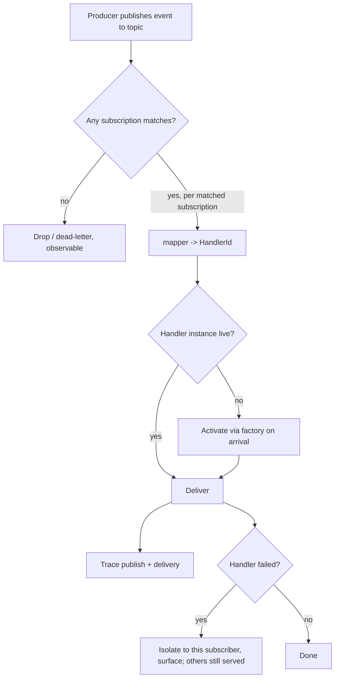

# Event Mesh

**Version:** 1.0.0
**Status:** Stable
**Layer:** concept

## Overview

A single in-process routing substrate over which the engine's subsystems publish and observe typed events without referencing one another. Today the system already emits many internal events — an inbox message arrives, a board card changes state, an office transitions to Paused, a schedule fires, an external trigger lands — but each is wired ad hoc, with its own bus notification, its own naming, and its own delivery path. The event mesh names that pattern once: a uniform event envelope, topic-based addressing, and a subscription model that decides which handler receives a published event. Producers say *what happened* and *where it came from*; they never name a consumer. Subscribers declare *which topics they care about*; they never reach into a producer.

This is the routing layer *beneath* the automation pipeline (which is the authored processing graph over these events) and the generalization *behind* the point-to-point inbox (which becomes one direct-messaging projection of the mesh). It is deliberately an in-process fabric within one engine instance, not a network agent-placement protocol — it composes with the modular-monolith architecture rather than decomposing the engine across machines.

## Related Specifications

- [l1-automation-pipeline.md](l1-automation-pipeline.md) - The pipeline's triggers (`state_change`, `kanban_event`, `message_received`, `external_event`, `webhook`) consume mesh-routed events; the mesh is the routing substrate they sit on.
- [l1-architecture.md](l1-architecture.md) - EM-9 composes with INV-8: the mesh is in-process within one monolith instance, never a network decomposition.
- [l1-office-control.md](l1-office-control.md) - OfficeState transitions are published as mesh events that interested subsystems observe.
- [l1-orchestration.md](l1-orchestration.md) - Orchestrator delegation can ride the request/response projection (EM-6) without the orchestrator and worker holding direct references.
- [l1-global-orchestration.md](l1-global-orchestration.md) - The only cross-office event path is an explicit relay (EM-10), mediated at the building level.
- [l1-acp.md](l1-acp.md) - The external streaming event protocol is a projection of mesh events to outside callers.
- [l1-execution-graph.md](l1-execution-graph.md) - Its in-graph `Topic` state channel is the intra-run analog of mesh publish/subscribe.
- [l1-messaging-gateway.md](l1-messaging-gateway.md) - Normalized inbound platform messages enter the mesh as events; the gateway is one producer.

## 1. Motivation

As the number of subsystems grows, the cost of wiring them directly to one another grows combinatorially: every producer that must notify N observers accumulates N references, N failure paths, and N places to edit when an observer is added. The symptom is already visible — separate, similarly-shaped notification mechanisms exist for inbox arrival, board events, office-state changes, scheduler firing, and trigger intake, each reinvented. A new observer (say, a dashboard counter that wants to react to every card transition) means touching the producer.

Publish/subscribe inverts the dependency. A producer publishes an event to a *topic* and is done; it neither knows nor cares who consumes it. A consumer registers a *subscription* and receives matching events; it never modifies the producer. Adding, removing, or replacing a consumer is a local change. The substrate that makes this work needs only a few load-bearing decisions: a uniform envelope so any subsystem can interpret any event's identity and origin; a topic-addressing scheme rich enough to express both broad categories and specific instances; a subscription model expressive enough for prefix/hierarchy matching yet pure enough to be cached; a way to layer directed request/response on top so the same substrate serves both fire-and-forget and ask-and-wait; and a clear scope boundary so this stays an in-process decoupling tool and does not quietly become a distributed-systems problem the architecture has explicitly chosen not to take on.

## 2. Constraints & Assumptions

- The mesh routes and delivers; it does not reason. Any reasoning is in the subscribed handler, not the substrate.
- Routing decisions (matcher/mapper evaluation) are side-effect-free, so they may be cached and replayed.
- The mesh is an in-process substrate within a single engine instance — it is NOT an agent-placement or worker-scheduling protocol, and it does not move work across machines.
- Cross-instance propagation is out of scope here; it happens only through the architecture's sanctioned boundaries (hub↔spoke, device-replication), which connect instances of the *same* whole engine.
- Events carry references/identity, not bulk user content in the clear; payload bodies follow the same on-device data-safety discipline as the rest of the system.
- Topics and subscriptions are office-scoped by default; cross-office visibility is an explicit, mediated exception.

## 3. Core Invariants

Rules every Layer 2 implementation MUST NOT violate:

- **EM-1 (Typed event envelope):** every routed event carries a uniform envelope independent of its payload — a stable unique id, an origin identifier, and a hierarchical type drawn from a namespaced vocabulary (namespaced to avoid collisions across subsystems). Any subsystem can read an event's identity, origin, and type without understanding its body.
- **EM-2 (Topic addressing, not recipient addressing):** events are published to a *topic* identified by `(type, source)` — *what* occurred and *where it originated* — never to a named recipient. A producer MUST NOT encode who consumes an event.
- **EM-3 (Subscription as a pure matcher→mapper):** a subscription is a side-effect-free pair: a **matcher** `topic → bool` ("does this subscription apply to this topic") and a **mapper** `topic → handler-identity` ("which handler instance receives it"). Matching MUST support both exact type match and prefix/hierarchy match over the type namespace. Because matcher and mapper are pure, routing decisions are cacheable.
- **EM-4 (Publish/subscribe decoupling):** a producer holds no reference to and no knowledge of its consumers. Subscriptions are dynamic — addable and removable at runtime — and adding or removing a consumer MUST NOT require modifying any producer.
- **EM-5 (On-demand handler activation):** handler instances are addressed by `(type, key)`, where the type binds to a *factory*, not a fixed class, so one handler kind yields distinct keyed instances. When a matched event maps to a handler instance that is not currently live, the mesh activates it on arrival rather than requiring it to be pre-created. Handlers are not explicitly destroyed by senders; lifecycle is the runtime's concern.
- **EM-6 (Request/response is a projection of pub/sub):** directed ask-and-wait is layered on the same substrate by correlation, not a separate channel — a request event carries a reply address and a correlation id; the response and any error are published back on well-known correlated topics keyed to that id; an unanswered request resolves with a timeout rather than waiting forever. Point-to-point messaging is a special case of the mesh.
- **EM-7 (Declared delivery & per-subscriber fault isolation):** delivery semantics are declared, not assumed — per-topic ordering and at-least-once / at-most-once handling are explicit properties of a subscription, not implicit guarantees. A failure while delivering to one subscriber is contained to that subscriber and surfaced; it MUST NOT silently deny the event to other subscribers.
- **EM-8 (Observable by construction):** publication and routed delivery are themselves a first-class observability source — every publish and delivery is traceable, carrying envelope id/origin/type and correlation id. Traces MUST NOT carry raw user-payload bodies in the clear (data-safety parity with the observability and security contracts).
- **EM-9 (In-process scope boundary):** the mesh is an in-process routing substrate within one engine instance. It is NOT a distributed worker/service placement protocol and MUST NOT be used to decompose the engine across the network. Cross-instance event flow occurs only through the architecture's sanctioned boundaries; routing across the mesh stays inside one process.
- **EM-10 (Office-scoped isolation):** topics and subscriptions are scoped to an office. An event published within one office is not visible to another except through an explicit, mediated cross-office relay; there is no ambient global topic space.

> L2 specs cannot reach RFC status until all invariants here are addressed in their "Invariant Compliance" section.

## 4. Detailed Design

### 4.1 Envelope & Topic Addressing

```text
[REFERENCE]
Envelope (uniform, payload-independent):        # EM-1
  id      : stable unique identifier
  source  : where the event originated (an identity/URI)
  type    : hierarchical, namespaced            # e.g. office.kanban.card.moved
  payload : opaque to the mesh (references, not bulk content in the clear)

TopicId = (type, source)                         # EM-2  — what happened, where from
HandlerId = (type, key)                          # EM-5  — type binds a factory; key picks an instance
```

The hierarchical `type` is the key to expressive routing: a subscriber can match an exact type (`office.kanban.card.moved`) or a whole subtree (`office.kanban.*`). Namespacing keeps subsystem vocabularies from colliding.

### 4.2 Subscription Model

```text
[REFERENCE]
Subscription:                                    # EM-3 (pure → cacheable)
  matches(topic) -> bool                         # exact OR prefix/hierarchy match
  map(topic)     -> HandlerId                    # which instance receives it

Well-known direct topics (the EM-6 projection):
  {HandlerType}:                                 # general direct messages to a handler type
  {HandlerType}:request={correlationId}          # an awaited request
  {HandlerType}:response={correlationId}         # its correlated response
  {HandlerType}:error={correlationId}            # its correlated failure
```

A prefix subscription on `{HandlerType}:` gives every handler of a type a private direct-message channel layered over the same pub/sub fabric — point-to-point messaging without a second mechanism.

### 4.3 Routing & On-Demand Activation



Matcher/mapper purity (EM-3) means the `topic → {subscriptions} → {HandlerId}` resolution can be memoized; only activation and delivery have effects.

### 4.4 Request/Response Over Pub-Sub

```text
[REFERENCE]
ask(target_type, payload, timeout):              # EM-6
    cid := new correlation id
    publish( topic=(target_type:request=cid, source=me), payload, reply=me )
    await one of:
        topic (me:response=cid) -> return value
        topic (me:error=cid)    -> raise typed error
        timeout                 -> raise timeout error   # never hang forever
```

Delegation and any other directed call become this pattern, so the orchestrator and a worker stay decoupled — neither holds a reference to the other, only a topic and a correlation id.

### 4.5 What the Mesh Unifies

The mesh is not a new subsystem to bolt on; it is the common substrate the following already-specified events resolve onto. This is the consolidation the concept delivers:

| Existing event today | Becomes, on the mesh |
| --- | --- |
| Inbox message arrival (point-to-point actor send + arrival notice) | A direct-topic projection (EM-6 well-known `{type}:` channel); the inbox is one consumer pattern, not a separate bus. |
| Board card transitions / comments | Events on `office.kanban.*` topics (EM-2); dashboards/automation subscribe without the board knowing them (EM-4). |
| OfficeState transitions (Active/Idle/Paused/…) | Events on `office.state.*`; observers (dashboard, health, automation) subscribe. |
| Scheduler firing / trigger intake | Producers publishing to trigger topics that the automation pipeline subscribes to as its `schedule` / `external_event` / `webhook` sources. |
| External streaming events to outside callers | A projection of mesh events out through the agent protocol (the mesh stays internal; the protocol is the external face). |

### 4.6 Ideas-to-Adopt Mapping (no-duplication proof)

The source pattern is a full multi-agent runtime; most of it is already covered by the existing concept set. Only the routing/subscription substrate above is genuinely uncaptured. The remainder maps as follows and is **not** re-specified:

| Source mechanic | Disposition | Owner |
| --- | --- | --- |
| Speaker-selection / round-robin / handoff-swarm / graph-superstep team patterns | Already covered | [l1-agent-framework-skeleton.md](l1-agent-framework-skeleton.md) (5-pattern catalog + 3 engines), [l1-orchestration.md](l1-orchestration.md), [l1-deliberation.md](l1-deliberation.md) |
| Message interception/middleware that can modify, log, or drop in-flight messages | Already covered | [l1-dynamic-harness.md](l1-dynamic-harness.md) (write-capable interceptor seam), [l1-orchestration.md](l1-orchestration.md) |
| Pluggable model-context windowing (buffered / head-and-tail / token-limited) | Already covered | [l1-context-compression.md](l1-context-compression.md) and the context-management implementation family |
| Memory contract that enriches the model context before each call, typed content + relevance query | Already covered | [l1-memory-model.md](l1-memory-model.md), [l1-knowledge-base.md](l1-knowledge-base.md) |
| Workbench: a stateful group of tools sharing resources with a start/stop/reset/save lifecycle and a dynamic tool list | Already covered | [l1-tool-composition.md](l1-tool-composition.md) (toolkit as named group + deferred resolution), [l1-agent-tool-ergonomics.md](l1-agent-tool-ergonomics.md) |
| Declarative, serializable component config (round-trip a component to/from a portable definition) | Already covered | [l1-automation-pipeline.md](l1-automation-pipeline.md) AP-11 portable definitions-only bundles, [l1-extensions.md](l1-extensions.md) |
| Lead-orchestrator with a Task Ledger (facts/guesses/plan, outer loop) and a Progress Ledger (per-step self-reflection + stall counter → replan, inner loop) | **Refinement candidate** — partly present (adaptive topology + `/goal`+judge+budget, drift-replan, silence-is-suspect watchdog); the explicit dual-ledger inner/outer-loop with stall-driven replan is a sharpening of orchestration, recorded here for a future amendment rather than duplicated | [l1-orchestration.md](l1-orchestration.md), [l1-task-graph-model.md](l1-task-graph-model.md), [l1-work-liveness.md](l1-work-liveness.md) |
| Distributed worker/service split, agent placement directory, gRPC gateway between processes | **Out of scope** by INV-8 — the engine is a single-deployable modular monolith; cross-module calls are in-process. EM-9 makes this boundary explicit. | [l1-architecture.md](l1-architecture.md) |

### 4.7 nodus Relevance

The mesh is a host-level concept; nodus is sequential-step, not pub/sub. Two narrow, non-structural touch-points exist (refinement candidates, no nodus-workspace change required now):

- **Envelope alignment (EM-1):** the workflow runtime's structured execution-event taxonomy could adopt the same `id / source / type` envelope shape, so a workflow's emitted events interoperate with the host mesh through one common envelope rather than a bespoke schema. This strengthens the observability portability contract without changing the language.
- **Subscription framing (EM-3):** a workflow's `@ON(...)` trigger blocks are themselves a subscribe-to-event mechanism — "this section reacts to that signal." Framing `@ON` matching as the matcher half of EM-3 keeps the host and the DSL describing event reaction in one vocabulary. The request/response correlation (EM-6) similarly mirrors the dialog suspend/resume descriptor (an awaited, correlated reply) without adding language surface.

## 5. Drawbacks & Alternatives

- **Indirection cost:** decoupling makes the static call graph harder to read — "who handles this event?" is answered by subscriptions at runtime, not by following a reference. Mitigated by EM-8 (every route is traced) and by keeping the type namespace disciplined and hierarchical.
- **Hidden coupling through topic names:** producers and consumers still implicitly agree on `type` strings. Mitigated by namespacing (EM-1) and treating well-known topic vocabularies as a reviewed contract.
- **Over-generalization risk:** not every direct call should become an event. The request/response projection (EM-6) exists precisely so that ask-and-wait stays ergonomic; the mesh is for decoupling many-to-many notifications and the system's own bus events, not for replacing ordinary in-module function calls (EM-9 keeps it in-process and bounded).
- **Alternative — keep per-subsystem bespoke buses:** the status quo; rejected because it reinvents envelope/routing/observability per event kind and makes every new observer a producer edit.
- **Alternative — adopt a distributed actor/placement runtime wholesale:** rejected by INV-8; its payoffs (independent scaling, multi-host fault isolation) do not apply to a single-user on-device monolith, while its costs (network hops, distributed failure modes, an orchestration platform) contradict the chosen deployment shape.

## Canonical References

| Alias | Path | Purpose |
| --- | --- | --- |
| `[ARCH]` | `.design/main/specifications/l1-architecture.md` | INV-8 modular-monolith boundary that EM-9 keeps the mesh inside. |
| `[PIPELINE]` | `.design/main/specifications/l1-automation-pipeline.md` | The authored processing graph whose triggers consume mesh-routed events. |
| `[OFFICE-CONTROL]` | `.design/main/specifications/l1-office-control.md` | OfficeState transitions published as mesh events. |

## Document History

| Version | Date | Author | Notes |
| --- | --- | --- | --- |
| 1.0.0 | 2026-06-30 | Core Team | Initial spec — in-process publish/subscribe event-routing substrate distilled from an external multi-agent runtime: typed event envelope (EM-1), topic addressing `(type, source)` (EM-2), subscription as a pure cacheable matcher→mapper with prefix/hierarchy matching (EM-3), publish/subscribe decoupling with dynamic subscriptions (EM-4), on-demand handler activation by `(type, key)` factory addressing (EM-5), request/response as a correlated projection of pub/sub with timeout (EM-6), declared delivery semantics + per-subscriber fault isolation (EM-7), observable-by-construction routing (EM-8), in-process scope boundary composing with INV-8 (EM-9), office-scoped isolation with mediated cross-office relay (EM-10); unifies the scattered inbox/board/office-state/scheduler/trigger bus events; ideas-to-adopt mapping proving no-duplication (team patterns, interception, model-context, memory, workbench, component-config already owned; dual-ledger orchestrator recorded as a refinement candidate; distributed placement out of scope by INV-8); nodus-relevance mapping (envelope alignment for the execution-event taxonomy; `@ON` framed as the EM-3 matcher). |
