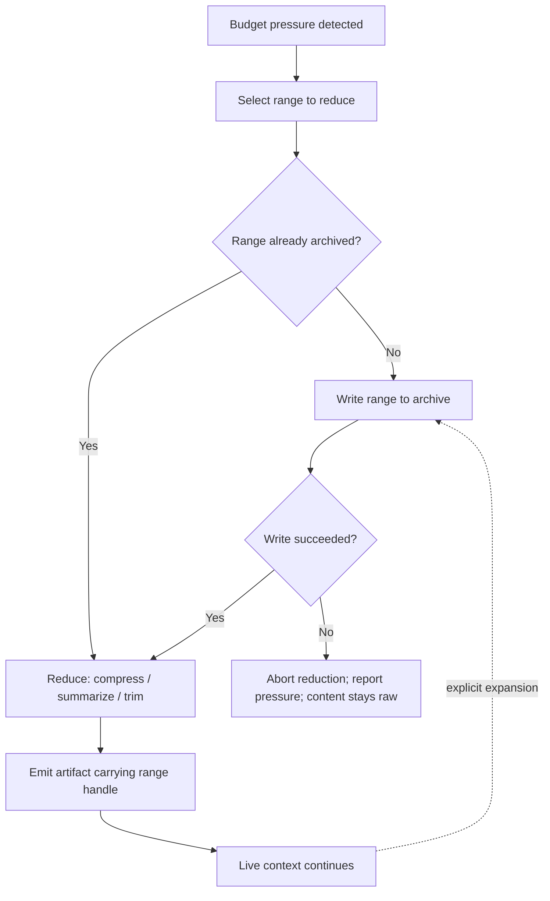

# Evidence Archive

**Version:** 1.0.0
**Status:** Stable
**Layer:** concept

## Overview

The evidence archive is the durable, immutable, device-local record of **what actually happened** in a session — the verbatim conversational turns, the tool invocations and their unabridged outputs, the model's own productions — kept *beneath* every reduction that acts on them.

Its single organizing rule is an ordering: **nothing may be reduced until it has been archived.** From that one rule the rest follows. A compaction summary stops being a *replacement* for the history it consumed and becomes an **address** into it. A trimmed tool output stops being a loss and becomes a truncation with a handle. A rewind stops being bounded by whatever survived the last eviction. And the agent gains a capability it does not otherwise have: the ability to tell "I remember this" apart from "I can go look".

The archive is deliberately *not* a memory system. Memory keeps what was **learned** — distilled, scoped, decaying. The archive keeps what was **said and done** — raw, undistilled, unranked, and never injected on its own initiative. It is the evidence plane, and it is the only plane in the system that is authoritative about the past by construction rather than by curation.

## Related Specifications

- [l1-context-compression.md](l1-context-compression.md) — CC-3 recoverable-original is bounded by the compressed content's lifetime; this archive is what makes that lifetime outlive the live context (CC-12). CC-7 ordering (compress before evict) composes with EA-1 (archive before either).
- [l2-context-management.md](l2-context-management.md) — the concrete reduction cascade (trim, tool-output truncation, LLM compaction) whose ordering EA-1 constrains and whose summary artifacts EA-2 requires to carry handles.
- [l1-hierarchical-summarization.md](l1-hierarchical-summarization.md) — the same discipline already endorsed one layer out: HS-4 carries provenance to the root (every summary node records the exact leaves it covers) and HS-6 makes a summary faithful-but-non-authoritative evidence derived from its children. EA-2 states for the live context what HS-4 states for a retrieval index; roll-up tiers are reduction artifacts that address the range beneath them rather than superseding it.
- [l1-conversation-rewind.md](l1-conversation-rewind.md) — RW-3 fork-never-destroy is the user-initiated form of this contract; RW-1 restore points anchor to archived ranges so rewind depth is not limited by what compaction spared.
- [l1-observation-retention.md](l1-observation-retention.md) — the sibling retention discipline for the *numeric* plane. OR-5 append-only immutability and OR-7 resolution honesty are reused here (EA-4, EA-8); this spec owns the non-numeric plane that OR explicitly excludes.
- [l1-diagnostic-log.md](l1-diagnostic-log.md) — DL-1 separate-plane discipline and DL-5 bounded ephemerality; the diagnostic log records *how the machinery behaved* and is allowed to expire, this archive records *what the work was* and is not (EA-9).
- [l1-memory-model.md](l1-memory-model.md) — MEM-5 decay-and-prune is correct for distilled memory and wrong for evidence; EA-9 keeps the two planes from being conflated, and EA-10 keeps the archive off the recall path.
- [l1-operational-ledger.md](l1-operational-ledger.md) — OL-6 confines chronological narrative to an append-only session log kept out of the predicate body; that log is a *curated* projection, this archive is its uncurated substrate.
- [l1-search.md](l1-search.md) — SRCH-1 scope set extended with the archive; search is the query surface, this spec owns durability and addressing (EA-8).
- [l1-storage-model.md](l1-storage-model.md) — STO-2 durable restartable state and STO-8 inspectability; the archive is state-tier data with a declared budget.
- [l1-file-management.md](l1-file-management.md) — the content-addressed store the archive points into rather than copying from (§4.3), which is what keeps EA-12's write amplification bounded for large artifacts.
- [l1-crash-recovery.md](l1-crash-recovery.md) — CR-2 point-in-time snapshots restore *state*; the archive preserves *evidence*. CR-7 honest recovery accounting is the same honesty EA-5/EA-8 apply to retention.
- [l1-context-provenance.md](l1-context-provenance.md) — CP-1 provenance labels MUST survive the archive round trip; content does not launder itself into trusted by having been stored (EA-11).
- [l1-confidentiality-flow.md](l1-confidentiality-flow.md) / [l1-security.md](l1-security.md) — the archive is the system's densest concentration of sensitive content; EA-6/EA-7 place the whole defense on the outbound and surfacing paths, never on lossy writes.
- [l1-tool-receipts.md](l1-tool-receipts.md) — TR-9 gives a tamper-evident record that an action *happened*; the archive holds what it *produced*. Receipts prove, the archive shows.
- [l1-claim-verification.md](l1-claim-verification.md) — a claim about the session's own past becomes checkable against a source instead of against a summary.

## 1. Motivation

### 1.1 The System Is Destructive Exactly Where It Should Be Careful

Two mechanisms in this system reduce conversation history, and they behave in opposite ways.

A **rewind** is something the user chooses, deliberately, knowing what they are giving up. It is non-destructive: RW-3 forks the abandoned continuation into a preserved branch, "no turn is silently lost".

A **compaction** is something the system does to itself, automatically, at a utilization threshold, without asking. It is destructive: older turns are replaced by a generated summary, tool outputs are truncated to a character cap, and the message list is rebuilt around the result.

That is the wrong way round. The deliberate act is reversible and the automatic one is not, so the session loses the most history precisely in the situation where nobody decided anything. This spec inverts it: the automatic act becomes an indexing operation, and destruction requires an explicit decision.

### 1.2 Recoverability Was Scoped Out On Purpose, And Nobody Picked It Up

`l1-context-compression` guarantees a recoverable original (CC-3) — and CC-1 is equally explicit that compression, selection, and summarization are "three separate token-economy stages with separate guarantees". The recoverability guarantee therefore attaches to a re-encoded diff and **not** to a summarized conversation. That boundary is deliberate and correct for that spec. It simply leaves the other side unowned.

The neighbouring planes do not cover it either, each for a good reason of its own:

- the diagnostic log is ephemeral by contract (DL-5) — it is a forensic sink, not a record of work;
- durable memory is a distillate that decays and is pruned (MEM-5), which is what makes it useful and what makes it unusable as evidence;
- observation retention solves this exact problem — multi-resolution tiers under a declared budget — but scopes itself to uniformly-sampled numeric series and states that events, log lines, and traces are out;
- tool receipts prove an action occurred and need not survive the session (TR-5).

So the mechanism exists, the honesty discipline exists, the ordering discipline exists — and no plane owns the raw non-numeric trace. This spec is that owner.

### 1.3 The Failure Has A Specific And Expensive Shape

An agent three hundred turns into a task refers to a decision made near the beginning. In the live context, all that remains of that decision is a clause inside a generated summary. The agent has no way to distinguish three very different situations: the summary faithfully compressed a decision that was made, or the summary is a plausible paraphrase that drifted, or the decision was never made and the clause appeared under compaction pressure.

The agent cannot tell them apart, and neither can the user, because the thing that would settle it was deleted by the same operation that produced the summary. What makes this expensive is not the error rate but the **shape**: the summary is confident and specific, and the only way to check it is to have kept what it summarized.

Everything downstream inherits this. Claim verification has no source to check against. Rewind cannot reach past the compaction boundary. Change attribution cannot show its work. Retrospective analysis of a long-running session reads its own summaries and calls that evidence.

## 2. Constraints & Assumptions

- The archive is **local by default and never egresses**; this is a hard boundary, not a configuration default (consistent with the local-first, no-exfiltration posture).
- It is an **append-only sequence of ranges**, not a general-purpose database. It answers "give me this range" and "find ranges matching this query" and nothing else. Mid-history edits and back-dated inserts are out of scope by design (EA-4).
- Archiving is on the hot path of every reduction, so its per-write cost must be small relative to the reduction it precedes; a design that makes archiving expensive invalidates the ordering EA-1 depends on.
- The archive stores what passed through the system; it makes **no claim of completeness about the world**, only about its own boundary — what the runtime witnessed.
- Retention is **bounded by a declared budget**, not by a promised horizon. Unbounded growth is not a design goal, and a horizon the system cannot keep is worse than a budget it can.
- The concrete storage substrate, chunking, index structure, and handle encoding are Layer 2 concerns. This spec constrains ordering, addressability, immutability, locality, honesty, and plane separation — not the format.
- The archive is a session-and-workspace scoped record; it inherits the isolation boundary of the office it belongs to and grants no cross-office visibility.

## 3. Core Invariants

Rules every Layer 2 implementation MUST NOT violate:

- **EA-1 (Archive-before-reduce ordering):** no context reduction — trimming, compression, summarization/compaction, or eviction — may act on a range until that range has been durably archived. The archive write is a **precondition** of the reduction, not a side effect of it. If the write cannot complete, the reduction does not proceed and the content stays raw — **never** discarded because it could not be preserved. Budget pressure therefore remains unrelieved, and the turn proceeds or fails on its own budget terms, attributed to the pressure rather than to the archive (EA-12): a turn that cannot fit is refused *as over budget*, with the failed archive write named as the reason the usual relief was unavailable. The archive never converts a preservation failure into a data loss, and never disguises one as the other.

- **EA-2 (Reduction artifacts are addresses, not replacements):** every artifact a reduction leaves in the live context in place of removed content — a compaction summary, a truncation stub, a roll-up tier, an elision marker — carries a **handle naming the exact archived range it stands for**. An artifact with no resolvable handle is malformed and MUST NOT be presented to the model or the user as a faithful stand-in for what it replaced. This is what converts compaction from a lossy transform into an indexing operation.

- **EA-3 (Expansion on demand is an ordinary capability):** any archived range inside the retention horizon expands back to its original form, for the agent at the point of use and for the user at the point of inspection, through an explicit request. Expansion is a normal, cheap, unremarkable operation — not a recovery procedure, not an administrative action, and not something that requires reconstructing a session.

- **EA-4 (Append-only and immutable):** the archive is append-only. A written range is never mutated, back-dated, re-summarized in place, or deleted in place. A correction is a **new** entry that supersedes an earlier one and records the supersession; it is never an edit of what was already recorded. (Same discipline as OR-5, applied to a different record.)

- **EA-5 (Removal is explicit, declared, and reported):** content leaves the archive exactly two ways — a user's explicit deletion act, or the enforcement of the declared retention budget. Both are recorded as events. The archive never silently thins itself, never drops the middle of a range to save space, and never answers a query over a removed range with a plausible-looking partial: a range that is gone is **reported as gone**.

- **EA-6 (Device-local, never a source for an outbound path):** the archive is on-device, inherits the state tier's at-rest protection, and never egresses. Beyond storage, it is **never a source for any outbound flow** — no sync, no telemetry, no model provider, no crash report, no export — except through an explicit, per-act, user-authorized operation that names what is leaving. The archive's threat model is exfiltration, and this invariant is the whole of the defense.

- **EA-7 (Secret-safe on the way out, not on the way in):** the write path preserves fidelity and does **not** redact — a redacting write destroys the exact content the archive exists to preserve, while still not un-happening the secret's presence in the session. Every read, surface, index, and export path instead applies the same secret and confidentiality rules as any other surface. Fidelity is a property of the record; safety is a property of the boundary around it. Where content genuinely must not remain recorded — a credential pasted into a chat, content under a deletion request — the remedy is the **explicit, recorded removal** of EA-5, not a quiet in-place scrub: the range is removed as a declared event and every handle addressing it resolves to *removed*, so the archive's own account of itself stays truthful about the gap it now has.

- **EA-8 (Queryable, with an honest horizon):** the archive is retrievable by content, not only by handle, and is available to the application-wide find surface as its own scope. Every answer states the horizon and the coverage it actually had. A query whose range exceeds the retained horizon returns what exists **plus an explicit statement of what does not** — it never silently narrows the range, and it never reconstructs an answer for a period it no longer holds. (OR-7's discipline on the non-numeric plane.)

- **EA-9 (Plane separation — evidence is not memory, ledger, or diagnostics):** the archive holds what was **said and done**, verbatim. Durable memory holds what was **learned** (distilled, scoped, decaying — MEM-5). The operational ledger holds what was **decided** (curated atomic predicates — OL-1). The diagnostic log holds how the **machinery behaved** (ephemeral — DL-5). None of the four substitutes for another; in particular the archive MUST NOT be repurposed as a memory store, and memory MUST NOT be treated as a record of what happened.

- **EA-10 (Evidence, never ambient context):** archived content is never auto-injected, never ranked into recall, and never enters a prompt because it exists. It re-enters context only through an explicit expansion (EA-3) or an explicit retrieval (EA-8), attributed as such. The existence of an archive is not a licence to keep more in context — it is what makes keeping less **safe**.

- **EA-11 (Provenance survives the round trip):** content re-entering context from the archive carries the provenance it had when it was archived. An untrusted fragment — a fetched page, a third-party tool's output, another agent's message — is still untrusted on expansion and is re-composed under the same neutralization rules (CP-1/CP-2). Storage is not laundering, and the archive MUST NOT become the path by which untrusted content acquires trust.

- **EA-12 (Cheap, bounded, and non-fatal):** archiving sits on the hot path of every reduction and MUST be bounded in cost and in write amplification — the same content is archived once, not once per reduction stage that touches it. An archive failure fails the **reduction** (EA-1) and is never itself fatal — it does not abort the session, corrupt state, or lose content; the session continues with the range unreduced and surfaces the condition. It is not a promise that the turn always survives: if the unrelieved pressure exceeds the budget, the turn fails *as over budget* (EA-1), which is an honest, attributed failure rather than a silent deletion. A system whose archive can take down a session will be turned off, and an archive that is off preserves nothing.

## 4. Detailed Design

### 4.1 The Ordering

The reduction cascade gains one mandatory stage at its head. Nothing else about the cascade changes: compression still runs before eviction (CC-7), selection still precedes summarization, budgets are still enforced the same way.

The dotted edge is the point of the whole design: the reduction path and the expansion path meet at the same stored range, so the summary in context and the content it came from are two views of one object rather than a survivor and a casualty.

### 4.2 What A Handle Is, And What It Is Not

A handle is an opaque, stable reference to a contiguous archived range. It resolves to exactly the content that was reduced — not to "roughly that part of the session", not to a timestamp window that has to be re-derived, and not to a re-query that might return something different later.

Three properties are contractual; everything else is Layer 2's choice:

- **Exactness.** The handle names the range that this artifact replaced, not a superset that happens to contain it. An agent expanding a summary gets what the summary summarized.
- **Stability.** A handle resolves to the same content for as long as the range is retained; it does not shift as new content is appended, and it does not become ambiguous under branching (RW-3 forks).
- **Self-describing failure.** A handle whose range has left the archive under EA-5 resolves to an explicit *removed* result naming the range and the reason — never to nothing, and never to a neighbouring range.

A handle is **not** a summary's provenance claim about its own accuracy. The handle says "this is what I was made from"; whether the summary is faithful is a separate question that the handle merely makes **answerable**.

### 4.3 What Is Archived

The archive's scope is the session's evidentiary content:

| Class | Archived | Note |
| --- | --- | --- |
| User messages | Yes, verbatim | Including edited and rewound-away variants (RW-3 branches) |
| Model productions | Yes, verbatim | Including reasoning surfaced into the transcript |
| Tool invocations | Yes — call, arguments, outcome | The receipt (TR-1) proves it; the archive holds it |
| Tool outputs | Yes, unabridged | Precisely the content the truncation caps would otherwise destroy |
| Reduction artifacts | Yes | Summaries are themselves evidence of what the system did |
| Injected memory / retrieved context | By reference | The memory store is authoritative; duplicating it violates plane separation (EA-9) |
| Large binary artifacts | By reference | Content-addressed pointer into the file store, not a copy |
| Numeric telemetry series | No | Owned by observation retention |
| Machinery-level diagnostics | No | Owned by the diagnostic log, ephemeral by contract |

The reference-not-copy rows are what keep EA-12's write amplification bounded: the archive is dense in text and sparse in bytes.

### 4.4 Retention And The Budget

Retention follows the same honesty stance as the numeric plane, with one deliberate difference in the failure mode.

The archive is bounded by a **declared storage budget**, not by a promised time horizon. When the budget is reached, the oldest ranges are removed whole, as recorded events (EA-5), and the horizon shortens. The system then states the shorter horizon on every query that touches it (EA-8).

The difference from observation retention is that this plane has **no meaningful coarsening**. A numeric series downsamples into sums, counts, and extremes that keep long-range questions exactly answerable. Text has no such operation — the "coarsened" form of a conversation is a summary, and a summary is precisely the artifact whose unverifiability created the problem. So the archive degrades by **losing range**, honestly and visibly, rather than by losing fidelity invisibly. Roll-up tiers may still exist above it (hierarchical summarization), but they are artifacts under EA-2, never a replacement tier.

### 4.5 Plane Separation In Practice

The four planes answer four different questions, and the most common design error is letting one answer another's:

| Plane | Question | Lifecycle | Curated? |
| --- | --- | --- | --- |
| Evidence archive | What was said and done? | Bounded by storage budget; append-only | No — raw |
| Durable memory | What was learned? | Decays, prunes, consolidates (MEM-5/MEM-6) | Yes — distilled |
| Operational ledger | What was decided? | Superseded, never mutated (OL-2) | Yes — atomic predicates |
| Diagnostic log | How did the machinery behave? | Ephemeral, rotated (DL-5) | No — but disposable |

Two consequences are worth stating explicitly. First, memory's decay is a **feature** and the archive must not be used to defeat it — an expired memory is expired, even though the session that produced it may still be archived. Second, the archive is not a recall path (EA-10): an agent that starts searching its archive for context on every turn has rebuilt an unranked, unbounded memory system with none of memory's scoping guarantees.

### 4.6 The Trust Boundary On Expansion

Expansion is a composition boundary and inherits every rule that governs one. Content coming back out of the archive is interpolated into a model-facing context exactly as content coming in from a tool or a fetch would be, with its original provenance label attached (EA-11).

The attack this closes is specific: without EA-11, an untrusted document that was fetched, neutralized-as-data, archived, and later expanded would re-enter through a path that never saw its original label — laundering untrusted content into trusted context via a storage round trip. The archive is a durable, searchable store of adversary-supplied text, which makes it an attractive staging ground precisely because it is trusted infrastructure.

### 4.7 What This Makes Possible Downstream

The archive is a foundation, not a feature; its value shows up in what other specs stop having to work around:

- **Rewind** reaches any point in the session, not the nearest point that survived compaction (RW-1).
- **Claim verification** can check a claim about the session's own past against a source rather than against a summary.
- **A summary becomes falsifiable.** Compaction quality stops being an article of faith and becomes measurable, because the input and the output are both retained.
- **The agent gains an honest epistemic distinction** between what it holds in context and what it can go and check — the same distinction a code index gives it about the source tree, applied to its own history.

## 5. Drawbacks & Alternatives

**"Just raise the context budget."** Bigger windows move the threshold; they do not change what happens at it. A long-running autonomous session reaches any finite budget, and the larger the window the more content a single compaction destroys. This gets worse with scale, not better.

**"Keep everything in context and never reduce."** Cost aside, this degrades the agent: a context full of stale, unranked history reasons worse than a compacted one. The archive exists to make aggressive reduction **safe**, not to make it unnecessary — EA-10 states this directly.

**"Let durable memory hold it."** Memory is a distillate with decay and scoping semantics that are correct for memory and disqualifying for evidence (EA-9). Making memory hold raw history would require removing exactly the properties that make memory useful.

**"Redact on write."** Rejected in EA-7. It destroys the fidelity the archive exists for, and it does not prevent the secret from having transited the session; the boundary belongs on the outbound path, where it also covers everything the redactor would have missed.

**Accepted costs.** The archive is a dense concentration of sensitive content on the user's device — mitigated by EA-6/EA-7 and at-rest protection, but not eliminated; a local-first system is the right place for this trade, and a cloud-synced one would not be. Archiving adds a mandatory write to the reduction hot path (bounded by EA-12). And the durable-storage cost is real, which is why EA-5 makes the budget declared and its enforcement visible rather than pretending the record is free.

## Canonical References

| Alias | Path | Purpose |
| --- | --- | --- |
| `[COMPRESSION]` | `.design/main/specifications/l1-context-compression.md` | CC-1/CC-3/CC-7 — the guarantee boundary this spec extends |
| `[CASCADE]` | `.design/main/specifications/l2-context-management.md` | The concrete reduction cascade EA-1 reorders |
| `[REWIND]` | `.design/main/specifications/l1-conversation-rewind.md` | RW-1/RW-3 — the user-initiated form of fork-never-destroy |
| `[RETENTION]` | `.design/main/specifications/l1-observation-retention.md` | OR-5/OR-7 — the numeric-plane sibling whose discipline is reused |
| `[PROVENANCE]` | `.design/main/specifications/l1-context-provenance.md` | CP-1/CP-2 — the labels EA-11 requires to survive the round trip |
| `[MEMORY]` | `.design/main/specifications/l1-memory-model.md` | MEM-5/MEM-6 — why the distillate plane cannot hold evidence |

## Document History

| Version | Date | Author | Notes |
| --- | --- | --- | --- |
| 1.0.0 | 2026-08-20 | Core Team | Initial concept — the durable, immutable, device-local record of what was said and done, kept beneath every reduction. Resolves the asymmetry in which a user's deliberate rewind is non-destructive (RW-3) while the system's automatic compaction is not: **archive before reduce** as a precondition, not a side effect (EA-1); reduction artifacts become **addresses** into the archive rather than replacements for it, converting compaction from a lossy transform into an indexing operation (EA-2); expansion on demand as an ordinary capability, not a recovery procedure (EA-3); append-only immutability with supersession instead of edits (EA-4); removal only by explicit user act or declared budget, always reported, never a silent thinning or a plausible partial (EA-5); device-local and never a source for any outbound path (EA-6); **secret-safe on the way out, not on the way in** — a redacting write destroys the fidelity the record exists for without un-happening the secret (EA-7); queryable with an honest horizon, reusing OR-7's discipline on the non-numeric plane (EA-8); four-plane separation keeping evidence distinct from memory (learned), ledger (decided), and diagnostics (machinery behaviour) (EA-9); evidence never ambient — the archive is what makes keeping *less* in context safe, not a licence to keep more (EA-10); provenance survives the round trip so storage is not laundering (EA-11); cheap, bounded, and non-fatal — an archive failure fails the reduction, never the turn (EA-12). Claims the non-numeric retention plane that l1-observation-retention explicitly scopes out and that no other plane owned. |
