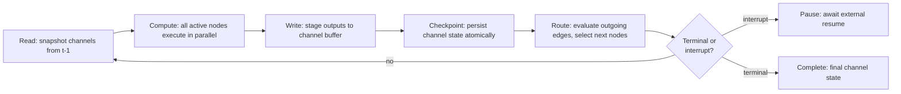

# Execution Graph Model

**Version:** 1.1.0
**Status:** Stable
**Layer:** concept

## Overview

The abstract model that describes how any multi-step agent process — orchestration run, workflow program, mission, or automation pipeline — is represented and executed at runtime. A process is a directed graph of execution nodes connected by typed state channels and conditional edges. The model specifies how state flows safely between concurrent nodes, how execution steps are atomic, how the graph can be interrupted and resumed, and how step budgets bound unbounded runs.

This spec governs the runtime execution model only. Authoring syntax (the DSL) and high-level coordination protocol (how the orchestrator delegates) are defined elsewhere.

## Related Specifications

- [l1-orchestration.md](l1-orchestration.md) — Orchestration protocol that drives goal-directed runs on top of the execution graph; ORC-5 (context isolation) maps to EG-5.
- [l1-workflow-language.md](l1-workflow-language.md) — Workflow DSL whose programs compile to execution graphs.
- [l1-automation-pipeline.md](l1-automation-pipeline.md) — Automation pipeline: directed graph of trigger/filter/transform/action nodes; shares the EG channel and superstep model.
- [l2-orchestration.md](l2-orchestration.md) — Concrete Rust implementation of delegation, wave-based parallel execution, and checkpoint resumption.
- [l2-workflow-runtime.md](l2-workflow-runtime.md) — In-tree Rust runtime for the workflow DSL; implements the EG execution loop.

## 1. Motivation

Sequential step execution — where each node simply calls the next — is too rigid for real agent work: some steps can run in parallel, state from multiple concurrent branches must merge cleanly, and any step may need to pause for a human decision. Without a formal model, every process type (orchestration, workflow, automation) invents ad-hoc solutions for the same problems: state sharing, concurrent merging, interrupt, and resumption.

A shared execution graph model solves this once: typed channels make concurrent state updates safe and composable, superstep atomicity eliminates data races without locks, conditional edges generalize all branching patterns into one primitive, and first-class interrupt edges bring human oversight into the model rather than bolting it on.

## 2. Constraints & Assumptions

- Graphs may contain cycles (loops are a normal pattern, not an error).
- State is not shared directly between nodes; all data exchange passes through channels.
- Nodes are opaque execution units — the graph model makes no assumptions about what runs inside a node.
- The execution graph model is technology-agnostic; no threading primitive or storage format is prescribed.
- A graph is compiled and validated before execution; runtime discovery of undefined targets is a compile-time error, not a runtime one.
- An optional immutable invocation context may be declared and made available to all nodes; it is distinct from mutable channel state and cannot be modified during a run.

## 3. Core Invariants

Rules every Layer 2 implementation MUST NOT violate:

- **EG-1 (Directed graph with optional cycles):** a graph is a set of nodes and a set of directed edges. Cycles are permitted and represent loops. Exactly one start node and one or more terminal nodes (or a conditional terminal) must be present.
- **EG-2 (Channel-only state transfer):** state MUST flow between nodes exclusively via declared typed channels. No node may read another node's internal state directly.
- **EG-3 (Three channel semantics):** every channel declares one of three behaviors:
  - *LastValue* — the channel holds the most recent write; earlier writes within the same superstep are discarded.
  - *Accumulator* — writes are combined by a declared pure reducer function (e.g., list append, numeric sum); the channel holds the aggregate result.
  - *Topic* — the channel is an ordered event stream; each write appends; readers receive the full or windowed sequence.
- **EG-4 (Superstep atomicity):** within a single execution step, all active nodes read channel state from the *previous* step, compute, and stage their writes. Staged writes are applied atomically at the step boundary. No node sees writes staged by other nodes in the same step. This guarantees race-free concurrent updates without explicit locking.
- **EG-5 (Compile-time edge validation):** all edge targets referenced by conditional routing functions MUST be declared nodes in the same graph. Undefined targets are rejected at compile time, never discovered at runtime.
- **EG-6 (Checkpoint at every boundary):** the full channel state is checkpointed atomically before each step executes. A crash or interrupt at any point resumes from the last complete checkpoint.
- **EG-7 (First-class interrupt edges):** an interrupt edge pauses execution after a node completes and before the next step begins. Execution does not resume until an external actor (human or system) provides a resume signal, optionally supplying modified channel state.
- **EG-8 (Step budget hard limit):** every graph execution is bounded by a maximum step count declared at invocation time. Reaching the limit is a safe hard-stop (distinct from a failure): the checkpoint is preserved, the run is marked `budget_exhausted`, and resumption is possible with a fresh budget.
- **EG-9 (Dynamic spawn directive):** a node may emit zero or more *spawn directives* as part of its output. Each directive names a target node and supplies a payload to that node's input channels. The executor creates one independent task per directive in the next superstep, enabling dynamic fan-out (map-reduce) without requiring explicit edges to be declared at compile time. All target nodes named in spawn directives MUST be declared in the graph (EG-5).
- **EG-10 (Unified control object):** a node may return a *control object* that atomically bundles: (a) channel state updates, (b) a routing override naming the next node(s), and (c) an interrupt-resume payload. When present, the control object supersedes any channel-only output and any edge-computed routing for that step. This prevents partial-update inconsistencies when a node needs to update state and redirect execution simultaneously.
- **EG-11 (Immutable invocation context):** a graph run may be supplied with an immutable context object at invocation time. The context is readable by all nodes throughout the run but MUST NOT be written to. It carries caller-identity, session scope, or any run-level datum that should not flow through channels (because it never changes). Absence of a context is valid; nodes that declare a context dependency fail at compile time if the graph has no declared context schema.

## 4. Detailed Design

### 4.1 Graph Anatomy

```plaintext
[REFERENCE]

Graph G = (N, E, C)
  N = { node_id → NodeSpec }
  E = { edge_id → EdgeSpec }
  C = { channel_id → ChannelSpec }

NodeSpec:
  id          : NodeId
  kind        : agent | tool | decision | terminal
  input_map   : { param → channel_id }   -- channels this node reads
  output_map  : { result → channel_id }  -- channels this node writes

EdgeSpec:
  from        : NodeId
  to          : NodeId | RouteFunction    -- conditional or direct
  kind        : normal | interrupt

ChannelSpec:
  id          : ChannelId
  type        : LastValue | Accumulator<ReducerFn> | Topic
  schema      : TypeSchema                -- validated at compile time
```

### 4.2 State Channel Types

| Type | Write Semantics | Read Semantics | Typical Use |
| --- | --- | --- | --- |
| `LastValue` | Latest write wins; prior writes in the same step are dropped | Returns current value or `None` | Scalar outputs (current plan, status, decision) |
| `Accumulator` | Each write is passed to the reducer along with the current aggregate | Returns current aggregate | Merging message lists, collecting results from parallel branches |
| `Topic` | Each write appends to the event log | Returns ordered slice (windowed or full) | Audit trail, event streaming, broadcast notifications |

Reducers for `Accumulator` channels are pure functions: `(current: T, update: T) → T`. They MUST be deterministic and free of side effects.

### 4.3 Superstep Execution Cycle



Every step is a synchronized round. The number of simultaneously active nodes is bounded by the parallelism limit of the execution environment; excess nodes queue without affecting correctness.

### 4.4 Conditional Routing

A routing function has the signature:

```plaintext
[REFERENCE]
fn route(channel_snapshot: ChannelState) → NodeId | [NodeId] | terminal
```

- Returning a single `NodeId` activates that node in the next step.
- Returning a list `[NodeId]` activates all listed nodes in parallel (fan-out).
- Returning `terminal` ends the graph run.

All node IDs that a routing function may return MUST be declared in the graph at compile time (EG-5). A router returning an undeclared ID is a compile error.

**Dynamic spawn (EG-9):** beyond static routing, a node may emit spawn directives that create new tasks pointing to declared nodes with custom payloads. This enables the map-reduce pattern: a single "map" node emits N spawn directives for N worker nodes; each worker runs independently; an "reduce" node downstream reads their accumulated outputs via an Accumulator channel.

```plaintext
[REFERENCE]
SpawnDirective:
  target  : NodeId         -- must be a declared node
  payload : ChannelPatch   -- initial channel values for this task instance
```

**Unified control object (EG-10):** when a node needs to simultaneously update state and redirect execution, it returns a control object instead of a plain output:

```plaintext
[REFERENCE]
ControlObject:
  updates  : ChannelPatch | None   -- state updates (applied atomically)
  goto     : NodeId | [NodeId] | terminal | None  -- routing override
  resume   : InterruptToken | None -- value to pass to a waiting interrupt
```

If `goto` is present, it overrides all edge-computed routing for this step. If `resume` is present, it satisfies a pending interrupt gate.

### 4.5 Interrupt and Resume

An interrupt edge marks a point where execution pauses after the source node's superstep completes. On interrupt:

1. The current channel state is checkpointed (EG-6).
2. The run status is set to `interrupted` and surfaced to the external actor.
3. The external actor MAY inspect and modify channel state before resuming.
4. On resume, the next superstep begins from the (possibly modified) checkpoint.

Interrupt edges are the canonical mechanism for human-in-the-loop gates, approval checkpoints, and scheduled pauses.

### 4.6 Checkpoint Semantics

Checkpoints are keyed by `(graph_id, run_id, step_index)`. A checkpoint captures:

- Full channel state at step boundary.
- Active node set for the next step.
- Step count and remaining budget.

Resumption from a checkpoint guarantees exactly-once execution semantics from that point forward: no step executed before the checkpoint is re-executed.

**Checkpoint durability modes:** implementations MAY offer three persistence timing strategies, selectable at invocation:

| Mode | Timing | Trade-off |
| --- | --- | --- |
| `strict` | Checkpoint persisted before next step begins | Safest; every step resumable; highest latency |
| `relaxed` | Checkpoint persisted concurrently while next step executes | Lower latency; at most one step re-executed on crash |
| `final` | Checkpoint persisted only at graph completion | Lowest overhead; no mid-run resumability |

The default MUST be `strict`. Implementations that do not support multiple modes MUST implement `strict` semantics.

### 4.7 Step Budget

The step budget is an integer declared at invocation. It counts supersteps, not individual node executions. On exhaustion:

- The run is checkpointed at the current boundary.
- Status transitions to `budget_exhausted`.
- A fresh invocation with a new budget can resume from the checkpoint.

The step budget is independent of and complementary to the token/cost budget managed by the orchestration and budget subsystems.

## 5. Implementation Notes

1. Compile the graph (validate EG-5) before the first superstep — reject undefined edge targets eagerly. Also validate at compile time: at least one terminal must be reachable; a routing function returning an empty list is treated as a terminal transition (not an error).
2. Implement superstep atomicity with a double-buffer: nodes write to a staging buffer that is applied atomically at the step boundary, then swapped for the next read phase. No synchronization between nodes writing to the staging buffer within the same step is required.
3. Accumulator reducers must be serializable to persist them with the channel schema in checkpoints.
4. For cyclic graphs, rely on EG-8 step budget rather than compile-time cycle detection; cycles are valid and intentional.
5. Interrupt edges are a distinct edge kind checked in the route phase; the pause fires after the source node's outputs are staged but before the target node's superstep begins.

## 6. Drawbacks & Alternatives

- **Alternative — shared mutable state (actor mailboxes only):** actor-style message passing without typed channels is simpler but loses the reducer and topic semantics, making parallel branch merging and event streaming ad-hoc. Channels generalize the pattern.
- **Alternative — synchronous sequential execution only:** simpler to implement but prevents parallel branch execution and forces artificial linearization of independent work. The superstep model costs little when there is only one active node per step.
- **Step budget vs. time budget:** step budgets are deterministic and reproducible; time budgets are environment-dependent. Both are useful, but step budget is the primary hard-stop mechanism here.

## Canonical References

| Alias | Path | Purpose |
| --- | --- | --- |
| `[ORCH]` | `.design/main/specifications/l1-orchestration.md` | Orchestration protocol that drives graph runs |
| `[WFL]` | `.design/main/specifications/l1-workflow-language.md` | DSL that compiles to execution graphs |
| `[AUT]` | `.design/main/specifications/l1-automation-pipeline.md` | Automation pipeline sharing the same channel/superstep model |
| `[WFR]` | `.design/main/specifications/l2-workflow-runtime.md` | Concrete Rust implementation of the execution loop |

## Document History

| Version | Date | Summary |
| --- | --- | --- |
| 1.0.0 | 2026-06-24 | Initial stable spec — graph anatomy, three channel types, superstep atomicity, conditional routing, interrupt/resume, step budget |
| 1.1.0 | 2026-06-24 | Added EG-9 (dynamic spawn directive), EG-10 (unified control object), EG-11 (immutable invocation context); checkpoint durability modes; immutable context in §2 Constraints |
