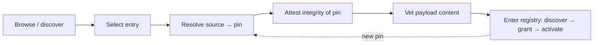

# Extension Marketplace & Distribution

**Version:** 1.0.0
**Status:** Stable
**Layer:** concept

## Overview

Extensions have to come from somewhere. The extension registry governs an extension's **local** life — discover, grant, activate, use — but not its **origin**: where it is published, how a user finds it, how an install pins to an exact payload, how an update is a reviewable move rather than a silent swap, and what a "curated" catalog does and does not vouch for. This spec names that missing dimension: the **marketplace & distribution model** — a curated, versioned catalog from which extensions are discovered, installed, and updated, feeding the local registry lifecycle without ever bypassing it.

The load-bearing ideas are that identity is a contract with everyone who already installed an extension (so a name is immutable and a rename is a governed migration, not a break); that an install is reproducible (it pins to an exact content revision, not a floating pointer); that curation is an honest **signal, not a guarantee** (a curated tier never implies the catalog owner controls third-party payloads); and that the marketplace is a **distribution channel, not a trust bypass** — a catalogued extension is still default-deny, still vetted, still integrity-checked before it can act.

## Related Specifications

- [l1-extensions.md](l1-extensions.md) — the local registry and lifecycle (EXT-2 `discover → grant → activate`) that a marketplace install **feeds**; EXT-3 default-deny still applies to a catalogued extension (XM-8); EXT-9 manifest is the per-extension contract this catalog references.
- [l1-component-scanning.md](l1-component-scanning.md) — the per-entry admission vetting the publishing gate invokes (XM-5); the catalog-level policy that decides *what may be published* composes the component-level check that decides *what is safe to admit*.
- [l1-attestation.md](l1-attestation.md) — integrity/authorship; the pinned revision (XM-3) is the integrity anchor a witness binds.
- [l1-version-control.md](l1-version-control.md) — the pinned-revision discipline and the reviewable-delta model: an update is an explicit move from one pin to another (XM-3), not a floating auto-advance.
- [l1-security.md](l1-security.md) — default-deny and the egress gate; fetching a payload and syncing a catalog are network acts, consent-gated and never silent (XM-8/XM-9).
- [l1-harness-composition.md](l1-harness-composition.md) — right-sizing decides *whether* to adopt a component (it must fill a real capability gap); the marketplace is *where it comes from*. Discovery does not license bloat.
- [../../nodus/specifications/l1-nodus-portability.md](../../nodus/specifications/l1-nodus-portability.md) — LP-13 addressable versioned import resolution is the nodus-workflow realization: the resolve step that precedes the attest→vet→run load gate.

## 1. Motivation

Without a named distribution model, an office that lets users add extensions improvises the supply chain unsafely: it installs from a floating branch, so two users on the same "version" get different code and an unreviewed upstream change lands silently; it identifies an extension by a mutable label, so a rename orphans every existing install; it treats "it's in our directory" as proof of safety, so a curated listing becomes an implied guarantee the owner cannot actually make for third-party code; or it lets a catalog install auto-grant capabilities, turning the directory into a trust bypass around the default-deny that protects every other extension.

A healthy marketplace resolves each of these deliberately. **Identity is stable** so installs survive. **Installs pin** so they are reproducible and updates are reviewable. **Trust tiers are explicit and honest** so a user knows whether the owner published this or merely listed it. **Publishing passes a real bar** — responsible data handling and truthful disclosure, judged over the whole shipped payload, not merely "not obviously malware." And **install flows through the same gates** as any other extension: default-deny, vetting, integrity — the catalog is a *source*, not an *exemption*. Naming this once keeps extension distribution reproducible, legible, and honestly trust-scoped.

## 2. Constraints & Assumptions

- The marketplace is a **distribution and discovery** layer; it owns neither the extension's local lifecycle (the registry does) nor its runtime confinement (the sandbox/security specs do).
- Curation is a human/policy judgment about *publishing*, distinct from the automated per-install content vetting; the two compose but are not the same act.
- A curated tier is a **signal**, never a warranty: the catalog owner cannot control or continuously re-verify third-party payloads, and must say so.
- Distribution is subject to the project's local-first, consent-gated egress posture: nothing is fetched, synced, updated, or granted silently.
- This spec adds a *channel and a catalog*; it introduces no new work unit, no new runtime confinement, and no new capability-grant mechanism — it composes the registry lifecycle, the vetting, the attestation, and the version-control pin already defined.

## 3. Core Invariants

Rules every Layer 2 implementation MUST NOT violate. They are technology-neutral.

- **XM-1 (Catalog of addressable, sourced entries):** a marketplace is a **curated catalog**; each entry names an extension and points to a **source** — an addressable location (a repository + subpath, a URL, or a local path) from which the extension's payload is fetched. The catalog is the discovery surface and is separable from any single extension and from the local registry; an entry is a declaration of *what to install and from where*, not the payload itself.

- **XM-2 (Stable immutable identity + governed rename migration):** each entry has an **immutable identity slug** under which users install it. The slug MUST NOT change once published — a rename breaks every existing install. A human-facing **display label** is a separate, mutable field for presentation. A genuinely unavoidable rename is expressed as an explicit **rename mapping** in the catalog that the loader applies transparently on the next sync, so existing installs auto-migrate instead of erroring. Identity is a contract with everyone who already installed the extension.

- **XM-3 (Reproducible install via pinning):** an install resolves an entry's source to a **concrete pinned revision** (an exact content revision, e.g. a commit digest), not a floating pointer alone; the same pin reproduces the same payload byte-for-byte. A floating reference (a branch or tag) MAY be recorded for *update discovery*, but what is **installed** is the pinned revision — so an install is reproducible across users and machines, and an update is an **explicit, reviewable move** from one pin to the next, never a silent auto-advance. The pin is the anchor attestation binds and vetting is scoped to.

- **XM-4 (Trust tiers are explicit and honest):** the catalog distinguishes **curated / first-party** entries (published or vetted by the catalog owner) from **third-party / community** entries, and the distinction is **legible to the user at install time**. A curated tier NEVER implies the owner controls, guarantees, or continuously re-verifies a third-party payload; the catalog states plainly what it does and does not vouch for. A listing is a signal to weigh, not a warranty to rely on.

- **XM-5 (Publishing gate — responsible behavior, not merely non-malice):** admission to a curated catalog is gated by a **published standard** an entry must meet — not only "not malicious" but "handles user data responsibly **and** its install description matches its actual behavior." The gate inspects the **whole shipped payload**, not only the auto-loaded surface: a payload fetched from a source ships its entire tree, including dormant or hidden files that are not auto-loaded but remain on disk and reachable. The gate enumerates broad-scope hooks, flags undisclosed outbound telemetry, and fails an entry whose stated purpose would not lead a reasonable user to expect the data access it performs. It invokes the per-component vetting as its mechanism (composing component-scanning); XM-5 is the catalog-level *policy* that decides publication.

- **XM-6 (Structured, truthful discovery):** entries carry structured discovery metadata — a **category**, a description, an author, a homepage — so a user can browse, filter, and evaluate before installing. The description is a **truthful disclosure** of what the extension does — its scope, data access, and network egress — because it is the primary basis for the install decision and is exactly what the publishing gate holds it to (XM-5). A description that undersells the extension's actual reach is a defect, not a cosmetic gap.

- **XM-7 (Bundle or curate a subset — the entry is the manifest of intent):** an entry resolves to a payload that MAY contain several extension kinds at once (commands, tool-servers, skills, hooks) installed as **one unit**; equally, an entry MAY curate an **explicit subset** of a source repository's components (e.g. naming specific skills) rather than adopting whatever the repo happens to contain. What is installed is exactly what the entry **declares**, never the ambient contents of the source. The entry is the authoritative statement of intent between the catalog and the user.

- **XM-8 (Distribution is a source, not a trust bypass):** installing from a marketplace is the **origin** step that feeds the existing extension lifecycle (discover → grant → activate); it never bypasses it. A marketplace-sourced extension is still **default-deny** (EXT-3): presence in a curated catalog grants it no capability. The user still grants permissions explicitly, the payload is still content-vetted (component-scanning) and integrity-verified against its pin (attestation) **before activation**, an **update** re-runs the same gates against the new pin, and a **remove** is clean. The catalog changes *where an extension comes from*, never *what it may do on arrival*.

- **XM-9 (Explicit, legible sync — no silent supply-chain drift):** the local view of a marketplace — its catalog, the installed set, available updates, and applied rename migrations — is refreshed by an **explicit sync**, and what sync changed (new / updated / renamed / removed entries) is **legible to the user**. Sync updates the catalog view and applies identity migrations (XM-2) only; it never silently fetches-and-activates, auto-updates a pin, or grants a capability. Distribution drift is always a visible, user-authorized event.

> L2 specs cannot reach RFC status until all invariants here are addressed in their "Invariant Compliance" section.

## 4. Detailed Design

### 4.1 Entry shape

An entry is a small, declarative record — the manifest of intent (XM-7):

```text
[REFERENCE]
entry := {
  name        : immutable identity slug          // XM-2 (contract with installed users)
  displayName : mutable presentation label        // XM-2
  description  : truthful disclosure of behavior   // XM-6 / XM-5
  author       : who published it
  category     : discovery facet                   // XM-6
  tier         : curated | community               // XM-4 (honest signal)
  source       : { location, ref?, pin }           // XM-1 / XM-3 (ref for discovery, pin for install)
  contents?    : explicit subset to install        // XM-7 (else the whole declared bundle)
  homepage     : where to learn more
}
catalog := { owner, entries: [entry], renames: { old-slug -> new-slug } }   // XM-2
```

### 4.2 Install / update / remove (feeding the registry)



Resolution pins (XM-3); attestation and vetting gate the pinned payload (XM-8); only then does the extension enter the registry lifecycle under default-deny. The dashed edge is update: an update is the same pipeline re-run against a new pin — a reviewable move, never an in-place mutation of the installed payload.

### 4.3 Curation vs vetting

Two distinct acts compose at the boundary:

| Act | Question | Who / when | Owner |
| --- | --- | --- | --- |
| Curation (XM-5) | Should this be *published* to the curated tier? | catalog owner, at listing time | this spec |
| Vetting (component-scanning) | Is this payload safe to *admit* at install? | the installing office, per install/update | l1-component-scanning |

Curation is a catalog-level, human/policy judgment about responsible behavior and honest disclosure over the whole shipped payload; vetting is the automated per-install content check it invokes as its mechanism. A curated listing does not skip vetting; XM-8 keeps both in the path.

## 5. Drawbacks & Alternatives

**Alternative: floating install (track a branch).** Rejected by XM-3 — non-reproducible and a silent-change vector; pinning plus explicit updates keeps the supply chain reviewable.

**Alternative: mutable identity (rename freely).** Rejected by XM-2 — orphans every existing install; the immutable slug plus a rename map preserves installs.

**Alternative: curation as guarantee.** Rejected by XM-4 — the owner cannot continuously re-verify third-party payloads; presenting a listing as a warranty is dishonest and dangerous. Curation is a signal; vetting and default-deny do the real protection.

**Alternative: catalog install auto-grants.** Rejected by XM-8 — that makes the directory a trust bypass; a catalogued extension is default-deny like any other.

## Canonical References

| Alias | Path | Purpose |
| --- | --- | --- |
| `[REGISTRY]` | `.design/main/specifications/l1-extensions.md` | The local lifecycle a marketplace install feeds (XM-8), under default-deny (EXT-3) |
| `[VETTING]` | `.design/main/specifications/l1-component-scanning.md` | The per-install content check the publishing gate invokes (XM-5) |
| `[ATTEST]` | `.design/main/specifications/l1-attestation.md` | The integrity anchor the install pin binds (XM-3) |
| `[NODUS]` | `.design/nodus/specifications/l1-nodus-portability.md` | The host-neutral realization: LP-13 addressable versioned import resolution (resolve → attest → vet → run) |

## Document History

| Version | Date | Author | Notes |
| --- | --- | --- | --- |
| 1.0.0 | 2026-07-09 | Core Team | Initial stable spec — extension marketplace & distribution: catalog of addressable sourced entries (XM-1), stable immutable identity + governed rename migration (XM-2), reproducible install via pinning (XM-3), explicit + honest trust tiers — curation is a signal not a guarantee (XM-4), publishing gate judging responsible behavior + description-matches-behavior over the whole shipped payload (XM-5), structured truthful discovery (XM-6), bundle-or-curate-subset entry as manifest of intent (XM-7), distribution is a source not a trust bypass — still default-deny + vetted + attested before activation (XM-8), explicit legible sync with no silent drift (XM-9). Composes l1-extensions / l1-component-scanning / l1-attestation / l1-version-control / l1-security. Distilled from an adoption pass over an external plugin-marketplace / extension-directory reference. |
