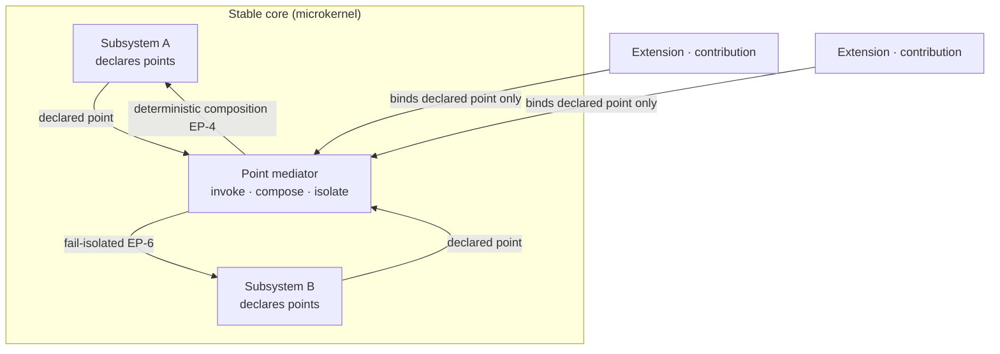

# Extension Points

**Version:** 1.0.0
**Status:** Stable
**Layer:** concept

## Overview

The technology-agnostic model of **where and how the core is extended** — the seam side of the plugin architecture. Where [l1-extensions.md](l1-extensions.md) defines the *artifact* (what a plugin is, its kinds, trust, and load lifecycle), this concept defines the *seam*: the **extension point**, a named, versioned place in the core at which an extension may contribute behavior, and the uniform grammar by which every aspect of the project — the office, the board, automation, memory, the wiki, roles, model serving, navigation, version control, security — exposes such seams.

The design follows the **microkernel (plugin) architecture** proven across the industry (editor contribution points, platform extension points, action/filter hook systems, tapped build pipelines): a small, stable core that owns behavior and publishes a *closed taxonomy* of extension-point kinds; extensions attach only at declared points, never by reaching into internals; and the core mediates every contribution and composes competing ones deterministically. The result is the mechanism the request asks for — plugins for **all aspects** of the project, **scalable** (N plugins cost nothing until their point is reached) and **flexible** (any subsystem gains extensibility by declaring points in the one shared grammar), without the core fragmenting into a dozen bespoke plugin systems.

Extensions and extension points are duals: an *extension* carries one or more **contributions**; each contribution binds to exactly one **extension point** whose kind it matches. This spec owns the extension-point half.

## Related Specifications

- [l1-extensions.md](l1-extensions.md) - The artifact model (kinds, registry, lifecycle, default-deny trust, sandbox, manifest, attestation — EXT-1…11) that an extension carrying contributions obeys; extension points are the seams those artifacts attach to. The two compose: EXT owns the *what*, this owns the *where/how*.
- [l2-plugin-hooks.md](l2-plugin-hooks.md) - A concrete realization of the *observe* and *decide* point kinds at actor-lifecycle and bus-event boundaries (preStop/postStop/on-event); one instance of this model, not its whole.
- [l1-tool-composition.md](l1-tool-composition.md) - Toolkits are a *command/contribution* case (a tool added to the tool surface) plus the composition discipline this spec generalizes across all point kinds.
- [l1-architecture.md](l1-architecture.md) - The layered core is the microkernel that owns the points (EP-1); command parity (INV-3) makes a contributed CLI verb, TUI slash, and library method one operation.
- [l1-security.md](l1-security.md) / [l1-action-gating.md](l1-action-gating.md) - Attaching to a point is a permissioned, sandboxed capability (EP-7); a *decide* point that gates an effect inherits the action-gating discipline.
- [l1-automation-pipeline.md](l1-automation-pipeline.md) - Pipeline trigger/action nodes are *command/contribution* and *provide* points; an automation extends the office through this model.
- [l1-roles.md](l1-roles.md) / [l1-model-runtime.md](l1-model-runtime.md) - Roles and model providers are *provide* points — the core selects one contributed implementation by a declared policy.
- [l1-office-fabric.md](l1-office-fabric.md) - A lens is a *provide*/*contribution* point on the fabric; a plugin can contribute a new lens through the same grammar.
- [l1-extension-marketplace.md](l1-extension-marketplace.md) - Distributes the extensions whose contributions bind here; distribution never bypasses the point contract.

## 1. Motivation

Cronus already lets capabilities plug in (skills, MCP servers, plugins, connectors — EXT). But "add a capability" is only half of an extensibility story. The other half is **the set of seams the core exposes** — the places a contribution can actually change behavior, across every subsystem. Today that half is implicit and uneven: one subsystem grew a narrow runtime hook surface (actor lifecycle + bus events), others have no declared seam at all, and there is no shared answer to "at which points, in what shape, may an extension contribute — and what happens when two extensions contribute to the same one?"

Three failures follow from leaving the seam side unmodeled:

- **Bespoke, non-uniform extensibility.** If each subsystem invents its own way to be extended, the project accretes a dozen incompatible plugin mechanisms; a plugin author learns a different contract per aspect, and the core cannot reason about extensibility as one thing. The best-practice answer is a *single contribution grammar* every aspect uses.
- **Undefined composition.** When two plugins want to influence the same decision — reorder the same board, both answer the same routing question, both transform the same prompt — an unmodeled system resolves it by accident (load order, last-writer-wins), which is neither deterministic nor safe. World-class plugin systems make composition a first-class, *declared* discipline: side-effect hooks fan out, value hooks form a pipeline, provider hooks select one, decision hooks bail on the first answer.
- **Fragile core / no evolution path.** Without the seam being a *versioned contract*, either the core cannot change (every internal edit risks breaking plugins) or it breaks them silently. The proven remedy is to treat each point as a semantically-versioned API surface: stable within a compatible range, migrated explicitly across a breaking one.

The resolving idea is to lift the microkernel pattern to a first-class concept: a stable core that publishes **declared, versioned extension points** in a **closed kind-taxonomy**, mediates every contribution, composes them **deterministically**, and activates them **lazily**. Extensions attach only there. That is what makes plugins reach *all aspects* while the core stays coherent, safe, and able to grow.

## 2. Constraints & Assumptions

- An extension point is a property of the **core/subsystem**, declared by it; extensions discover points, they do not invent them. A contribution cannot attach where no point is declared.
- The point-kind taxonomy is **closed** (a small fixed set); adding a *new kind* is a core change, not something a plugin does. Subsystems add *points*, never new kinds.
- Contributions are **untrusted** and reach only what their manifest declares; all trust, sandbox, and grant rules of [l1-extensions.md](l1-extensions.md) / [l1-security.md](l1-security.md) apply unchanged. This spec adds the *where*, not a new trust model.
- Composition must be **deterministic**: the same installed set and inputs yield the same result. Ordering is *declared*, never incidental to install or load order.
- The model is **additive to l1-extensions**: it does not change what an extension is; it names the seams contributions bind to and how they compose.
- A non-technical client never wires points by hand; the office manages contributions and asks only at permission gates (OFF-6). The point model is an internal architecture the office operates on the client's behalf.

## 3. Core Invariants (Layer 1 only)

Rules every Layer 2 implementation MUST NOT violate:

- **EP-1 (Declared seams only — no reaching into internals):** the core is extended **only** at named extension points a subsystem explicitly declares. A contribution attaches to a declared point through that point's contract and MUST NOT reach a subsystem's internal state or call another subsystem's code directly (no monkey-patching, no back doors). The seam is the only door; where no point is declared, behavior is not extensible.

- **EP-2 (Closed, uniform point-kind taxonomy):** every extension point is exactly one of a **closed set of kinds**, and the *same* set is used by every aspect of the project. The kinds are: **observe** (react to an event with side effects, cannot change the outcome), **transform** (receive a value and return a possibly-modified one, chainable), **provide** (supply a named implementation the core selects among), **contribute** (add a new invocable surface — a command/verb, tool, node, menu item, lens), and **decide** (answer a decision, able to short-circuit it). A point declares its kind; a contribution MUST match it. No subsystem invents a private, non-conforming extension mechanism (anti-sprawl).

- **EP-3 (Core-mediated invocation):** the core invokes every contribution at its point; a contribution never invokes another contribution directly and never holds the kernel's internals. A contribution influences behavior solely through its point's declared input/output contract, so one contribution can neither corrupt another nor the core. The core is the sole mediator.

- **EP-4 (Deterministic composition & declared precedence):** when several contributions bind the same point, the core composes them **deterministically** by the point kind's discipline — *observe*: all run, isolated, in a deterministic order; *transform*: a stable-order pipeline where each output feeds the next; *provide*: exactly one selected by a declared policy with deterministic tie-breaking; *contribute*: all added, collisions on the same invocable name resolved by a declared rule; *decide*: first non-abstaining decision in declared order wins. Ordering is **declared** (explicit priority and/or before/after constraints), never a function of install or load order. Same points + same inputs ⇒ same composition.

- **EP-5 (Versioned seam contract — stable, explicitly evolved):** every extension point is a **versioned contract** (its kind, input/output shape, and guarantees). The core MUST NOT break a published point within a compatible version range; a breaking change is a new point version with an announced migration, never a silent shape change. A contribution declares the point version it targets; a target the core cannot satisfy is **refused before activation** (composing EXT-2), never silently mis-bound to an incompatible seam.

- **EP-6 (Fail-isolated contributions — the kernel survives a bad plugin):** a contribution's error, timeout, or misbehavior is contained at its point under the point's **declared failure policy** — *observe*/*transform* skip the offender and continue (fail-forward), *provide*/*decide* fall through to the next candidate — and is logged and audited. A contribution MUST NOT be able to crash the core, hang a point unbounded (points are time/step-bounded), or silently corrupt an outcome. Every point declares its failure policy; "undefined behavior on plugin failure" is forbidden.

- **EP-7 (Least-privilege, declared reach):** a contribution reaches only the points and capabilities its manifest declares; attaching to a point is itself a **default-deny, permissioned** capability (composing EXT-3/EXT-4/EXT-6). A plugin cannot bind a point it did not declare, and a point MAY require a specific grant to contribute to (e.g., a *decide* point that gates a security-relevant effect). Point reach is capability-scoped, never ambient.

- **EP-8 (Every aspect extensible through the one model):** extensibility is uniform across the project — each subsystem exposes its seams as declared points of the common taxonomy (EP-2), so no aspect is extended through a privileged, non-conforming mechanism, and a **new subsystem gains extensibility by declaring points**, not by adding a parallel plugin system. The architecture scales by adding points within the one model; the set of *aspects* is open, the set of *kinds* is closed.

- **EP-9 (Lazy activation & observable wiring):** a contribution is bound and its host extension loaded **lazily** — only when its point is reached or its declared activation trigger fires (composing EXT-2) — so installed-but-unused contributions cost nothing (scalability). The complete live wiring — which contributions bind which points, in what order, which provider is selected, which decision won — is **inspectable and auditable** at any time (composing EXT-8), so the office and the client can see exactly how the core is currently extended.

> L2 specs cannot reach RFC status until all invariants here are addressed in their "Invariant Compliance" section.

## 4. Detailed Design

### 4.1 The microkernel stance

The core owns behavior and publishes seams; everything pluggable enters through a declared point the core invokes (EP-1, EP-3).



An extension never touches a subsystem directly; it hands a contribution to the mediator, which invokes it at the point and folds its result back under the kind's composition rule.

### 4.2 The point-kind taxonomy (EP-2)

One closed grammar, reused by every aspect. Each kind carries its own composition and failure discipline (world-practice analog shown for orientation only; the contract is the columns, not the analog).

| Kind | Contribution does | Composition (EP-4) | Failure policy (EP-6) | Analog |
| --- | --- | --- | --- | --- |
| **observe** | reacts with side effects; cannot change the outcome | all run, isolated, deterministic order | skip offender, continue | action hook / event listener |
| **transform** | maps a value → possibly-modified value | stable-order pipeline, chained | skip offender (pass value through) | filter hook / waterfall tap |
| **provide** | supplies a named implementation | exactly one selected by declared policy | fall through to next candidate | provider / strategy |
| **contribute** | adds a new invocable surface | all added; name collisions resolved by declared rule | reject the malformed contribution | contribution point |
| **decide** | answers a decision, may short-circuit | first non-abstaining answer in declared order wins | fall through to next decider | bail hook / chain of responsibility |

Choosing the *kind* is the design act that keeps composition safe: a plugin that must not change an outcome is given an *observe* point (it physically cannot), a plugin that legitimately shapes a value gets *transform*, and a plugin that answers a gate gets *decide* under a grant (EP-7).

### 4.3 Composition & precedence

Precedence is always **declared**, never inherited from load order (EP-4).

```text
[REFERENCE]
Each contribution declares: point-id, target point-version, priority?, before/after?
The core topologically orders contributions on a point by (priority, before/after constraints),
breaking any residual tie by a stable deterministic key (e.g., extension identity), NOT by load order.

observe   → run every contribution in that order, each isolated (one failing does not stop the rest)
transform → thread the value through the order: v = c_k(...c_2(c_1(v)))
provide   → evaluate the selection policy over candidates in that order; bind exactly one
decide    → ask each in order; the first that returns a decision (not "abstain") wins; else core default
contribute→ register each invocable; on same-name collision apply the declared rule (namespaced / refused)
```

Determinism is the load-bearing property: the same installed set and inputs must always compose the same way, so behavior is reproducible and auditable (EP-9) rather than an artifact of what happened to load first.

### 4.4 The seam as a versioned contract (EP-5)

A point is an API the ecosystem depends on. It is semantically versioned:

```text
[REFERENCE]
point "board.card.ordering" v1  (kind: transform; in: card list; out: reordered card list)
  compatible change  → v1.x  (add optional context; old contributions keep binding)
  breaking change    → v2     (shape changes; v1 contributions do NOT auto-bind)
                              core publishes v2 alongside v1 for a migration window, then retires v1
A contribution targeting v1 that meets only a v2 core is refused at activation (EP-5), surfaced — never silently bound to v2.
```

This is what lets the core evolve without breaking the plugin ecosystem, and lets plugins written once keep working — the scalability guarantee the request calls for.

### 4.5 Aspects that expose extension points

"For all aspects" is concrete: every subsystem publishes seams in the one grammar. Representative (non-exhaustive; new subsystems add points the same way, EP-8):

| Aspect | Example point | Kind |
| --- | --- | --- |
| Office / orchestration | on-hire, on-delegate; a custom staffing strategy | observe; provide |
| Kanban board | card transition, column ordering; a custom column/board | observe/transform; contribute |
| Automation pipeline | a new trigger source or action node | contribute; provide |
| Memory | pre-store enrichment, recall re-ranking | transform |
| Wiki (knowledge lens) | page-render augmentation, grounding source | transform; provide |
| Model serving | a model provider selected by policy | provide |
| Roles | a role definition offered to the office | provide/contribute |
| Navigation / office fabric | a new lens or sidebar subsystem | contribute/provide |
| Version control | pre-commit quality gate | decide |
| Security / effects | an authorization decision on an effect | decide (grant-gated, EP-7) |
| CLI / tool surface | a new verb / tool | contribute (parity INV-3) |

Each row is the *same* mechanism, differing only in point kind — a board reorder is a *transform*, a model provider is a *provide*, a commit gate is a *decide*. The office never learns a per-aspect plugin dialect.

### 4.6 Relationship to l1-extensions and l2-plugin-hooks

- **l1-extensions (the dual).** EXT owns the artifact: kinds, registry, discover→grant→activate lifecycle, sandbox, manifest, attestation. This spec owns the seam a contribution binds. An extension's manifest (EXT-9) declares *which points* its contributions target and *at what version* (EP-5) — the manifest is where the two halves meet.
- **l2-plugin-hooks (one realization).** The existing hook system is exactly the *observe* and *decide* kinds instantiated at actor-lifecycle and bus-event points, with its fail-forward and deterministic-order rules being the EP-4/EP-6 disciplines for those points. It is one conforming instance; this L1 generalizes its narrow surface to the whole core. (Aligning that L2 to also declare this parent is a downstream planning reconciliation, mirroring how EXT-10/EXT-11 were carried by their L2 implementers.)

### 4.7 Scalability & flexibility

- **Scalability.** Lazy activation (EP-9) means installed-but-unused contributions are free; the cost is paid only when a point is reached. Determinism (EP-4) keeps behavior stable as the installed set grows. Versioned seams (EP-5) let the ecosystem grow without lockstep upgrades.
- **Flexibility.** Any aspect becomes extensible by declaring points in the one taxonomy (EP-2/EP-8); the five kinds cover the full range from passive observation to authoritative decision, so a subsystem can open exactly the amount of extensibility it should — no more (a *decide* point is a deliberate, grant-gated choice), no less (an *observe* point costs a subsystem almost nothing to publish).

## 5. Drawbacks & Alternatives

- **Taxonomy rigidity.** A closed five-kind set (EP-2) cannot express every conceivable seam. Accepted deliberately: the closure is what keeps composition and safety tractable; a genuinely new kind is a considered core change, not a plugin's prerogative. The five kinds span observe→transform→provide→contribute→decide, which cover the field in practice.
- **Declared-ordering burden.** Requiring declared precedence (EP-4) is more work than "just run them," but incidental load-order composition is exactly the non-determinism world-class systems eliminate; the burden buys reproducibility and auditability.
- **Versioning overhead.** Treating every point as a versioned contract (EP-5) is heavier than an ad-hoc seam, justified by the alternative — a core that either cannot change or breaks plugins silently.
- **Alternative — keep bespoke per-subsystem hooks.** Rejected (EP-8): it fragments extensibility into incompatible dialects and defeats "one mechanism for all aspects."
- **Alternative — let plugins patch internals directly (open core).** Rejected (EP-1/EP-3): direct reach makes plugins mutually corrupting and the core impossible to evolve; the mediated seam is the whole point of the microkernel pattern.
- **Alternative — fold this into l1-extensions.** Rejected: EXT is already a large spec about the artifact and its trust; the seam model spans every subsystem's composition and versioning and deserves its own altitude (the same reasoning that keeps tool-composition and marketplace as siblings of EXT, not sections of it).

## nodus-relevance mapping

Nodus already embodies this model's principles at the DSL grain; the main-workspace concept generalizes them to the whole host.

| Element | nodus seam | Note |
| --- | --- | --- |
| *provide* points (EP-2) | host-supplied providers: `ModelProvider`, `AuditProvider`, `SchemaProvider`, `StorageProvider` (LP-2/LP-8) | The runtime declares provider seams the host fills — *provide*-kind points, selected/injected by the host. |
| Closed kind taxonomy (EP-2) | closed flag/validator/type registries (NL vocab) | Nodus already forbids open-ended private mechanisms; a capability is declared, not improvised. |
| Versioned seam contract (EP-5) | vocabulary schema versioning + `@needs` selective disclosure (NL-16) | A workflow targets a declared, versioned vocabulary slice; incompatible use is a fail-fast validation error. |
| Least-privilege reach (EP-7) | declared capability resolved before run (LP-8) | Binding a seam is a pre-declared, pre-validated capability, never ambient. |
| Deterministic composition (EP-4) | deterministic execution/rendering (NL-6) | Same inputs + same declared set ⇒ same result. |

## Canonical References

| Alias | Path | Purpose |
| --- | --- | --- |
| `[EXTENSIONS]` | `.design/main/specifications/l1-extensions.md` | The artifact model this pairs with; the manifest is where a contribution names its target points (EP-5, EXT-9) |
| `[PLUGIN-HOOKS]` | `.design/main/specifications/l2-plugin-hooks.md` | A conforming realization of the *observe*/*decide* kinds (§4.6) |
| `[ARCH]` | `.design/main/specifications/l1-architecture.md` | The layered core (microkernel) that owns the points; command parity for *contribute* (INV-3) |
| `[SECURITY]` | `.design/main/specifications/l1-security.md` | Default-deny, sandbox, grants a point contribution inherits (EP-7) |
| `[ACTION-GATING]` | `.design/main/specifications/l1-action-gating.md` | The gate discipline a security-relevant *decide* point composes |
| `[TOOL-COMP]` | `.design/main/specifications/l1-tool-composition.md` | Toolkits as a *contribute*+composition case this generalizes |

## Document History

| Version | Date | Author | Notes |
| --- | --- | --- | --- |
| 1.0.0 | 2026-07-24 | Core Team | Initial spec — the extension-point (seam) model, dual to l1-extensions: the core is extended only at declared, mediated seams (EP-1/EP-3); a closed, uniform point-kind taxonomy (observe / transform / provide / contribute / decide) used by every aspect (EP-2); deterministic composition under declared precedence (EP-4); versioned seam contracts with pre-activation refusal of incompatible targets (EP-5); fail-isolated contributions under declared failure policies (EP-6); least-privilege, declared, grant-gated point reach (EP-7); every aspect extensible through the one model, new subsystems add points not parallel systems (EP-8); lazy activation and observable/auditable live wiring (EP-9). Microkernel/contribution-point best-practice synthesis; composes l1-extensions (artifact) / l2-plugin-hooks (one realization) / l1-security / l1-architecture. Main-only host architecture concept. |
