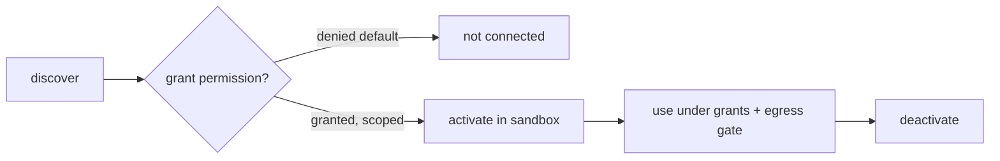

# Extensions

**Version:** 1.1.0
**Status:** Stable
**Layer:** concept

## Overview

The technology-agnostic model of how Cronus is extended with new capabilities. Four extension kinds — **skills** (reusable procedures), **MCP servers** (external tool providers), **plugins** (code extensions), and **service connectors** (declarative integrations with external HTTP/REST services that have no MCP server) — share one registry, one lifecycle, and one trust model. The office may also *generate* new skills by distilling repeated successful patterns. Extensions are powerful and potentially untrusted, so connection is default-deny, permissioned, and sandboxed.

## Related Specifications

- [l1-roles.md](l1-roles.md) - Roles carry skills; hired roles activate the extensions they need.
- [l1-security.md](l1-security.md) - Sandboxing, default-deny egress, and permission grants (SEC-3/6/7); connector credentials follow secret isolation.
- [l1-workflow-language.md](l1-workflow-language.md) - A skill MAY be expressed as a workflow.
- [l1-memory-model.md](l1-memory-model.md) - Skill generation distills patterns (consistent with OFF-9).
- [l1-automation-pipeline.md](l1-automation-pipeline.md) - A connector's triggers feed the pipeline as `external_event` / `webhook` sources; its creates/searches back `action` nodes (EXT-10).
- [l2-extension-registry.md](l2-extension-registry.md) - Concrete manifest, connection, sandbox, and commands.

## 1. Motivation

The product's goal is "collect the best ideas under the hood." That means plugging in the open ecosystem (MCP tools), reusable skills, and custom plugins — without each becoming a security hole or a bespoke subsystem. Modeling all three as one permissioned, sandboxed extension type keeps connection uniform and safe, and lets the office grow its own capabilities by turning what it learns into skills.

## 2. Constraints & Assumptions

- Extensions may be third-party and untrusted; the system must contain them.
- A non-technical client should not have to wire extensions manually; the office manages them, asking only at permission gates.
- Generation is bounded: only skills are auto-generated for now; MCP/plugin generation is out of scope.

## 3. Core Invariants (Layer 1 only)

Rules every Layer 2 implementation MUST NOT violate:

- **EXT-1 (Unified model):** skills, MCP servers, and plugins are extension *kinds* sharing one registry and one lifecycle; they are never modeled as three disjoint subsystems.
- **EXT-2 (Lifecycle):** every extension follows discover → grant-permission → activate → use → deactivate. Nothing is usable before activation.
- **EXT-3 (Default-deny trust):** an extension gains no capability until explicitly permitted; connecting an external/third-party extension is denied by default (consistent with SEC-3 / ORC-9 approval).
- **EXT-4 (Sandboxed execution):** extension code and tools run sandboxed with least privilege (consistent with SEC-6); a misbehaving extension cannot exceed its grants.
- **EXT-5 (Preset + custom):** the system ships read-only preset extensions; users/offices add custom ones in the mutable state tier (consistent with STO-3 / ROL-2).
- **EXT-6 (Scoped, minimal grants):** an extension's permissions (filesystem, network, secrets) are explicit and minimal; any outbound access passes the egress gate (SEC-3).
- **EXT-7 (Skill generation):** the office MAY generate new skills by distilling repeated successful patterns (consistent with OFF-9). Generated skills enter the registry as *custom* extensions and are reviewable before activation.
- **EXT-8 (Provenance & audit):** every extension records its origin (preset / custom / generated) and its grants; activations and tool calls are auditable.
- **EXT-9 (Manifest contract):** each extension declares a manifest (kind, capabilities, required permissions); the registry validates it before activation.

- **EXT-10 (Service connector kind):** a *connector* is a fourth extension kind — a declarative integration with an external HTTP/REST service that exposes no MCP server. A connector bundles three things. (a) An **authentication scheme** from a closed taxonomy — none / basic / api-key / digest / oauth1 / oauth2 / session — each honoring one uniform contract: a connection *test*, a human-readable connection *label*, automatic credential *refresh* on a typed expiry signal, and *deauthentication* on a typed invalid-credential signal. (b) **Operations** in three roles — *triggers* (event sources), *creates* (side-effecting actions), and *searches* (lookups) — which bind into the automation pipeline and tool surface exactly as any other extension capability, never as a parallel runtime. (c) A trigger **delivery mode** — *polling* (periodic fetch, deduplicated by stable object identity, not by time window) or *subscription* (a REST hook the connector subscribes to and unsubscribes from), with polling as the mandatory fallback when subscription is unavailable. A connector obeys the same registry, lifecycle (EXT-2), default-deny trust (EXT-3), sandboxing (EXT-4), minimal grants + egress gate (EXT-6), provenance/audit (EXT-8), and manifest contract (EXT-9) as every other kind. Its credentials follow the secret-isolation rules of `l1-security.md` and MUST NOT appear in event payloads (consistent with AP-4).

> L2 specs cannot reach RFC status until all invariants here are addressed in their "Invariant Compliance" section.

## 4. Detailed Design

### 4.1 Extension kinds

| Kind | Provides | Interface |
| --- | --- | --- |
| skill | a reusable procedure/capability | instructions (and optionally a workflow) |
| mcp-server | external tools | a connected MCP server (stdio/remote) |
| plugin | a code extension | a sandboxed code entry point |
| connector | an external HTTP/REST service integration | a declarative auth scheme + triggers/creates/searches (EXT-10) |

### 4.2 Lifecycle and trust



Permissions are explicit and minimal (EXT-6); the client is asked only at the grant gate (consistent with OFF-6). Tool calls and activations are audited (EXT-8).

### 4.3 Skill generation (self-improvement)


The office watches for recurring patterns (the curator/archivist role) and distills them into candidate skills, which enter the registry as reviewable custom extensions (EXT-7). MCP and plugin generation are deferred.

### 4.4 Service connectors (EXT-10)

MCP is the office's preferred path to external tools, but most of the world's services expose only a plain HTTP/REST API and no MCP server. A *connector* integrates such a service declaratively, without bespoke plugin code, and without a second runtime.

**Authentication scheme taxonomy.** A connector picks exactly one scheme; each satisfies the same four-part contract so the office handles connection uniformly:

| Scheme | Carries | Refresh / deauth behavior |
| --- | --- | --- |
| none | nothing | n/a (public API) |
| basic | username + password | deauth on 401 |
| api-key | a key in header/query | deauth on 401/403 |
| digest | challenge-response credentials | re-challenge; deauth on persistent 401 |
| oauth1 | signed-request tokens | deauth on invalid signature |
| oauth2 | access + refresh tokens | auto-refresh on typed expiry; deauth when refresh fails |
| session | a server-issued session token | auto-refresh by re-running the session exchange |

The contract is: **test** (verify the connection works and resolve a connection **label** for display), **refresh** (renew credentials on a typed *expiry* signal — never on an arbitrary error), and **deauth** (mark the connection invalid on a typed *invalid-credential* signal so the office re-prompts the user). Credentials live in the secret store (`l1-security.md`), never in event payloads (AP-4).

**Operations and the resource shortcut.** A connector declares operations in three roles — *trigger*, *create*, *search*. To stay DRY, it MAY declare a **resource** once (its identity, and how to get / list / create / search / subscribe it) and have the trigger/create/search operations *derived* from that single definition, rather than authored three times.

**Trigger delivery duality.**

```text
[REFERENCE]
POLLING        — periodically fetch a list; emit only items whose stable id
                 has not been seen before (dedup by identity, not time window)
SUBSCRIPTION   — on activation, call the service's subscribe endpoint registering
                 a callback URL; on deactivation, call unsubscribe; events arrive
                 as inbound webhooks (lower latency, no polling cost)
FALLBACK       — a subscription trigger MUST also declare a polling path, used
                 when the service's hook is unavailable or a delivery is missed
```

A connector's triggers surface to the automation pipeline as `external_event` (polling) or `webhook` (subscription) sources; its creates/searches back `action` nodes. The connector is the *source*; the pipeline is the *engine* (`l1-automation-pipeline.md`).

**Hydration (deferred dereferencing).** A trigger payload carries descriptors, not bulk values (AP-4). When a downstream step genuinely needs a large payload — a file, a long document — it dereferences a **hydration pointer** carried in the descriptor, fetching the value on demand under the connector's grants. This complements content-addressed storage (`l1-file-management.md`): the pointer travels cheaply through the graph; the bytes load once, lazily, only if used.

**Idempotent search-or-create.** A connector MAY expose a *search-or-create* operation: search for a record, and create it only if absent. This makes "ensure X exists" automations idempotent — re-running does not duplicate. Connectors MAY also expose **dynamic input fields** whose choices are populated at run time from a trigger/search (a live dropdown) and **dependent fields** that refresh when an upstream field changes.

## 5. Drawbacks & Alternatives

- **Permission friction:** default-deny means more grant prompts; mitigated by the office remembering grants and asking once per scope.
- **Generated-skill quality:** distilled skills can be wrong; mitigated by the review gate before activation. <!-- TBD: auto-activate threshold for generated skills vs always-review -->
- **Alternative — trust-all extensions:** rejected outright; extensions run untrusted code/tools.
- **Alternative — four separate subsystems:** rejected; duplicates lifecycle and trust logic across skills/MCP/plugins/connectors.
- **Connector vs MCP overlap:** a connector and an MCP server can both wrap the same service. The office prefers MCP when one exists (richer, protocol-native) and falls back to a declarative connector for the long tail of services that expose only HTTP. The two are the same extension kind family, not competing subsystems — a connector can later be superseded by an MCP server for the same service without changing how automations consume it.

## Canonical References

| Alias | Path | Purpose |
| --- | --- | --- |
| `[SECURITY]` | `.design/main/specifications/l1-security.md` | Sandbox, egress, permission grants; connector credential isolation |
| `[ROLES]` | `.design/main/specifications/l1-roles.md` | Roles carry/activate skills |
| `[PIPELINE]` | `.design/main/specifications/l1-automation-pipeline.md` | Connector triggers/creates/searches feed the pipeline (EXT-10) |
| `[REGISTRY]` | `.design/main/specifications/l2-extension-registry.md` | Concrete realization |

## Document History

| Version | Date | Notes |
| --- | --- | --- |
| 1.0.0 | 2026-06-24 | Initial stable spec — three extension kinds (skill / mcp-server / plugin) sharing one registry, lifecycle, and trust model; EXT-1…EXT-9; default-deny + sandboxed; skill generation. |
| 1.1.0 | 2026-06-25 | EXT-10 added — *service connector* as a fourth extension kind for external HTTP/REST services with no MCP server: closed authentication-scheme taxonomy (none/basic/api-key/digest/oauth1/oauth2/session) with a uniform test/label/refresh/deauth contract; trigger/create/search operations with an optional resource shortcut; trigger delivery duality (polling deduped by stable identity vs subscription REST hooks with mandatory polling fallback); hydration for deferred large-payload dereferencing; idempotent search-or-create; dynamic/dependent input fields. `connector` kind added to §4.1; §4.4 added; Overview now "four kinds"; Document History introduced per RULES §5. Additive invariant — the four L2 implementers (l2-extension-registry, l2-agent-migration, l2-plugin-hooks, l2-learning-loop) carry EXT-10 as unaddressed pending a `magic.task` reconciliation; L1 remains Stable (no destabilization cascade). |
