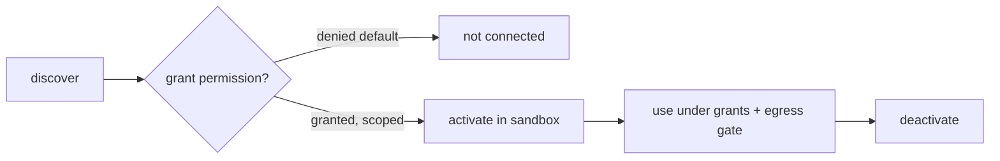

# Extensions

**Version:** 1.0.0
**Status:** Stable
**Layer:** concept

## Overview

The technology-agnostic model of how Cronus is extended with new capabilities. Three extension kinds — **skills** (reusable procedures), **MCP servers** (external tool providers), and **plugins** (code extensions) — share one registry, one lifecycle, and one trust model. The office may also *generate* new skills by distilling repeated successful patterns. Extensions are powerful and potentially untrusted, so connection is default-deny, permissioned, and sandboxed.

## Related Specifications

- [l1-roles.md](l1-roles.md) - Roles carry skills; hired roles activate the extensions they need.
- [l1-security.md](l1-security.md) - Sandboxing, default-deny egress, and permission grants (SEC-3/6/7).
- [l1-workflow-language.md](l1-workflow-language.md) - A skill MAY be expressed as a workflow.
- [l1-memory-model.md](l1-memory-model.md) - Skill generation distills patterns (consistent with OFF-9).
- [l2-extension-registry.md](l2-extension-registry.md) - Concrete manifest, connection, sandbox, and commands.

## 1. Motivation

The product's goal is "collect the best ideas under the hood." That means plugging in the open ecosystem (MCP tools), reusable skills, and custom plugins — without each becoming a security hole or a bespoke subsystem. Modeling all three as one permissioned, sandboxed extension type keeps connection uniform and safe, and lets the office grow its own capabilities by turning what it learns into skills.

## 2. Constraints & Assumptions

- Extensions may be third-party and untrusted; the system must contain them.
- A non-technical client should not have to wire extensions manually; the office manages them, asking only at permission gates.
- Generation is bounded: only skills are auto-generated for now; MCP/plugin generation is out of scope.

## 3. Core Invariants (Layer 1 only)

Rules every Layer 2 implementation MUST NOT violate:

- **EXT-1 (Unified model):** skills, MCP servers, and plugins are extension *kinds* sharing one registry and one lifecycle; they are never modeled as three disjoint subsystems.
- **EXT-2 (Lifecycle):** every extension follows discover → grant-permission → activate → use → deactivate. Nothing is usable before activation.
- **EXT-3 (Default-deny trust):** an extension gains no capability until explicitly permitted; connecting an external/third-party extension is denied by default (consistent with SEC-3 / ORC-9 approval).
- **EXT-4 (Sandboxed execution):** extension code and tools run sandboxed with least privilege (consistent with SEC-6); a misbehaving extension cannot exceed its grants.
- **EXT-5 (Preset + custom):** the system ships read-only preset extensions; users/offices add custom ones in the mutable state tier (consistent with STO-3 / ROL-2).
- **EXT-6 (Scoped, minimal grants):** an extension's permissions (filesystem, network, secrets) are explicit and minimal; any outbound access passes the egress gate (SEC-3).
- **EXT-7 (Skill generation):** the office MAY generate new skills by distilling repeated successful patterns (consistent with OFF-9). Generated skills enter the registry as *custom* extensions and are reviewable before activation.
- **EXT-8 (Provenance & audit):** every extension records its origin (preset / custom / generated) and its grants; activations and tool calls are auditable.
- **EXT-9 (Manifest contract):** each extension declares a manifest (kind, capabilities, required permissions); the registry validates it before activation.

> L2 specs cannot reach RFC status until all invariants here are addressed in their "Invariant Compliance" section.

## 4. Detailed Design

### 4.1 Extension kinds

| Kind | Provides | Interface |
| --- | --- | --- |
| skill | a reusable procedure/capability | instructions (and optionally a workflow) |
| mcp-server | external tools | a connected MCP server (stdio/remote) |
| plugin | a code extension | a sandboxed code entry point |

### 4.2 Lifecycle and trust

Permissions are explicit and minimal (EXT-6); the client is asked only at the grant gate (consistent with OFF-6). Tool calls and activations are audited (EXT-8).

### 4.3 Skill generation (self-improvement)

The office watches for recurring patterns (the curator/archivist role) and distills them into candidate skills, which enter the registry as reviewable custom extensions (EXT-7). MCP and plugin generation are deferred.

## 5. Drawbacks & Alternatives

- **Permission friction:** default-deny means more grant prompts; mitigated by the office remembering grants and asking once per scope.
- **Generated-skill quality:** distilled skills can be wrong; mitigated by the review gate before activation. <!-- TBD: auto-activate threshold for generated skills vs always-review -->
- **Alternative — trust-all extensions:** rejected outright; extensions run untrusted code/tools.
- **Alternative — three separate subsystems:** rejected; duplicates lifecycle and trust logic.

## Canonical References

| Alias | Path | Purpose |
| --- | --- | --- |
| `[SECURITY]` | `.design/main/specifications/l1-security.md` | Sandbox, egress, permission grants |
| `[ROLES]` | `.design/main/specifications/l1-roles.md` | Roles carry/activate skills |
| `[REGISTRY]` | `.design/main/specifications/l2-extension-registry.md` | Concrete realization |
