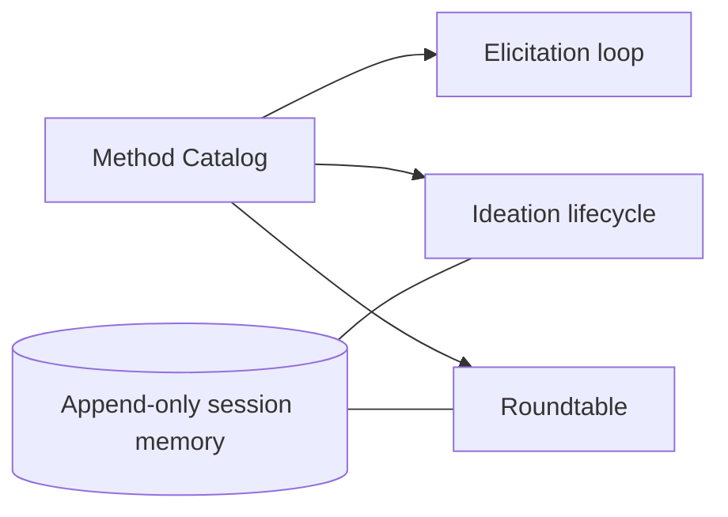
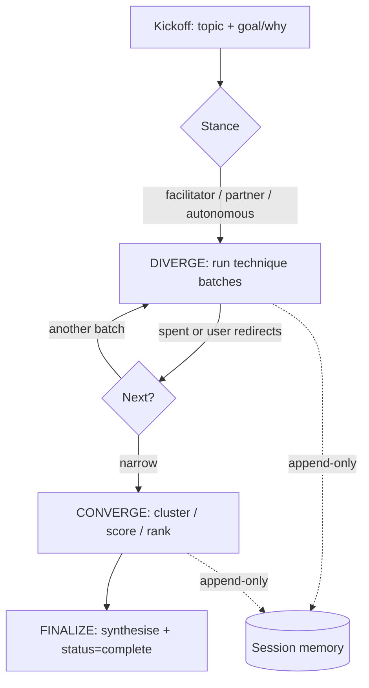

# Facilitated Cognition

**Version:** 1.1.0
**Status:** Stable
**Layer:** concept

## Overview

Facilitated cognition is the office's subsystem for *drawing out better thinking* — from the agent's own output and from the user — through structured, named, on-demand techniques. It is exploratory and advisory: it sharpens, diversifies, and stress-tests ideas, but it never makes a binding decision.

The subsystem has three faces that share one engine:

1. **Elicitation** — a portable catalog of named reasoning/critique techniques (first-principles, pre-mortem, inversion, steelmanning, second-order thinking, …) that the agent applies to its *most recent output* to reconsider and refine it, with the user steering which technique runs.
2. **Ideation** — a divergence-first facilitation protocol for generating far more and far better ideas on a topic than the user would alone, with a deliberate diverge → converge → finalize lifecycle and a durable session memory.
3. **Roundtable** — a multi-persona conversation where several distinct personas reason and clash in character, surfacing perspectives a single voice would miss.

This complements the office's *decision* and *reflection* machinery: deliberation decides, inner-monologue reflects autonomously in the background, lookahead simulates consequences — facilitation explores. The four are deliberately separate (see FC-12).

## Related Specifications

- [l1-deliberation.md](l1-deliberation.md) — decision protocol with orchestrator finality; facilitation is the exploratory complement that never decides (FC-12).
- [l1-inner-monologue.md](l1-inner-monologue.md) — background autonomous reflection; facilitation is foreground and on-demand.
- [l1-lookahead-planning.md](l1-lookahead-planning.md) — consequence simulation; pre-mortem/inversion methods here are the lightweight cousins.
- [l1-orchestration.md](l1-orchestration.md) — delegation and budget protocol used to run per-persona roundtable reasoning and parallel elicitation.
- [l1-roles.md](l1-roles.md) — role specialties that supply roundtable personas and expert-panel elicitation participants.
- [l1-quality-standards.md](l1-quality-standards.md) — adversarial review gates; the risk/competitive elicitation methods feed but do not replace them.
- [l1-workflow-language.md](l1-workflow-language.md) — facilitation lifecycles are expressible as agent workflows; the method catalog is a candidate vocabulary extension.
- [l1-extensions.md](l1-extensions.md) — the method catalog is a user-extensible asset, distributed and overridable like skills.
- [l1-security.md](l1-security.md) — facilitation content is user data; on-device-by-default, consent-gated egress (FC-11).
- [l1-memory-model.md](l1-memory-model.md) — durable session memory (memlog) is a scoped, append-only artifact distinct from long-term memory.
- [l1-operational-ledger.md](l1-operational-ledger.md) — sibling data-driven, id-addressable, layered registry; informs the optional `counters` failure-mode field and activity scoping (FC-1).

## 1. Motivation

Autonomous offices are good at converging — picking an answer and executing. They are weak at the two cognitive moves that precede a *good* answer:

1. **Refining their own first draft.** An agent's initial output is rarely its best. Without a forcing function, the agent affirms its own work instead of attacking it. A catalog of named critique techniques, applied deliberately to the just-produced output, turns "looks fine" into "here is the failure mode I missed."

2. **Genuine divergence with the user.** When a user wants to ideate, a one-shot answer ends the thinking prematurely. The highest-value sessions push *past* the obvious — more ideas, sharper questions, harder constraints — and only then narrow. This requires a protocol that resists concluding, keeps shifting the creative lens, and keeps judgment out of the generating phase.

A third, related gap: a single agent voice has a single bias. Letting several distinct personas argue a question — and clash rather than agree — exposes trade-offs and blind spots that no monologue surfaces.

These are facilitation problems, not decision problems. Treating them as decisions (vote, pick, move on) is exactly what destroys their value.

## 2. Constraints & Assumptions

- Facilitation is **opt-in and interruptible**: the user (or the invoking workflow) can proceed/exit at any point. It never blocks the primary flow.
- Facilitation is **advisory**: its outputs are proposals. It never commits an irreversible action and never overrides the decision protocols (FC-12).
- The method catalog is **data, not code**: techniques are declared as catalog entries so the set can grow without changing the engine.
- Sessions may be **long and interruptible**: an ideation session can outlive a single context window, so its state must be durable and resumable (FC-6, FC-7).
- The subsystem must run in **two contexts** — interactive (a human steering) and headless (a machine invoking it) — with non-blurring contracts (FC-10).
- Privacy is assumed: ideas, transcripts, and logs are user data kept **on-device by default** (FC-11).

## 3. Core Invariants

Rules that any Layer 2 implementation MUST NOT violate:

- **FC-1 Catalog as portable registry**: reasoning/critique/ideation techniques live in a data-driven catalog where each entry declares at minimum a category, a name, a description (what it does, when to use it, why it helps), and an output shape. The catalog is extensible without engine changes and may be layered (built-in < project < personal) with id-stable overrides. An entry MAY additionally declare the failure mode it counters and an activity scope, enabling **failure-driven selection** — reaching for the technique that counters an observed or anticipated failure, not only goal-driven selection.
- **FC-2 Context-aware, bounded selection**: when offering techniques, the agent selects a small short-list (a handful, not the whole library) ranked by the current context — content type, complexity, risk level, stakeholder needs. The full library is never dumped into the working context to make a choice; it is queried. When two selected techniques overlap or interact, a declared resolution order determines which runs first (e.g. identify the hardest constraint before enumerating the failure modes around it).
- **FC-3 Elicitation operates on existing output, change-gated**: an elicitation method is applied to the agent's most recent output to reconsider/refine/improve it. Any resulting change to a durable artifact is proposed and applied **only on explicit acceptance**; a rejected proposal is discarded, not silently retained. Elicitation complements, and never substitutes for, the post-task quality gates.
- **FC-4 Non-committal selection surface**: the facilitation surface always offers reshuffle / list-all / **proceed**, and never forces a pick. "Proceed" (do nothing further) is always reachable in one step. The surface is never a wall of stacked questions.
- **FC-5 Declared stance, held for the run**: an ideation session runs in exactly one stance — *facilitator* (the agent supplies no ideas; a forcing function for the user's), *partner* (the agent co-generates, with authorship of each idea attributed), or *autonomous* (the agent runs the whole session and presents the result). The stance is fixed at the start and holds for the entire run.
- **FC-6 Divergence precedes convergence; judgment is quarantined**: generation and evaluation are distinct phases. Convergence MUST NOT run while ideas are still flowing, and evaluation MUST NOT leak into a generating batch. The lifecycle is explicitly diverge → converge → finalize.
- **FC-7 Append-only session memory is the single source of truth**: every idea, decision, question, and direction is recorded as a one-line, time-ordered, append-only entry through an atomic writer. Entries are never edited or reordered. Whatever is not logged is lost; all synthesis and every resume build from this log alone.
- **FC-8 Resumable, durable sessions**: a facilitation session persists to disk and is resumable from its log after interruption. The log carries an explicit lifecycle status (in-progress → complete); only the finalize phase may mark a session complete.
- **FC-9 Persona integrity in roundtable**: in a multi-persona roundtable each persona speaks in its own voice; the orchestrator MAY add staging and connective tissue but MUST NOT invent, soften, or alter a persona's substantive position. False consensus is a failure mode — when the room converges too easily, a contrarian/dissenting voice is introduced.
- **FC-10 Run-mode degradation without failure**: a roundtable may run inline (one mind voicing every persona) or with independent per-persona reasoning (delegated workers). If the richer mechanism is unavailable in the host, it degrades to inline silently rather than failing. The presentation contract (one flowing conversation, not a stack of separate answers) is identical across modes.
- **FC-11 Interactive/headless separation**: when facilitation is invoked by a machine signal rather than an interactive user, it adopts a non-interactive contract — the agent generates without prompting and returns a result. The interactive and headless contracts never blur; headless is the only context in which the *facilitator* stance generates ideas itself.
- **FC-12 Advisory boundary**: facilitation never issues a binding decision and never performs an irreversible/outward action. Binding decisions belong to the deliberation protocol (orchestrator finality) and the autonomous decision protocol; commits and external effects pass through their own gates. Facilitation's output is evidence and options, nothing more.

> An L2 implementation cannot reach RFC until every invariant above is addressed in its Invariant Compliance section.

## 4. Detailed Design

### 4.1 The Method Catalog

The shared backbone of all three faces. A catalog is a set of technique entries; an engine reads entries, never hardcodes techniques.

| Field | Role |
| --- | --- |
| `category` | Grouping/lens (e.g. core, risk, creative, collaboration, technical, framing, research, retrospective). Drives super-group ordering. |
| `name` | Display name of the technique. |
| `description` | Terse but rich: what it does, when to reach for it, why it helps. The selector reads intent from this, not from the name. |
| `output_pattern` | A flow guide for the technique's shape (e.g. `assumptions → truths → new approach`). Anchors otherwise "vibe-only" methods. |
| `provenance` *(opt)* | `classic` / `signature` / `playful` — lets a "proven & professional" lead group surface recognised methods first. |
| `goal_affinity` *(opt)* | Multi-valued tags (feature / strategy / diagnosis / unstuck / …) powering goal → technique routing. |
| `audience` *(opt)* | `solo` / `group` / `either` — flags methods that silently assume a multi-human room. |
| `counters` *(opt)* | The failure mode this technique is designed to counter — powers failure-driven selection (FC-1). |
| `activity_scope` *(opt)* | Activity/phase clusters where the technique applies (planning / execution / research / review / debug) — scopes selection to the current kind of work. |

Catalog mechanics:

- **Goal → technique routing**: the user's stated goal maps to a short-list via `goal_affinity`, so "add a feature to a brownfield app" surfaces a different set than "plan a sabbatical." This is the single highest-value selection aid.
- **Invent-on-the-fly**: the engine may synthesise a brand-new technique in the spirit of a category when asked, rather than being limited to catalog rows; a keeper can be saved back to the personal layer (FC-1).
- **Layering & override**: built-in < project < personal, id-stable; a project or user may retune or add techniques without forking the engine (ties to extension distribution).



### 4.2 Elicitation Loop (refine recent output)

Applied to the just-produced output, interactively or invoked from another workflow.

```text
[REFERENCE]
1. SELECT  — read context; pick ~5 fitting methods from the catalog (FC-2)
2. OFFER   — present short-list + [reshuffle] [list-all] [proceed] (FC-4)
3. APPLY   — run the chosen method on the recent output; show what it revealed
4. GATE    — ask to apply changes to the artifact; accept → apply, reject → discard (FC-3)
5. LOOP    — re-present the surface for further passes, until [proceed]
```

When invoked indirectly from another workflow, the loop receives the section just generated, enhances it across passes, and returns the enhanced section to the caller on `proceed`. Elicitation enriches; it does not gate completion (the quality pipeline does).

### 4.3 Ideation Lifecycle (divergence-first facilitation)



- **Kickoff**: one compound question — *what are we ideating, and what's the goal/why?* The why shapes technique choice and synthesis. Skip if already clear.
- **Stance** (FC-5): set once, held throughout. In *partner*, every idea is authored (`by user` / `by coach`) in the log.
- **Diverge discipline**: aim past the obvious and resist concluding; shift the creative lens every few turns (usually by switching technique); one prompt per message in dialogue stances — never a multiple-choice wall for *what* to ideate (the only menu choices allowed are the up-front *process* choices: stance and technique batch).
- **Converge** (FC-6): a deliberate, separate phase entered only when divergence is spent. Pick one convergence move that fits the decision (affinity clustering, impact–effort, novel/useful/feasible scoring, forced ranking, plus/minus/interesting, must/should/could/won't) — chosen and named, not offered as a menu. In *facilitator* stance the agent structures and prompts but the user judges; it never ranks for them.
- **Finalize**: synthesise from the logged decisions, mark the session complete (FC-8), and emit the artifact/keepsake.
- **Session memory (memlog)** (FC-7): the canonical record. One-line entries typed `idea` / `insight` / `question` / `decision` / `direction` / `technique`, time-ordered, append-only, atomic writes. A resume reloads the log and offers to continue any non-complete session.

### 4.4 Roundtable (multi-persona conversation)

A live, in-character group conversation rather than a stack of separate answers.

- **Casting**: personas come from role specialties, a saved custom cast, or an ad-hoc cast conjured for the topic; a *scene* may bias how the room behaves.
- **Voicing** (FC-9): 2–3 fitting personas talk per exchange, varying round to round; turns run back-to-back as one conversation; the orchestrator weaves delivery but preserves each persona's substance verbatim. Clash beats consensus; a contrarian is injected when the room agrees too easily.
- **Run modes** (FC-10): inline (one mind), independent-per-persona (delegated workers for substantive rounds), or a persistent persona team where the host supports it — degrading to inline when a mechanism is absent.
- **Health**: name impasses and ask where to point next; drop flat turns rather than retrying; offer a synthesised keepsake at wrap-up without forcing summary into the flow.

The roundtable differs from deliberation: it is conversational and exploratory with no decision rule, whereas deliberation gathers independent arguments in parallel and ends in an orchestrator decision logged to the office's audit surface.

### 4.5 Ideas-to-Adopt Mapping

How this concept lands against existing specs — what is genuinely new versus already covered:

| Mined idea | Disposition | Where it lands |
| --- | --- | --- |
| Named reasoning/critique method catalog (data-driven, context-selected) | **New** | FC-1, FC-2; §4.1 |
| Apply-to-recent-output refinement loop with change gating | **New** | FC-3; §4.2 |
| Reshuffle / list-all / proceed non-committal surface | **New** | FC-4 |
| Three ideation stances (facilitator/partner/autonomous) | **New** | FC-5; §4.3 |
| Diverge → converge → finalize with judgment quarantine | **New** | FC-6; §4.3 |
| Append-only, resumable session memory (memlog) | **New** | FC-7, FC-8; §4.3 |
| Multi-persona roundtable, persona-integrity preserving | **New** | FC-9, FC-10; §4.4 |
| Interactive vs headless contract separation | **New** | FC-11 |
| Pre-mortem / red-team / edge-case methods | **Reuse** | adversarial review in the quality pipeline; catalog references, does not duplicate |
| Parallel independent argument gathering + finality | **Reuse** | deliberation (decision authority stays there, FC-12) |
| Consequence/what-if simulation | **Reuse** | lookahead planning |
| Scale-adaptive depth (lighter for small tasks) | **Reuse** | complexity-gated decomposition + the operation-mode ladder |

### 4.6 Nodus Relevance

The method catalog and the facilitation lifecycles map cleanly onto the workflow DSL, making facilitation a strong candidate to be *authored as workflows* rather than baked into the host:

- **Catalog as vocabulary/macro library**: each technique is a candidate callable (a macro or command) and the catalog is a vocabulary-extension asset loaded through the DSL's schema-provider seam — techniques added as data, not code (mirrors FC-1).
- **Lifecycle as control flow**: diverge → converge → finalize maps to the DSL's sectioned control flow (bounded loops with a max, conditional branches); the "run a technique until it stops producing, then switch" pattern is a bounded loop over catalog entries.
- **Memlog as observability**: the append-only session log is exactly an append-only, immutable execution trace — the audit/observability contract already defined for the runtime (one event per idea/decision), reusing rather than reinventing persistence.
- **Selection surface as HITL dialog**: the reshuffle/select/proceed loop is a human-in-the-loop ask/confirm dialog — aligning with the upstream control-construct parity gap the nodus workspace already tracks.

These are adoption *candidates* for the nodus workspace, recorded here at concept level; the concrete language/runtime surface is owned by the nodus specs.

## 5. Implementation Notes

1. The catalog is the foundation — define it (and its layered override + query API) before the three faces.
2. Elicitation (§4.2) is the smallest face and a good first vertical slice; it needs only the catalog + the offer/apply/gate loop.
3. The session memory writer (FC-7) is a shared dependency of ideation and roundtable; build it once, atomic, append-only.
4. Roundtable run-mode degradation (FC-10) should default to inline; richer modes are additive and host-gated.
5. Headless contracts (FC-11) are separate code paths, not flags sprinkled through the interactive path.

## 6. Drawbacks & Alternatives

**Drawback — facilitation theatre.** Poorly bounded, facilitation becomes performative (endless reshuffles, walls of options). FC-4 (always-reachable proceed) and FC-2 (bounded short-list) are the guards.

**Alternative — fold everything into deliberation.** Rejected: deliberation's invariants (independent-then-decide, orchestrator finality, audit log) are wrong for open exploration, where cross-pollination and resisting closure are the point. Merging would force a decision rule onto a process whose value is *not* deciding (FC-12).

**Alternative — hardcode a fixed set of techniques.** Rejected: the value compounds with catalog breadth and per-project tuning; a code-bound set cannot be extended or overridden by users (violates FC-1).

**Alternative — single-voice "consider other perspectives" prompt instead of a roundtable.** Rejected: a single voice simulating perspectives collapses to its own bias and produces agreement, not clash; persona integrity and injected dissent (FC-9) are what make the perspectives real.

## Canonical References

| Alias | Path | Purpose |
| --- | --- | --- |
| `[DELIBERATION]` | `.design/main/specifications/l1-deliberation.md` | Decision authority boundary (FC-12) — facilitation must not cross it |
| `[ORCHESTRATION]` | `.design/main/specifications/l1-orchestration.md` | Delegation + budget for per-persona reasoning and parallel elicitation |
| `[ROLES]` | `.design/main/specifications/l1-roles.md` | Source of roundtable personas and expert-panel participants |
| `[WORKFLOW-LANG]` | `.design/main/specifications/l1-workflow-language.md` | Lifecycles-as-workflows; catalog-as-vocabulary candidate (§4.6) |
| `[SECURITY]` | `.design/main/specifications/l1-security.md` | On-device-default, consent-gated egress for facilitation content (FC-11) |

## Document History

| Version | Date | Author | Notes |
| --- | --- | --- | --- |
| 1.0.0 | 2026-06-25 | Core Team | Initial spec — FC-1…FC-12; method catalog, elicitation loop, divergence-first ideation lifecycle, multi-persona roundtable; ideas-to-adopt + nodus-relevance mapping (mined from an external agile multi-agent facilitation framework) |
| 1.1.0 | 2026-06-25 | Core Team | Minor — catalog gains optional `counters` (failure-mode) + `activity_scope` fields enabling failure-driven, activity-scoped selection (FC-1); inter-technique conflict-resolution ordering (FC-2); cross-link to l1-operational-ledger. Mined from a second external development-workflow framework's phase-bound thinking-model libraries. Re-reviewed (spec-critic + prompt-engineer PASS). |
