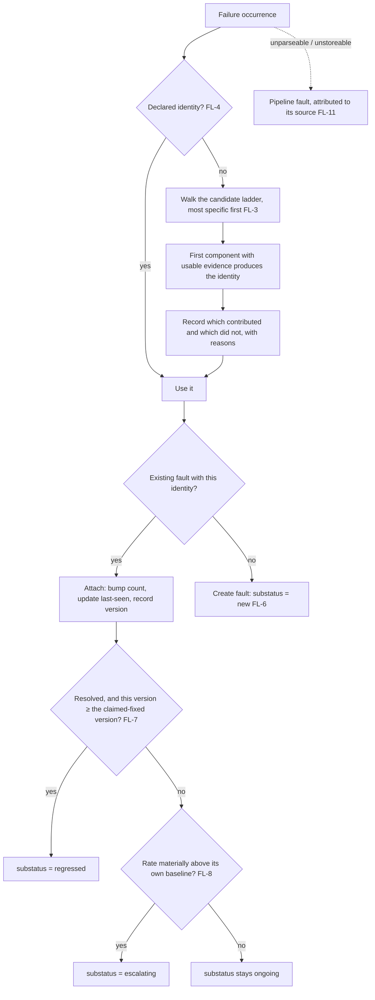

# Fault Identity & Lifecycle

**Version:** 1.0.0
**Status:** Stable
**Layer:** concept

## Overview

What makes two failures **the same failure**, and what happens to that failure over its life.

Two coupled contracts. **Identity**: occurrences collapse into a *fault* by a named, versioned, explainable rule set, with explicitly declared identity outranking any computed one, and merges that never invalidate an existing reference. **Lifecycle**: a fault is not merely open or closed — an unresolved fault is *new*, *ongoing*, *regressed*, or *escalating*; an archived one is archived *until* something, not into a void; and a resolution is a **claim anchored to a version that the system then checks**, so a fix that did not hold reads as a regression rather than quietly reappearing as a stranger.

This is upstream of reporting. Error reporting decides whether and how a failure is filed outward; this decides what the thing being filed *is*, and how its state evolves whether or not anything is ever filed.

## Related Specifications

- [l1-error-reporting.md](l1-error-reporting.md) - Consent-gated outward filing; its ERR-3 de-duplication is *this* contract's identity, and a filed report addresses a fault rather than an occurrence (ERR-7).
- [l1-issue-reporting.md](l1-issue-reporting.md) - User-authored "Report Issue" submissions; a distinct, human-initiated channel that attaches to a fault when one applies.
- [l1-operational-health.md](l1-operational-health.md) - Owns alerting authority; escalation (FL-8) surfaces through its rules, and bursts are digested there (OH-14).
- [l1-doctor.md](l1-doctor.md) - Repairs faults; this layer identifies and tracks them and never repairs.
- [l1-observation-retention.md](l1-observation-retention.md) - The retained record whose aggregates back a fault's counts and its escalation baseline.
- [l1-anomaly-consensus.md](l1-anomaly-consensus.md) - Statistical unusualness of a *series*; escalation here is a rate change of a *named fault* against its own baseline — related discipline, different subject.
- [l1-completion-verification.md](l1-completion-verification.md) - Evidence-backed completion claims; FL-7 applies the same honesty to a *fix* claim by checking it against later versions.
- [l1-staged-rollout.md](l1-staged-rollout.md) - A changed identity rule or new detector is introduced under its shadow/exposure discipline (SR-12), never swapped in place.
- [l1-diagnostic-log.md](l1-diagnostic-log.md) - The forensic plane a fault's retained occurrences may point into; separate lifecycle, not tiered here.
- [../../nodus/specifications/l1-nodus-observability.md](../../nodus/specifications/l1-nodus-observability.md) - Supplies stable, message-independent identity contributions on error events (HO-19), composing cross-run step identity (HO-15).

## 1. Motivation

A system that runs continuously does not fail once. It fails the same way ten thousand times, and a handful of other ways twice. Every useful property of a failure record follows from getting that distinction right, and every pathology follows from getting it wrong.

**Without identity, volume becomes the message.** Ten thousand occurrences of one trivial failure drown two occurrences of the one that matters. The natural response — read the loudest — is exactly backwards, since loudness measures frequency and nothing else. Collapsing occurrences into faults makes the list a list of *problems*, which is what a human can act on, rather than a list of *events*, which is what a machine produced.

**Without a versioned identity rule, history silently rewrites itself.** Changing what "the same failure" means re-partitions everything already recorded. A fault that splits under a new rule keeps its name, its counts, its resolution, and its assignee — while now describing a different thing. Nobody notices, because nothing errors; the numbers simply stop meaning what they meant. Versioning the rule set is what makes such a change a migration rather than a quiet corruption.

**Without substatus, a flat open/closed list stops being read.** Everything unresolved looks alike: the failure that appeared five minutes ago, the one everyone has scrolled past for a month, and the one somebody fixed last week whose fix did not hold. These demand completely different responses and a flat model renders them identically — so the list is triaged once, then ignored, and the system's failure record becomes decoration.

**Without checking resolutions, a "fixed" claim is never wrong.** Marking something resolved is an assertion about the future: *this will not happen again from this version onward*. If the system does not test that assertion, the fix is never falsified — the failure simply comes back as a new stranger, gets triaged again by someone who does not know it was already "fixed" twice, and the pattern of a persistently-failing repair is invisible precisely because each attempt erased the last.

**And without an escalation notion, being known is a hiding place.** A problem read once and mentally filed as "known" gets no further attention, so a tenfold increase in its rate produces no signal at all: nothing *new* appeared. The most dangerous failure in a mature system is not the unknown one — it is the known one that got much worse while everyone had already stopped looking at it.

## 2. Constraints & Assumptions

- Fault records are **local-first**: identity, lifecycle, and occurrence samples live on-device; nothing here creates an egress path, and outward filing remains the reporting layer's consent-gated decision.
- The layer **identifies and tracks**; it does not repair (self-healing), does not alert (operational health), and does not file (error reporting).
- Occurrence content is subject to the same data-safety boundary as every other record: retained samples carry descriptors and sanitized diagnostics, never secrets or raw user content.
- A "version" is whatever the host declares as its release identity; this spec requires that one exists and is comparable, not what it is made of.
- The layer must remain cheap at high failure volume: cost is bounded by the number of *faults*, not the number of *occurrences* (FL-10).

## 3. Core Invariants

Rules every Layer 2 implementation MUST NOT violate:

- **FL-1 (A fault is an identity, not an occurrence):** occurrences of the same underlying failure collapse into one **fault** carrying first-seen, last-seen, occurrence count, and the versions it has appeared in. Every surface — a list, a notification, a report, a hand-off — addresses the **fault**. Presenting or filing per-occurrence is forbidden: it makes frequency the loudest signal in the room, which buries the fifty distinct problems under the one that happens to fire in a loop.
- **FL-2 (Identity is computed by a named, versioned rule set):** the equivalence assigning an occurrence to a fault is produced by a **named, versioned grouping configuration** with a deterministic, ordered rule set, and that configuration's identity travels with every fault it produced. The rule set is **versioned, never edited in place**, because changing what "the same failure" means **silently re-partitions all history**: a fault that splits or merges under a new rule keeps its name, counts, resolution, and owner while now describing something else — a corruption that raises no error and is therefore never noticed. Re-grouping under a new configuration is an explicit, recorded migration.
- **FL-3 (Identity is layered and explainable — a fallback ladder, not a single rule):** identity is computed from an **ordered set of candidate components**, most-specific evidence first, degrading to progressively coarser evidence; and the fault records **which component produced its identity, and which were considered without contributing, with the reason**. The ladder exists so a low-quality occurrence still groups sensibly instead of becoming a singleton; the explanation exists because *"why are these the same?"* and *"why are these different?"* are the only two questions a grouping system is ever asked, and one that cannot answer them gets overridden by hand until it means nothing.
- **FL-4 (Declared identity outranks computed identity):** an explicitly declared identity — an operator-authored rule, or an identity the failing component supplies about itself — takes precedence over any computed one, and the fault records that it did. Computed grouping is a default for the failures nobody anticipated; it is never an authority over the ones somebody did.
- **FL-5 (Merging preserves references):** when two faults are recognized as one, merging them MUST leave the absorbed identity **resolvable**: anything holding the old reference — a filed report, a link, an external ticket, a note, an automation — continues to reach the surviving fault. A merge that invalidates existing references trades duplication for dangling references, which is strictly worse: a duplicate is visible and a dead reference is not. **Splitting** — recognizing that one fault was two problems — is the symmetric operation and is handled honestly rather than symmetrically: the split produces new identities with a recorded provenance link to the original, and the original identity keeps resolving **to the record of the split**, never silently to whichever side the system guessed. Picking a side is the one outcome forbidden here, because a reference that now means something narrower than it did is indistinguishable from one that still means what it said.
- **FL-6 (Status refined by substatus — an open fault says *which kind* of open):** a fault's state is a **status** — unresolved, resolved, archived, plus terminal housekeeping states — refined by a **substatus**. An unresolved fault is **new**, **ongoing**, **regressed**, or **escalating**; an archived fault is archived **until it escalates**, **until a stated condition is met**, or **permanently**. A flat open/closed model is forbidden: it renders "appeared five minutes ago", "scrolled past for a month", and "the fix did not hold" identically, and a list whose entries all look alike is triaged once and then ignored.
- **FL-7 (Resolution is a version-anchored claim the system checks):** resolving a fault records **the version in which it is claimed fixed** — a specific version, or the next one to be produced. The claim is then **tested against reality**: a recurrence in a version **at or after** the claimed one transitions the fault to **regressed**, an unresolved state that carries the fact that a fix was asserted and did not hold. A recurrence in an **earlier** version is not a regression and MUST NOT be reported as one. Silently reopening a resolved fault as new is forbidden — it erases the single most valuable fact in the record, that somebody already believed this was fixed, and it hides the pattern of a repair that keeps failing.
- **FL-8 (Escalation re-surfaces a known fault):** a fault whose occurrence rate rises above **its own established baseline** by a **declared, inspectable factor** becomes **escalating** and is surfaced again *although it is already known*. Being known MUST NOT be a hiding place: without this rule a tenfold increase in a familiar failure produces no signal whatsoever, because nothing new appeared — which is how a mature system's worst incidents begin.
- **FL-9 (Archival is conditional by default, permanent only by explicit choice):** archiving suppresses a fault's **notification**, never its recording, its counting, or its visibility in the record, and it carries a **condition for return** — escalation, a stated occurrence threshold, or a stated time. Permanent archival exists but is an explicit, attributed decision, never the default: a default-permanent archive is where problems go to be forgotten rather than decided, and it is indistinguishable from a fix. Archival is **not** the same operation as silencing an alert rule: archival is a decision about *this fault* made by whoever triages it and travels with the fault forever, while silencing withholds *a chosen rule's* output for a stated time and belongs to the alerting layer. Both suppress notification; conflating them loses the distinction between "we have judged this problem" and "we are not being told about this rule right now".
- **FL-10 (Bounded, representative occurrence retention):** a fault retains a **bounded, representative** set of occurrences — the first, the latest, and a sample between — plus aggregate counts over time; never every occurrence. The retained samples are what make a fault actionable, the aggregates are what make faults rankable, and the bound is what keeps the loudest fault from being the most expensive one to have. Cost scales with the number of faults, not occurrences.
- **FL-11 (The recording pipeline's own failures are faults, attributed to their source):** an occurrence that could not be parsed, normalized, grouped, or stored is itself recorded as a **visible fault attributed to the source that produced it** — never discarded and never buried in an operator-only log. Data that fails to become a record is precisely the data whose absence nobody notices, and a pipeline that silently drops what it cannot handle reports a world cleaner than the real one. (The fault-record member of the trace-completeness honesty discipline.)

> L2 specs cannot reach RFC status until all invariants here are addressed in their "Invariant Compliance" section.

## 4. Detailed Design

### 4.1 From occurrence to fault



### 4.2 The identity ladder (FL-3)

| Rung | Evidence | Why it sits here |
| --- | --- | --- |
| 1 | Declared identity (operator rule, or the component's own) | Somebody who knew the domain decided; nothing computed outranks that (FL-4) |
| 2 | Structural location of the failure (where in the system, at what step) | The most stable specific evidence — survives message changes, input changes, and cosmetic refactors |
| 3 | Typed failure class | Coarser but always present; groups sensibly when location is unavailable |
| 4 | Normalized descriptor of last resort | Prevents singleton explosion; deliberately last, because free text varies per occurrence |

The ordering is the design. Free-text content sits at the bottom precisely because it usually carries interpolated values — an identifier, a path, a timestamp — that differ on every occurrence and would shatter one fault into thousands. A ladder that starts there produces a record with no faults in it, only events.

### 4.3 Status × substatus (FL-6)

| Status | Substatus | Means | Notifies? |
| --- | --- | --- | --- |
| unresolved | **new** | First appearance, within its initial window | Yes |
| unresolved | **ongoing** | Known, steady, already triaged | Per the alerting rules |
| unresolved | **regressed** | Was resolved; recurred at or after the claimed-fixed version (FL-7) | Yes — a failed fix is news |
| unresolved | **escalating** | Rate materially above its own baseline (FL-8) | Yes — even though known |
| archived | **until-escalating** | Deliberately quiet unless it gets worse | On escalation only |
| archived | **until-condition** | Quiet until a stated threshold or time | On the condition |
| archived | **permanent** | Explicitly, attributably decided (FL-9) | No |
| resolved | — | Claimed fixed in a named version; watched (FL-7) | On regression |

Each substatus exists because it demands a different response, and a model that cannot express the difference forces every one of them to be handled as the same thing.

### 4.4 Resolution is a claim, not a state change (FL-7)

```text
[REFERENCE]
resolve(fault, claimed_fixed_in):
    fault.status := resolved
    fault.claimed_fixed_in := claimed_fixed_in        // a specific version, or "the next one produced"
    fault.resolved_by, fault.resolved_at := actor, now

on_occurrence(fault, occurrence):
    if fault.status = resolved:
        if occurrence.version ≥ fault.claimed_fixed_in:
            fault.status, fault.substatus := unresolved, regressed     // the claim failed
        else:
            record the occurrence; the claim is untouched                // an older version is not a regression
```

Two errors this prevents, both common and both silent. A recurrence from an *older* version reported as a regression sends people to re-examine a fix that is fine. A recurrence from a *newer* version reported as a brand-new fault hides that the fix failed — and hides it again the next time, so a repair that has failed four times looks like four unrelated problems.

### 4.5 Boundary with neighbouring layers

| Concern | Owner |
| --- | --- |
| What makes two failures the same, and how the fault's state evolves | **This spec** |
| Whether a failure is filed outward, with what consent and scrubbing | Error reporting |
| A human-authored problem report | Issue reporting |
| Whether anyone is notified, at what severity, with what hysteresis and silencing | Operational health |
| Repairing the underlying fault | The self-healing subsystem |
| Statistical unusualness of a metric series | Anomaly consensus (a different subject: a series, not a named fault) |
| Introducing a new identity rule or detector safely | Staged rollout (SR-12 shadow evaluation) |

## 5. Drawbacks & Alternatives

- **Grouping is never perfect.** Over-grouping hides distinct problems; under-grouping produces noise. Mitigated structurally rather than by tuning: the ladder degrades instead of failing (FL-3), the decision is explainable so a wrong grouping is diagnosable, declared identity overrides it (FL-4), and merges are safe (FL-5).
- **Versioned rule sets mean two configurations coexist during a migration.** Accepted: the alternative is editing in place, which corrupts history invisibly (FL-2). A recorded migration is the cheaper problem.
- **Substatus adds states to reason about.** Accepted: each one exists because it demands a different response, and the flat alternative collapses them into a list nobody reads.
- **Alternative — one issue per occurrence.** Rejected by FL-1: it makes frequency the ranking function and buries everything rare, which is where the important failures live.
- **Alternative — group by message text.** Rejected by FL-3: interpolated values vary per occurrence, so this produces a record with no faults in it, only events wearing fault-shaped clothing.
- **Alternative — edit the grouping rules in place.** Rejected by FL-2: it silently re-partitions history while every number continues to look valid.
- **Alternative — reopen a resolved fault as a new one.** Rejected by FL-7: it deletes the fact that a fix was claimed, which is the only way to see a repair that keeps failing.
- **Alternative — archive means closed.** Rejected by FL-9: an unconditional archive is indistinguishable from a fix and is where problems go to be forgotten rather than decided.
- **Alternative — drop what the pipeline cannot parse.** Rejected by FL-11: the dropped data is exactly the data whose absence is invisible, so the record ends up describing a cleaner world than the real one.

## Canonical References

| Alias | Path | Purpose |
| --- | --- | --- |
| `[REPORTING]` | `.design/main/specifications/l1-error-reporting.md` | Consent-gated outward filing whose ERR-3 equivalence this contract defines. |
| `[HEALTH]` | `.design/main/specifications/l1-operational-health.md` | Sole alerting authority; escalation and digesting surface through it. |
| `[ROLLOUT]` | `.design/main/specifications/l1-staged-rollout.md` | The discipline for introducing a new identity rule or detector without swapping it in place (SR-12). |
| `[OBSERVABILITY]` | `.design/nodus/specifications/l1-nodus-observability.md` | Source of stable, message-independent identity contributions on error events (HO-19). |

## Document History

| Version | Date | Author | Notes |
| --- | --- | --- | --- |
| 1.0.0 | 2026-07-23 | Core Team | Initial spec — fault identity and lifecycle as the layer upstream of reporting: occurrences collapse into a fault that every surface addresses (FL-1); identity produced by a named, versioned rule set that is migrated rather than edited, because changing what "the same failure" means silently re-partitions all history while every number still looks valid (FL-2); a layered, explainable fallback ladder from most-specific evidence down to a normalized descriptor of last resort, with free text deliberately last since interpolated values shatter one fault into thousands (FL-3); declared identity outranking computed (FL-4); merges that keep the absorbed identity resolvable so no existing reference dangles (FL-5); status refined by substatus — new / ongoing / regressed / escalating, and archived until-escalating / until-condition / permanent — because a flat open-closed list renders every kind of open identically and is triaged once then ignored (FL-6); resolution as a version-anchored claim the system checks, a recurrence at or after the claimed version reading as *regressed* while an earlier-version recurrence is not, so a repeatedly-failing repair stays visible instead of appearing as unrelated strangers (FL-7); escalation re-surfacing a known fault whose rate rose above its own baseline, since being known must not be a hiding place (FL-8); conditional-by-default archival that suppresses notification but never recording (FL-9); bounded representative occurrence retention so cost scales with faults not occurrences (FL-10); the recording pipeline's own failures recorded as visible faults attributed to their source, since silently dropped data is the data whose absence nobody notices (FL-11). Concept-only. |
