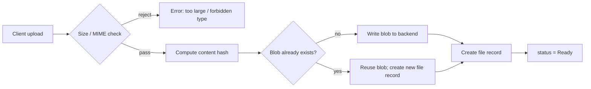

# File Management

**Version:** 1.0.0
**Status:** Stable
**Layer:** concept

## Overview

A first-class subsystem for uploading, storing, organising, and retrieving binary and text files within the system. Files serve as source material for knowledge collections, inline attachments in chat, exported artifacts, and imported resources. Every file has a stable identity, content-addressed storage (deduplication), metadata, and access control. The file subsystem is the single authoritative store for all user-provided binary content.

## Related Specifications

- [l1-resource-sharing.md](l1-resource-sharing.md) - Files are shareable resources governed by the access grant model.
- [l1-knowledge-base.md](l1-knowledge-base.md) - Knowledge collections reference files as their source documents.
- [l1-security.md](l1-security.md) - File access respects sandbox boundaries; egress of file content is gated.
- [l1-storage-model.md](l1-storage-model.md) - Files live in the mutable state tier; program-tier files are never overwritten.
- [l2-file-store.md](l2-file-store.md) - Concrete implementation: upload pipeline, storage backend, deduplication.

## 1. Motivation

Without a dedicated file subsystem, each feature (chat, knowledge base, notes, exports) manages its own binary storage — leading to duplicate copies, inconsistent naming, orphaned blobs, and no shared access control. Centralising files in one registry with stable IDs means every consumer references the same object, deduplication is automatic, and access policy is applied in one place.

## 2. Constraints & Assumptions

- Files enter the system through explicit upload or server-side reference; no implicit file capture from agent output.
- The physical storage backend (local filesystem, object store) is configurable; the file record (metadata + ID) is always stored in the central database regardless of backend.
- Files are not versioned in the storage layer; replacing a file means uploading a new file and re-referencing it. The previous file record is retained for audit until garbage-collected.
- The file subsystem does not parse or index file content — that is the knowledge base's responsibility.

## 3. Core Invariants

Rules every Layer 2 implementation MUST NOT violate:

- **FM-1 (Explicit ingestion):** a file enters the system only through an explicit upload or a deliberate server-side ingest action; no implicit capture from agent output, chat history, or memory.
- **FM-2 (Content-addressed deduplication):** two uploads of identical binary content produce one stored blob, referenced by two distinct file records. Each record has its own metadata and access control.
- **FM-3 (Metadata decoupled from content):** the file record (name, MIME type, size, content hash, owner, access grants, timestamps) is stored in the database; the binary blob is stored in a configurable backend. The record is the identity; the blob is the content.
- **FM-4 (Access control):** file records follow the resource-sharing model (RS-1…RS-8); a private file is accessible only to its owner and explicitly-granted principals. Sharing a file grants access to its content.
- **FM-5 (Reference tracking):** the system tracks which resources reference each file (knowledge documents, notes, chat messages). A file with no references and past a retention window is eligible for garbage collection; a referenced file is never garbage-collected.
- **FM-6 (Size enforcement):** uploads exceeding a configurable limit are rejected at the boundary with a clear error; no partial blobs are stored.
- **FM-7 (Immutable blobs):** once stored, a blob is never overwritten in-place; "updating a file" creates a new record referencing a new blob (or reusing an existing blob if content is unchanged, per FM-2).

> L2 specs cannot reach RFC status until all invariants here are addressed in their "Invariant Compliance" section.

## 4. Detailed Design

### 4.1 File Record

```text
File {
  id           : FileId
  owner_id     : UserId
  name         : string           // original filename
  mime_type    : string
  size         : u64              // bytes
  hash         : string           // SHA-256 hex of blob content
  storage_path : string           // backend-relative path to blob
  meta         : dict             // free-form metadata (source, processing hints, etc.)
  status       : FileStatus
  created_at   : Timestamp
  updated_at   : Timestamp
}

enum FileStatus {
  Uploading,   // transfer in progress
  Ready,       // available for use
  Deleted,     // soft-deleted; blob retained until GC
}
```

### 4.2 Upload Flow



### 4.3 Access and Download

1. Caller provides `file_id` and its authenticated identity.
2. Resolve access: owner check → grant check (RS resolution). Deny if neither passes.
3. Stream blob from storage backend. Blob URL or presigned URL never exposed directly without an access check.

### 4.4 Soft Deletion and Garbage Collection

- Deletion marks a file record as `Deleted` and removes it from access. Blob is not immediately removed.
- A GC process runs periodically: for each `Deleted` record, verify there are no remaining references; if none exist and the retention window has elapsed, delete the blob and the record.
- A file that is both `Deleted` by the owner AND referenced by a knowledge collection retains its blob until the collection is also deleted or the document is removed.

### 4.5 Allowed MIME Types

The system defines a configurable allowlist of accepted MIME types. Common defaults:

| Category | Examples |
|---|---|
| Documents | `application/pdf`, `text/markdown`, `text/plain`, `text/html` |
| Images | `image/jpeg`, `image/png`, `image/gif`, `image/webp` |
| Structured | `application/json`, `text/csv`, `application/xml` |
| Audio | `audio/mpeg`, `audio/wav`, `audio/ogg` |

Binary executables and unsupported types are rejected.

## 5. Implementation Notes

1. Implement the file record and upload endpoint before any consumer (knowledge base, notes, chat) depends on file IDs.
2. The content hash (FM-2) must be computed server-side, not trusted from the client.
3. Storage backend is abstracted behind a trait/interface; local filesystem is the default; object stores are plug-in backends.

## 7. Drawbacks & Alternatives

- **Per-feature storage:** simpler per-feature but creates silos, duplication, and inconsistent access control.
- **Always-eager deletion:** deleting blobs immediately on record delete is simpler but risks losing data if a soft-deleted file is still referenced by a concurrent indexing job. Soft-delete + GC is safer.

## Canonical References

| Alias | Path | Purpose |
|---|---|---|
| `[IMPL]` | `.design/main/specifications/l2-file-store.md` | Concrete upload pipeline, backend trait, hash logic, GC scheduler. |
| `[STORAGE]` | `.design/main/specifications/l1-storage-model.md` | Tier model that governs where files live. |
